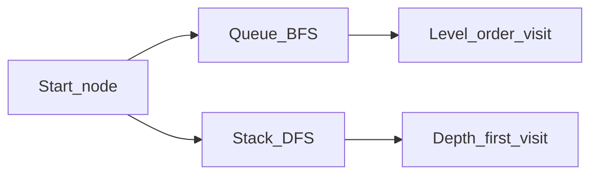

# Chapter 15 — BFS and DFS

> "Almost every graph algorithm is BFS or DFS in a trench coat."

## Learning objectives

By the end of this chapter you will be able to:

- Implement BFS with a queue and DFS with a stack (and recursion).
- Choose BFS vs. DFS based on the problem at hand.
- Find the shortest path in an unweighted graph using BFS.
- Detect cycles in a directed graph using DFS with three-color marking.
- Trace both algorithms by hand and predict their traversal order.

## Prerequisites & recap

- [Graphs](14-graphs.md) — adjacency list representation, terminology.
- [Queues](08-queues.md) — BFS uses a queue; FIFO order is what gives it
  level-by-level behavior.
- [Stacks](07-stacks.md) — DFS uses a stack; LIFO order is what drives it
  deep before wide.

## The simple version

You're standing at the entrance of a maze. You need to visit every room.
There are exactly two strategies:

**BFS (Breadth-First Search):** explore all rooms one step away before
moving to rooms two steps away, then three steps, and so on — like a
ripple spreading outward. Because you explore in "layers," the first time
you reach a room is guaranteed to be via the shortest path (in an
unweighted graph).

**DFS (Depth-First Search):** pick a corridor and follow it as deep as
possible until you hit a dead end, then backtrack and try the next corridor.
You explore one entire branch before moving to another. DFS is the natural
fit for "exhaustive search" problems — topological sort, cycle detection,
solving puzzles, and backtracking.

Both visit every node and every edge exactly once: O(V + E).

## Visual flow

```
  Graph:
                A
               / \
              B   C
             /   / \
            D   E   F

  BFS from A (queue):          DFS from A (stack):

  Visit: A                     Visit: A
  Queue: [B, C]                Stack: [B, C]

  Visit: B                     Visit: C  (LIFO — last in, first out)
  Queue: [C, D]                Stack: [B, E, F]

  Visit: C                     Visit: F
  Queue: [D, E, F]             Stack: [B, E]

  Visit: D                     Visit: E
  Queue: [E, F]                Stack: [B]

  Visit: E                     Visit: B
  Queue: [F]                   Stack: [D]

  Visit: F                     Visit: D
  Queue: []                    Stack: []

  BFS order: A B C D E F       DFS order: A C F E B D
  (level by level)             (deep before wide)
```

## Graph traversal modes (Mermaid)



*BFS explores layers; DFS drills deep before siblings.*

## Concept deep-dive

### Why BFS finds shortest paths

BFS processes nodes in order of their distance from the start. When you
dequeue a node at distance *d*, you enqueue its unvisited neighbors at
distance *d + 1*. The first time any node is reached, it's via a shortest
path — because you process all nodes at distance *d* before any at *d + 1*.

This **only works for unweighted graphs** (or graphs where all edges have
equal weight). For weighted graphs, you need Dijkstra (positive weights) or
Bellman-Ford (negative weights).

### Why DFS is the tool for structure

DFS naturally discovers the "shape" of a graph:

- **Cycle detection:** if you encounter a node that's currently "in progress"
  (on the DFS stack), you've found a back edge — a cycle.
- **Topological sort:** process nodes in reverse DFS finish order. By the
  time you finish a node, all its dependencies are already finished.
- **Connected components:** run DFS from every unvisited node; each run
  discovers one component.
- **Backtracking:** try a choice, recurse, undo the choice — the
  recursive structure of DFS is a natural fit.

### BFS implementation

```python
from collections import deque

def bfs(graph: dict[str, list[str]], start: str):
    visited = {start}
    queue = deque([start])
    while queue:
        node = queue.popleft()
        yield node
        for neighbor in graph.get(node, []):
            if neighbor not in visited:
                visited.add(neighbor)
                queue.append(neighbor)
```

**Key detail:** add to `visited` when *enqueueing*, not when *dequeueing*.
If you wait until dequeueing, the same node can be added to the queue
multiple times — wasting time and potentially producing duplicates.

### BFS shortest path with path reconstruction

```python
def shortest_path(
    graph: dict[str, list[str]], start: str, end: str
) -> list[str] | None:
    if start == end:
        return [start]
    prev: dict[str, str | None] = {start: None}
    queue: deque[str] = deque([start])
    while queue:
        node = queue.popleft()
        for neighbor in graph.get(node, []):
            if neighbor not in prev:
                prev[neighbor] = node
                if neighbor == end:
                    return _reconstruct(prev, end)
                queue.append(neighbor)
    return None

def _reconstruct(prev: dict[str, str | None], end: str) -> list[str]:
    path: list[str] = []
    current: str | None = end
    while current is not None:
        path.append(current)
        current = prev[current]
    path.reverse()
    return path
```

### DFS — recursive

```python
def dfs_recursive(
    graph: dict[str, list[str]], start: str
):
    visited: set[str] = set()

    def go(node: str):
        visited.add(node)
        yield node
        for neighbor in graph.get(node, []):
            if neighbor not in visited:
                yield from go(neighbor)

    return go(start)
```

### DFS — iterative

```python
def dfs_iterative(
    graph: dict[str, list[str]], start: str
):
    visited: set[str] = set()
    stack = [start]
    while stack:
        node = stack.pop()
        if node in visited:
            continue
        visited.add(node)
        yield node
        for neighbor in reversed(graph.get(node, [])):
            if neighbor not in visited:
                stack.append(neighbor)
```

**Why `reversed`?** The stack is LIFO. If neighbors are `[B, C]`, pushing
them in order means C is on top (processed first). Reversing gives the
same order as the recursive version.

### Cycle detection with three-color DFS

For directed graphs, DFS classifies edges by node state:

- **White** — unvisited.
- **Gray** — currently on the DFS recursion stack (processing in progress).
- **Black** — fully processed (all descendants explored).

A **back edge** (gray → gray) means a cycle. A black node is safe — it's
fully explored with no cycles found through it.

### When to use which

| Problem | Use | Why |
|---|---|---|
| Shortest path (unweighted) | **BFS** | Processes nodes in distance order |
| Level-by-level processing | **BFS** | Queue naturally groups by level |
| Shortest path (weighted) | **Dijkstra** (not BFS) | BFS ignores edge weights |
| Cycle detection (directed) | **DFS** | Three-color marking finds back edges |
| Topological sort | **DFS** | Reverse post-order gives valid ordering |
| Connected components | **DFS** or BFS | Both work; DFS is slightly simpler |
| Exhaustive search / backtracking | **DFS** | Naturally explores and backtracks |
| Is a node reachable? | Either | Both are O(V + E) |

## Why these design choices

| Choice | Trade-off | When you'd pick differently |
|---|---|---|
| BFS for shortest path | O(V + E) but only works for unweighted graphs | Dijkstra when edges have weights |
| Recursive DFS | Clean, expressive code | Iterative DFS when graph depth > ~1000 (Python recursion limit) |
| Iterative DFS | No recursion limit issues; explicit stack | Recursive when code clarity matters and depth is bounded |
| Visited set (hash set) | O(1) lookups; O(V) memory | Visited array (by index) when nodes are 0..n-1 integers — slightly faster |
| Three-color marking | Required for directed cycle detection | Simple visited set suffices for undirected cycle detection |

## Production-quality code

```python
from __future__ import annotations
from collections import deque
from typing import Iterator


Graph = dict[str, list[str]]


def bfs(graph: Graph, start: str) -> Iterator[str]:
    """Breadth-first traversal yielding nodes in BFS order."""
    if start not in graph:
        return
    visited = {start}
    q: deque[str] = deque([start])
    while q:
        node = q.popleft()
        yield node
        for nbr in graph.get(node, []):
            if nbr not in visited:
                visited.add(nbr)
                q.append(nbr)


def bfs_shortest_path(
    graph: Graph, start: str, end: str
) -> list[str] | None:
    """Shortest path in an unweighted graph via BFS.
    Returns the path as a list of nodes, or None if unreachable."""
    if start not in graph:
        return None
    if start == end:
        return [start]
    prev: dict[str, str | None] = {start: None}
    q: deque[str] = deque([start])
    while q:
        node = q.popleft()
        for nbr in graph.get(node, []):
            if nbr not in prev:
                prev[nbr] = node
                if nbr == end:
                    path: list[str] = []
                    cur: str | None = end
                    while cur is not None:
                        path.append(cur)
                        cur = prev[cur]
                    path.reverse()
                    return path
                q.append(nbr)
    return None


def dfs(graph: Graph, start: str) -> Iterator[str]:
    """Iterative depth-first traversal."""
    if start not in graph:
        return
    visited: set[str] = set()
    stack = [start]
    while stack:
        node = stack.pop()
        if node in visited:
            continue
        visited.add(node)
        yield node
        for nbr in reversed(graph.get(node, [])):
            if nbr not in visited:
                stack.append(nbr)


def has_cycle_directed(graph: Graph) -> bool:
    """Detect cycles in a directed graph using DFS three-color marking."""
    WHITE, GRAY, BLACK = 0, 1, 2
    color: dict[str, int] = {node: WHITE for node in graph}

    def visit(node: str) -> bool:
        color[node] = GRAY
        for nbr in graph.get(node, []):
            c = color.get(nbr, WHITE)
            if c == GRAY:
                return True
            if c == WHITE and visit(nbr):
                return True
        color[node] = BLACK
        return False

    return any(color[n] == WHITE and visit(n) for n in graph)


def reachable(graph: Graph, start: str) -> set[str]:
    """Return all nodes reachable from start (including start)."""
    return set(bfs(graph, start))


def connected_components(graph: Graph) -> list[set[str]]:
    """Find connected components in an undirected graph."""
    visited: set[str] = set()
    components: list[set[str]] = []
    for node in graph:
        if node not in visited:
            component = set(bfs(graph, node))
            visited |= component
            components.append(component)
    return components
```

## Security notes

N/A — BFS and DFS are in-process algorithms. The operational concerns are:

- **Denial of service via graph size.** If user input defines the graph
  (e.g., a social network query), an adversary can submit a huge graph that
  consumes O(V + E) memory and CPU. Cap the size of accepted graphs.
- **Stack overflow in recursive DFS.** Python's default recursion limit is
  ~1000. An adversary crafting a deep graph (a long chain) can crash a
  recursive DFS. Use iterative DFS in production.

## Performance notes

| Metric | BFS | DFS |
|---|---|---|
| Time | O(V + E) | O(V + E) |
| Space (visited set) | O(V) | O(V) |
| Space (queue / stack) | O(V) worst case | O(V) worst case |

Both algorithms have identical asymptotic complexity. The practical
differences are:

- **BFS space:** in a breadth-heavy graph (e.g., a star graph with one
  center node and V−1 leaves), the queue holds V−1 nodes simultaneously.
- **DFS space:** in a depth-heavy graph (long chain), the stack holds V
  nodes. The recursive version uses O(V) call-stack frames.
- **Cache locality:** BFS tends to be slightly more cache-friendly because
  the queue accesses nodes in "layer" order, which often corresponds to
  memory locality in adjacency lists.

## Common mistakes

| # | Symptom | Cause | Fix |
|---|---|---|---|
| 1 | Infinite loop on cyclic graph | No visited set | Always maintain a visited set; add to it *before* enqueueing/pushing |
| 2 | BFS returns a non-shortest path | Added nodes to visited on *dequeue* instead of *enqueue* | Add to visited when enqueueing — prevents duplicate entries |
| 3 | `RecursionError` on large graph | Recursive DFS with graph depth > 1000 | Use iterative DFS with an explicit stack |
| 4 | BFS used for weighted shortest path | Assumed all edges have equal cost | Use Dijkstra for weighted graphs; BFS only works for unweighted |
| 5 | DFS traversal order differs from expected | Pushed neighbors in forward order; stack LIFO reverses them | Use `reversed()` when pushing neighbors to match natural left-to-right order |
| 6 | Connected components missed some nodes | Started BFS/DFS from only one node in a disconnected graph | Loop over *all* nodes; start a new BFS/DFS from each unvisited node |

## Practice

**Warm-up.** Given a small directed graph, trace BFS and DFS from a starting
node. Write down the visit order by hand before running the code.

**Standard.** Implement `reachable(graph, start)` returning the set of all
nodes reachable from `start` (using BFS or DFS).

**Bug hunt.** A colleague wrote recursive DFS for a graph with 100,000 nodes
arranged in a line (node 0 → node 1 → ... → node 99999). The function
crashes with `RecursionError`. Explain why and fix it.

**Stretch.** Use BFS to find the shortest path through a 2D grid maze.
Represent the maze as a list of strings where `'.'` is open, `'#'` is a
wall, `'S'` is start, and `'E'` is end.

**Stretch++.** Implement topological sort using DFS post-order (reverse the
DFS finish order). Verify on a 6-node DAG representing course prerequisites.

<details><summary>Show solutions</summary>

**Warm-up:**

```python
g = {"A": ["B", "C"], "B": ["D"], "C": ["D", "E"], "D": [], "E": []}
print(list(bfs(g, "A")))   # ['A', 'B', 'C', 'D', 'E']
print(list(dfs(g, "A")))   # ['A', 'B', 'D', 'C', 'E']
```

**Bug hunt:** Python's default recursion limit is ~1000. A 100,000-node
linear graph causes 100,000 nested recursive calls — far beyond the limit.
Fix: use iterative DFS with an explicit stack, which uses heap memory
instead of the call stack.

**Stretch (maze):**

```python
def solve_maze(maze: list[str]) -> list[tuple[int, int]] | None:
    rows, cols = len(maze), len(maze[0])
    start = end = None
    for r in range(rows):
        for c in range(cols):
            if maze[r][c] == "S": start = (r, c)
            if maze[r][c] == "E": end = (r, c)
    if start is None or end is None:
        return None

    prev: dict[tuple[int, int], tuple[int, int] | None] = {start: None}
    q: deque[tuple[int, int]] = deque([start])
    while q:
        r, c = q.popleft()
        if (r, c) == end:
            path = []
            cur = end
            while cur is not None:
                path.append(cur)
                cur = prev[cur]
            path.reverse()
            return path
        for dr, dc in [(-1, 0), (1, 0), (0, -1), (0, 1)]:
            nr, nc = r + dr, c + dc
            if 0 <= nr < rows and 0 <= nc < cols and (nr, nc) not in prev and maze[nr][nc] != "#":
                prev[(nr, nc)] = (r, c)
                q.append((nr, nc))
    return None
```

**Stretch++ (topological sort via DFS):**

```python
def topo_sort_dfs(graph: dict[str, list[str]]) -> list[str] | None:
    WHITE, GRAY, BLACK = 0, 1, 2
    color = {n: WHITE for n in graph}
    order: list[str] = []

    def visit(node: str) -> bool:
        color[node] = GRAY
        for nbr in graph.get(node, []):
            if color.get(nbr, WHITE) == GRAY:
                return False  # cycle
            if color.get(nbr, WHITE) == WHITE and not visit(nbr):
                return False
        color[node] = BLACK
        order.append(node)
        return True

    for n in graph:
        if color[n] == WHITE and not visit(n):
            return None  # cycle detected
    order.reverse()
    return order
```

</details>

## In plain terms (newbie lane)
If `Bfs And Dfs` feels abstract, think of it as a practical tool to make your backend work more predictable and easier to debug. Use this chapter to build one clear mental model first, then add details.

> **Newbies often think:** this topic is only theory and memorization.  
> **Actually:** it is a workflow aid that helps you make better decisions under real project pressure.


## Quiz

1. BFS uses:
    (a) a stack  (b) a queue  (c) a heap  (d) recursion only

2. BFS finds:
    (a) any path  (b) shortest path in an unweighted graph
    (c) shortest path in a weighted graph  (d) longest path

3. DFS time complexity:
    (a) O(V²)  (b) O(V + E)  (c) O(E²)  (d) O(V log V)

4. In directed DFS cycle detection, a cycle is signaled by:
    (a) visiting a white node  (b) encountering a gray node from another
    gray node  (c) reaching a black node  (d) the stack becoming empty

5. For shortest weighted paths, you should use:
    (a) BFS  (b) DFS  (c) Dijkstra (or Bellman-Ford for negative weights)
    (d) topological sort

**Short answer:**

6. Give a problem where DFS is clearly better than BFS.

7. Why does BFS use a queue and DFS use a stack? How does the data structure
   shape the traversal order?

*Answers: 1-b, 2-b, 3-b, 4-b, 5-c. 6) Topological sort or cycle detection in a directed graph — both rely on DFS's ability to track "in-progress" nodes (gray state) and process nodes in post-order. BFS can't naturally detect back edges. 7) A queue (FIFO) ensures nodes are processed in the order they were discovered — nearest first, giving level-by-level exploration. A stack (LIFO) processes the most recently discovered node first, driving the traversal deep into one branch before backtracking.*

## Learn-by-doing mini-project

Full brief (goal, acceptance criteria, hints, stretch): [15-bfs-and-dfs — mini-project](mini-projects/15-bfs-and-dfs-project.md).

## Where this idea reappears

- **Same thread elsewhere:** trace how this chapter’s primitives show up in production systems — not only in this language or layer.
- **Cross-module links (read next when you feel stuck):**
  - [Big-O and production trade-offs](../06-dsa/03-big-o.md) — performance reasoning for APIs and batch jobs.
  - [Stack memory vs heap objects](../07-c-memory/06-stack-and-heap.md) — why recursion depth and allocation patterns matter.

  - [Concept threads (hub)](../appendix-threads/README.md) — state, errors, and performance reading trails.


## Chapter summary

- BFS (queue, FIFO) explores level-by-level and finds shortest paths in
  unweighted graphs. DFS (stack/recursion, LIFO) explores depth-first and
  is the tool for cycle detection, topological sort, and backtracking.
- Both run in O(V + E) time and O(V) space.
- Always use a visited set to avoid infinite loops on cyclic graphs. Add
  nodes to visited when enqueueing/pushing, not when processing.
- For weighted shortest paths, BFS is wrong — use Dijkstra.

## Further reading

- *CLRS* ch. 22 — Elementary Graph Algorithms (BFS, DFS, topological sort).
- *Algorithms* by Sedgewick & Wayne, ch. 4.1–4.2.
- Next: [P vs NP](16-p-vs-np.md).
