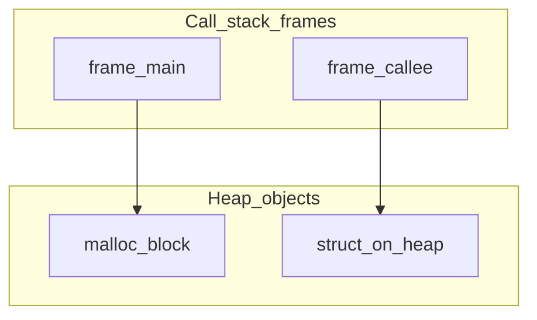

# Chapter 06 — Stack and Heap

> "Memory in a C program has two personalities: the stack for fast, automatic, short-lived storage, and the heap for manual, flexible, long-lived storage."

## Learning objectives

By the end of this chapter you will be able to:

- Explain where local variables, parameters, and dynamically allocated data live in memory.
- Allocate memory with `malloc`, `calloc`, and `realloc`, and release it with `free`.
- Prevent leaks, use-after-free, and double-free bugs.
- Use AddressSanitizer and Valgrind to detect memory errors.
- Recognize stack overflow symptoms and know when to move data to the heap.

## Prerequisites & recap

- [Pointers](03-pointers.md) — you already know that `&x` gives an address and `*p` dereferences it. This chapter explains *where* those addresses come from.

## The simple version

When a function is called, the CPU pushes a *stack frame* containing the function's local variables and parameters. When the function returns, that frame is popped — the locals vanish instantly, for free. The stack is fast (just move a pointer) and automatic (no cleanup code needed), but it's small (typically 1–8 MB per thread) and everything on it dies when the function exits.

The heap is the opposite: you explicitly ask for memory with `malloc`, you use it for as long as you need, and you explicitly give it back with `free`. The heap is large (limited only by available RAM), but allocation is slower, and if you forget to free, you leak. If you free too early, you crash. If you free twice, you corrupt the allocator. This is the central tension of C programming: the heap gives you freedom, and the price is responsibility.

## Visual flow

```
  High addresses
  ┌──────────────────────────────┐
  │          Stack               │  ← grows downward
  │  ┌────────────────────────┐  │
  │  │ main() frame           │  │  locals, return addr
  │  │  int x = 5             │  │
  │  ├────────────────────────┤  │
  │  │ foo() frame            │  │  locals, return addr
  │  │  int y = 10            │  │
  │  │  int *p = malloc(...)  │──┼──┐ pointer on stack,
  │  └────────────────────────┘  │  │ data on heap
  │          ↓ grows down        │  │
  │                              │  │
  │        ~ free space ~        │  │
  │                              │  │
  │          ↑ grows up          │  │
  │  ┌────────────────────────┐  │  │
  │  │  Heap                  │◄─┼──┘
  │  │  [allocated block]     │  │
  │  │  [allocated block]     │  │
  │  └────────────────────────┘  │
  │  ┌────────────────────────┐  │
  │  │  BSS (uninitialized)   │  │
  │  ├────────────────────────┤  │
  │  │  Data (initialized)    │  │
  │  ├────────────────────────┤  │
  │  │  Text (code)           │  │
  │  └────────────────────────┘  │
  Low addresses
```

*Caption: Typical process memory layout. Stack grows down, heap grows up. Locals live on the stack; `malloc` returns heap addresses.*

## Stack vs heap (Mermaid)



*Frames hold pointers; objects with dynamic lifetime live on the heap.*

## Concept deep-dive

### The stack — fast, automatic, limited

Each function call pushes a *frame* containing parameters, locals, the return address, and saved registers. When the function returns, the frame is popped — a single pointer adjustment.

```c
void foo(void) {
    int local = 42;      /* on the stack */
    Point p = {1.0, 2.0}; /* also on the stack */
}
/* local and p are gone — frame popped */
```

Why is the stack fast? Because "allocation" is just subtracting from the stack pointer register. No locks, no searching for free blocks, no metadata. But you can't control lifetimes — everything dies at function exit — and the size is bounded (typically 1–8 MB per thread, configurable via `ulimit -s`).

### The heap — manual, flexible, expensive

```c
#include <stdlib.h>

int *nums = malloc(10 * sizeof *nums);
if (!nums) {
    perror("malloc");
    abort();
}
for (int i = 0; i < 10; i++) nums[i] = i;
free(nums);
nums = NULL;
```

The four heap functions:

| Function | What it does |
|---|---|
| `malloc(size)` | Allocates `size` uninitialized bytes. Returns `NULL` on failure. |
| `calloc(n, size)` | Allocates `n * size` bytes, *zeroed*. Safer for arrays. |
| `realloc(p, new_size)` | Grows or shrinks `p`. May move the allocation; returns new address. |
| `free(p)` | Releases memory. `free(NULL)` is a no-op by design. |

Why must you check `malloc`'s return value? On Linux with overcommit enabled, `malloc` rarely fails. But on embedded systems, containers with memory limits, or after allocating gigabytes, it will return `NULL`. Dereferencing `NULL` is a segfault.

### The ownership rule

Every `malloc` must have exactly one `free`. The function that allocates doesn't have to be the one that frees, but the *ownership* must be documented. Common conventions:

- **Creator frees**: whoever calls `xxx_new` must call `xxx_free`.
- **Transfer**: "this function returns an owned pointer — caller must free."
- **Borrow**: "this function reads the data but doesn't take ownership."

Get this wrong and you have leaks (forgot to free), use-after-free (freed too early), or double-free (freed twice).

### The bug menagerie

| Bug | What happens | Detection |
|---|---|---|
| **Leak** | Forgot to free. Memory grows forever. | Valgrind, ASan's `LeakSanitizer` |
| **Use-after-free** | Used a pointer after `free`. UB. | ASan, Valgrind |
| **Double free** | Called `free` twice on the same pointer. UB. | ASan, Valgrind |
| **Out-of-bounds** | Wrote past allocation. Corrupts heap metadata. | ASan |
| **Dangling return** | Returned `&local` from a function. | Compiler warnings, ASan |

Your best defense during development:

```bash
cc -fsanitize=address,undefined -g -O1 main.c -o app
./app
```

AddressSanitizer (ASan) catches use-after-free, buffer overflows, and leaks with clear stack traces. The `10×` slowdown is worth it during development.

### When to use heap vs. stack

| Condition | Use |
|---|---|
| Size known at compile time and small | Stack |
| Object must outlive creating function | Heap |
| Size determined at runtime | Heap |
| Data too large for stack (> ~1 MB) | Heap |
| Performance-critical tight loop | Stack (avoid malloc overhead) |

### Stack overflow

```c
void infinite(void) { infinite(); }  /* stack overflow */
```

Unbounded recursion or giant local arrays (`char buf[10000000]`) exhaust the stack. Symptom: segfault with a tiny or missing stack trace. Fix: allocate large buffers on the heap, or convert deep recursion to iteration.

### `realloc` — the tricky one

```c
int *tmp = realloc(nums, new_size * sizeof *nums);
if (!tmp) {
    /* nums is STILL VALID — don't lose it */
    perror("realloc");
    free(nums);
    return -1;
}
nums = tmp;
```

Why the temporary variable? If `realloc` fails, it returns `NULL` — but the old pointer is still valid. If you write `nums = realloc(nums, ...)` directly and it fails, you've lost the only pointer to the old allocation. Leak.

If `realloc` succeeds and *moves* the allocation, the old pointer is now invalid. Any other pointer into the old buffer is dangling. This is why you should only ever access a `realloc`-able buffer through one pointer.

## Why these design choices

**Why doesn't C have garbage collection?** Because C was designed to *implement* garbage collectors, not use one. The language runs on bare metal where every cycle counts. Adding a GC would require a runtime, pause-time overhead, and the loss of deterministic resource management. Languages built on top of C (Python, Ruby, Go) add their own GC.

**Why is `free(NULL)` a no-op?** To simplify cleanup code. Without this guarantee, every `free` call would need a null check. By making it safe, C lets you write unconditional cleanup paths.

**When would you pick differently?** Rust's ownership system achieves heap safety at compile time with no runtime cost. Go and Java use garbage collection so you never call `free`. C is the right tool when you need the heap but can't afford the runtime overhead of a GC (OS kernels, embedded systems, language runtimes).

## Production-quality code

### Dynamic array (IntVec)

```c
#include <stdlib.h>
#include <stdio.h>

typedef struct {
    int   *data;
    size_t size;
    size_t cap;
} IntVec;

void vec_init(IntVec *v) {
    v->data = NULL;
    v->size = 0;
    v->cap  = 0;
}

int vec_push(IntVec *v, int x) {
    if (v->size == v->cap) {
        size_t new_cap = v->cap ? v->cap * 2 : 8;
        int *tmp = realloc(v->data, new_cap * sizeof *tmp);
        if (!tmp) return -1;
        v->data = tmp;
        v->cap  = new_cap;
    }
    v->data[v->size++] = x;
    return 0;
}

int vec_pop(IntVec *v, int *out) {
    if (v->size == 0) return -1;
    *out = v->data[--v->size];
    return 0;
}

void vec_free(IntVec *v) {
    free(v->data);
    v->data = NULL;
    v->size = v->cap = 0;
}
```

The doubling strategy gives amortized O(1) push. Setting `v->data = NULL` after free prevents accidental use-after-free.

### String duplication on the heap

```c
#include <string.h>
#include <stdlib.h>

char *str_dup(const char *s) {
    size_t n = strlen(s) + 1;
    char *p = malloc(n);
    if (!p) return NULL;
    memcpy(p, s, n);
    return p;
}
```

Caller owns `p` and must `free` it. This is the same as POSIX `strdup`, but portable to strict C17.

## Security notes

- **Heap overflow**: writing past a `malloc` allocation corrupts the allocator's metadata. Attackers exploit this to overwrite function pointers or return addresses. Always track allocation sizes and bounds-check writes.
- **Use-after-free exploitation**: freed memory gets recycled by the allocator. An attacker can trigger an allocation of the same size, fill it with controlled data, then cause the program to dereference the old (now-reused) pointer — reading attacker-controlled values or jumping to attacker-controlled code.
- **Integer overflow in size calculations**: `malloc(n * sizeof(int))` can overflow if `n` is huge, resulting in a small allocation and a subsequent buffer overflow. Use `calloc(n, sizeof(int))` which checks for overflow internally, or validate `n` first.

## Performance notes

- **Stack allocation**: essentially free — a single register subtraction. ~1 nanosecond.
- **`malloc`/`free`**: 20–100 ns typical on modern allocators (glibc, jemalloc, tcmalloc). Thread-safe allocators use per-thread caches to avoid lock contention.
- **`realloc` that moves**: costs O(n) for the copy. The doubling strategy ensures this happens O(log n) times over n pushes, giving amortized O(1) per push.
- **`calloc` vs. `malloc` + `memset`**: `calloc` can be faster because the OS may provide pre-zeroed pages via copy-on-write, avoiding the explicit `memset`.
- **Memory fragmentation**: many small allocations and frees can fragment the heap, making future large allocations fail even when total free memory is sufficient. Arena allocators (one big malloc, bump-pointer, single free) avoid this.

## Common mistakes

| Symptom | Cause | Fix |
|---|---|---|
| Memory usage grows without bound | `malloc` without corresponding `free` (leak) | Run under Valgrind or ASan; add cleanup paths |
| Program crashes randomly | Use-after-free: dereferencing freed memory | Set pointers to `NULL` after `free`; use ASan |
| "Double free or corruption" error | Called `free` twice on the same pointer | Track ownership; set pointer to NULL after free |
| `realloc` causes a leak | Wrote `p = realloc(p, n)` — if it fails, old `p` is lost | Use a temporary: `tmp = realloc(p, n)` |
| Segfault with deep recursion | Stack overflow — too many frames | Convert to iteration or allocate large data on heap |
| `malloc` returns NULL but program continues | Didn't check the return value | Always check; `if (!p) { handle error }` |

## Practice

**Warm-up.** Allocate an array of 100 ints on the heap, fill each with `i * i`, print them, and free.

**Standard.** Implement `IntVec` with `init`, `push`, `pop`, and `free`. Push 20 values and pop them all, printing each.

**Bug hunt.** What's the UB in this code?

```c
int *p = malloc(sizeof(int));
*p = 42;
free(p);
printf("%d\n", *p);
```

**Stretch.** Implement `str_dup` and use it to duplicate `argv` entries into a heap-allocated array. Free everything cleanly. Verify with `valgrind --leak-check=full`.

**Stretch++.** Build a simple arena allocator: one big `malloc` at startup, a bump pointer for allocation, and a single `arena_free` that releases everything. Test by allocating 1000 small objects and freeing once.

<details><summary>Solutions</summary>

**Bug hunt.** Use-after-free: `p` was freed, so `*p` in the `printf` dereferences freed memory. The value might appear correct (the allocator hasn't reused the memory yet), but it's UB — another allocation or a different optimization level will produce garbage or a crash.

**Warm-up.**

```c
#include <stdio.h>
#include <stdlib.h>

int main(void) {
    int *arr = malloc(100 * sizeof *arr);
    if (!arr) { perror("malloc"); return 1; }

    for (int i = 0; i < 100; i++) arr[i] = i * i;
    for (int i = 0; i < 100; i++) printf("%d ", arr[i]);
    printf("\n");

    free(arr);
    return 0;
}
```

**Stretch++.**

```c
typedef struct {
    char  *buf;
    size_t cap;
    size_t used;
} Arena;

int arena_init(Arena *a, size_t cap) {
    a->buf = malloc(cap);
    if (!a->buf) return -1;
    a->cap = cap;
    a->used = 0;
    return 0;
}

void *arena_alloc(Arena *a, size_t size) {
    size = (size + 7) & ~(size_t)7;  /* align to 8 bytes */
    if (a->used + size > a->cap) return NULL;
    void *p = a->buf + a->used;
    a->used += size;
    return p;
}

void arena_free(Arena *a) {
    free(a->buf);
    a->buf = NULL;
    a->used = a->cap = 0;
}
```

</details>

## In plain terms (newbie lane)
If `Stack And Heap` feels abstract, think of it as a practical tool to make your backend work more predictable and easier to debug. Use this chapter to build one clear mental model first, then add details.

> **Newbies often think:** this topic is only theory and memorization.  
> **Actually:** it is a workflow aid that helps you make better decisions under real project pressure.


## Quiz

1. Local variables live on the:
    (a) heap  (b) stack  (c) data segment  (d) text segment

2. `malloc` returns:
    (a) zeroed memory  (b) uninitialized memory or NULL  (c) freed memory  (d) NULL always

3. `realloc(p, 0)` is:
    (a) equivalent to `free`  (b) implementation-defined in C17  (c) a crash  (d) returns `p` unchanged

4. Double-free is:
    (a) harmless  (b) undefined behavior  (c) automatically handled  (d) idempotent

5. The best tool to detect leaks during development is:
    (a) `gcc`  (b) AddressSanitizer or Valgrind  (c) `lldb`  (d) `objdump`

**Short answer:**

6. When should you prefer the heap over the stack?
7. What is the "ownership" convention and why does it matter in C?

*Answers: 1-b, 2-b, 3-b, 4-b, 5-b*

## Learn-by-doing mini-project

Full brief (goal, acceptance criteria, hints, stretch): [06-stack-and-heap — mini-project](mini-projects/06-stack-and-heap-project.md).

## Where this idea reappears

- **Same thread elsewhere:** trace how this chapter’s primitives show up in production systems — not only in this language or layer.
- **Cross-module links (read next when you feel stuck):**
  - [Python object model](../01-python/02-variables.md) — names, references, and mutability at a higher level.
  - [JavaScript event loop](../08-js/13-event-loop.md) — another managed-memory runtime with different scheduling trade-offs.

  - [Concept threads (hub)](../appendix-threads/README.md) — state, errors, and performance reading trails.


## Chapter summary

- The stack is fast, automatic, and limited — use it for small, short-lived data.
- The heap is flexible and manual — every `malloc` needs exactly one `free`, and ownership must be documented.
- Use-after-free, double-free, and leaks are C's most common runtime bugs. AddressSanitizer and Valgrind catch them.
- `realloc` can move memory — always assign to a temp, and never hold secondary pointers into a realloc-able buffer.

## Further reading

- `man 3 malloc` — your OS's allocator documentation.
- AddressSanitizer documentation: https://clang.llvm.org/docs/AddressSanitizer.html
- *The Garbage Collection Handbook*, Jones/Hosking/Moss — how managed languages solve these problems.
- Next: [Advanced Pointers](07-advanced-pointers.md).
