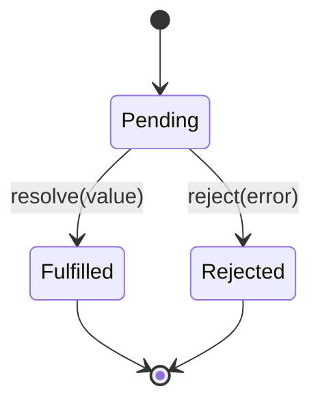

# Chapter 12 — Promises

> A promise represents a future value. It starts out *pending*, becomes *fulfilled* with a value or *rejected* with an error, and notifies everyone who's waiting.

## Learning objectives

- Create, consume, and chain promises.
- Use `async`/`await` (the preferred surface).
- Combine promises with `all`, `allSettled`, `race`, `any`.
- Handle rejections consistently.

## Prerequisites & recap

- [Functions](03-functions.md), [Errors](09-errors.md).

## In plain terms (newbie lane)

This chapter is really about **Promises**. Skim *Learning objectives* above first—they are your exit ticket.

> **Newbies often think:** they must memorize the whole chapter before writing any code.  
> **Actually:** you only need the *next* honest mental model, then you prove it with the exercises and mini-project.

Companion links: [Onboarding](../appendix-onboarding.md) · [Study habits](../appendix-study-habits.md) · [Concept threads](../appendix-threads/README.md)

<details><summary>Pause and predict</summary>

Without scrolling: what is one real bug or outage class this chapter helps you prevent?

</details>


## Concept deep-dive

### Promise states

- **Pending** — not yet settled.
- **Fulfilled** — resolved with a value.
- **Rejected** — settled with an error.

A promise settles at most once.

### Consuming

```js
fetchUser(1)
  .then(user => console.log(user))
  .catch(err => console.error(err))
  .finally(() => console.log("done"));
```

Prefer `async/await`:

```js
try {
  const user = await fetchUser(1);
  console.log(user);
} catch (err) {
  console.error(err);
}
```

Same semantics, linear flow.

### Creating

Rarely do you `new Promise`. Most APIs already return one. When you do:

```js
function sleep(ms) {
  return new Promise(resolve => setTimeout(resolve, ms));
}
```

### Combinators

```js
await Promise.all([a, b, c]);        // all fulfilled or first rejection
await Promise.allSettled([a, b]);    // array of {status, value|reason}
await Promise.race([a, b]);          // first to settle (either way)
await Promise.any([a, b, c]);        // first fulfilled (AggregateError if all reject)
```

Use `allSettled` when you want to inspect each outcome.

### Concurrency vs. serial

```js
// Serial (slow if independent)
const u = await fetchUser(id);
const p = await fetchPosts(id);

// Concurrent (fast)
const [u, p] = await Promise.all([fetchUser(id), fetchPosts(id)]);
```

### Chained returns

```js
async function handler(req) {
  const user = await fetchUser(req.id);
  const posts = await fetchPosts(user.id);
  return { user, posts };
}
```

`return` inside an async function fulfills the outer promise.

### Error propagation

`throw` in an async function rejects its returned promise. Use try/catch at the boundary.

## Worked examples

### Example 1 — Parallel fetch

```js
const results = await Promise.all(urls.map(u => fetch(u).then(r => r.json())));
```

### Example 2 — Timeout wrapper

```js
function withTimeout(promise, ms) {
  return Promise.race([
    promise,
    new Promise((_, rej) => setTimeout(() => rej(new Error("timeout")), ms)),
  ]);
}
```

## Diagrams



*Caption: Trace the flow (data/time/money) through this figure before reading further.*

## Common pitfalls & gotchas

- Forgetting `await` — `fn()` returns a promise, not its value.
- Not handling rejection — Node crashes on `unhandledRejection` (default).
- Serial awaits for independent calls — use `Promise.all`.
- `async` everywhere when the function doesn't actually await.

## Exercises

1. Warm-up. Implement `sleep(ms)`.
2. Standard. Fetch JSON from two URLs concurrently and merge results.
3. Bug hunt. Why does `for (const x of xs) await f(x)` run serially?
4. Stretch. Implement `retry(fn, attempts)` using async/await.
5. Stretch++. Write `parallelLimit(fns, n)` that runs at most n concurrently.

<details><summary>Show solutions</summary>

3. Each iteration awaits the previous; by design.

</details>

## Quiz

1. A promise can settle:
    (a) once (b) many times (c) never (d) exactly twice
2. Prefer `await` over `.then` because:
    (a) it's faster (b) linear error handling with try/catch (c) required (d) deprecated `.then`
3. `Promise.all` rejects:
    (a) never (b) as soon as any rejects (c) after all settle (d) only if first rejects
4. Unhandled rejection in Node 20+:
    (a) silent (b) warning only (c) crashes by default (d) impossible
5. `async` function always returns:
    (a) `undefined` (b) a value (c) a Promise (d) null

**Short answer:**

6. When use `Promise.allSettled` over `Promise.all`?
7. Why wrap promises in `withTimeout`?

## Mini-project: Apply it

Full brief (goal, acceptance criteria, hints, stretch): [12-promises — mini-project](mini-projects/12-promises-project.md).

## Where this idea reappears

- **Same thread elsewhere:** trace how this chapter’s primitives show up in production systems — not only in this language or layer.
- **Cross-module links (read next when you feel stuck):**
  - [TypeScript narrowing](../09-ts/10-type-narrowing.md) — turning runtime knowledge into compile-time proofs.
  - [HTTP clients](../10-http-clients/README.md) — where Promises meet the network.

  - [Concept threads (hub)](../appendix-threads/README.md) — state, errors, and performance reading trails.


## Chapter summary

- Promise = future value with 3 states.
- `async`/`await` is the readable surface.
- Use combinators for concurrency control.

## Further reading

- MDN, *Using promises*.
- Next: [the event loop](13-event-loop.md).
