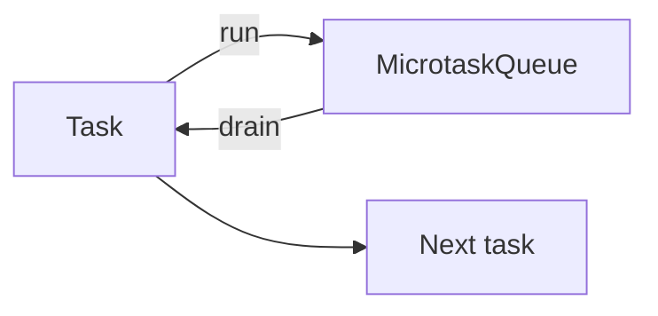

# Chapter 13 — The Event Loop

> JavaScript runs on a single thread. The magic that makes it feel concurrent is the event loop: a scheduler shuffling tasks, microtasks, and I/O callbacks.

## Learning objectives

- Describe the event-loop phases in Node and in the browser.
- Distinguish the *macrotask* queue from the *microtask* queue.
- Predict the order of execution in a snippet.
- Avoid blocking the event loop.

## Prerequisites & recap

- [Promises](12-promises.md).

## In plain terms (newbie lane)

This chapter is really about **The Event Loop**. Skim *Learning objectives* above first—they are your exit ticket.

> **Newbies often think:** they must memorize the whole chapter before writing any code.  
> **Actually:** you only need the *next* honest mental model, then you prove it with the exercises and mini-project.

Companion links: [Onboarding](../appendix-onboarding.md) · [Study habits](../appendix-study-habits.md) · [Concept threads](../appendix-threads/README.md)

<details><summary>Pause and predict</summary>

Without scrolling: what is one real bug or outage class this chapter helps you prevent?

</details>


## Concept deep-dive

### The single thread

Your JS runs on one thread. The event loop picks a *task*, runs it to completion, then drains all pending *microtasks* before picking the next task.

### Two queues (plus more in Node)

- **Macrotask queue**: `setTimeout`, `setInterval`, I/O callbacks, `setImmediate` (Node).
- **Microtask queue**: `Promise.then/catch/finally`, `queueMicrotask`, `MutationObserver` (browser).

After every macrotask, *all* pending microtasks run before the next macrotask. A microtask scheduling another microtask gets processed before returning control.

### Execution order snippet

```js
console.log("1");
setTimeout(() => console.log("2"), 0);
Promise.resolve().then(() => console.log("3"));
console.log("4");
// 1, 4, 3, 2
```

Why: sync first (`1`, `4`). Then microtasks (`3`). Then macrotasks (`2`).

### Node's event loop phases

Roughly:

1. **Timers** — `setTimeout`, `setInterval`.
2. **Pending callbacks** — deferred I/O callbacks.
3. **Idle / prepare** — internal.
4. **Poll** — retrieves new I/O events.
5. **Check** — `setImmediate`.
6. **Close callbacks** — `socket.on("close", ...)`.

Microtasks flush after each phase step.

### Blocking the event loop

A long synchronous computation freezes everything:

```js
while (Date.now() - start < 5000) {}  // 5s of nothing else happens
```

Options:

- Offload to a **Worker thread** (`node:worker_threads`, `Web Worker`).
- Chunk work with `setImmediate`/`setTimeout(0)`.
- Use native modules (C++/Rust) that release the thread.

### Why single-threaded still scales

I/O is async and parallel *outside* JS (libuv's thread pool in Node, browser internals). JS coordinates but doesn't itself do heavy lifting.

## Worked examples

### Example 1 — Micro vs. macro

```js
setTimeout(() => console.log("timeout"), 0);
Promise.resolve().then(() => console.log("promise"));
console.log("sync");
// sync, promise, timeout
```

### Example 2 — `setImmediate` vs. `setTimeout(fn, 0)` in Node

```js
setTimeout(() => console.log("timeout"), 0);
setImmediate(() => console.log("immediate"));
// order depends on the phase you're currently in; setImmediate is guaranteed
// to fire once per poll-phase flush
```

## Diagrams



*Caption: Trace the flow (data/time/money) through this figure before reading further.*

## Common pitfalls & gotchas

- Expecting `setTimeout(..., 0)` to run *immediately*.
- Blocking the loop with a synchronous parse/regex on a huge string.
- Promises scheduled in a tight loop starving macrotasks.
- Mixing browser / Node assumptions.

## Exercises

1. Warm-up. Predict output of the ch. 13 snippet.
2. Standard. Write a version of `delay(n)` that doesn't block the loop.
3. Bug hunt. Why does `while (!ready) {}` deadlock your server?
4. Stretch. Offload a CPU-heavy task to a Worker thread.
5. Stretch++. Use `queueMicrotask` vs. `setTimeout(0)` and discuss ordering.

<details><summary>Show solutions</summary>

3. The loop can't process the event that would set `ready`.

</details>

## Quiz

1. JavaScript runs on:
    (a) one thread (main) (b) many threads (c) kernel only (d) depends
2. `Promise.then` callbacks go to:
    (a) macrotask queue (b) microtask queue (c) nowhere (d) worker queue
3. Microtasks drain:
    (a) after every macrotask (b) once per minute (c) never (d) only on exit
4. `setTimeout(fn, 0)`:
    (a) runs immediately (b) runs as soon as possible, after microtasks (c) runs last (d) is illegal
5. CPU-bound work should:
    (a) stay on main thread (b) move to Worker thread (c) use async (d) be ignored

**Short answer:**

6. Why do microtasks drain before the next macrotask?
7. What's the difference between `setImmediate` and `setTimeout(0)`?

## Mini-project: Apply it

Full brief (goal, acceptance criteria, hints, stretch): [13-event-loop — mini-project](mini-projects/13-event-loop-project.md).

## Where this idea reappears

- **Same thread elsewhere:** trace how this chapter’s primitives show up in production systems — not only in this language or layer.
- **Cross-module links (read next when you feel stuck):**
  - [TypeScript narrowing](../09-ts/10-type-narrowing.md) — turning runtime knowledge into compile-time proofs.
  - [HTTP clients](../10-http-clients/README.md) — where Promises meet the network.

  - [Concept threads (hub)](../appendix-threads/README.md) — state, errors, and performance reading trails.


## Chapter summary

- One thread, two queues, a scheduler.
- Microtasks > macrotasks in priority.
- Offload or chunk CPU-heavy work.

## Further reading

- MDN, *The event loop*. Node.js guides, *The Node.js Event Loop*.
- Next: [runtimes](14-runtimes.md).
