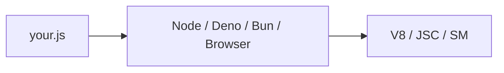

# Chapter 14 — Runtimes

> A JavaScript *runtime* is the program that executes JS: Node.js, Deno, Bun, or a browser's engine. They share the language but differ in APIs, philosophy, and ergonomics.

## Learning objectives

- Distinguish Node.js, Deno, Bun, and browser runtimes.
- Pick the right one for a backend project.
- Use modern Node.js features: `fetch`, `node:test`, `--env-file`.
- Know where to find docs for each.

## Prerequisites & recap

- [Modules](15-modules.md) (next chapter, but this one references it).

## In plain terms (newbie lane)

This chapter is really about **Runtimes**. Skim *Learning objectives* above first—they are your exit ticket.

> **Newbies often think:** they must memorize the whole chapter before writing any code.  
> **Actually:** you only need the *next* honest mental model, then you prove it with the exercises and mini-project.

Companion links: [Onboarding](../appendix-onboarding.md) · [Study habits](../appendix-study-habits.md) · [Concept threads](../appendix-threads/README.md)

<details><summary>Pause and predict</summary>

Without scrolling: what is one real bug or outage class this chapter helps you prevent?

</details>


## Concept deep-dive

### Node.js

The default backend runtime since 2009. Written on V8. Strengths:

- Huge ecosystem (npm).
- Stable LTS cadence.
- Rich stdlib: `node:fs`, `node:net`, `node:http`.
- Modern APIs catching up: global `fetch`, `AbortController`, `WebCrypto`, `node:test`.

Weaknesses: CommonJS-vs-ESM duality, some legacy APIs.

### Deno

Created by Node's original author; addresses early Node regrets:

- Secure by default (permissions for FS, net, env).
- TypeScript native.
- Web-standard APIs (`fetch`, `Response`).
- Explicit URL imports: `import x from "https://…"`.

Good for CLIs and edge functions. Smaller ecosystem than Node's.

### Bun

JS runtime written in Zig, on JavaScriptCore (Safari's engine). Claims much faster startup and I/O. Compatible with most of npm. Aggressive roadmap; watch for breaking changes.

### Browser

Runs JS sandboxed. API surface overlaps with Node's recent additions (`fetch`, `URL`, `crypto.subtle`). No `fs`, no raw sockets.

### Packaging formats

- **CommonJS** (`require`, `module.exports`): legacy Node default.
- **ESM** (`import`, `export`): modern standard. Opt in via `"type": "module"` in `package.json` or `.mjs`.

### Environment variables

- Node 20+: `node --env-file=.env app.js`.
- Before: `dotenv` library or manual parsing.
- Access: `process.env.FOO`.

### Running scripts

```bash
node app.js
node --watch app.js        # re-run on change
node --test                # stdlib test runner (Node 20+)
```

### Choosing

- **Node.js** — default for production APIs. Boring and battle-tested.
- **Deno / Bun** — adventurous or niche (edge, CLIs).
- **Browser** — client-side.

Boot.dev's backend path uses Node.js. So does this book.

## Worked examples

### Example 1 — Modern Node stdlib

```js
import { test } from "node:test";
import assert from "node:assert";

test("adds", () => {
  assert.strictEqual(1 + 2, 3);
});
```

Run: `node --test`.

### Example 2 — Native fetch

```js
const r = await fetch("https://example.com");
console.log(r.status, await r.text());
```

No `axios` needed for simple cases.

## Diagrams



*Caption: Trace the flow (data/time/money) through this figure before reading further.*

## Common pitfalls & gotchas

- Mixing CJS and ESM in the same package without `"type"`.
- Deno's permission flags — scripts that "don't work" often need `-A`.
- Targeting too-new Node on a CI that ships LTS N-1.
- Assuming browser APIs (like `localStorage`) exist in Node.

## Exercises

1. Warm-up. Print Node's version from a script.
2. Standard. Write a script using `node:test` with 3 tests; run with `node --test`.
3. Bug hunt. `import x from "./x.js"` fails with "ERR_UNKNOWN_FILE_EXTENSION". Why?
4. Stretch. Fetch JSON from a public API and print 3 fields.
5. Stretch++. Run the same script under Bun or Deno; note differences.

<details><summary>Show solutions</summary>

3. Missing `"type": "module"` in `package.json`, or extension is `.cjs`/`.mjs` mismatch.

</details>

## Quiz

1. Node.js engine:
    (a) JavaScriptCore (b) SpiderMonkey (c) V8 (d) Chakra
2. ESM opt-in in Node:
    (a) rename to `.mjs` or set `"type": "module"` (b) use `--esm` flag (c) automatic (d) unsupported
3. Secure-by-default runtime:
    (a) Node.js (b) Deno (c) Bun (d) V8
4. `fetch` is:
    (a) Node-only (b) browser-only (c) standard, in all modern runtimes (d) npm package only
5. `node --test`:
    (a) deprecated (b) built-in test runner since Node 20 (c) 3rd party (d) Deno feature

**Short answer:**

6. Why is Node's stdlib test runner appealing?
7. When would you pick Deno over Node?

## Mini-project: Apply it

Full brief (goal, acceptance criteria, hints, stretch): [14-runtimes — mini-project](mini-projects/14-runtimes-project.md).

## Where this idea reappears

- **Same thread elsewhere:** trace how this chapter’s primitives show up in production systems — not only in this language or layer.
- **Cross-module links (read next when you feel stuck):**
  - [TypeScript narrowing](../09-ts/10-type-narrowing.md) — turning runtime knowledge into compile-time proofs.
  - [HTTP clients](../10-http-clients/README.md) — where Promises meet the network.

  - [Concept threads (hub)](../appendix-threads/README.md) — state, errors, and performance reading trails.


## Chapter summary

- Multiple runtimes; Node is the default.
- Modern Node has `fetch`, `node:test`, `--env-file`.
- Pick ESM; avoid mixing formats.

## Further reading

- Node.js docs, *The Node.js event loop*, *ECMAScript modules*.
- Next: [modules](15-modules.md).
