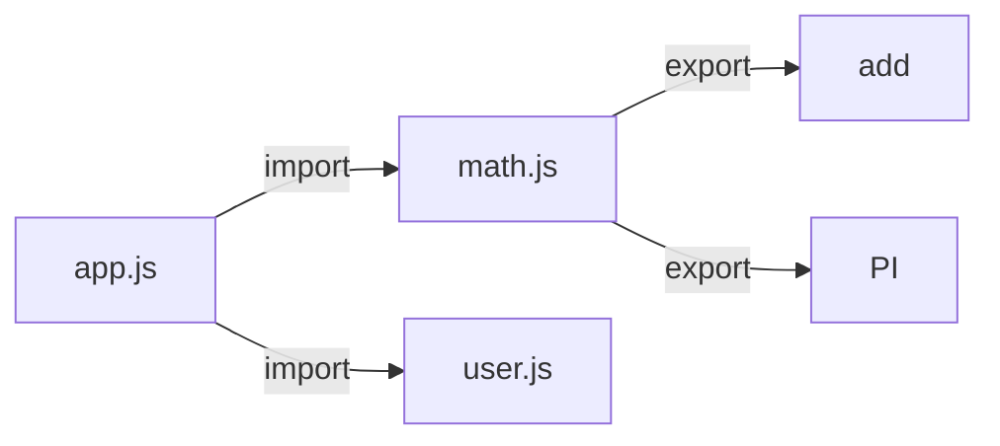

# Chapter 15 — Modules

> Modules split code into files with clean boundaries. ESM is the modern standard — the default for this book and everything that comes after.

## Learning objectives

- Use `import` / `export` fluently.
- Distinguish named and default exports.
- Understand how paths and extensions resolve.
- Know when you'd still meet CommonJS.

## Prerequisites & recap

- [Variables](01-variables.md).

## In plain terms (newbie lane)

This chapter is really about **Modules**. Skim *Learning objectives* above first—they are your exit ticket.

> **Newbies often think:** they must memorize the whole chapter before writing any code.  
> **Actually:** you only need the *next* honest mental model, then you prove it with the exercises and mini-project.

Companion links: [Onboarding](../appendix-onboarding.md) · [Study habits](../appendix-study-habits.md) · [Concept threads](../appendix-threads/README.md)

<details><summary>Pause and predict</summary>

Without scrolling: what is one real bug or outage class this chapter helps you prevent?

</details>


## Concept deep-dive

### Named exports

```js
// math.js
export function add(a, b) { return a + b; }
export const PI = 3.14159;
```

```js
// app.js
import { add, PI } from "./math.js";
```

### Default export

```js
// user.js
export default class User { /* ... */ }
```

```js
import User from "./user.js";      // any name at import site
```

Default exports are less refactor-friendly than named; prefer named unless the module really exposes one thing.

### Renaming

```js
import { add as sum } from "./math.js";
export { sum as add };
```

### Re-exports (barrel)

```js
// index.js
export { add, PI } from "./math.js";
export { default as User } from "./user.js";
```

Barrels are convenient but can hurt tree-shaking — use sparingly.

### Paths and extensions

In Node ESM, relative paths need the extension:

```js
import { add } from "./math.js";        // ok
import { add } from "./math";           // ERR_MODULE_NOT_FOUND
```

TypeScript (with `--moduleResolution` `node16` or `bundler`) bends this. In browsers, relative paths are always URLs.

### Bare specifiers

```js
import express from "express";
```

Resolved via `node_modules`. In Deno, bare specifiers require an import map.

### Dynamic import

```js
const mod = await import("./heavy.js");
mod.run();
```

Returns a promise. Useful for lazy loading or conditional imports.

### CommonJS (`require`)

```js
const math = require("./math");
module.exports = { add };
```

You'll meet it in legacy code and some libraries. Avoid in new projects. Interop: `import` a CJS module yields `{ default: cjsExports }`.

### Side effects and top-level await

Modules run their top-level code once, on first import. Top-level `await` is allowed in ESM:

```js
// config.js
const config = await (await fetch("config.json")).json();
export default config;
```

Blocks consumers until the promise settles.

## Worked examples

### Example 1 — A tiny library

```
src/
  index.js           # barrel
  add.js
  sub.js
```

```js
// add.js
export const add = (a, b) => a + b;
```

```js
// index.js
export { add } from "./add.js";
export { sub } from "./sub.js";
```

```js
import { add, sub } from "./src/index.js";
```

### Example 2 — Dynamic plugin load

```js
async function loadPlugin(name) {
  const mod = await import(`./plugins/${name}.js`);
  return mod.default;
}
```

## Diagrams



*Caption: Trace the flow (data/time/money) through this figure before reading further.*

## Common pitfalls & gotchas

- Missing file extensions in ESM Node.
- Circular imports — allowed but risky; initial values may be `undefined`.
- Mixing CJS/ESM.
- Over-using default exports; refactors lose the name link.

## Exercises

1. Warm-up. Split a utility into `math.js` + `index.js` + `app.js`; import via the barrel.
2. Standard. Rename an export at the import site.
3. Bug hunt. Why does ESM Node reject `import "./x"` (no extension)?
4. Stretch. Load two plugins with `await import(...)` based on a config flag.
5. Stretch++. Demonstrate a circular import going wrong and refactor it.

<details><summary>Show solutions</summary>

3. Node ESM follows strict spec resolution; extensions are mandatory for relative paths.

</details>

## Quiz

1. Preferred export style:
    (a) default (b) named (c) CommonJS (d) mixed
2. Dynamic import returns:
    (a) module (b) function (c) promise resolving to module (d) sync value
3. CommonJS vs. ESM:
    (a) same (b) CJS legacy `require`/`module.exports`; ESM modern `import`/`export` (c) CJS is new (d) ESM deprecated
4. ESM in Node requires:
    (a) `.mjs` or `"type": "module"` (b) nothing (c) TypeScript (d) Deno
5. Top-level await:
    (a) CJS only (b) ESM only (c) both (d) neither

**Short answer:**

6. Why are named exports refactor-friendlier than default?
7. One downside of barrel files.

## Mini-project: Apply it

Full brief (goal, acceptance criteria, hints, stretch): [15-modules — mini-project](mini-projects/15-modules-project.md).

## Where this idea reappears

- **Same thread elsewhere:** trace how this chapter’s primitives show up in production systems — not only in this language or layer.
- **Cross-module links (read next when you feel stuck):**
  - [TypeScript narrowing](../09-ts/10-type-narrowing.md) — turning runtime knowledge into compile-time proofs.
  - [HTTP clients](../10-http-clients/README.md) — where Promises meet the network.

  - [Concept threads (hub)](../appendix-threads/README.md) — state, errors, and performance reading trails.


## Chapter summary

- ESM is the standard; `import` / `export`; extensions mandatory.
- Prefer named exports.
- Dynamic `import()` for laziness.

## Further reading

- Node.js docs, *ECMAScript modules*.
- Next module: [Module 09 — TypeScript](../09-ts/README.md).
