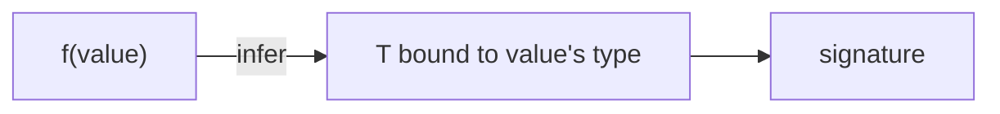

# Chapter 13 — Generics

> Generics let you write code that works for *any* type while keeping the types connected. Without them, you'd either repeat yourself or settle for `any`.

## Learning objectives

- Write generic functions and classes.
- Constrain type parameters with `extends`.
- Use default type parameters.
- Understand how to infer generics from arguments.

## Prerequisites & recap

- [Classes](11-classes.md), [Utility types](12-utility-types.md).

## In plain terms (newbie lane)

This chapter is really about **Generics**. Skim *Learning objectives* above first—they are your exit ticket.

> **Newbies often think:** they must memorize the whole chapter before writing any code.  
> **Actually:** you only need the *next* honest mental model, then you prove it with the exercises and mini-project.

Companion links: [Onboarding](../appendix-onboarding.md) · [Study habits](../appendix-study-habits.md) · [Concept threads](../appendix-threads/README.md)

<details><summary>Pause and predict</summary>

Without scrolling: what is one real bug or outage class this chapter helps you prevent?

</details>


## Concept deep-dive

### Generic function

```ts
function identity<T>(x: T): T { return x; }

identity<number>(5);   // explicit
identity("hi");         // inferred as string
```

### Multiple parameters

```ts
function pair<A, B>(a: A, b: B): [A, B] { return [a, b]; }
```

### Constraints with `extends`

```ts
function longest<T extends { length: number }>(a: T, b: T): T {
  return a.length >= b.length ? a : b;
}
```

`T` must have a `length` property. Works for strings, arrays, typed objects.

### `keyof` and indexed access

```ts
function get<T, K extends keyof T>(obj: T, key: K): T[K] {
  return obj[key];
}

const user = { id: 1, name: "Ada" };
get(user, "name");   // string
get(user, "x");       // error
```

### Default type parameters

```ts
type ResponseEnvelope<T = unknown> = { status: number; data: T };
```

### Generic class

```ts
class Stack<T> {
  private items: T[] = [];
  push(x: T) { this.items.push(x); }
  pop(): T | undefined { return this.items.pop(); }
}

const s = new Stack<number>();
```

### Generic interfaces

```ts
interface Repository<T> {
  find(id: string): Promise<T | null>;
  save(item: T): Promise<void>;
}
```

### `infer` (preview)

Used inside conditional types to pull a type out — see [ch. 14](14-conditional-types.md).

### Variance

TypeScript doesn't expose variance annotations explicitly (until 4.7's `in/out`), but most generics are structural — assignability follows shape.

## Worked examples

### Example 1 — Typed filter

```ts
function filter<T>(xs: readonly T[], pred: (x: T) => boolean): T[] {
  return xs.filter(pred);
}
```

### Example 2 — Typed event emitter

```ts
type EventMap = { login: { userId: string }; logout: {} };

class TypedEmitter<E> {
  private listeners: { [K in keyof E]?: Array<(p: E[K]) => void> } = {};
  on<K extends keyof E>(name: K, fn: (p: E[K]) => void) {
    (this.listeners[name] ??= []).push(fn);
  }
  emit<K extends keyof E>(name: K, payload: E[K]) {
    for (const fn of this.listeners[name] ?? []) fn(payload);
  }
}

const e = new TypedEmitter<EventMap>();
e.on("login", p => p.userId);
e.emit("login", { userId: "abc" });
```

Enterprise-level type safety from ~15 lines.

## Diagrams



*Caption: Trace the flow (data/time/money) through this figure before reading further.*

## Common pitfalls & gotchas

- Over-constraining; start broad and narrow only when needed.
- Explicit generic passes when inference would suffice.
- Generic on class but methods all use `any` — defeats the purpose.
- Conflicting constraints between declaration and usage.

## Exercises

1. Warm-up. Write `first<T>(xs: T[]): T | undefined`.
2. Standard. Generic `groupBy<T, K extends string|number>(xs: T[], key: (x: T) => K): Record<K, T[]>`.
3. Bug hunt. Why does `function f<T>(x: T) { return x.length; }` fail?
4. Stretch. Constrain `T` to `{ id: string }` in a `Repository<T>`.
5. Stretch++. Type-safe `pluck<T, K extends keyof T>(xs: T[], key: K): T[K][]`.

<details><summary>Show solutions</summary>

3. `T` unconstrained — doesn't know about `length`. Constrain: `<T extends { length: number }>`.

</details>

## Quiz

1. Generic:
    (a) subclass (b) type parameter (c) decorator (d) mixin
2. Constraint syntax:
    (a) `T implements X` (b) `T extends X` (c) `T is X` (d) `T: X`
3. `keyof T`:
    (a) runtime keys (b) union of T's property name literals (c) arbitrary string (d) values
4. Explicit generic argument:
    (a) required (b) optional when inferable (c) always (d) never
5. Default type parameter:
    (a) `T = X` (b) `T ? X` (c) `T := X` (d) `T!`

**Short answer:**

6. When do you need constraints?
7. Give one reason for explicit generic arguments.

## Mini-project: Apply it

Full brief (goal, acceptance criteria, hints, stretch): [13-generics — mini-project](mini-projects/13-generics-project.md).

## Where this idea reappears

- **Same thread elsewhere:** trace how this chapter’s primitives show up in production systems — not only in this language or layer.
- **Cross-module links (read next when you feel stuck):**
  - [HTTP servers in TypeScript](../12-http-servers/README.md) — types meet request/response boundaries.
  - [Runtime validation](../10-http-clients/10-runtime-validation.md) — when `unknown` enters your trust boundary.

  - [Concept threads (hub)](../appendix-threads/README.md) — state, errors, and performance reading trails.


## Chapter summary

- Generics: parameters for types.
- Constrain with `extends`; default with `=`.
- `keyof` + indexed access for object property gymnastics.

## Further reading

- TS Handbook, *Generics*.
- Next: [conditional types](14-conditional-types.md).
