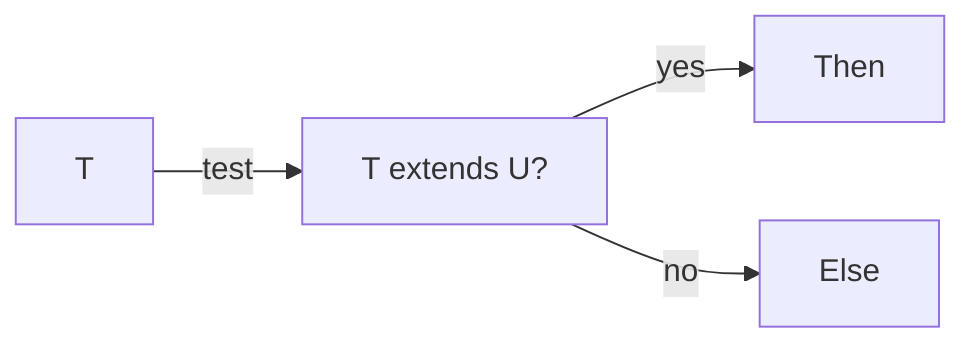

# Chapter 14 — Conditional Types

> Conditional types are `if`-expressions on types. They let you compute types from other types — the heart of TypeScript's advanced type magic.

## Learning objectives

- Write conditional types `T extends U ? X : Y`.
- Use `infer` to extract parts of a type.
- Understand distribution over unions.

## Prerequisites & recap

- [Generics](13-generics.md).

## In plain terms (newbie lane)

This chapter is really about **Conditional Types**. Skim *Learning objectives* above first—they are your exit ticket.

> **Newbies often think:** they must memorize the whole chapter before writing any code.  
> **Actually:** you only need the *next* honest mental model, then you prove it with the exercises and mini-project.

Companion links: [Onboarding](../appendix-onboarding.md) · [Study habits](../appendix-study-habits.md) · [Concept threads](../appendix-threads/README.md)

<details><summary>Pause and predict</summary>

Without scrolling: what is one real bug or outage class this chapter helps you prevent?

</details>


## Concept deep-dive

### Syntax

```ts
type IsString<T> = T extends string ? true : false;

type A = IsString<"hi">;    // true
type B = IsString<42>;       // false
```

### `infer`

Pull a type out of a structure:

```ts
type ElementOf<T> = T extends (infer U)[] ? U : never;
type S = ElementOf<string[]>;     // string
type N = ElementOf<number[]>;     // number
```

Used internally by `ReturnType`, `Parameters`, `Awaited`:

```ts
type MyReturnType<F> = F extends (...args: any[]) => infer R ? R : never;
```

### Distribution over unions

When the tested type is a "naked" type parameter, conditional types distribute over the union:

```ts
type WrapInArray<T> = T extends any ? T[] : never;
type R = WrapInArray<string | number>;   // string[] | number[]
```

Disable distribution by wrapping in a tuple:

```ts
type WrapInArrayAll<T> = [T] extends [any] ? T[] : never;
type R2 = WrapInArrayAll<string | number>;  // (string | number)[]
```

### Chained conditionals

```ts
type TypeName<T> =
    T extends string  ? "string"
  : T extends number  ? "number"
  : T extends boolean ? "boolean"
  : T extends undefined ? "undefined"
  : T extends Function ? "function"
  : "object";
```

### Practical uses

- `Awaited<T>` — unwrap promises.
- `ReturnType<F>`, `Parameters<F>` — pull parts of function types.
- Distinguishing tuples from arrays.
- Discriminating overloads.

### Template literal types

Not conditionals per se, but complementary:

```ts
type URLOf<P extends string> = `https://api.com/${P}`;
type U = URLOf<"users">;   // "https://api.com/users"
```

## Worked examples

### Example 1 — `Unarray`

```ts
type Unarray<T> = T extends (infer U)[] ? U : T;
type A = Unarray<string[]>;    // string
type B = Unarray<number>;       // number
```

### Example 2 — Flatten one level

```ts
type Flat<T> = T extends (infer U)[] ? Unarray<U> : T;
type X = Flat<number[][]>;     // number
```

## Diagrams



*Caption: Trace the flow (data/time/money) through this figure before reading further.*

## Common pitfalls & gotchas

- Distribution surprises: `T extends any ? T[] : never` on a union becomes a union of arrays, not an array of unions.
- Over-engineered conditional chains become unreadable; stop before you reach the type system's edges.
- Missing `[T]` wrap when you want no distribution.

## Exercises

1. Warm-up. Write `IsNumber<T>`.
2. Standard. Implement `Awaited<T>` using `infer`.
3. Bug hunt. Why does `T extends any ? T[] : never` distribute over unions?
4. Stretch. Write `Exclude<T, U>` from scratch (`T extends U ? never : T`).
5. Stretch++. Template literal: `CamelCase<"hello_world">` → `"helloWorld"`.

<details><summary>Show solutions</summary>

4. Exactly `T extends U ? never : T`.
5. Template literal + conditional recursion; see `CamelCase` recipes online.

</details>

## Quiz

1. Conditional type:
    (a) runtime `if` (b) compile-time `T extends U ? X : Y` (c) type guard (d) overload
2. `infer`:
    (a) declares a variable (b) captures a part of a matched type (c) asserts (d) runtime
3. Distribution:
    (a) happens when T is naked in conditional (b) always (c) never (d) runtime
4. Disable distribution:
    (a) wrap in tuple `[T]` (b) change to interface (c) use `any` (d) impossible
5. Template literal types:
    (a) runtime strings (b) compile-time string composition (c) regex (d) deprecated

**Short answer:**

6. When does distribution matter in practice?
7. Give one real-world use of `infer`.

## Mini-project: Apply it

Full brief (goal, acceptance criteria, hints, stretch): [14-conditional-types — mini-project](mini-projects/14-conditional-types-project.md).

## Where this idea reappears

- **Same thread elsewhere:** trace how this chapter’s primitives show up in production systems — not only in this language or layer.
- **Cross-module links (read next when you feel stuck):**
  - [HTTP servers in TypeScript](../12-http-servers/README.md) — types meet request/response boundaries.
  - [Runtime validation](../10-http-clients/10-runtime-validation.md) — when `unknown` enters your trust boundary.

  - [Concept threads (hub)](../appendix-threads/README.md) — state, errors, and performance reading trails.


## Chapter summary

- Conditional types = type-level if.
- `infer` pulls pieces out.
- Distribution over unions is both powerful and tricky.

## Further reading

- TS Handbook, *Conditional Types*.
- Next: [local development](15-local-development.md).
