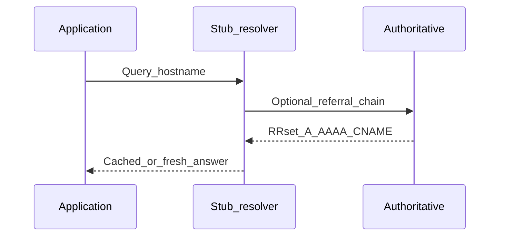

# Chapter 02 — DNS

> "Before HTTP does anything, DNS has to tell it where to go. 'It's always DNS' — the first thing you check when something is mysteriously broken."

## Learning objectives

By the end of this chapter you will be able to:

- Explain how a hostname becomes an IP address through the DNS resolution chain.
- Describe the purpose of A, AAAA, CNAME, MX, TXT, and NS record types.
- Use `dig`, `nslookup`, and `host` to inspect DNS from the terminal.
- Explain how TTL and caching affect DNS propagation.
- Perform DNS lookups programmatically in Node.js.

## Prerequisites & recap

- [Why HTTP](01-why-http.md) — you know HTTP runs over TCP/QUIC and needs an IP address to connect.

## The simple version

When you type `fetch("https://api.example.com/users")`, your code doesn't actually know where `api.example.com` lives on the internet. DNS is the phone book that translates that human-friendly name into a numeric IP address like `93.184.215.14`. Only then can your code open a TCP connection.

The lookup follows a delegation chain: your machine asks a resolver, the resolver asks root name servers, those point to `.com` servers, which point to the authoritative server for `example.com`, and that finally returns the IP. Every answer is cached for a duration called the TTL, so this chain is only walked in full on the first lookup.

## In plain terms (newbie lane)

This chapter is really about **DNS**. Skim *Learning objectives* above first—they are your exit ticket.

> **Newbies often think:** they must memorize the whole chapter before writing any code.  
> **Actually:** you only need the *next* honest mental model, then you prove it with the exercises and mini-project.

Companion links: [Onboarding](../appendix-onboarding.md) · [Study habits](../appendix-study-habits.md) · [Concept threads](../appendix-threads/README.md)

<details><summary>Pause and predict</summary>

Without scrolling: what is one real bug or outage class this chapter helps you prevent?

</details>


## Visual flow

```
  ┌──────┐    ┌──────────┐    ┌──────┐    ┌─────┐    ┌─────────────┐
  │ Your │    │ Recursive│    │ Root │    │.com │    │Authoritative│
  │  App │    │ Resolver │    │  NS  │    │ TLD │    │   NS for    │
  │      │    │(1.1.1.1) │    │      │    │     │    │ example.com │
  └──┬───┘    └────┬─────┘    └──┬───┘    └──┬──┘    └──────┬──────┘
     │  A?         │             │           │              │
     │────────────▶│  A?         │           │              │
     │             │────────────▶│           │              │
     │             │  try .com   │           │              │
     │             │◀────────────│           │              │
     │             │        A?               │              │
     │             │────────────────────────▶│              │
     │             │        try auth NS      │              │
     │             │◀────────────────────────│              │
     │             │                  A?                    │
     │             │──────────────────────────────────────▶│
     │             │                  93.184.215.14         │
     │             │◀──────────────────────────────────────│
     │ 93.184.215.14                                       │
     │◀────────────│                                       │
     │             │                                       │
```

*DNS resolution is a delegation chain. Each server says "I don't know, but ask them." Caching shortcuts this after the first lookup.*

## DNS resolution chain (Mermaid)



*Stub resolver handles recursion; your HTTP client only sees the final address.*

## Concept deep-dive

### The lookup chain

When you call `fetch("https://example.com")`, here's what happens before any HTTP byte flows:

1. **Application cache** — your runtime (Node, browser) may have resolved this name recently.
2. **OS cache** — the operating system keeps its own DNS cache.
3. **Recursive resolver** — your configured DNS server (often your ISP, or a public resolver like `1.1.1.1` or `8.8.8.8`). This is the workhorse.
4. **The delegation walk** — the resolver queries root name servers → the TLD server for `.com` → the authoritative name server for `example.com`.
5. **The answer** — an A record (IPv4) or AAAA record (IPv6) comes back.

Why does this multi-step design exist? Because no single server can hold every domain's records. The hierarchical delegation lets the system scale to billions of domains while keeping each server's responsibility small.

### Record types

| Type | Maps | Example | Why it exists |
|------|------|---------|---------------|
| **A** | hostname → IPv4 | `example.com → 93.184.215.14` | The fundamental lookup |
| **AAAA** | hostname → IPv6 | `example.com → 2606:2800:...` | IPv6 support |
| **CNAME** | alias → another hostname | `www.example.com → example.com` | Lets multiple names point to one canonical name |
| **MX** | domain → mail server | `example.com → mail.example.com` | Email routing |
| **TXT** | domain → arbitrary text | SPF, DKIM, domain verification | Prove domain ownership, email auth |
| **NS** | domain → name server | `example.com → ns1.example.com` | Delegates authority |
| **SOA** | domain → authority metadata | Serial number, refresh intervals | Zone management |

### TTL and caching

Every DNS record carries a **TTL** (time-to-live) in seconds. Resolvers and OS caches honor this: once they've seen a record, they won't ask again until the TTL expires.

This is why DNS changes aren't instant. If you change an A record but the old record had a 24-hour TTL, some clients will keep using the old IP for up to 24 hours. The fix: lower the TTL *before* making the change, wait for the old TTL to expire, then make the change.

Short TTLs (60–300s) allow fast failover but increase DNS traffic. Long TTLs (3600s+) reduce traffic but slow propagation. Most production services use 300s as a sensible default.

### Tools

```bash
dig example.com              # full answer with TTL, authority, etc.
dig +short example.com       # just the IP
dig AAAA example.com         # IPv6 record
dig MX example.com           # mail servers
dig @1.1.1.1 example.com    # query a specific resolver
nslookup example.com         # simpler output, cross-platform
host example.com             # simplest one-liner
```

Why learn these? Because when an HTTP request fails with "could not resolve host," you need to confirm whether the problem is DNS, not your code. `dig` is the single most useful debugging tool for that.

### DNS in Node.js

```ts
import { promises as dns } from "node:dns";

await dns.resolve4("example.com");       // [ '93.184.215.14' ]
await dns.resolve6("example.com");       // [ '2606:2800:...' ]
await dns.resolveMx("gmail.com");        // [ { exchange: '...', priority: 5 } ]
await dns.resolveTxt("example.com");     // [ ['v=spf1 ...'] ]
```

Node's default `dns.lookup()` uses the OS resolver (via libuv's `getaddrinfo`), which is single-threaded. If you need high-throughput parallel lookups, use `dns.promises.resolve4()` instead — it bypasses the thread pool and uses c-ares directly.

### HTTPS and DNS

When multiple HTTPS sites share a single IP, DNS alone can't distinguish them. That's where **SNI** (Server Name Indication) comes in: the client includes the hostname in the TLS handshake so the server picks the right certificate. DNS resolves the IP; SNI picks the cert.

### DNS over HTTPS (DoH)

Traditional DNS queries are plaintext UDP — anyone on the network path can see which domains you're resolving. DNS over HTTPS encrypts those queries inside a regular HTTPS connection to a resolver like `1.1.1.1` or `8.8.8.8`. This prevents eavesdropping and tampering but adds a dependency on the DoH provider.

## Why these design choices

| Decision | Why | Alternative | When you'd pick differently |
|---|---|---|---|
| Hierarchical delegation | Scales to billions of domains; no single point of failure | Flat namespace (like a hosts file) | You wouldn't — flat doesn't scale |
| Caching with TTL | Reduces load on authoritative servers, speeds up lookups | No caching (query every time) | Never in practice; but short TTLs approximate it for failover |
| UDP transport | Fast, low overhead for small queries | TCP (used for large responses, zone transfers) | Responses > 512 bytes or when reliability matters |
| Plaintext by default | Simplicity, historical | DoH, DoT (DNS over TLS) | When privacy matters — increasingly the default in browsers |

## Production-quality code

```ts
import { promises as dns } from "node:dns";

interface DnsReport {
  hostname: string;
  a: string[];
  aaaa: string[];
  mx: Array<{ exchange: string; priority: number }>;
  txt: string[][];
  error?: string;
}

async function resolveSafe<T>(fn: () => Promise<T>, fallback: T): Promise<T> {
  try {
    return await fn();
  } catch {
    return fallback;
  }
}

async function dnsReport(hostname: string): Promise<DnsReport> {
  const [a, aaaa, mx, txt] = await Promise.all([
    resolveSafe(() => dns.resolve4(hostname), []),
    resolveSafe(() => dns.resolve6(hostname), []),
    resolveSafe(() => dns.resolveMx(hostname), []),
    resolveSafe(() => dns.resolveTxt(hostname), []),
  ]);

  return { hostname, a, aaaa, mx, txt };
}

async function main() {
  const hostname = process.argv[2];
  if (!hostname) {
    console.error("Usage: npx tsx 02-dns.ts <hostname>");
    process.exit(1);
  }

  const report = await dnsReport(hostname);
  console.log(`DNS report for ${report.hostname}:`);
  console.log(`  A:    ${report.a.join(", ") || "(none)"}`);
  console.log(`  AAAA: ${report.aaaa.join(", ") || "(none)"}`);
  console.log(`  MX:   ${report.mx.map(r => `${r.priority} ${r.exchange}`).join(", ") || "(none)"}`);
  console.log(`  TXT:  ${report.txt.map(r => r.join("")).join("; ") || "(none)"}`);
}

main();
```

## Security notes

- **DNS poisoning** — an attacker injects a forged DNS response, redirecting traffic to a malicious IP. DNSSEC signs records to prevent this, but adoption is still incomplete.
- **DNS exfiltration** — malware encodes stolen data in DNS queries (e.g., `stolen-data.evil.com`). Monitor outbound DNS for anomalies.
- **Plaintext DNS leaks** — traditional DNS exposes every domain you resolve. Use DoH or DoT in privacy-sensitive environments.
- **SNI leaks** — even with DoH, the SNI field in TLS is visible unless you use ECH (Encrypted Client Hello), which is still emerging.

## Performance notes

- **DNS adds latency before HTTP starts.** A cold lookup (no cache) can take 50–200ms as it walks the delegation chain. Hot cache: <1ms.
- **Connection reuse amortizes DNS cost.** HTTP keep-alive and HTTP/2 multiplexing mean you pay the DNS cost once per host, not once per request.
- **Node's `dns.lookup()` bottleneck** — it uses the libuv thread pool (default 4 threads). Under heavy load, DNS lookups queue up. Increase `UV_THREADPOOL_SIZE` or switch to `dns.resolve4()`.
- **TTL-aware caching in your app** can help for services that resolve the same hosts repeatedly. But be careful not to cache longer than the TTL, or you'll miss failovers.

## Common mistakes

| # | Symptom | Cause | Fix |
|---|---------|-------|-----|
| 1 | "Site works in the browser but not from my Node script" | `/etc/hosts` has an override the browser uses but Node's `dns.resolve4()` bypasses | Use `dns.lookup()` (which reads `/etc/hosts`) or check `/etc/hosts` |
| 2 | "I changed the DNS record but clients still hit the old IP" | Caches still hold the old record within its TTL | Lower the TTL before making changes; wait for the old TTL to expire |
| 3 | "DNS resolution is slow under load" | Node's default `dns.lookup()` uses the libuv thread pool, which is only 4 threads by default | Set `UV_THREADPOOL_SIZE=64` or use `dns.resolve4()` for async resolution |
| 4 | "CNAME chain resolution fails intermittently" | Too many CNAME hops (some resolvers give up after 8–10) | Flatten the chain; point directly to an A record where possible |

## Practice

### Warm-up

Use `dig +short example.com` to find the A record for `example.com`.

<details><summary>Show solution</summary>

```bash
dig +short example.com
# 93.184.215.14
```

</details>

### Standard

Use Node's `dns.promises` to resolve a hostname and print all IPv4 addresses.

<details><summary>Show solution</summary>

```ts
import { promises as dns } from "node:dns";

const addresses = await dns.resolve4("example.com");
console.log("IPv4 addresses:", addresses);
```

</details>

### Bug hunt

A developer reports: "I changed the A record for `api.myapp.com` from `1.2.3.4` to `5.6.7.8` thirty minutes ago, but some users still hit the old IP." What's happening?

<details><summary>Show solution</summary>

The old A record had a long TTL (likely 3600s / 1 hour or more). Caches — at the OS level, the ISP's resolver, and intermediate resolvers — will keep serving the old IP until the TTL expires. The fix: before making DNS changes, lower the TTL to something short (e.g., 60s), wait for the *old* TTL to expire, then make the change.

</details>

### Stretch

Create a custom DNS resolver in Node that queries Cloudflare's `1.1.1.1` instead of the system default.

<details><summary>Show solution</summary>

```ts
import { promises as dns } from "node:dns";

const resolver = new dns.Resolver();
resolver.setServers(["1.1.1.1"]);
const addresses = await resolver.resolve4("example.com");
console.log("Via Cloudflare:", addresses);
```

</details>

### Stretch++

Write a small TTL-aware in-memory DNS cache. It should store resolved addresses with their TTL and return cached results until the TTL expires, then re-resolve.

<details><summary>Show solution</summary>

```ts
import { promises as dns } from "node:dns";

interface CacheEntry {
  addresses: string[];
  expiresAt: number;
}

const cache = new Map<string, CacheEntry>();

async function resolveWithCache(
  hostname: string,
  ttlMs = 300_000,
): Promise<string[]> {
  const now = Date.now();
  const cached = cache.get(hostname);

  if (cached && cached.expiresAt > now) {
    return cached.addresses;
  }

  const addresses = await dns.resolve4(hostname);
  cache.set(hostname, { addresses, expiresAt: now + ttlMs });
  return addresses;
}

// First call resolves; second call returns from cache
console.log(await resolveWithCache("example.com"));
console.log(await resolveWithCache("example.com")); // cached
```

Note: a production cache would use the actual TTL from the DNS response. Node's `dns.resolve4()` doesn't expose the TTL directly — you'd need a library like `dns-packet` or a custom resolver for that.

</details>

## Quiz

1. An A record maps:
   (a) Hostname → IPv4  (b) Hostname → IPv6  (c) IPv4 → hostname  (d) Domain → mail server

2. TTL determines:
   (a) Record size  (b) How long a cache holds a record before re-querying  (c) DNS version  (d) Port number

3. A CNAME record is:
   (a) An alias pointing to another hostname  (b) A mail exchange record  (c) Arbitrary text  (d) A name server delegation

4. HTTPS + SNI allows:
   (a) Replacing DNS entirely  (b) Multiple hosts to share an IP, with the cert matching the requested hostname  (c) Skipping TLS  (d) HTTP/2 only

5. DNS over HTTPS provides:
   (a) No encryption  (b) Encrypted DNS queries to prevent eavesdropping  (c) A replacement for TLS  (d) HTTP/3 exclusively

**Short answer:**

6. Why does DNS change propagation take time?
7. Name two command-line tools for inspecting DNS records.

*Answers: 1-a, 2-b, 3-a, 4-b, 5-b. 6 — Resolvers and OS caches hold the old record until its TTL expires; until then, they serve the stale answer without re-querying the authoritative server. 7 — Any two of: `dig`, `nslookup`, `host`.*

## Learn-by-doing mini-project

Full brief (goal, acceptance criteria, hints, stretch): [02-dns — mini-project](mini-projects/02-dns-project.md).

## Where this idea reappears

- **Same thread elsewhere:** trace how this chapter’s primitives show up in production systems — not only in this language or layer.
- **Cross-module links (read next when you feel stuck):**
  - [HTTP servers](../12-http-servers/01-servers.md) — the other side of the same protocol.
  - [Webhooks and callbacks](../12-http-servers/09-webhooks.md) — HTTP used as an event bus.

  - [Concept threads (hub)](../appendix-threads/README.md) — state, errors, and performance reading trails.


## Chapter summary

- DNS translates hostnames to IP addresses through a hierarchical delegation chain (root → TLD → authoritative).
- Record types (A, AAAA, CNAME, MX, TXT, NS) each serve a specific purpose in the resolution ecosystem.
- TTL controls caching duration — it's the reason DNS changes aren't instant.
- `dig` is your go-to debugging tool; Node's `dns.promises` module is your programmatic interface.

## Further reading

- *DNS and BIND*, Albitz & Liu — the comprehensive reference.
- Julia Evans, *How DNS works* — visual explanation.
- Next: [URIs](03-uris.md).
