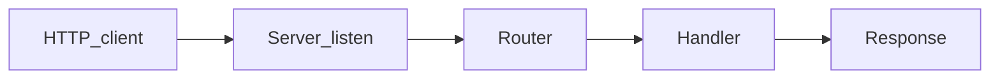

# Chapter 04 — JSON

> JSON is almost always the wire format for server APIs. Parse carefully, validate always, serialize explicitly.

## Learning objectives

By the end of this chapter you will be able to:

- Parse JSON request bodies safely with size limits.
- Validate every field with Zod before it reaches your service layer.
- Design consistent response envelopes for success and error cases.
- Handle edge cases: dates, BigInts, nested objects, and large payloads.
- Stream large result sets with NDJSON to avoid memory exhaustion.

## Prerequisites & recap

- [JSON (client side)](../10-http-clients/06-json.md) — you know how `JSON.parse()` and `JSON.stringify()` work.
- [Runtime validation](../10-http-clients/10-runtime-validation.md) — you've used Zod to validate unknown data.

## The simple version

When a client sends your server a request, the body arrives as raw bytes. Your server needs to (1) decode those bytes into a JavaScript object (parsing), (2) check that every field has the right type and shape (validation), and (3) send back a response in a predictable format (serialization). If you skip step 2, you're trusting the internet to send you well-formed data — which is roughly as safe as leaving your front door open and hoping only friends walk in.

On the way out, you need a consistent "envelope" for responses so every client (and every developer on your team) knows exactly where to find the data, the error code, and the pagination info without reading endpoint-specific documentation.

## In plain terms (newbie lane)

This chapter is really about **JSON**. Skim *Learning objectives* above first—they are your exit ticket.

> **Newbies often think:** they must memorize the whole chapter before writing any code.  
> **Actually:** you only need the *next* honest mental model, then you prove it with the exercises and mini-project.

Companion links: [Onboarding](../appendix-onboarding.md) · [Study habits](../appendix-study-habits.md) · [Concept threads](../appendix-threads/README.md)

<details><summary>Pause and predict</summary>

Without scrolling: what is one real bug or outage class this chapter helps you prevent?

</details>


## Visual flow

```
  Client POST body (raw bytes)
       │
       ▼
  ┌──────────────┐     ┌──────────────┐     ┌───────────┐
  │ Body parser  │────▶│ Zod validate │────▶│  Service   │
  │ (JSON.parse) │     │ (type-safe)  │     │  logic     │
  └──────────────┘     └──────────────┘     └─────┬─────┘
                                                  │
       ┌──────────────────────────────────────────┘
       ▼
  ┌────────────────┐     ┌───────────────────┐
  │ Serialize      │────▶│ HTTP response     │
  │ (JSON.stringify│     │ { data: {...} }   │
  │  + envelope)   │     │ 201 Created       │
  └────────────────┘     └───────────────────┘
```
*Caption: Request body flows through parsing, validation, and service logic. Response is serialized into a consistent envelope.*

## System diagram (Mermaid)



*High-level HTTP server data flow for this chapter’s topic.*

## Concept deep-dive

### Parsing the request body

Express needs explicit middleware to parse JSON:

```ts
app.use(express.json({ limit: "1mb" }));
```

Fastify parses JSON by default. Both reject malformed JSON with a 400 status.

**Why the `limit`?** Without it, an attacker can POST a multi-gigabyte body and crash your server with an out-of-memory error. 1 MB is generous for most JSON APIs. File uploads use a different mechanism (multipart, presigned URLs).

### Validating with Zod

Never trust `req.body`. Even if the JSON is syntactically valid, the fields might be wrong:

```ts
import { z } from "zod";

const CreateUser = z.object({
  email: z.string().email(),
  name: z.string().min(1).max(100),
  password: z.string().min(12),
});

app.post("/users", asyncHandler(async (req, res) => {
  const input = CreateUser.parse(req.body);
  const user = await userService.register(input);
  res.status(201).json({ data: user });
}));
```

On parse failure, Zod throws a `ZodError` with field-level details. Your error middleware (Chapter 05) turns that into a 400 response.

**Why Zod and not manual checks?** Because manual `if (!req.body.email)` checks are tedious, error-prone, and don't give you type inference. Zod validates *and* narrows the TypeScript type in one call.

### Response envelopes — pick a style and stick to it

Three common patterns:

| Style | Example | When to use |
|---|---|---|
| Bare object | `{ id: 1, name: "Ada" }` | Simple, but no room for metadata |
| Data wrapper | `{ data: { id: 1, name: "Ada" } }` | Easy to add `meta` later |
| Data + meta | `{ data: [...], meta: { page: 1, total: 42 } }` | Paginated lists |

Consistency matters more than which style you pick. Document your choice in OpenAPI or a README, and use it on every endpoint.

### Error envelopes

Errors should also follow a consistent shape:

```json
{
  "error": "validation_failed",
  "details": [
    { "path": "email", "message": "Invalid email" }
  ]
}
```

Include a machine-readable `error` code (for programmatic handling) and a human-readable `message` or `details` (for developer debugging). Never return just a string.

### Content-Type

Always set `Content-Type: application/json; charset=utf-8` on responses. Express's `res.json()` does this automatically. The danger is error pages — if your reverse proxy or a fallback handler returns HTML, JSON clients break. Make sure every path through your server returns JSON.

### Dates

Serialize dates as ISO 8601 strings (`"2025-01-15T09:30:00.000Z"`). Never send `Date` objects (they don't exist in JSON) or Unix timestamps without documenting it. ISO strings are unambiguous, sortable, and parseable in every language.

### BigInts

`JSON.stringify()` throws on BigInt values. You have two options:

1. Convert to string before serialization: `{ id: bigintValue.toString() }`.
2. Use a custom replacer: `JSON.stringify(obj, (_, v) => typeof v === "bigint" ? v.toString() : v)`.

Document which fields are string-encoded numbers.

### Streaming large responses with NDJSON

If an endpoint returns thousands of items, building a giant JSON array in memory is expensive. Newline-delimited JSON (NDJSON) streams one object per line:

```
{"id":1,"name":"Ada"}
{"id":2,"name":"Alan"}
{"id":3,"name":"Grace"}
```

```ts
app.get("/export", asyncHandler(async (_req, res) => {
  res.setHeader("Content-Type", "application/x-ndjson");
  for await (const row of db.streamRows("SELECT * FROM users")) {
    res.write(JSON.stringify(row) + "\n");
  }
  res.end();
}));
```

The client reads line-by-line. Memory usage stays constant regardless of result set size.

## Why these design choices

| Decision | Trade-off | When you'd pick differently |
|---|---|---|
| Zod validation on every endpoint | Slight runtime overhead (~µs per request) | Extremely hot path with pre-validated internal traffic → skip validation (rare) |
| 1 MB body limit | Rejects legitimate large payloads | File uploads → use multipart or presigned URLs instead of JSON |
| Data envelope `{ data: ... }` | Slightly more verbose | Internal microservice with typed clients → bare objects are fine |
| ISO date strings | Slightly longer than timestamps | Analytics pipeline that needs numeric timestamps → document and use numbers |
| NDJSON for large exports | Clients must handle streaming | Result set always fits in memory → return a normal JSON array |

## Production-quality code

```ts
import express, { Request, Response, NextFunction } from "express";
import { z, ZodError } from "zod";

const app = express();
app.use(express.json({ limit: "1mb" }));

function asyncHandler(fn: (req: Request, res: Response) => Promise<void>) {
  return (req: Request, res: Response, next: NextFunction) =>
    Promise.resolve(fn(req, res)).catch(next);
}

// --- Schemas ---

const CreateBook = z.object({
  title: z.string().min(1).max(200),
  author: z.string().min(1).max(100),
  published: z.string().date().optional(),
  isbn: z.string().regex(/^\d{13}$/).optional(),
});

const UpdateBook = CreateBook.partial();

const PaginationQuery = z.object({
  limit: z.coerce.number().int().min(1).max(100).default(20),
  offset: z.coerce.number().int().min(0).default(0),
});

// --- Handlers ---

app.get("/v1/books", asyncHandler(async (req, res) => {
  const { limit, offset } = PaginationQuery.parse(req.query);
  const { books, total } = await bookService.list({ limit, offset });
  res.json({ data: books, meta: { limit, offset, total } });
}));

app.get("/v1/books/:id", asyncHandler(async (req, res) => {
  const book = await bookService.getById(req.params.id);
  res.json({ data: book });
}));

app.post("/v1/books", asyncHandler(async (req, res) => {
  const input = CreateBook.parse(req.body);
  const book = await bookService.create(input);
  res.status(201).json({ data: book });
}));

app.patch("/v1/books/:id", asyncHandler(async (req, res) => {
  const input = UpdateBook.parse(req.body);
  const book = await bookService.update(req.params.id, input);
  res.json({ data: book });
}));

// --- Uniform error middleware ---

app.use((err: unknown, req: Request, res: Response, _next: NextFunction) => {
  if (err instanceof ZodError) {
    res.status(400).json({
      error: "validation_failed",
      details: err.issues.map((i) => ({
        path: i.path.join("."),
        message: i.message,
      })),
    });
    return;
  }

  if (err instanceof Error && "status" in err && "code" in err) {
    const httpErr = err as Error & { status: number; code: string };
    res.status(httpErr.status).json({
      error: httpErr.code,
      message: httpErr.message,
    });
    return;
  }

  (req as any).log?.error(err);
  res.status(500).json({ error: "server_error" });
});
```

## Security notes

- **Injection via JSON** — a malicious body like `{ "__proto__": { "admin": true } }` can pollute prototypes. Modern Express and Fastify mitigate this, but if you use custom parsing or spread user input into objects, be careful. Validate with Zod to only accept known fields.
- **Information leakage in error responses** — never include stack traces, SQL queries, or internal file paths in 4xx/5xx responses. Log them server-side.
- **Content-Type mismatch** — if an attacker sends `Content-Type: text/html` to a JSON endpoint, your body parser ignores it (no parse). This is correct behavior — but make sure you don't fall through to a handler that assumes `req.body` exists.
- **Nested object depth** — deeply nested JSON can cause stack overflow during parsing. Set `express.json({ limit: "1mb" })` and consider a `parameterLimit` or depth check for pathological inputs.

## Performance notes

- **`JSON.parse()` is fast** — V8's JSON parser is highly optimized. For typical API payloads (< 100 KB), parsing takes microseconds. Don't try to optimize this unless profiling shows it's a bottleneck.
- **`JSON.stringify()` on large objects** can be slow. For responses with thousands of items, consider NDJSON streaming or pagination.
- **Body size limits prevent DoS** — without them, a single request can allocate gigabytes of memory and crash your process.
- **Zod validation overhead** is negligible for most payloads. If you profile and find it slow on very large schemas, consider using Zod's `.safeParse()` with caching or switching to compiled validators like Ajv for hot paths.
- **Avoid serializing unnecessary fields** — if your database row has 30 columns but the client only needs 5, select only those 5. Less data to serialize means faster responses and less bandwidth.

## Common mistakes

| Symptom | Cause | Fix |
|---|---|---|
| `req.body` is `undefined` | Forgot `app.use(express.json())` | Add the JSON body-parsing middleware before your routes |
| Server crashes with `FATAL ERROR: CALL_AND_RETRY_LAST Allocation failed` | No body size limit — a single large request exhausted memory | Set `express.json({ limit: "1mb" })` |
| Endpoints return different shapes: one returns `{ users: [...] }`, another returns `[...]` | No agreed-upon response envelope | Pick a convention (`{ data: ... }` or `{ data: ..., meta: ... }`) and enforce it in code review |
| `TypeError: Do not know how to serialize a BigInt` | `JSON.stringify()` throws on BigInt values | Convert BigInts to strings before serialization |
| Error responses include a full Node.js stack trace | Default error handler or no error middleware | Add a central error middleware that strips internal details (see Chapter 05) |
| Client receives HTML error page from a JSON API | Reverse proxy (nginx) returned its own error page on 502/504 | Configure nginx to return JSON error bodies, or add `error_page` directives with JSON responses |

## Practice

**Warm-up.** Add a 1 MB body size limit to your Express server. Test by sending a payload larger than 1 MB and verifying you get a 413 response.

<details><summary>Solution</summary>

```ts
app.use(express.json({ limit: "1mb" }));
```

Test with:
```bash
node -e "process.stdout.write('{\"x\":\"' + 'A'.repeat(2_000_000) + '\"}')" \
  | curl -X POST -H "Content-Type: application/json" -d @- http://localhost:3000/echo
```

Express returns `413 Payload Too Large`.

</details>

**Standard.** Validate a `CreateUser` body with Zod. Return a 400 with field-level error details on validation failure.

<details><summary>Solution</summary>

```ts
const CreateUser = z.object({
  email: z.string().email(),
  name: z.string().min(1).max(100),
});

app.post("/users", asyncHandler(async (req, res) => {
  const input = CreateUser.parse(req.body);
  res.status(201).json({ data: { id: 1, ...input } });
}));

// Error middleware handles ZodError → 400
app.use((err, _req, res, _next) => {
  if (err instanceof z.ZodError) {
    return res.status(400).json({
      error: "validation_failed",
      details: err.issues.map(i => ({
        path: i.path.join("."),
        message: i.message,
      })),
    });
  }
  res.status(500).json({ error: "server_error" });
});
```

</details>

**Bug hunt.** A developer writes `JSON.stringify({ amount: 9007199254740993n })` and gets a `TypeError`. Why, and how do you fix it?

<details><summary>Solution</summary>

`JSON.stringify()` does not know how to serialize BigInt values. The fix: convert BigInt to string before serialization, either manually (`amount.toString()`) or with a custom replacer:

```ts
JSON.stringify(obj, (_key, value) =>
  typeof value === "bigint" ? value.toString() : value
);
```

Document that the field is a string-encoded number in your API spec.

</details>

**Stretch.** Stream an NDJSON response of 10,000 items without loading them all into memory at once.

<details><summary>Solution</summary>

```ts
app.get("/export", asyncHandler(async (_req, res) => {
  res.setHeader("Content-Type", "application/x-ndjson");
  for (let i = 0; i < 10_000; i++) {
    const item = { id: i, name: `Item ${i}` };
    const ok = res.write(JSON.stringify(item) + "\n");
    if (!ok) await new Promise((r) => res.once("drain", r));
  }
  res.end();
}));
```

The `drain` check handles backpressure — if the client reads slowly, you pause writing instead of buffering everything in memory.

</details>

**Stretch++.** Create a single middleware that translates domain errors (from your error hierarchy) and Zod errors into uniform JSON error envelopes. Every endpoint should produce the same error shape.

<details><summary>Solution</summary>

See the error middleware in the production-quality code section. The key insight: check `instanceof ZodError` first (for validation), then check for your custom `HttpError` class (for domain errors), and finally fall back to a generic 500. This single middleware handles every error path in your application.

</details>

## Quiz

1. Which middleware enables JSON body parsing in Express?
   (a) It's automatic  (b) `express.json()`  (c) `express.urlencoded()`  (d) `app.body()`

2. A 400 response typically means:
   (a) Server crashed  (b) Client input is malformed or invalid  (c) Authentication required  (d) Resource not found

3. How should you serialize Date values in JSON API responses?
   (a) As Unix timestamps  (b) As ISO 8601 strings  (c) As `Date` objects  (d) Any format is fine

4. What is NDJSON?
   (a) A single large JSON document  (b) Newline-delimited JSON — one object per line  (c) A binary format  (d) Compressed JSON

5. Why is a body size limit essential?
   (a) It's optional  (b) It prevents denial-of-service via memory exhaustion  (c) It's only for file uploads  (d) Express sets a safe default

**Short answer:**

6. Why should error responses follow a consistent envelope across all endpoints?

7. Give one reason to stream NDJSON instead of returning a 50 MB JSON array.

*Answers: 1-b, 2-b, 3-b, 4-b, 5-b. 6 — Consistent error envelopes let clients write a single error-handling path instead of per-endpoint parsing logic. Machines can programmatically read the `error` code, and developers can quickly identify the problem from the `details` without guessing the shape. 7 — Streaming keeps server memory usage constant regardless of result size. A 50 MB array must be fully built in memory before sending; NDJSON writes one row at a time and lets the garbage collector reclaim each row after it's flushed.*

## Learn-by-doing mini-project

Full brief (goal, acceptance criteria, hints, stretch): [04-json — mini-project](mini-projects/04-json-project.md).

## Where this idea reappears

- **Same thread elsewhere:** trace how this chapter’s primitives show up in production systems — not only in this language or layer.
- **Cross-module links (read next when you feel stuck):**
  - [HTTP clients](../10-http-clients/01-why-http.md) — symmetric skills for debugging full stacks.
  - [Safe SQL from application code](../11-sql/04-crud.md) — parameters, transactions, and errors behind your routes.

  - [Concept threads (hub)](../appendix-threads/README.md) — state, errors, and performance reading trails.


## Chapter summary

- Parse JSON bodies with explicit middleware and a size limit — never trust the client to be well-behaved.
- Validate every field with Zod before it reaches your service layer; catch `ZodError` in a central error middleware and return structured 400s.
- Pick a response envelope convention (`{ data }` or `{ data, meta }`) and use it everywhere — consistency saves every client developer hours of guesswork.
- Stream large result sets with NDJSON to keep server memory usage constant.

## Further reading

- [Zod documentation](https://zod.dev/)
- [NDJSON specification](https://github.com/ndjson/ndjson-spec)
- [Express `express.json()` API](https://expressjs.com/en/api.html#express.json)
- Next: [Error handling](05-error-handling.md).
