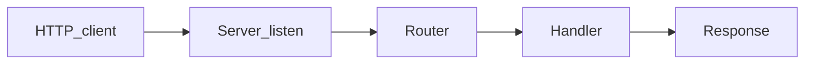

# Chapter 06 — Storage

> Every real server needs durable storage. How you connect, query, and migrate determines how pleasant your next year will be.

## Learning objectives

By the end of this chapter you will be able to:

- Connect to PostgreSQL with a connection pool and explain why pooling matters.
- Write safe queries using parameterized placeholders (never string concatenation).
- Choose between raw SQL, query builders (Kysely, Drizzle), and ORMs (Prisma).
- Manage schema changes with migrations that are versioned, ordered, and backward-compatible.
- Use transactions correctly and avoid common pitfalls like pool exhaustion and N+1 queries.

## Prerequisites & recap

- [Module 11 — SQL](../11-sql/README.md) — you can write SELECT, INSERT, UPDATE, and JOIN queries.
- [Architecture](03-architecture.md) — you know how the storage layer fits behind an interface.

## The simple version

Your server stores data in a database. Every request that touches data follows the same pattern: borrow a connection from a pool, send a parameterized query, get results back, return the connection to the pool. The pool exists because opening a fresh TCP connection to PostgreSQL on every request is slow (~5 ms) and wastes server resources. With a pool of 10–20 connections, hundreds of concurrent requests share those connections efficiently.

On top of this connection plumbing, you need a way to evolve your database schema over time. That's what migrations are — versioned SQL scripts checked into git that run in order to bring any database from empty to current. Never edit a migration after it's been applied. Never apply migrations by hand. Automate everything.

## In plain terms (newbie lane)

This chapter is really about **Storage**. Skim *Learning objectives* above first—they are your exit ticket.

> **Newbies often think:** they must memorize the whole chapter before writing any code.  
> **Actually:** you only need the *next* honest mental model, then you prove it with the exercises and mini-project.

Companion links: [Onboarding](../appendix-onboarding.md) · [Study habits](../appendix-study-habits.md) · [Concept threads](../appendix-threads/README.md)

<details><summary>Pause and predict</summary>

Without scrolling: what is one real bug or outage class this chapter helps you prevent?

</details>


## Visual flow

```
  HTTP Request
       │
       ▼
  ┌──────────┐     ┌──────────────┐     ┌────────────┐
  │ Handler  │────▶│   Service    │────▶│  Storage   │
  └──────────┘     └──────────────┘     │  adapter   │
                                        └──────┬─────┘
                                               │
                                        ┌──────▼─────┐
                                        │  pg.Pool   │
                                        │ (10 conns) │
                                        └──────┬─────┘
                                               │
                                        ┌──────▼─────┐
                                        │ PostgreSQL │
                                        └────────────┘

  Migrations:
  001_create_users.sql ──▶ 002_add_email_index.sql ──▶ ...
```
*Caption: Queries flow through a connection pool. Migrations evolve the schema in order.*

## System diagram (Mermaid)



*High-level HTTP server data flow for this chapter’s topic.*

## Concept deep-dive

### Connecting with a pool

```ts
import pg from "pg";

const pool = new pg.Pool({
  connectionString: process.env.DATABASE_URL,
  max: 10,
  idleTimeoutMillis: 30_000,
  connectionTimeoutMillis: 5_000,
});
```

**Why a pool?** Each TCP connection to Postgres costs a handshake, authentication, and memory on the database server. A pool of 10 connections can serve hundreds of concurrent requests by queuing them. When a query finishes, the connection goes back to the pool for the next request.

**How many connections?** A good starting point is `max = (2 × CPU cores) + 1` for the database server, divided by the number of application instances. For a single app instance hitting a small Postgres, 10–20 is typical. Too many connections increase context-switching overhead on the database.

### Parameterized queries — the only safe way

```ts
export async function findUserById(id: string): Promise<User | null> {
  const r = await pool.query(
    "SELECT id, email, name FROM users WHERE id = $1",
    [id],
  );
  return r.rows[0] ?? null;
}
```

**Why parameterized?** Because string concatenation (`WHERE id = '${id}'`) is how SQL injection happens. With parameters (`$1`, `$2`), the database treats values as data, never as SQL. This is non-negotiable.

### Raw SQL vs. query builders vs. ORMs

| Approach | Example | Strengths | Weaknesses |
|---|---|---|---|
| **Raw SQL** (`pg`) | `pool.query("SELECT ...")` | Total control, no abstraction | No type safety, manual mapping |
| **Query builder** (Kysely, Drizzle) | `db.select().from(users)` | Type-safe, close to SQL | Small learning curve |
| **ORM** (Prisma, TypeORM) | `prisma.user.findMany()` | High productivity for CRUD | Hides SQL; awkward for complex queries |

**Recommended for new Node/TS backends:** Drizzle or Kysely. They generate types from your schema, stay close to SQL, and don't force you into an entity/model paradigm that fights with your domain types.

### Drizzle — a quick tour

Define your schema in TypeScript:

```ts
import { pgTable, serial, text, timestamp } from "drizzle-orm/pg-core";

export const users = pgTable("users", {
  id: serial("id").primaryKey(),
  email: text("email").notNull().unique(),
  name: text("name").notNull(),
  createdAt: timestamp("created_at").defaultNow().notNull(),
});
```

Query with type safety:

```ts
import { drizzle } from "drizzle-orm/node-postgres";
import { eq } from "drizzle-orm";

const db = drizzle(pool);

const result = await db.select()
  .from(users)
  .where(eq(users.email, "ada@example.com"))
  .limit(1);
```

**Why Drizzle?** It gives you autocomplete, type checking, and generated migrations without hiding the SQL. When you read a Drizzle query, you can predict the SQL it generates. With a full ORM, you often can't.

### Migrations

Schema changes are code. Check them into git, apply them in order, never edit after deployment:

```sql
-- 001_create_users.sql
CREATE TABLE users (
  id SERIAL PRIMARY KEY,
  email TEXT NOT NULL UNIQUE,
  name TEXT NOT NULL,
  created_at TIMESTAMPTZ NOT NULL DEFAULT now()
);
```

Tools:
- **Drizzle Kit**: `drizzle-kit generate:pg` → SQL migration files, apply with `drizzle-kit push`.
- **Kysely**: migrations are up/down TypeScript functions.
- **Prisma**: `prisma migrate dev`.

**Golden rules:**

1. Never edit a migration after it has run in any environment.
2. Apply migrations before new code starts (in your deploy pipeline).
3. Make schema changes backward-compatible across deploys: add column nullable first, backfill, then enforce `NOT NULL`.

**Why backward-compatible?** During a rolling deploy, old code and new code run simultaneously. If the new migration drops a column that old code reads, you get errors on the old pods until they're replaced.

### Transactions

When multiple queries must succeed or fail together:

```ts
const client = await pool.connect();
try {
  await client.query("BEGIN");
  await client.query(
    "UPDATE accounts SET balance = balance - $1 WHERE id = $2",
    [amount, fromId],
  );
  await client.query(
    "UPDATE accounts SET balance = balance + $1 WHERE id = $2",
    [amount, toId],
  );
  await client.query("COMMIT");
} catch (e) {
  await client.query("ROLLBACK");
  throw e;
} finally {
  client.release();
}
```

**Why `client.release()` in `finally`?** If you forget to release, that connection is stuck — eventually your pool runs out and the server hangs. `finally` ensures release happens even if `COMMIT` or `ROLLBACK` throws.

Drizzle and Kysely offer cleaner scoping: `db.transaction(async (tx) => { ... })`.

### The N+1 problem

Fetching related data in a loop:

```ts
const posts = await db.query("SELECT * FROM posts");
for (const post of posts.rows) {
  const author = await db.query("SELECT * FROM users WHERE id = $1", [post.author_id]);
  // 1 query for posts + N queries for authors = N+1
}
```

Fix: use a `JOIN` or batch with `WHERE id = ANY($1)`:

```ts
const authorIds = posts.rows.map((p) => p.author_id);
const authors = await db.query(
  "SELECT * FROM users WHERE id = ANY($1)",
  [authorIds],
);
```

### Testing with a real database

Run a disposable Postgres for tests via Docker or Testcontainers. Don't use SQLite — database dialects differ in subtle ways (date handling, JSON operators, array support). Test against the same engine you deploy to.

```ts
import { PostgreSqlContainer } from "@testcontainers/postgresql";

const container = await new PostgreSqlContainer().start();
const pool = new pg.Pool({ connectionString: container.getConnectionUri() });
// run migrations, run tests, stop container
```

## Why these design choices

| Decision | Trade-off | When you'd pick differently |
|---|---|---|
| PostgreSQL | Heavier than SQLite; requires a separate server | Embedded/edge app → use SQLite. Key-value workload → use Redis |
| Connection pool (`max: 10`) | Limits concurrency | CPU-heavy DB server → lower `max`. Many app instances → divide pool across them |
| Drizzle over Prisma | Less magic, more SQL knowledge required | Rapid prototyping with simple CRUD → Prisma's generated client is faster to start with |
| Raw SQL over any abstraction | No type safety | You're an SQL expert and the team is comfortable reading raw queries |
| Testcontainers for integration tests | Slower than in-memory mocks | Unit tests → use the in-memory adapter from Chapter 03. Integration tests → use a real DB |

## Production-quality code

```ts
import pg from "pg";
import { z } from "zod";

const Env = z.object({
  DATABASE_URL: z.string().url(),
  DB_POOL_MAX: z.coerce.number().int().default(10),
});
const env = Env.parse(process.env);

const pool = new pg.Pool({
  connectionString: env.DATABASE_URL,
  max: env.DB_POOL_MAX,
  idleTimeoutMillis: 30_000,
  connectionTimeoutMillis: 5_000,
});

pool.on("error", (err) => {
  console.error("unexpected pool error", err);
  process.exit(1);
});

// --- User storage implementation ---

interface User {
  id: number;
  email: string;
  name: string;
  created_at: Date;
}

interface UserStorage {
  findById(id: number): Promise<User | null>;
  findByEmail(email: string): Promise<User | null>;
  create(input: { email: string; name: string }): Promise<User>;
  list(opts: { limit: number; offset: number }): Promise<{ users: User[]; total: number }>;
}

function makePostgresUserStorage(pool: pg.Pool): UserStorage {
  return {
    async findById(id) {
      const r = await pool.query<User>(
        "SELECT id, email, name, created_at FROM users WHERE id = $1",
        [id],
      );
      return r.rows[0] ?? null;
    },

    async findByEmail(email) {
      const r = await pool.query<User>(
        "SELECT id, email, name, created_at FROM users WHERE email = $1",
        [email],
      );
      return r.rows[0] ?? null;
    },

    async create(input) {
      const r = await pool.query<User>(
        `INSERT INTO users (email, name)
         VALUES ($1, $2)
         RETURNING id, email, name, created_at`,
        [input.email, input.name],
      );
      return r.rows[0];
    },

    async list({ limit, offset }) {
      const [dataResult, countResult] = await Promise.all([
        pool.query<User>(
          "SELECT id, email, name, created_at FROM users ORDER BY id LIMIT $1 OFFSET $2",
          [limit, offset],
        ),
        pool.query<{ count: string }>("SELECT count(*)::text FROM users"),
      ]);
      return {
        users: dataResult.rows,
        total: Number(countResult.rows[0].count),
      };
    },
  };
}

// --- Transaction helper ---

async function withTransaction<T>(
  pool: pg.Pool,
  fn: (client: pg.PoolClient) => Promise<T>,
): Promise<T> {
  const client = await pool.connect();
  try {
    await client.query("BEGIN");
    const result = await fn(client);
    await client.query("COMMIT");
    return result;
  } catch (e) {
    await client.query("ROLLBACK");
    throw e;
  } finally {
    client.release();
  }
}

export { pool, makePostgresUserStorage, withTransaction };
```

## Security notes

- **SQL injection** — the most common and devastating database attack. Always use parameterized queries (`$1`, `$2`). Never concatenate user input into SQL strings. ORMs and query builders do this for you, but verify if you drop to raw SQL.
- **Least privilege** — your application's database user should not have `DROP TABLE` or `CREATE EXTENSION` permissions. Use a separate migration user with elevated privileges.
- **Connection string secrets** — `DATABASE_URL` contains credentials. Never log it, commit it, or expose it in error messages. Load from environment variables or a secrets manager.
- **Row-level security** — for multi-tenant apps, consider Postgres RLS policies so that even a bug in your application code can't leak data across tenants.

## Performance notes

- **Pool sizing** — too few connections and requests queue. Too many and the database spends more time context-switching than working. Start with 10, monitor `pg_stat_activity`, adjust.
- **Indexes** — the biggest single performance lever. If a query is slow, check `EXPLAIN ANALYZE`. A missing index on a `WHERE` clause column is the most common cause.
- **N+1 queries** kill latency. A page that loads 50 posts and then fetches each author individually makes 51 round trips. One `JOIN` or `IN (...)` query does it in 2.
- **Connection timeouts** — set `connectionTimeoutMillis` so requests fail fast instead of waiting indefinitely for a pool connection during a database outage.
- **Prepared statements** — Postgres caches query plans for prepared statements. `pg` uses prepared statements by default when you use `pool.query()` with parameters.
- **`RETURNING`** — use `INSERT ... RETURNING *` instead of INSERT + SELECT. One round trip instead of two.

## Common mistakes

| Symptom | Cause | Fix |
|---|---|---|
| `Error: too many clients already` after a burst of requests | Pool connections not released — `client.release()` missing or not in `finally` | Always release in a `finally` block; use `pool.query()` instead of `pool.connect()` when you don't need transactions |
| SQL injection vulnerability | String concatenation: `` `WHERE id = '${id}'` `` | Use parameterized queries: `WHERE id = $1`, `[id]` |
| Migration works in dev, breaks in staging | Migration was edited after being applied in dev | Never edit applied migrations. Create a new migration to fix mistakes |
| Long-running transactions cause lock contention and timeouts | Transaction holds locks while doing non-DB work (HTTP calls, file I/O) | Keep transactions short. Do all non-DB work before or after the transaction |
| Test suite is slow (30+ seconds) | Each test connects to a remote database and migrates from scratch | Use Testcontainers for isolated Postgres; or run migrations once per suite and truncate tables between tests |
| `SELECT *` returns columns that changed, breaking code | Schema evolved but code assumes fixed columns | Select explicit columns: `SELECT id, email, name` instead of `SELECT *` |

## Practice

**Warm-up.** Connect to PostgreSQL via `pg.Pool` and run `SELECT 1 AS result`. Log the result.

<details><summary>Solution</summary>

```ts
import pg from "pg";

const pool = new pg.Pool({ connectionString: process.env.DATABASE_URL });
const r = await pool.query("SELECT 1 AS result");
console.log(r.rows[0]); // { result: 1 }
await pool.end();
```

</details>

**Standard.** Implement a `UserStorage` interface with `findById`, `create`, and `list` methods using raw `pg`. Ensure the same tests pass against both the Postgres adapter and the in-memory adapter from Chapter 03.

<details><summary>Solution</summary>

See the production-quality code section for the Postgres implementation. The key: both adapters implement the same `UserStorage` interface, so the service and tests are adapter-agnostic.

</details>

**Bug hunt.** A server works fine under light load but under burst traffic logs `Error: too many clients already`. What's wrong?

<details><summary>Solution</summary>

The code is using `pool.connect()` for transactions but not calling `client.release()` in a `finally` block. When an error occurs between `connect()` and `release()`, the connection is leaked. After `max` leaks, the pool is exhausted. Fix: always release in `finally`, or use `pool.query()` for single-statement queries.

</details>

**Stretch.** Add Drizzle ORM to your project. Define a `users` table schema, generate a migration, and run it against a local Postgres.

<details><summary>Solution</summary>

1. `npm install drizzle-orm pg` and `npm install -D drizzle-kit`
2. Define schema in `src/schema.ts`
3. Add `drizzle.config.ts` pointing to your schema
4. Run `npx drizzle-kit generate:pg` to generate migration SQL
5. Run `npx drizzle-kit push` to apply

</details>

**Stretch++.** Write an integration test using Testcontainers' PostgreSQL module. The test should start a container, run migrations, insert a user, query it, and stop the container.

<details><summary>Solution</summary>

```ts
import { PostgreSqlContainer } from "@testcontainers/postgresql";
import pg from "pg";

test("user CRUD against real Postgres", async () => {
  const container = await new PostgreSqlContainer().start();
  const pool = new pg.Pool({ connectionString: container.getConnectionUri() });

  await pool.query(`
    CREATE TABLE users (
      id SERIAL PRIMARY KEY,
      email TEXT NOT NULL UNIQUE,
      name TEXT NOT NULL
    )
  `);

  const storage = makePostgresUserStorage(pool);
  const user = await storage.create({ email: "ada@test.com", name: "Ada" });
  expect(user.id).toBe(1);

  const found = await storage.findById(1);
  expect(found?.email).toBe("ada@test.com");

  await pool.end();
  await container.stop();
}, 30_000);
```

</details>

## Quiz

1. What does a connection pool prevent?
   (a) Lock contention  (b) Repeated TCP connect/authenticate overhead per query  (c) SQL injection  (d) Schema drift

2. What is the parameterized query placeholder syntax in `pg`?
   (a) `?`  (b) `$1`, `$2`, ...  (c) `:name`  (d) `{0}`

3. What's the key difference between a query builder and an ORM?
   (a) They're identical  (b) A query builder stays close to SQL; an ORM adds entity/model abstractions  (c) ORMs are faster  (d) Query builders are SQL-only

4. What makes a migration backward-compatible?
   (a) It requires downtime  (b) Old code and new code can both work during a rolling deploy  (c) It drops columns first  (d) It's impossible

5. Why test against real Postgres instead of SQLite?
   (a) SQLite is preferred  (b) Database dialects differ; SQLite hides Postgres-specific bugs  (c) They're equivalent  (d) Postgres is required by law

**Short answer:**

6. When would you choose Drizzle over Prisma for a new project?

7. Why should you never edit a migration that has already been applied?

*Answers: 1-b, 2-b, 3-b, 4-b, 5-b. 6 — When you want type-safe queries that stay close to SQL, need fine-grained control over generated queries, or want to avoid Prisma's code-generated client model that can conflict with your domain types. 7 — Other environments (staging, production, teammates' machines) have already recorded that migration as "applied." If you change it, those environments will never re-run it, causing schema drift. Instead, create a new migration with the correction.*

## Learn-by-doing mini-project

Full brief (goal, acceptance criteria, hints, stretch): [06-storage — mini-project](mini-projects/06-storage-project.md).

## Where this idea reappears

- **Same thread elsewhere:** trace how this chapter’s primitives show up in production systems — not only in this language or layer.
- **Cross-module links (read next when you feel stuck):**
  - [HTTP clients](../10-http-clients/01-why-http.md) — symmetric skills for debugging full stacks.
  - [Safe SQL from application code](../11-sql/04-crud.md) — parameters, transactions, and errors behind your routes.

  - [Concept threads (hub)](../appendix-threads/README.md) — state, errors, and performance reading trails.


## Chapter summary

- Connect to PostgreSQL through a pool (`pg.Pool`) — pooling amortizes connection setup across hundreds of requests and prevents connection exhaustion.
- Always use parameterized queries (`$1`, `$2`) — string concatenation is the root cause of SQL injection, the most dangerous and most preventable database attack.
- Choose your query abstraction (raw SQL, query builder, ORM) based on team SQL fluency and project complexity — Drizzle and Kysely hit the sweet spot for TypeScript backends.
- Treat migrations as immutable, ordered code: check them into git, apply them before deploying new code, and make schema changes backward-compatible for zero-downtime deploys.

## Further reading

- [Drizzle ORM documentation](https://orm.drizzle.team/)
- [Kysely documentation](https://kysely.dev/)
- [node-postgres (`pg`) documentation](https://node-postgres.com/)
- [Testcontainers for Node.js](https://testcontainers.com/guides/getting-started-with-testcontainers-for-nodejs/)
- Next: [Authentication](07-authentication.md).
