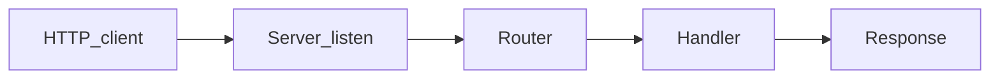

# Chapter 07 — Authentication

> Authentication proves *who* is making a request. Do it wrong and everything downstream is fiction.

## Learning objectives

By the end of this chapter you will be able to:

- Hash passwords with a slow, salted algorithm (bcrypt or argon2) and explain why speed is the enemy.
- Issue and verify JWTs with short expiration and proper claims.
- Implement cookie-based sessions with `HttpOnly`, `Secure`, and `SameSite` attributes.
- Choose between session cookies and Bearer tokens based on your client type.
- Build a refresh token rotation flow for long-lived sessions.

## Prerequisites & recap

- [HTTP headers](../10-http-clients/05-headers.md) — you know how `Authorization` and `Cookie` headers work.
- [Storage](06-storage.md) — you can persist data in PostgreSQL.

## The simple version

Authentication answers one question: "who are you?" The client proves identity (usually with a password), and the server responds with a token — a ticket the client presents on every subsequent request. The server either looks up that ticket in a database (session-based) or verifies a cryptographic signature on it (JWT-based).

The critical security rule: never store passwords as plain text. Hash them with a deliberately slow algorithm (bcrypt, argon2) so that if your database is ever stolen, attackers can't reverse the hashes in bulk. Everything else in this chapter — token issuance, middleware, refresh flows — is just plumbing around that core principle.

## In plain terms (newbie lane)

This chapter is really about **Authentication**. Skim *Learning objectives* above first—they are your exit ticket.

> **Newbies often think:** they must memorize the whole chapter before writing any code.  
> **Actually:** you only need the *next* honest mental model, then you prove it with the exercises and mini-project.

Companion links: [Onboarding](../appendix-onboarding.md) · [Study habits](../appendix-study-habits.md) · [Concept threads](../appendix-threads/README.md)

<details><summary>Pause and predict</summary>

Without scrolling: what is one real bug or outage class this chapter helps you prevent?

</details>


## Visual flow

```
  1. LOGIN
  ┌────────┐   POST /login          ┌──────────┐
  │ Client │ ──(email, password)───▶ │  Server  │
  └────────┘                         │          │
                                     │ find user│
                                     │ bcrypt   │
                                     │ compare  │
  ┌────────┐   200 + token/cookie    │ issue    │
  │ Client │ ◀──────────────────── │ token    │
  └────────┘                         └──────────┘

  2. AUTHENTICATED REQUEST
  ┌────────┐   GET /me               ┌──────────┐
  │ Client │ ──(Bearer token)──────▶ │  Server  │
  │        │   or (Cookie: sid=...)  │ verify   │
  │        │                         │ token    │
  │ Client │ ◀──{ user data }────── │ attach   │
  └────────┘                         │ req.user │
                                     └──────────┘
```
*Caption: Login exchanges credentials for a token. Subsequent requests present the token for verification.*

## System diagram (Mermaid)



*High-level HTTP server data flow for this chapter’s topic.*

## Concept deep-dive

### Passwords: hash, don't store

Never store plaintext passwords. Hash with a **slow, salted** algorithm:

```ts
import bcrypt from "bcrypt";

const hash = await bcrypt.hash(plaintext, 12);
const isValid = await bcrypt.compare(plaintext, hash);
```

**Why slow?** Because speed is the attacker's friend. SHA-256 hashes billions of passwords per second on a GPU. bcrypt with cost factor 12 takes ~250 ms per hash — tolerable for one login, but makes brute-forcing a stolen database take years instead of hours.

**Why salted?** Each hash includes a unique random salt, so two users with the same password get different hashes. This prevents rainbow-table attacks.

`argon2` (via the `argon2` npm package) is the current recommendation from the Password Hashing Competition. bcrypt remains safe and widely supported. **Never use:** MD5, SHA-1, plain SHA-256, or any non-salted algorithm.

### Tokens: two families

**Session cookies (opaque tokens):**
- Server generates a random session ID, stores `sessions(id, user_id, expires)` in the database.
- Client receives the session ID in a `Set-Cookie` header.
- On every request, the browser automatically sends the cookie. Server looks up the session in the database.
- Revocation is instant: delete the row.

**JWTs (JSON Web Tokens):**
- Server signs a JSON payload (`{ sub: userId, exp: ... }`) with a secret key.
- Client receives the token and sends it in `Authorization: Bearer <token>`.
- Server verifies the signature — no database lookup needed.
- Revocation is hard: the token is valid until it expires. Mitigate with short expirations (15 min) and refresh tokens.

### When to use which

| Scenario | Best choice | Why |
|---|---|---|
| Browser-based web app | Session cookies | `HttpOnly` prevents XSS from stealing the token; browser handles cookies automatically |
| Mobile app or SPA calling your API | JWT + refresh token | No cookie jar; Authorization header is explicit |
| Service-to-service | JWT or API key | No user interaction; key management is simpler |
| High-security (banking, healthcare) | Session cookies | Instant revocation; server-side state is a feature, not a bug |

### Login flow with JWT

```ts
import jwt from "jsonwebtoken";

app.post("/login", asyncHandler(async (req, res) => {
  const { email, password } = LoginSchema.parse(req.body);
  const user = await storage.findByEmail(email);

  if (!user || !await bcrypt.compare(password, user.passwordHash)) {
    throw new Unauthorized();
  }

  const accessToken = jwt.sign(
    { sub: user.id, role: user.role },
    env.JWT_SECRET,
    { expiresIn: "15m" },
  );

  res.json({ token: accessToken });
}));
```

**Why the same error for "user not found" and "wrong password"?** Because separate messages ("user not found" vs. "incorrect password") tell an attacker which email addresses are registered. Always return a generic "invalid credentials."

### Authentication middleware

```ts
function authenticate(req: Request, _res: Response, next: NextFunction) {
  const header = req.headers.authorization ?? "";
  const [scheme, token] = header.split(" ");

  if (scheme !== "Bearer" || !token) throw new Unauthorized();

  try {
    const payload = jwt.verify(token, env.JWT_SECRET) as { sub: string };
    (req as any).userId = payload.sub;
    next();
  } catch {
    throw new Unauthorized();
  }
}

app.use("/v1", authenticate);
```

### Refresh tokens

Short-lived access tokens (15 min) + long-lived refresh tokens (7–30 days). The refresh token is stored server-side so it can be revoked:

```ts
app.post("/refresh", asyncHandler(async (req, res) => {
  const { refreshToken } = req.body;
  const session = await sessions.findByToken(refreshToken);

  if (!session || session.expiresAt < new Date()) {
    throw new Unauthorized();
  }

  await sessions.revoke(session.id);

  const newRefresh = crypto.randomUUID();
  await sessions.create({ userId: session.userId, token: newRefresh, expiresAt: ... });

  const accessToken = jwt.sign({ sub: session.userId }, env.JWT_SECRET, { expiresIn: "15m" });
  res.json({ token: accessToken, refreshToken: newRefresh });
}));
```

**Why rotate the refresh token?** If a refresh token is stolen, the legitimate user's next refresh attempt will fail (the old token was revoked), alerting them. Without rotation, a stolen refresh token grants indefinite access.

### Cookie-based sessions

```ts
app.post("/login", asyncHandler(async (req, res) => {
  // ... verify credentials ...
  const sessionId = crypto.randomUUID();
  await sessions.create({ id: sessionId, userId: user.id });

  res.cookie("sid", sessionId, {
    httpOnly: true,
    secure: true,
    sameSite: "lax",
    maxAge: 24 * 60 * 60 * 1000,
  });
  res.status(204).end();
}));
```

- `httpOnly` — JavaScript can't read the cookie (XSS protection).
- `secure` — cookie only sent over HTTPS.
- `sameSite: "lax"` — cookie not sent on cross-site POST requests (CSRF mitigation).

### Rotating signing keys

Rotate the JWT signing key periodically. During rotation, support two keys:

1. Sign new tokens with the new key.
2. Verify tokens with both old and new keys (check the `kid` header).
3. After the old key's longest token expires, remove the old key.

## Why these design choices

| Decision | Trade-off | When you'd pick differently |
|---|---|---|
| bcrypt cost factor 12 | ~250 ms per hash; slower login | Very high traffic login endpoint → consider argon2 with tuned parameters for better GPU resistance |
| JWT with 15-minute expiration | Requires refresh token infrastructure | Internal admin tool with low risk → longer expiration (1 hour) is acceptable |
| Session cookies for browsers | Requires server-side storage | Stateless microservice that can't maintain sessions → use JWT |
| Generic "invalid credentials" error | Worse UX for honest users who forgot their email | Registration flow → you already expose which emails exist via "email taken" errors; the login generic message is still worthwhile |
| Refresh token rotation | More complexity | Low-risk app → single long-lived refresh token with revocation is simpler |

## Production-quality code

```ts
import express, { Request, Response, NextFunction } from "express";
import jwt from "jsonwebtoken";
import bcrypt from "bcrypt";
import crypto from "node:crypto";
import { z } from "zod";

const BCRYPT_ROUNDS = 12;

const LoginSchema = z.object({
  email: z.string().email(),
  password: z.string().min(1),
});

const RegisterSchema = z.object({
  email: z.string().email(),
  name: z.string().min(1).max(100),
  password: z.string().min(12),
});

// --- Service ---

function makeAuthService(deps: {
  userStorage: UserStorage;
  sessionStorage: SessionStorage;
  jwtSecret: string;
}) {
  return {
    async register(input: z.infer<typeof RegisterSchema>) {
      const existing = await deps.userStorage.findByEmail(input.email);
      if (existing) throw new Conflict("email already registered");

      const passwordHash = await bcrypt.hash(input.password, BCRYPT_ROUNDS);
      return deps.userStorage.create({
        email: input.email,
        name: input.name,
        passwordHash,
      });
    },

    async login(email: string, password: string) {
      const user = await deps.userStorage.findByEmail(email);
      if (!user || !await bcrypt.compare(password, user.passwordHash)) {
        throw new Unauthorized();
      }

      const accessToken = jwt.sign(
        { sub: user.id, role: user.role },
        deps.jwtSecret,
        { expiresIn: "15m" },
      );

      const refreshToken = crypto.randomUUID();
      await deps.sessionStorage.create({
        token: refreshToken,
        userId: user.id,
        expiresAt: new Date(Date.now() + 7 * 24 * 60 * 60 * 1000),
      });

      return { accessToken, refreshToken };
    },

    async refresh(refreshToken: string) {
      const session = await deps.sessionStorage.findByToken(refreshToken);
      if (!session || session.expiresAt < new Date()) {
        throw new Unauthorized();
      }

      await deps.sessionStorage.revoke(session.id);

      const newRefreshToken = crypto.randomUUID();
      await deps.sessionStorage.create({
        token: newRefreshToken,
        userId: session.userId,
        expiresAt: new Date(Date.now() + 7 * 24 * 60 * 60 * 1000),
      });

      const accessToken = jwt.sign(
        { sub: session.userId },
        deps.jwtSecret,
        { expiresIn: "15m" },
      );

      return { accessToken, refreshToken: newRefreshToken };
    },

    verifyAccessToken(token: string): { sub: string } {
      return jwt.verify(token, deps.jwtSecret) as { sub: string };
    },
  };
}

// --- Middleware ---

function makeAuthMiddleware(authService: ReturnType<typeof makeAuthService>) {
  return (req: Request, _res: Response, next: NextFunction) => {
    const header = req.headers.authorization ?? "";
    const [scheme, token] = header.split(" ");

    if (scheme !== "Bearer" || !token) throw new Unauthorized();

    try {
      const payload = authService.verifyAccessToken(token);
      (req as any).userId = payload.sub;
      next();
    } catch {
      throw new Unauthorized();
    }
  };
}

// --- Error classes (from ch05) ---

class HttpError extends Error {
  constructor(public status: number, public code: string, msg?: string) {
    super(msg ?? code);
  }
}
class Unauthorized extends HttpError {
  constructor() { super(401, "unauthorized", "invalid credentials"); }
}
class Conflict extends HttpError {
  constructor(msg: string) { super(409, "conflict", msg); }
}

// --- Interfaces ---

interface UserStorage {
  findByEmail(email: string): Promise<any>;
  create(input: any): Promise<any>;
}

interface SessionStorage {
  create(session: any): Promise<void>;
  findByToken(token: string): Promise<any>;
  revoke(id: string): Promise<void>;
}

export { makeAuthService, makeAuthMiddleware, LoginSchema, RegisterSchema };
```

## Security notes

- **OWASP A07:2021 — Identification and Authentication Failures** — this chapter addresses the #7 risk. Use slow hashing, enforce minimum password length (12+), and rate-limit login attempts.
- **Never sign with a weak secret** — use at least 256 bits of cryptographically random data for `JWT_SECRET`. Generate with `node -e "console.log(require('crypto').randomBytes(32).toString('hex'))"`.
- **Don't put secrets in JWTs** — JWTs are signed, not encrypted (by default). Anyone can decode the payload with `base64`. Never include passwords, SSNs, or sensitive data.
- **Don't accept tokens via query params** — `?token=xyz` leaks to access logs, browser history, and `Referer` headers. Use `Authorization` header or `HttpOnly` cookies only.
- **Rate-limit login endpoints** — without rate limiting, attackers can brute-force passwords. Use `express-rate-limit` or a reverse proxy rate limiter.
- **Timing attacks** — `bcrypt.compare()` is constant-time by design. Don't short-circuit with `===` before calling compare.

## Performance notes

- **bcrypt is intentionally slow** (~250 ms at cost 12). This is the point — but it means login requests are CPU-bound. For high-traffic login endpoints, consider offloading to a worker thread or using argon2 (which is more parallelism-resistant on GPUs).
- **JWT verification is fast** — `jwt.verify()` is a single HMAC computation (~µs). No database lookup, no network call.
- **Session lookups add latency** — each authenticated request hits the database. Mitigate with Redis for session storage (sub-millisecond lookups) or an in-memory cache with short TTL.
- **Connection pool pressure** — every authenticated request that checks a session uses a pool connection. Size your pool accordingly.
- **Short-lived access tokens reduce revocation checks** — with 15-minute tokens, you only need to check revocation on refresh, not on every request.

## Common mistakes

| Symptom | Cause | Fix |
|---|---|---|
| Passwords stored as SHA-256 hashes get cracked within hours of a breach | SHA-256 is fast; no salt | Switch to bcrypt (cost 12+) or argon2. Mandate password reset for all users |
| Login endpoint reveals which emails are registered ("user not found" vs. "wrong password") | Different error messages for different failure modes | Return the same "invalid credentials" message for both cases |
| JWT remains valid even after the user changes their password or is banned | JWTs can't be revoked once issued | Use short expiration (15 min) + server-side refresh tokens that can be revoked |
| `jwt.verify()` throws but the error is swallowed, returning `undefined` to the handler | Missing `try/catch` or incorrect error handling in middleware | Catch the error and throw `Unauthorized()` so the error middleware returns 401 |
| Session cookies sent over HTTP (not HTTPS) | `secure: true` not set, or development uses HTTP | Always set `secure: true`; use HTTPS in all environments including local dev (mkcert) |
| XSS attack steals the JWT from localStorage | Token stored in JavaScript-accessible storage | Use `HttpOnly` cookies for browser apps, or accept the risk with Bearer tokens in SPAs |

## Practice

**Warm-up.** Hash a password with bcrypt (cost 12) and verify it. Log the hash — notice the salt is embedded in the hash string.

<details><summary>Solution</summary>

```ts
import bcrypt from "bcrypt";

const plain = "my-secure-password";
const hash = await bcrypt.hash(plain, 12);
console.log(hash); // $2b$12$... (60 chars, includes salt)

const isValid = await bcrypt.compare(plain, hash);
console.log(isValid); // true
console.log(await bcrypt.compare("wrong", hash)); // false
```

</details>

**Standard.** Implement `POST /login` that validates credentials, issues a JWT, and an `authenticate` middleware that verifies the JWT on protected routes.

<details><summary>Solution</summary>

```ts
app.post("/login", asyncHandler(async (req, res) => {
  const { email, password } = LoginSchema.parse(req.body);
  const user = await storage.findByEmail(email);
  if (!user || !await bcrypt.compare(password, user.passwordHash)) {
    throw new Unauthorized();
  }
  const token = jwt.sign({ sub: user.id }, SECRET, { expiresIn: "15m" });
  res.json({ token });
}));

function authenticate(req, _res, next) {
  const [, token] = (req.headers.authorization ?? "").split(" ");
  if (!token) throw new Unauthorized();
  try {
    const { sub } = jwt.verify(token, SECRET);
    req.userId = sub;
    next();
  } catch { throw new Unauthorized(); }
}

app.get("/me", authenticate, asyncHandler(async (req, res) => {
  const user = await storage.findById(req.userId);
  res.json({ data: user });
}));
```

</details>

**Bug hunt.** A login endpoint returns `"user not found"` when the email doesn't exist and `"wrong password"` when the password is incorrect. Why is this a security problem?

<details><summary>Solution</summary>

An attacker can enumerate which email addresses are registered by observing the different error messages. With a list of known-valid emails, they can focus brute-force or credential-stuffing attacks on those accounts. Fix: return the same generic error ("invalid credentials") regardless of whether the email exists or the password is wrong.

</details>

**Stretch.** Add refresh tokens stored in the database. The `/refresh` endpoint should rotate the refresh token (revoke the old one, issue a new one) and return a fresh access token.

<details><summary>Solution</summary>

See the `refresh` method in the production-quality code section. Key steps: find session by refresh token, verify it hasn't expired, revoke it, create a new session with a new token, sign a new access token, return both.

</details>

**Stretch++.** Implement JWT signing key rotation with a `kid` (key ID) header. Sign new tokens with the new key; verify with both old and new keys.

<details><summary>Solution</summary>

```ts
const KEYS = [
  { kid: "key-2025-01", secret: process.env.JWT_SECRET_NEW! },
  { kid: "key-2024-06", secret: process.env.JWT_SECRET_OLD! },
];

function signToken(payload: object) {
  const key = KEYS[0];
  return jwt.sign(payload, key.secret, {
    expiresIn: "15m",
    header: { kid: key.kid },
  });
}

function verifyToken(token: string) {
  const decoded = jwt.decode(token, { complete: true });
  const kid = decoded?.header?.kid;
  const key = KEYS.find((k) => k.kid === kid);
  if (!key) throw new Unauthorized();
  return jwt.verify(token, key.secret);
}
```

</details>

## Quiz

1. Passwords should be stored as:
   (a) Plaintext  (b) SHA-256 hash  (c) bcrypt or argon2 hash  (d) Base64 encoded

2. A JWT is by default:
   (a) Encrypted  (b) Signed (anyone can read the payload, but can't tamper)  (c) Opaque  (d) A cookie

3. Which cookie attributes protect against XSS and CSRF?
   (a) `HttpOnly`, `Secure`, `SameSite`  (b) `Domain` only  (c) `Path` only  (d) None needed

4. Access token vs. refresh token:
   (a) Identical  (b) Access is short-lived (minutes); refresh is long-lived (days) and revocable  (c) Access is longer  (d) Both are infinite

5. Tokens sent via URL query parameters:
   (a) Are fine  (b) Leak to logs, browser history, and Referer headers — avoid  (c) Are required by OAuth  (d) Are the standard approach

**Short answer:**

6. Why is bcrypt preferred over SHA-256 for password hashing?

7. Name one trade-off between JWTs and session cookies.

*Answers: 1-c, 2-b, 3-a, 4-b, 5-b. 6 — bcrypt is deliberately slow (hundreds of milliseconds per hash) and includes a unique salt per hash. SHA-256 is designed for speed (billions per second on GPUs) and has no built-in salting, making brute-force and rainbow-table attacks trivial on stolen hashes. 7 — JWTs are stateless (no DB lookup per request, easy to scale horizontally) but hard to revoke. Session cookies require server-side storage but support instant revocation (delete the session row). Pick based on whether revocability or statelessness matters more.*

## Learn-by-doing mini-project

Full brief (goal, acceptance criteria, hints, stretch): [07-authentication — mini-project](mini-projects/07-authentication-project.md).

## Where this idea reappears

- **Same thread elsewhere:** trace how this chapter’s primitives show up in production systems — not only in this language or layer.
- **Cross-module links (read next when you feel stuck):**
  - [HTTP clients](../10-http-clients/01-why-http.md) — symmetric skills for debugging full stacks.
  - [Safe SQL from application code](../11-sql/04-crud.md) — parameters, transactions, and errors behind your routes.

  - [Concept threads (hub)](../appendix-threads/README.md) — state, errors, and performance reading trails.


## Chapter summary

- Hash passwords with bcrypt (cost 12+) or argon2 — speed is the enemy of password security, and salting prevents rainbow-table attacks.
- Choose session cookies for browser apps (automatic sending, `HttpOnly` protection) and JWTs for mobile/SPA/service-to-service (stateless verification, no cookie jar needed).
- Keep access tokens short-lived (15 minutes) and pair them with server-side refresh tokens that can be rotated and revoked.
- Never leak whether an email exists through different error messages on login — return "invalid credentials" for all failures.

## Further reading

- [OWASP Authentication Cheat Sheet](https://cheatsheetseries.owasp.org/cheatsheets/Authentication_Cheat_Sheet.html)
- [OWASP Password Storage Cheat Sheet](https://cheatsheetseries.owasp.org/cheatsheets/Password_Storage_Cheat_Sheet.html)
- [JWT.io — Introduction to JWTs](https://jwt.io/introduction)
- Next: [Authorization](08-authorization.md).
