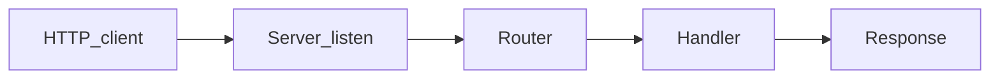

# Chapter 08 — Authorization

> Authentication told you *who*. Authorization answers *what are they allowed to do?*

## Learning objectives

By the end of this chapter you will be able to:

- Implement role-based access control (RBAC) and resource-ownership checks.
- Centralize authorization logic in a single, testable `can()` function.
- Decide when to return 403 vs. 404 to avoid leaking resource existence.
- Know when to reach for a policy engine (OPA, Cedar, Casbin).
- Apply tenant isolation so one customer can never see another's data.

## Prerequisites & recap

- [Authentication](07-authentication.md) — you know *who* the user is (`req.userId`). Now you decide what they're allowed to do.

## The simple version

Authorization is a bouncer with a guest list. Authentication checked your ID at the door (you are who you claim). Authorization checks whether your name is on the list for the VIP section. Sometimes the list says "only the owner of this table can sit here." Sometimes it says "only admins can enter the back office." And sometimes, when you shouldn't even know the VIP section exists, the bouncer says "there's no VIP section" instead of "you're not allowed in."

In code, you centralize these rules in one place — a `can(user, action, resource)` function — so that every endpoint enforces the same policy. Scattering `if (!user.admin)` checks across 50 handlers is how authorization bugs are born.

## In plain terms (newbie lane)

This chapter is really about **Authorization**. Skim *Learning objectives* above first—they are your exit ticket.

> **Newbies often think:** they must memorize the whole chapter before writing any code.  
> **Actually:** you only need the *next* honest mental model, then you prove it with the exercises and mini-project.

Companion links: [Onboarding](../appendix-onboarding.md) · [Study habits](../appendix-study-habits.md) · [Concept threads](../appendix-threads/README.md)

<details><summary>Pause and predict</summary>

Without scrolling: what is one real bug or outage class this chapter helps you prevent?

</details>


## Visual flow

```
  Incoming Request
       │
       ▼
  ┌──────────┐     ┌──────────┐     ┌──────────────────┐
  │ AuthN    │────▶│  AuthZ   │────▶│    Handler       │
  │ (who?)   │     │ (allowed?)│     │  (do the work)   │
  └──────────┘     └────┬─────┘     └──────────────────┘
                        │
                   ┌────┴────┐
                   │         │
                 ALLOW     DENY
                   │         │
                   ▼         ▼
              Handler    403 Forbidden
              runs       or 404 Not Found
                         (hide existence)
```
*Caption: Authentication runs first, then authorization checks if the user is allowed. Denied requests never reach the handler.*

## System diagram (Mermaid)



*High-level HTTP server data flow for this chapter’s topic.*

## Concept deep-dive

### Roles vs. permissions vs. policies

Three levels of access control, each adding flexibility:

**RBAC (Role-Based Access Control):**
Assign users a role — `admin`, `editor`, `viewer`. Check the role before allowing an action. Simple, easy to audit, sufficient for most applications.

**Permissions (Fine-Grained):**
Roles map to sets of permissions: `admin → [users:delete, posts:edit, ...]`. Check permissions instead of roles. More flexible but more to manage.

**ABAC (Attribute-Based Access Control):**
Rules expressed over subject, action, resource, and context attributes. "A user can edit a post if they are the author AND the post is in draft status AND it was created less than 24 hours ago." Powerful but complex — usually implemented with a policy engine.

**For most applications, RBAC + resource ownership is enough.** Start simple, graduate to fine-grained permissions or ABAC only when your access control logic outgrows role checks.

### Role-based middleware

```ts
function requireRole(...roles: string[]) {
  return (req: Request, _res: Response, next: NextFunction) => {
    const user = (req as any).user;
    if (!user || !roles.includes(user.role)) {
      throw new Forbidden();
    }
    next();
  };
}

app.delete("/v1/users/:id", authenticate, requireRole("admin"), deleteUser);
```

**Why middleware?** Because it runs before the handler. If authorization fails, the handler never executes, and you can't accidentally forget the check inside handler logic.

### Ownership checks

Some operations require the caller to own the resource:

```ts
async function ensureOwnerOrAdmin(
  req: Request,
  resource: { authorId: string },
) {
  const user = (req as any).user;
  if (user.role === "admin") return;
  if (resource.authorId === user.id) return;
  throw new Forbidden();
}
```

**Why not throw `Forbidden` and call it done?** Because sometimes leaking that a resource *exists* is itself a security problem. If user A shouldn't know that user B has a private draft, return 404 instead of 403.

### 403 vs. 404 — the information leak trade-off

| Scenario | Return | Why |
|---|---|---|
| Admin-only endpoint, user is not admin | 403 | The endpoint is public knowledge; the user just can't use it |
| User tries to access another user's private resource | 404 | Returning 403 confirms the resource exists; 404 hides that fact |
| User tries to edit a public resource they don't own | 403 | The resource is already visible; no existence leak |

**Rule of thumb:** if the user shouldn't know the resource exists, return 404. If the resource is already visible but the action is restricted, return 403.

### Centralizing authorization: the `can()` function

Instead of scattering checks across handlers:

```ts
type Action = "post:read" | "post:edit" | "post:delete" | "user:delete";

interface AuthContext {
  user: { id: string; role: string };
  resource?: { authorId?: string };
}

function can(ctx: AuthContext, action: Action): boolean {
  if (ctx.user.role === "admin") return true;

  switch (action) {
    case "post:read":
      return true;
    case "post:edit":
    case "post:delete":
      return ctx.resource?.authorId === ctx.user.id;
    case "user:delete":
      return false;
    default:
      return false;
  }
}
```

**Why centralize?** Because authorization rules change. When the product manager says "editors can now delete their own posts," you change one function instead of hunting through 15 handlers. It's also trivially unit-testable — no HTTP, no database, just function calls.

### Authorization middleware using `can()`

```ts
function authorize(action: Action) {
  return asyncHandler(async (req: Request, _res: Response, next: NextFunction) => {
    const user = (req as any).user;
    const resourceId = req.params.id;

    let resource: { authorId?: string } | undefined;
    if (resourceId) {
      const post = await posts.findById(resourceId);
      if (!post) throw new NotFound();
      resource = { authorId: post.authorId };
      (req as any).resource = post;
    }

    if (!can({ user, resource }, action)) {
      throw new Forbidden();
    }
    next();
  });
}

app.patch("/v1/posts/:id", authenticate, authorize("post:edit"), updatePost);
app.delete("/v1/posts/:id", authenticate, authorize("post:delete"), deletePost);
```

### Multi-tenant isolation

If your app serves multiple organizations, every query must be scoped by `tenantId`. Make it impossible to forget:

```ts
function makeTenantStorage(pool: pg.Pool, tenantId: string) {
  return {
    async findPosts() {
      return pool.query(
        "SELECT * FROM posts WHERE tenant_id = $1",
        [tenantId],
      );
    },
  };
}
```

**Why build tenant isolation into the storage layer?** Because if you rely on developers remembering to add `WHERE tenant_id = ?` to every query, someone will forget. And when they do, one customer sees another customer's data.

### Rate limiting

Not strictly authorization, but closely related. Limit per-user or per-IP to prevent abuse:

```ts
import rateLimit from "express-rate-limit";

app.use("/v1/login", rateLimit({ windowMs: 60_000, max: 10 }));
app.use("/v1", rateLimit({ windowMs: 60_000, max: 100 }));
```

### When to use a policy engine

If your authorization logic involves more than a few roles and ownership checks — hundreds of permissions, conditional rules based on resource attributes, or policies that non-developers need to edit — consider an external policy engine:

- **OPA (Open Policy Agent)** — Rego language, widely adopted, evaluates policies as a sidecar.
- **Cedar (AWS)** — purpose-built for authorization, strongly typed.
- **Casbin** — library-based, supports RBAC/ABAC/ACL models.

For most CRUD apps, a `can()` function is simpler and faster.

### Admin impersonation

When an admin acts on behalf of a user, log both the actor (real admin) and the subject (impersonated user):

```ts
logger.info({
  actor: req.adminId,
  subject: req.userId,
  action: "delete_post",
  resourceId: post.id,
}, "admin impersonation action");
```

Without this audit trail, you can't distinguish between "the user deleted it" and "an admin deleted it pretending to be the user."

## Why these design choices

| Decision | Trade-off | When you'd pick differently |
|---|---|---|
| RBAC + ownership | Coarse-grained; can't express complex rules | Complex rules involving time, geography, or resource state → ABAC with a policy engine |
| Central `can()` function | One more layer of indirection | 3-endpoint API with admin-only routes → inline `if (user.role !== "admin")` is fine |
| 404 instead of 403 for private resources | Hides useful debugging info for legitimate users | Public resources → use 403 since existence is already known |
| Tenant isolation in storage layer | Limits storage API flexibility | Single-tenant app → not needed |
| Rate limiting at the middleware level | Can't differentiate by endpoint type in a single rule | Complex rate limiting rules → use a reverse proxy (nginx, Cloudflare) or Redis-backed limiter |

## Production-quality code

```ts
import { Request, Response, NextFunction } from "express";

// --- Types ---

type Role = "admin" | "editor" | "viewer";
type Action =
  | "post:read" | "post:create" | "post:edit" | "post:delete"
  | "user:read" | "user:edit" | "user:delete";

interface AuthUser {
  id: string;
  role: Role;
  tenantId: string;
}

interface Resource {
  authorId?: string;
  tenantId?: string;
}

// --- Pure policy function ---

function can(user: AuthUser, action: Action, resource?: Resource): boolean {
  if (resource?.tenantId && resource.tenantId !== user.tenantId) {
    return false;
  }

  if (user.role === "admin") return true;

  switch (action) {
    case "post:read":
    case "user:read":
      return true;

    case "post:create":
      return user.role === "editor";

    case "post:edit":
    case "post:delete":
      return user.role === "editor" && resource?.authorId === user.id;

    case "user:edit":
      return resource?.authorId === user.id;

    case "user:delete":
      return false;

    default:
      return false;
  }
}

// --- Middleware factory ---

function authorize(action: Action, getResource?: (req: Request) => Promise<Resource | null>) {
  return async (req: Request, _res: Response, next: NextFunction) => {
    const user = (req as any).user as AuthUser;
    if (!user) throw new Unauthorized();

    let resource: Resource | undefined;
    if (getResource) {
      const r = await getResource(req);
      if (!r) throw new NotFound();
      resource = r;
      (req as any).resource = r;
    }

    if (!can(user, action, resource)) {
      throw new Forbidden();
    }

    next();
  };
}

// --- Error classes ---

class HttpError extends Error {
  constructor(public status: number, public code: string, msg?: string) {
    super(msg ?? code);
  }
}
class Unauthorized extends HttpError {
  constructor() { super(401, "unauthorized"); }
}
class Forbidden extends HttpError {
  constructor() { super(403, "forbidden"); }
}
class NotFound extends HttpError {
  constructor() { super(404, "not_found"); }
}

export { can, authorize, AuthUser, Action, Resource };
```

## Security notes

- **OWASP A01:2021 — Broken Access Control** — authorization flaws are the #1 web application risk. Centralize checks, test every endpoint, and never rely on frontend-only enforcement.
- **Always enforce on the backend** — hiding a button in the UI is not authorization. An attacker can craft HTTP requests directly.
- **Audit logging** — log every authorization decision (at least denials). This creates a trail for incident response and compliance.
- **Tenant isolation is non-negotiable** — in multi-tenant apps, a single missing `WHERE tenant_id = ?` clause is a data breach. Build isolation into the storage layer so it's automatic.
- **Privilege escalation** — verify that a user can't change their own role (e.g., `PATCH /users/me { role: "admin" }`). The update endpoint should ignore or reject role changes unless the caller is an admin.

## Performance notes

- **`can()` is a pure function** — it takes microseconds. Authorization itself is never the performance bottleneck.
- **Resource fetching for ownership checks** adds a database query. If the handler also needs the resource, fetch it once in the authorization middleware and attach it to `req` so the handler doesn't fetch it again.
- **Rate limiting with in-memory stores** (like `express-rate-limit`'s default `MemoryStore`) doesn't work across multiple server instances. Use a Redis-backed store for distributed rate limiting.
- **Policy engine overhead** — OPA evaluates policies in ~1 ms. For most apps this is negligible, but for sub-millisecond latency requirements, a compiled `can()` function is faster.

## Common mistakes

| Symptom | Cause | Fix |
|---|---|---|
| Regular users can delete other users' posts | Ownership check missing on the `DELETE` endpoint | Add `authorize("post:delete", fetchPost)` middleware before the handler |
| Authorization checks exist in the frontend but not the backend | Developer assumed UI hiding is sufficient | Always enforce authorization server-side. Frontend checks are UX, not security |
| Returning 403 for private resources reveals their existence to unauthorized users | Using 403 uniformly instead of 404 for hidden resources | Return 404 when the caller shouldn't know the resource exists |
| Multi-tenant data leak: one customer sees another's data | `WHERE tenant_id = ?` missing from a query | Build tenant scoping into the storage layer (factory pattern) so it's automatic |
| User can change their own role to "admin" via `PATCH /users/me` | Update endpoint doesn't strip or validate the `role` field | Use a Zod schema that excludes `role` from user-editable fields, or explicitly reject role changes from non-admins |
| Rate limit works on one server but not when load-balanced | `MemoryStore` doesn't sync across instances | Use a Redis-backed rate limit store |

## Practice

**Warm-up.** Add a `requireRole("admin")` middleware that throws `Forbidden` if the user's role is not admin. Apply it to a `DELETE /v1/users/:id` route.

<details><summary>Solution</summary>

```ts
function requireRole(...roles: string[]) {
  return (req: Request, _res: Response, next: NextFunction) => {
    const user = (req as any).user;
    if (!user || !roles.includes(user.role)) throw new Forbidden();
    next();
  };
}

app.delete("/v1/users/:id", authenticate, requireRole("admin"), deleteUser);
```

</details>

**Standard.** Add an owner-or-admin check for `PATCH /v1/posts/:id` and `DELETE /v1/posts/:id`. Only the post author or an admin can modify or delete.

<details><summary>Solution</summary>

```ts
async function fetchPost(req: Request): Promise<Resource | null> {
  const post = await postStorage.findById(req.params.id);
  if (!post) return null;
  return { authorId: post.authorId };
}

app.patch("/v1/posts/:id", authenticate, authorize("post:edit", fetchPost), updatePost);
app.delete("/v1/posts/:id", authenticate, authorize("post:delete", fetchPost), deletePost);
```

</details>

**Bug hunt.** A developer's error log shows `"Forbidden: user 42 tried to access post 13"`. A security engineer says this log entry is itself a leak. Why?

<details><summary>Solution</summary>

If user 42 shouldn't know post 13 exists, the log confirms its existence. While server logs are internal, if logs are shipped to a shared monitoring system with broad access, this leaks information. More importantly, the *response* should return 404, not 403, to hide existence. The log entry itself is fine if access is restricted, but the HTTP response must not reveal existence.

</details>

**Stretch.** Implement a pure `can(user, action, resource)` function with full unit tests. Cover: admin can do everything, editor can edit own posts, viewer can only read, nobody can delete users except admin.

<details><summary>Solution</summary>

```ts
// Tests
assert(can({ id: "1", role: "admin", tenantId: "t1" }, "user:delete") === true);
assert(can({ id: "1", role: "editor", tenantId: "t1" }, "post:edit", { authorId: "1" }) === true);
assert(can({ id: "1", role: "editor", tenantId: "t1" }, "post:edit", { authorId: "2" }) === false);
assert(can({ id: "1", role: "viewer", tenantId: "t1" }, "post:read") === true);
assert(can({ id: "1", role: "viewer", tenantId: "t1" }, "post:edit", { authorId: "1" }) === false);
assert(can({ id: "1", role: "editor", tenantId: "t1" }, "user:delete") === false);
```

</details>

**Stretch++.** Research OPA (Open Policy Agent). Write a Rego policy for your `can()` rules and evaluate it locally with `opa eval`.

<details><summary>Solution</summary>

```rego
package authz

default allow = false

allow {
  input.user.role == "admin"
}

allow {
  input.action == "post:edit"
  input.user.role == "editor"
  input.resource.authorId == input.user.id
}

allow {
  input.action == "post:read"
}
```

Evaluate: `opa eval -i input.json -d policy.rego "data.authz.allow"`

</details>

## Quiz

1. RBAC stands for:
   (a) Role-Based Access Control  (b) Attribute-Based Access Control  (c) No Access Control  (d) Runtime Access Control

2. When should you return 404 instead of 403?
   (a) They're identical  (b) When the caller shouldn't know the resource exists  (c) When the resource is public  (d) 404 is deprecated for auth

3. Where must authorization be enforced?
   (a) Only in the frontend  (b) Always on the backend; optionally mirrored in the frontend for UX  (c) Only in the network layer  (d) Only in the client

4. How should multi-tenant apps ensure data isolation?
   (a) Filter by `tenant_id` on every query  (b) Trust the JWT's tenant claim without filtering  (c) Always use a separate database per tenant  (d) No special handling needed

5. What's the purpose of rate limiting on auth endpoints?
   (a) It's required everywhere  (b) It prevents brute-force and credential-stuffing attacks  (c) It replaces authorization  (d) It's irrelevant to security

**Short answer:**

6. Why is returning 404 instead of 403 sometimes the safer choice?

7. Name one benefit of centralizing authorization in a `can()` function.

*Answers: 1-a, 2-b, 3-b, 4-a, 5-b. 6 — Returning 403 confirms that the resource exists, which leaks information to attackers. Returning 404 hides the resource's existence entirely, preventing enumeration attacks and protecting sensitive resources that the caller shouldn't know about. 7 — A centralized `can()` function is pure and unit-testable without HTTP or database dependencies. When authorization rules change, you update one function instead of modifying dozens of handlers. It also makes it easy to audit the complete set of rules in one place.*

## Learn-by-doing mini-project

Full brief (goal, acceptance criteria, hints, stretch): [08-authorization — mini-project](mini-projects/08-authorization-project.md).

## Where this idea reappears

- **Same thread elsewhere:** trace how this chapter’s primitives show up in production systems — not only in this language or layer.
- **Cross-module links (read next when you feel stuck):**
  - [HTTP clients](../10-http-clients/01-why-http.md) — symmetric skills for debugging full stacks.
  - [Safe SQL from application code](../11-sql/04-crud.md) — parameters, transactions, and errors behind your routes.

  - [Concept threads (hub)](../appendix-threads/README.md) — state, errors, and performance reading trails.


## Chapter summary

- Authorization checks *what* an authenticated user is allowed to do — RBAC plus ownership covers most applications.
- Centralize rules in a pure `can(user, action, resource)` function so they're testable, auditable, and easy to update.
- Return 404 instead of 403 when resource existence should stay hidden — this prevents enumeration attacks on private data.
- In multi-tenant apps, build tenant isolation into the storage layer so every query is automatically scoped — relying on developer memory is how data breaches happen.

## Further reading

- [OWASP Access Control Cheat Sheet](https://cheatsheetseries.owasp.org/cheatsheets/Access_Control_Cheat_Sheet.html)
- [OPA (Open Policy Agent)](https://www.openpolicyagent.org/)
- [Cedar — Authorization language by AWS](https://www.cedarpolicy.com/)
- Next: [Webhooks](09-webhooks.md).
