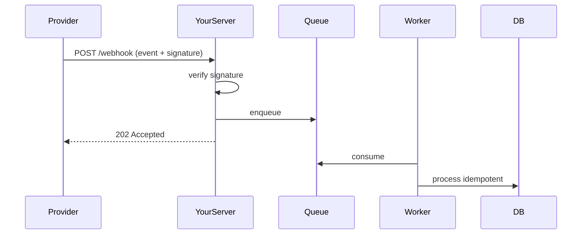

# Chapter 09 — Webhooks

> A webhook is a user-configurable callback. Instead of polling "did anything happen?", the other service calls *you*.

## Learning objectives

- Design webhook payloads.
- Verify signatures.
- Handle retries and idempotency.
- Avoid blocking the caller.

## Prerequisites & recap

- [Servers](01-servers.md), [JSON](04-json.md).

## In plain terms (newbie lane)

This chapter is really about **Webhooks**. Skim *Learning objectives* above first—they are your exit ticket.

> **Newbies often think:** they must memorize the whole chapter before writing any code.  
> **Actually:** you only need the *next* honest mental model, then you prove it with the exercises and mini-project.

Companion links: [Onboarding](../appendix-onboarding.md) · [Study habits](../appendix-study-habits.md) · [Concept threads](../appendix-threads/README.md)

<details><summary>Pause and predict</summary>

Without scrolling: what is one real bug or outage class this chapter helps you prevent?

</details>


## Concept deep-dive

### Pattern

1. You publish an endpoint (`POST /webhooks/stripe`).
2. The other service sends a JSON body + a signature header whenever an event happens.
3. You verify, acknowledge with 2xx quickly, and process async.

### Verifying signatures

Senders sign with HMAC; you verify:

```ts
import crypto from "node:crypto";

function verify(signature: string, body: string, secret: string): boolean {
  const expected = crypto.createHmac("sha256", secret).update(body).digest("hex");
  return crypto.timingSafeEqual(Buffer.from(signature), Buffer.from(expected));
}
```

Use `timingSafeEqual` to avoid timing attacks.

Read the raw body (not parsed JSON) for signing:

```ts
// express: use a raw body parser for this route only
app.post("/webhooks/stripe", express.raw({ type: "application/json" }), handler);
```

### Idempotency

Most providers retry on failure. Include an event ID; treat duplicates as no-ops:

```ts
async function handle(event) {
  const already = await events.exists(event.id);
  if (already) return;
  await events.markProcessed(event.id);
  await doWork(event);
}
```

Wrap in a transaction or use a unique constraint on `event_id`.

### ACK fast, process async

Return 2xx within seconds. Push the actual work to a queue or background job:

```ts
app.post("/webhooks/x", rawBody, asyncHandler(async (req, res) => {
  const sig = req.header("x-signature") ?? "";
  if (!verify(sig, req.body, SECRET)) throw new Unauthorized();
  await queue.send(req.body);
  res.status(202).json({ accepted: true });
}));
```

Store enough to reprocess later if background worker fails.

### Retries

Webhook providers retry with exponential backoff on 5xx. Return 4xx (e.g., 400 bad signature) to signal "don't retry" for permanent failures.

### Replay attack

An attacker captures a valid signed request and replays it. Mitigate by:

- Sending a timestamp (`X-Timestamp`) — reject if old.
- Tracking event IDs and rejecting duplicates.

### Testing locally

Use `ngrok` / `cloudflared` to expose localhost to the internet for the provider to reach. Or stub with recorded payloads.

## Worked examples

### Example 1 — Stripe-ish verification

```ts
app.post("/webhooks/stripe",
  express.raw({ type: "application/json" }),
  asyncHandler(async (req, res) => {
    const sig = req.header("stripe-signature") ?? "";
    if (!verify(sig, req.body, STRIPE_SECRET)) return res.status(400).end();
    const event = JSON.parse(req.body.toString());
    await handleEvent(event);
    res.status(200).end();
  })
);
```

### Example 2 — Idempotency with DB

```sql
CREATE TABLE processed_events (
  id TEXT PRIMARY KEY,
  processed_at TIMESTAMPTZ NOT NULL DEFAULT now()
);
```

```ts
async function handleEvent(evt) {
  try {
    await db.query("INSERT INTO processed_events (id) VALUES ($1)", [evt.id]);
  } catch (e) {
    if (isUniqueViolation(e)) return;    // already processed
    throw e;
  }
  await doWork(evt);
}
```

## Diagrams



*Caption: Trace the flow (data/time/money) through this figure before reading further.*

## Common pitfalls & gotchas

- Parsing JSON before signing — signature mismatch.
- Long processing in the handler → timeouts and retries storm.
- No idempotency → duplicate charges, emails.
- Logging full payload (may include PII).

## Exercises

1. Warm-up. Add `/webhooks/test` returning 200.
2. Standard. Implement HMAC verification with `timingSafeEqual`.
3. Bug hunt. Why does parsing JSON before verification break the signature?
4. Stretch. Add event-ID idempotency with a DB unique constraint.
5. Stretch++. Simulate retries in tests; assert no duplicate work.

## Quiz

1. Signature verification uses:
    (a) plain equal (b) `timingSafeEqual` (c) regex (d) `===`
2. Parse order:
    (a) parse JSON then verify (b) verify raw bytes then parse (c) either (d) depends
3. ACK strategy:
    (a) process fully before responding (b) verify + enqueue + 202 (c) 500 (d) 204 silently
4. Retry storm caused by:
    (a) returning 2xx (b) returning 5xx on transient issues (c) returning 4xx (d) anything
5. Idempotency key:
    (a) prevents duplicates (b) replaces auth (c) is optional (d) ignored

**Short answer:**

6. Why reject replays with a timestamp window?
7. One advantage of processing asynchronously.

## Mini-project: Apply it

Full brief (goal, acceptance criteria, hints, stretch): [09-webhooks — mini-project](mini-projects/09-webhooks-project.md).

## Where this idea reappears

- **Same thread elsewhere:** trace how this chapter’s primitives show up in production systems — not only in this language or layer.
- **Cross-module links (read next when you feel stuck):**
  - [HTTP clients](../10-http-clients/01-why-http.md) — symmetric skills for debugging full stacks.
  - [Safe SQL from application code](../11-sql/04-crud.md) — parameters, transactions, and errors behind your routes.

  - [Concept threads (hub)](../appendix-threads/README.md) — state, errors, and performance reading trails.


## Chapter summary

- Verify signatures on the raw body.
- ACK fast; process async.
- Idempotency is non-negotiable.

## Further reading

- Stripe webhook docs (canonical example).
- Next: [documentation](10-documentation.md).
