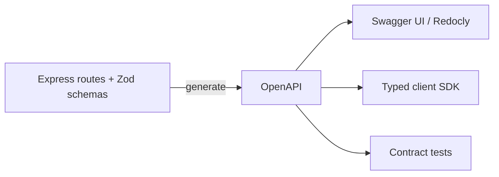

# Chapter 10 — Documentation

> An undocumented API is a private one. If you want anyone (including future you) to use it, write the docs.

## Learning objectives

- Write an OpenAPI specification for an API.
- Generate interactive docs (Swagger UI, Scalar, Redocly).
- Keep docs and code in sync.
- Write examples that actually run.

## Prerequisites & recap

- All previous chapters.

## In plain terms (newbie lane)

This chapter is really about **Documentation**. Skim *Learning objectives* above first—they are your exit ticket.

> **Newbies often think:** they must memorize the whole chapter before writing any code.  
> **Actually:** you only need the *next* honest mental model, then you prove it with the exercises and mini-project.

Companion links: [Onboarding](../appendix-onboarding.md) · [Study habits](../appendix-study-habits.md) · [Concept threads](../appendix-threads/README.md)

<details><summary>Pause and predict</summary>

Without scrolling: what is one real bug or outage class this chapter helps you prevent?

</details>


## Concept deep-dive

### OpenAPI

OpenAPI (formerly Swagger) is a YAML/JSON description of your HTTP API. A minimal example:

```yaml
openapi: 3.1.0
info:
  title: Bookstore API
  version: 1.0.0
paths:
  /v1/books:
    get:
      summary: List books
      responses:
        "200":
          description: OK
          content:
            application/json:
              schema:
                type: array
                items: { $ref: "#/components/schemas/Book" }
components:
  schemas:
    Book:
      type: object
      required: [id, title]
      properties:
        id:    { type: integer }
        title: { type: string }
```

### Generating docs from the spec

- **Swagger UI** — classic interactive playground.
- **Redoc / Redocly** — opinionated, beautiful.
- **Scalar** — modern, dark mode friendly.

Serve at `/docs`:

```ts
import swaggerUi from "swagger-ui-express";
import spec from "./openapi.json";
app.use("/docs", swaggerUi.serve, swaggerUi.setup(spec));
```

### Generating spec from code

Two strategies:

1. **Spec-first**: write YAML, generate server stubs and/or client SDKs. Cleaner contracts.
2. **Code-first**: annotate routes / schemas; tooling generates spec. Easier to keep in sync.

For Fastify + Zod, `@fastify/swagger` + `zod-to-json-schema` is a popular combo. For Express, `zod-openapi`, `express-openapi`, or manual.

### Keep them in sync

The spec must match reality. Do one of:

- Generate spec from code.
- Validate requests/responses against spec in tests.
- Run a contract test suite in CI.

A stale spec lies to clients; worse than no spec.

### Examples

Every non-trivial endpoint should have a working request + response example in the docs. Copy-pasteable `curl` helps.

### Versioning

Document every version you still support. Deprecation notices on old endpoints in the spec make intent clear.

### Non-OpenAPI docs

Beyond the spec:

- **README** — quick start.
- **Architecture** — how the pieces fit. Include a mermaid diagram.
- **Runbook** — how to deploy, troubleshoot, rotate secrets.
- **Change log** — what changed and when.

Each of these saves an incident someday.

## Worked examples

### Example 1 — Serve docs

```ts
app.use("/docs", swaggerUi.serve, swaggerUi.setup(spec, {
  swaggerOptions: { persistAuthorization: true },
}));
```

### Example 2 — Contract test in CI

```ts
test("GET /v1/books returns schema-valid response", async () => {
  const r = await supertest(app).get("/v1/books");
  const isValid = ajv.validate(spec.components.schemas.BookList, r.body);
  expect(isValid).toBe(true);
});
```

Any drift between code and spec fails CI.

## Diagrams



*Caption: Trace the flow (data/time/money) through this figure before reading further.*

## Common pitfalls & gotchas

- Shipping a spec that doesn't match the server.
- Documenting every endpoint but not examples.
- Versioning docs inconsistently.
- No runbook → the on-call engineer reads the docs during an outage.

## Exercises

1. Warm-up. Write an OpenAPI stub for `GET /v1/health`.
2. Standard. Generate or hand-write OpenAPI for your `books` API; mount Swagger UI.
3. Bug hunt. Docs say `201` but code returns `200`. Add a contract test.
4. Stretch. Generate a typed client SDK from your spec.
5. Stretch++. Publish docs to a static site (GitHub Pages) on every merge to `main`.

## Quiz

1. OpenAPI is:
    (a) a testing library (b) a spec format for HTTP APIs (c) a database (d) a runtime
2. Keep docs and code in sync via:
    (a) discipline only (b) generation or contract tests (c) manual review (d) nothing
3. Swagger UI mounts:
    (a) anywhere (b) typically at `/docs` (c) only root (d) only in dev
4. Spec-first vs. code-first:
    (a) same (b) different trade-offs; both valid (c) spec-first deprecated (d) code-first deprecated
5. Runbook:
    (a) developer doc (b) operational procedures for incidents (c) API spec (d) CI config

**Short answer:**

6. Why include runnable examples in docs?
7. One benefit of generating a typed SDK from OpenAPI.

## Mini-project: Apply it

Full brief (goal, acceptance criteria, hints, stretch): [10-documentation — mini-project](mini-projects/10-documentation-project.md).

## Where this idea reappears

- **Same thread elsewhere:** trace how this chapter’s primitives show up in production systems — not only in this language or layer.
- **Cross-module links (read next when you feel stuck):**
  - [HTTP clients](../10-http-clients/01-why-http.md) — symmetric skills for debugging full stacks.
  - [Safe SQL from application code](../11-sql/04-crud.md) — parameters, transactions, and errors behind your routes.

  - [Concept threads (hub)](../appendix-threads/README.md) — state, errors, and performance reading trails.


## Chapter summary

- Docs = spec + examples + runbook.
- Keep in sync automatically or with CI.
- An undocumented endpoint effectively doesn't exist.

## Further reading

- OpenAPI Specification.
- Redocly, Scalar docs.
- Next module: [Module 13 — File Servers & CDNs](../13-file-cdn/README.md).
