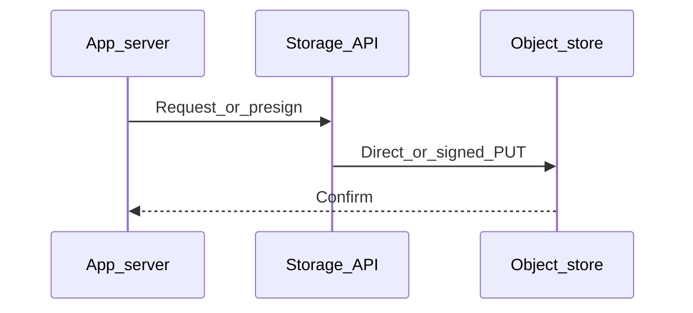

# Chapter 01 — File Storage

> "Not every payload belongs in a database. Photos, videos, backups, and logs live in *file storage* — and there are three flavors of it."

## Learning objectives

By the end of this chapter you will be able to:

- Distinguish block, file, and object storage and know when to reach for each.
- Explain why storing large files in a database or on local disk is a bad idea.
- Describe the object-storage data model and cost structure.
- Design the "metadata in SQL, bytes in object storage" pattern.

## Prerequisites & recap

- [Module 11 — SQL](../11-sql/README.md) — you understand relational databases.
- [Linux filesystems](../02-linux/02-filesystems.md) — you've worked with directories and permissions.

## The simple version

Think of three different ways to put stuff on a shelf. **Block storage** is like a filing cabinet with fixed-size drawers — fast and precise, but you manage the structure yourself. **File storage** is like a shared network drive — you get folders and filenames, and multiple machines can access it. **Object storage** is like a warehouse with a label on every box — you hand it a blob, give it a name, and it stores it with near-infinite capacity.

For almost every backend you'll build, the answer is: put your database on block storage, put your files in object storage, and skip the shared file server unless you're dealing with legacy infrastructure.

## Visual flow

```
  Browser                    App Server              Object Store (S3)
    |                            |                         |
    |-- GET /api/upload-url ---->|                         |
    |<--- presigned PUT URL -----|                         |
    |                            |                         |
    |---------- PUT bytes ------------------------------>  |
    |                            |                         |
    |-- POST /api/confirm ------>|                         |
    |                        [save metadata to DB]         |
    |                            |                         |
    |-- GET /photo/123 --------->| ---(or CDN)-----------> |
    |<--------- image bytes -----|<----------------------- |

    Caption: The app never proxies file bytes — it signs a URL
    and the browser talks directly to S3.
```

## System diagram (Mermaid)



*Typical control plane vs data plane when moving bytes to durable storage.*

## Concept deep-dive

### Three flavors of storage

| Model | Unit | Example | Use |
|---|---|---|---|
| **Block** | Fixed-size blocks on a device | AWS EBS, SSD | Boot disks, databases |
| **File** | Hierarchical files + directories | NFS, Samba, EFS | Shared app state, lift-and-shift |
| **Object** | Arbitrary blob + key + metadata | S3, GCS, Azure Blob | Web/app payloads, backups, data lakes |

A modern backend uses a database (sitting on block storage), almost never a shared filesystem, and lots of object storage.

### Why not store files in the database?

Short answer: **don't**. Here's why:

- **Row size blows up.** A few megabytes per row turns backups, replication, and `pg_dump` into multi-hour ordeals.
- **The database isn't built for streaming.** It's optimized for queries across structured rows, not shoveling multi-MB blobs through a query protocol.
- **CDNs can't cache database responses.** You miss out on the cheapest and most effective way to serve files globally.
- **You can't scale independently.** Storage grows differently from compute — object storage lets you pay for each separately.

The one exception: tiny blobs (avatars < 10 KB) in environments where object storage isn't available. Even then, move them out as soon as you can.

### Why not the local filesystem?

- **Not shared between instances** — the moment you scale to two servers, half your users can't find their uploads.
- **Lost on container restart** — ephemeral by default in Docker, ECS, Lambda.
- **No CDN in front** — every request hits your server.

Local disk is fine for throwaway temp files and logs that get shipped elsewhere immediately.

### Object storage properties

- **Effectively unlimited capacity.** You never provision disk — you pay per byte stored.
- **Flat namespace.** There are no real directories — keys like `photos/2026/04/abc.jpg` just look like paths. The `/` is part of the string.
- **Built-in features.** Versioning, lifecycle rules, cross-region replication, encryption at rest — all first-class.
- **HTTP API.** Every object store speaks HTTP. Easy to integrate, easy to front with a CDN.
- **Strong consistency.** S3 has been strongly consistent since December 2020 — read-after-write, list-after-write.

### Cost model

Object storage bills on three lines:

1. **Bytes stored** — cheap (~$0.023/GB-month for S3 Standard).
2. **Requests** — GET and PUT each have per-thousand-request costs.
3. **Bandwidth out (egress)** — often the biggest line item for public-facing workloads.

Archival tiers (Glacier, Deep Archive) are ~10× cheaper to store but expensive and slow to retrieve. Put a CDN in front of your public objects to slash egress costs.

### File servers — when they still appear

- Legacy on-prem applications that expect POSIX filesystem semantics.
- Shared-write workloads like a build farm where many workers modify the same files.
- Environments where no object storage is available (rare today, but it happens).

### Putting it together

A typical media-heavy application:

- **App DB** on block storage (EBS, attached SSD).
- **User uploads** → S3 via presigned URL so the app server never proxies bytes.
- **Public assets** → S3, served through a CloudFront CDN.
- **Logs** → stdout → central log system (not files on disk).

## Why these design choices

**Why presigned URLs instead of proxying through the app?** Your app server has limited bandwidth and CPU. If every upload and download passes through it, you've created a bottleneck that scales linearly with traffic. Presigned URLs let the client talk directly to S3, which has effectively unlimited bandwidth, and your server only signs a short-lived URL. The trade-off: you need CORS configured on the bucket, and you lose the ability to intercept the upload for validation mid-stream (you validate after with a confirmation step instead).

**Why not just make the bucket public?** A public bucket means anyone with the URL can download every object. Presigned download URLs give you per-request access control with built-in expiry. If you need truly public assets (like a marketing site's images), front them with CloudFront + Origin Access Control so the bucket itself stays private.

**When would you pick a file server over object storage?** If your workload requires POSIX semantics — partial file writes, file locking, directory listings with inode metadata — object storage won't fit. NFS or EFS is the right answer there. But this is rare for new applications.

## Production-quality code

### Presigned upload endpoint

```ts
import { S3Client, PutObjectCommand } from "@aws-sdk/client-s3";
import { getSignedUrl } from "@aws-sdk/s3-request-presigner";
import { randomUUID } from "node:crypto";
import type { Request, Response, NextFunction } from "express";

const s3 = new S3Client({ region: process.env.AWS_REGION ?? "us-east-1" });
const BUCKET = process.env.UPLOAD_BUCKET;
if (!BUCKET) throw new Error("UPLOAD_BUCKET env var is required");

const MAX_SIZE = 10 * 1024 * 1024; // 10 MB
const ALLOWED_TYPES = new Set(["image/jpeg", "image/png", "image/webp"]);

app.get("/api/upload-url", async (req: Request, res: Response, next: NextFunction) => {
  try {
    const contentType = req.query.type as string;
    if (!ALLOWED_TYPES.has(contentType)) {
      return res.status(400).json({ error: "Unsupported file type" });
    }

    const key = `uploads/${randomUUID()}`;
    const url = await getSignedUrl(
      s3,
      new PutObjectCommand({
        Bucket: BUCKET,
        Key: key,
        ContentType: contentType,
        ContentLength: MAX_SIZE,
      }),
      { expiresIn: 300 }
    );

    res.json({ url, key });
  } catch (err) {
    next(err);
  }
});
```

### Photo metadata schema

```sql
CREATE TABLE photos (
  id          UUID PRIMARY KEY DEFAULT gen_random_uuid(),
  user_id     INT NOT NULL REFERENCES users(id),
  s3_key      TEXT NOT NULL,
  content_type TEXT NOT NULL,
  size_bytes  INT NOT NULL,
  width       INT,
  height      INT,
  created_at  TIMESTAMPTZ NOT NULL DEFAULT now()
);

CREATE INDEX idx_photos_user ON photos (user_id, created_at DESC);
```

## Security notes

- **Never expose raw AWS credentials to the browser.** The presigned URL contains a signature — the actual keys stay server-side.
- **Enforce `Content-Type` on the presign** so attackers can't upload executable files disguised as images.
- **Keep presign expiry short** (5 minutes or less). A leaked URL is only useful briefly.
- **Validate uploads server-side after confirmation** — check the object's actual Content-Type and size in S3, not just what the client claims.
- **Enable Block Public Access** on the bucket at both account and bucket level.

## Performance notes

- **Presigned uploads eliminate the app as a bandwidth bottleneck.** S3 handles the data plane; your server only generates ~500-byte signed URLs.
- **Egress is the dominant cost.** A single CDN-fronted architecture can cut egress by 80–95% compared to serving directly from S3.
- **Multipart uploads** (`@aws-sdk/lib-storage`) are essential for files > 100 MB — they parallelize parts and retry failures independently.
- **S3 Standard-IA** saves ~40% on storage for infrequently accessed files, but read costs are higher — don't use it for hot content.

## Common mistakes

| # | Symptom | Cause | Fix |
|---|---------|-------|-----|
| 1 | Upload endpoint becomes the bottleneck under load | App proxies every byte through its own network and CPU | Switch to presigned URLs — let clients talk to S3 directly |
| 2 | `pg_dump` takes hours; replication lag grows | Large blobs stored in Postgres `BYTEA` columns | Move file bytes to S3; store only the S3 key in the DB |
| 3 | Container restarts lose user uploads | Files saved to local disk inside the container | Write to S3 (or at minimum a mounted volume) instead |
| 4 | Disk fills up on the app server | Temp files or logs accumulate without cleanup | Ship logs to a central system; delete temp files after use; add monitoring for disk usage |
| 5 | Monthly AWS bill spikes unexpectedly | Heavy egress from S3 without a CDN | Place CloudFront in front of public objects to cache at the edge |

## Practice

### Warm-up

Match each use case to the correct storage model (block, file, or object):

- A PostgreSQL database
- User-uploaded profile photos
- A build farm where 50 workers compile the same repo
- Application log files shipped to a central system
- A static marketing website

<details><summary>Show solution</summary>

- PostgreSQL → **block** (EBS or local SSD)
- Profile photos → **object** (S3)
- Build farm shared repo → **file** (NFS/EFS)
- Log files → **object** (shipped to S3 or a log service, not kept on local disk)
- Static website → **object** (S3 + CDN)

</details>

### Standard

Design a `documents` table for a file-sharing app. Files are stored in S3; your table tracks metadata. Include: user ownership, original filename, S3 key, MIME type, size, and timestamps.

<details><summary>Show solution</summary>

```sql
CREATE TABLE documents (
  id            UUID PRIMARY KEY DEFAULT gen_random_uuid(),
  owner_id      INT NOT NULL REFERENCES users(id),
  original_name TEXT NOT NULL,
  s3_key        TEXT NOT NULL UNIQUE,
  mime_type     TEXT NOT NULL,
  size_bytes    BIGINT NOT NULL,
  created_at    TIMESTAMPTZ NOT NULL DEFAULT now(),
  updated_at    TIMESTAMPTZ NOT NULL DEFAULT now()
);
```

</details>

### Bug hunt

Your `GET /photos/:id` handler reads the photo from the database (`BYTEA` column) and streams the 5 MB blob to the client. Under load, the endpoint's p99 latency jumps from 50 ms to 8 seconds and the database connection pool exhausts. Why?

<details><summary>Show solution</summary>

Each request holds a database connection open while streaming 5 MB over HTTP. Under concurrency, you exhaust the connection pool — new requests queue behind slow streams. The fix: store bytes in S3, return a redirect (or presigned URL) from the endpoint, and let the client fetch the blob directly from object storage.

</details>

### Stretch

Write a migration plan: your app currently stores uploads on the local filesystem at `/var/uploads/`. Design the steps to move to S3 without downtime.

<details><summary>Show solution</summary>

1. Deploy a new version that writes new uploads to S3 *and* local disk (dual-write).
2. Add a background job that copies existing files from `/var/uploads/` to S3, updating DB records with the new S3 key.
3. Update the read path: check S3 first, fall back to local disk.
4. Once all files are migrated and verified, deploy a version that reads/writes S3 only.
5. Remove the local files after a retention period.

</details>

### Stretch++

Cost-estimate storing and serving 1 million photos averaging 500 KB each in S3 Standard, assuming 10 million GET requests/month and 50% cache-hit rate at CloudFront.

<details><summary>Show solution</summary>

- **Storage:** 1M × 500 KB = 500 GB → ~$11.50/month (S3 Standard at $0.023/GB).
- **PUT requests (initial upload):** 1M PUTs → ~$5.00 ($0.005 per 1,000).
- **GET requests to S3:** 50% of 10M = 5M GETs → ~$2.00 ($0.0004 per 1,000).
- **Egress from S3 to CloudFront:** 5M × 500 KB = ~2.5 TB → $0 (S3-to-CloudFront egress is free).
- **CloudFront data transfer out:** 10M × 500 KB = ~5 TB → ~$425/month (varies by region, ~$0.085/GB).
- **Total:** ~$444/month. The dominant cost is CloudFront egress to end users.

</details>

## In plain terms (newbie lane)
If `File Storage` feels abstract, think of it as a practical tool to make your backend work more predictable and easier to debug. Use this chapter to build one clear mental model first, then add details.

> **Newbies often think:** this topic is only theory and memorization.  
> **Actually:** it is a workflow aid that helps you make better decisions under real project pressure.


## Quiz

1. Which of the following is an example of object storage?
   (a) EBS  (b) EFS  (c) S3  (d) NFS

2. Where should you NOT store 10 MB user uploads at scale?
   (a) S3  (b) A database row  (c) Google Cloud Storage  (d) Cloudflare R2

3. What is a key advantage of object storage over block storage for web payloads?
   (a) POSIX file semantics  (b) Effectively unlimited capacity, HTTP API, CDN-friendly  (c) Lower latency for random reads  (d) Native database support

4. When did S3 become strongly consistent for read-after-write?
   (a) Never  (b) Since 2020  (c) Only in certain regions  (d) Only with versioning enabled

5. What happens when you store uploads on local disk and scale to multiple app instances?
   (a) Files are automatically replicated  (b) It breaks — each instance has its own disk  (c) A shared filesystem is created  (d) The load balancer handles it

**Short answer:**

6. Give one reason to store metadata in SQL and file bytes in S3.
7. Why are presigned URLs useful for file uploads?

*Answers: 1-c, 2-b, 3-b, 4-b, 5-b. 6 — They scale independently: the DB handles queries on structured metadata while S3 handles cheap, durable blob storage without bloating rows. 7 — They let the client upload directly to S3 without exposing AWS credentials and without routing bytes through your app server.*

## Learn-by-doing mini-project

Full brief (goal, acceptance criteria, hints, stretch): [01-file-storage — mini-project](mini-projects/01-file-storage-project.md).

## Where this idea reappears

- **Same thread elsewhere:** trace how this chapter’s primitives show up in production systems — not only in this language or layer.
- **Cross-module links (read next when you feel stuck):**
  - [SQL metadata patterns](../11-sql/README.md) — storing pointers, not blobs.
  - [HTTP cache semantics](../10-http-clients/05-headers.md) — `Cache-Control` and friends behind CDN behavior.

  - [Concept threads (hub)](../appendix-threads/README.md) — state, errors, and performance reading trails.


## Chapter summary

- **Three storage models exist:** block (for databases), file (for shared POSIX access), and object (for everything else in a modern backend).
- **Don't put large files in your database or on local disk** — it kills performance, breaks horizontal scaling, and costs more.
- **Metadata in SQL, bytes in object storage** is the standard pattern. Presigned URLs keep your app server out of the data plane.
- **Egress is the dominant cost** — put a CDN in front of public objects.

## Further reading

- AWS, *Cloud Storage Overview* — compares block, file, and object.
- AWS, *Amazon S3 Developer Guide* — deep reference.
- Cloudflare, *What is Object Storage?* — vendor-neutral explainer.
- Next: [Caching](02-caching.md).
