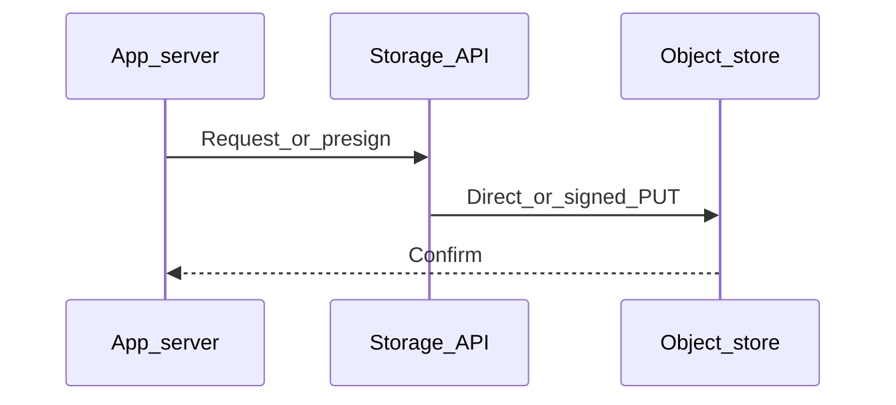

# Chapter 02 — Caching

> "A cache keeps a copy of an answer so you don't recompute or refetch it. Cheap and magical when right; silent and dangerous when wrong."

## Learning objectives

By the end of this chapter you will be able to:

- Set `Cache-Control` and `ETag` headers on HTTP responses.
- Use conditional requests (`If-None-Match` / `If-Modified-Since`) to save bandwidth.
- Distinguish `public`, `private`, `no-cache`, and `no-store` directives.
- Pick a cache invalidation strategy and explain the trade-offs.
- Implement application-level caching with Redis.

## Prerequisites & recap

- [HTTP headers](../10-http-clients/05-headers.md) — you understand request/response headers.

## The simple version

Imagine you ask a librarian for a book, and she photocopies the relevant page for you. The next time you ask the same question, she hands you the copy instead of searching the stacks again. That's a cache. The trick is knowing when the original page has changed and the copy is stale — that's cache invalidation, and it's the hardest part.

HTTP caching works in layers: your browser keeps a local cache, a CDN keeps a shared edge cache, and your application can keep its own cache in Redis or memory. The `Cache-Control` header is the instruction sheet that tells every layer how long a response stays fresh.

## Visual flow

```
  Browser                     CDN Edge                   Origin Server
    |                            |                            |
    |--- GET /style.abc123.css ->|                            |
    |                            |-- (cache miss) ----------->|
    |                            |<-- 200 + Cache-Control ----|
    |                            |   public, max-age=31536000 |
    |<-- 200 (cached at edge) ---|                            |
    |                            |                            |
    |--- GET /style.abc123.css ->|                            |
    |<-- 200 (edge cache hit) ---|  (origin never called)     |
    |                            |                            |
    |--- GET /api/me ----------->|                            |
    |                            |-- (no-store, pass) ------->|
    |                            |<-- 200 + private ----------|
    |<-- 200 (not cached) ------- |                            |

    Caption: Immutable assets get long TTLs; private endpoints
    bypass the shared cache entirely.
```

## System diagram (Mermaid)



*Typical control plane vs data plane when moving bytes to durable storage.*

## Concept deep-dive

### Caching layers

- **Browser cache** — per-user, local. Driven by `Cache-Control` and `ETag`.
- **CDN edge cache** — shared between users, geographically close. Driven by `Cache-Control` with `s-maxage`.
- **Reverse proxy** (Nginx, Varnish) — in front of your origin, same principles as CDN.
- **Application cache** (Redis, in-memory) — you control the keys and TTLs explicitly.

HTTP caching headers drive layers 1–3. Your code drives layer 4.

### `Cache-Control` directives

```
Cache-Control: public, max-age=3600, s-maxage=86400, immutable
```

| Directive | Meaning |
|---|---|
| `public` | Any cache (browser, CDN) may store this response |
| `private` | Only the user's browser — not shared caches |
| `no-store` | Do not cache at all — not even the browser |
| `no-cache` | May cache, but must revalidate before every use |
| `max-age=N` | Fresh for N seconds in the browser |
| `s-maxage=N` | Fresh for N seconds at shared caches (CDN) — overrides `max-age` there |
| `immutable` | Never revalidate — the content will never change at this URL |
| `stale-while-revalidate=N` | Serve stale for up to N seconds while refetching in background |

The modern pattern for static assets with fingerprinted filenames (`app.abcd1234.js`):

```
Cache-Control: public, max-age=31536000, immutable
```

Content never changes for that URL — if the file changes, the filename changes.

### `ETag` and `Last-Modified`

The server tags each response with an identifier:

```
ETag: "v42"
Last-Modified: Fri, 10 Apr 2026 12:00:00 GMT
```

On the next request, the client includes the tag:

```
If-None-Match: "v42"
If-Modified-Since: Fri, 10 Apr 2026 12:00:00 GMT
```

If unchanged, the server returns `304 Not Modified` with no body. You save bandwidth but still make a round trip — that's why `max-age` and `immutable` are better when you can use them.

### Cache keys

A cache key usually includes **method + URL + `Vary` headers**. The `Vary` header tells caches which request headers matter:

- `Vary: Accept-Encoding` — cache separate copies for gzip vs. brotli.
- `Vary: Accept-Language` — cache per language.
- `Vary: Cookie` — effectively disables shared caching (every user has different cookies).

### Invalidation

The hard problem. Two practical patterns:

- **Versioned URLs** — `/assets/app.abcd1234.js`. A new build emits a new hash; the old URL stays valid in old caches forever. No invalidation needed.
- **Purge** — CDN API call to evict a key. Fast, but slower than versioning and costs money at scale.

Versioned URLs are almost always better. Use purging only for resources you can't fingerprint (like `index.html`).

### Caching dynamic responses

```
Cache-Control: private, max-age=0, must-revalidate
```

For user-specific endpoints. You can consider short-TTL edge caching for semi-dynamic content — a product listing that changes every few minutes — with careful `Vary` and `stale-while-revalidate`.

### Application-level caching (Redis)

For expensive computations or frequently-read data:

```ts
const key = `dashboard:${userId}`;
const cached = await redis.get(key);
if (cached) return JSON.parse(cached);

const data = await computeDashboard(userId);
await redis.set(key, JSON.stringify(data), "EX", 60);
return data;
```

Watch out for stale data — include a version in the key or keep TTLs short.

## Why these design choices

**Why version URLs instead of purging?** Purging is an operation you have to trigger, wait for, and hope propagates to every edge POP. Versioned URLs make the problem disappear — the old URL still serves the old content (harmlessly) and the new URL is a cache miss that populates naturally. The trade-off: your HTML must reference the new URL, so `index.html` itself can't be versioned the same way. The common fix is a very short TTL on HTML and a very long TTL on fingerprinted assets.

**Why `stale-while-revalidate` instead of just a longer `max-age`?** A long `max-age` risks serving genuinely stale data for too long. `stale-while-revalidate` gives you the latency benefit of serving from cache immediately while triggering a background refresh. The user sees fast responses; the next user gets fresh data. The trade-off: one user sees slightly stale content during the revalidation window.

**When would you skip caching entirely?** When correctness beats speed — financial transactions, real-time collaboration state, anything where a stale read causes user-visible errors. Use `no-store` and accept the latency cost.

## Production-quality code

### ETag middleware for a JSON endpoint

```ts
import type { Request, Response, NextFunction } from "express";
import { createHash } from "node:crypto";

app.get("/v1/products/:id", async (req: Request, res: Response, next: NextFunction) => {
  try {
    const product = await products.findById(req.params.id);
    if (!product) return res.status(404).json({ error: "not found" });

    const body = JSON.stringify(product);
    const etag = `"${createHash("md5").update(body).digest("hex")}"`;

    if (req.headers["if-none-match"] === etag) {
      return res.status(304).end();
    }

    res.setHeader("ETag", etag);
    res.setHeader("Cache-Control", "public, max-age=60, stale-while-revalidate=300");
    res.setHeader("Content-Type", "application/json");
    res.send(body);
  } catch (err) {
    next(err);
  }
});
```

### Redis memoization with error handling

```ts
import Redis from "ioredis";

const redis = new Redis(process.env.REDIS_URL ?? "redis://localhost:6379");

async function cached<T>(
  key: string,
  ttlSeconds: number,
  compute: () => Promise<T>
): Promise<T> {
  try {
    const hit = await redis.get(key);
    if (hit) return JSON.parse(hit) as T;
  } catch {
    // Redis down — fall through to compute
  }

  const data = await compute();

  redis
    .set(key, JSON.stringify(data), "EX", ttlSeconds)
    .catch(() => {}); // fire-and-forget; app works without cache

  return data;
}

// Usage
const dashboard = await cached(
  `dashboard:${userId}`,
  60,
  () => computeDashboard(userId)
);
```

## Security notes

- **Never cache `private` data as `public`.** If `GET /api/me` returns user-specific data and you set `Cache-Control: public`, a CDN may serve Alice's profile to Bob.
- **`Vary: Cookie` on anything auth-dependent.** But beware — this effectively disables shared caching. Prefer `private` for per-user responses.
- **ETag values can leak information.** Don't use sequential database IDs as ETags — use a hash of the response body.
- **Cached responses can bypass access-control changes.** If you revoke a user's access but the CDN has a cached copy, they still see it until TTL expires. Keep TTLs short on sensitive data, or purge on access changes.

## Performance notes

- **Browser `max-age` eliminates the network round trip entirely** — faster than a 304, which still requires a request.
- **`immutable` on fingerprinted assets avoids revalidation on refresh** — browsers traditionally revalidate on manual refresh even within `max-age`.
- **Cache stampede** occurs when many clients miss at the same instant (e.g., right after TTL expires on a popular key). Mitigate with request coalescing, probabilistic early refresh, or a mutex on the recompute.
- **Redis GET is ~0.1 ms** vs. hundreds of milliseconds for a complex DB query. But serialization/deserialization overhead matters for large payloads — benchmark before assuming a cache helps.

## Common mistakes

| # | Symptom | Cause | Fix |
|---|---------|-------|-----|
| 1 | User A sees User B's profile page | `Cache-Control: public` on a per-user endpoint | Use `private` or `no-store` for user-specific responses |
| 2 | Users see stale content after a deploy | Long `max-age` on URLs that aren't versioned | Use fingerprinted filenames for assets; short TTL on `index.html` |
| 3 | Origin gets hammered despite CDN in front | Missing or misconfigured `Vary` header — CDN bypasses for every unique cookie | Whitelist only necessary `Vary` dimensions; avoid `Vary: *` |
| 4 | Database melts when a popular cache key expires | Cache stampede — hundreds of concurrent misses hit the DB simultaneously | Use a lock or semaphore so only one request recomputes; others wait |
| 5 | `304 Not Modified` never fires | ETag not set, or `If-None-Match` header stripped by a proxy | Set ETags; verify your reverse proxy forwards conditional headers |

## Practice

### Warm-up

Add `Cache-Control: public, max-age=60` to a static JSON endpoint. Verify with `curl -I` that the header appears.

<details><summary>Show solution</summary>

```ts
app.get("/api/status", (_req, res) => {
  res.setHeader("Cache-Control", "public, max-age=60");
  res.json({ status: "ok", timestamp: new Date().toISOString() });
});
```

```bash
curl -I http://localhost:3000/api/status
# Look for: Cache-Control: public, max-age=60
```

</details>

### Standard

Add ETag + 304 handling to a product endpoint. Verify that a second request with `If-None-Match` returns 304 with no body.

<details><summary>Show solution</summary>

```ts
app.get("/api/products/:id", async (req, res) => {
  const product = await db.products.findById(req.params.id);
  if (!product) return res.status(404).end();

  const etag = `"${product.updated_at.getTime()}"`;
  if (req.headers["if-none-match"] === etag) return res.status(304).end();

  res.setHeader("ETag", etag);
  res.setHeader("Cache-Control", "public, max-age=30");
  res.json(product);
});
```

```bash
# First request — get the ETag
curl -i http://localhost:3000/api/products/1
# Note the ETag value, e.g. "1713369600000"

# Second request — conditional
curl -i -H 'If-None-Match: "1713369600000"' http://localhost:3000/api/products/1
# Should return 304 with no body
```

</details>

### Bug hunt

Your team set `Cache-Control: public, max-age=3600` on the `GET /api/me` endpoint. Users are reporting they sometimes see someone else's account details. What went wrong, and how do you fix it?

<details><summary>Show solution</summary>

`public` tells CDN edge caches to store and serve the response to anyone. The CDN cached the first user's `/api/me` response and served it to everyone else. Fix: change to `Cache-Control: private, no-store` for any user-specific endpoint. Immediately purge the CDN cache for that path.

</details>

### Stretch

Add Redis memoization to a slow dashboard endpoint. Include: a 60-second TTL, graceful degradation when Redis is down, and a way to manually bust the cache.

<details><summary>Show solution</summary>

```ts
app.get("/api/dashboard/:userId", async (req, res) => {
  const { userId } = req.params;
  const bustCache = req.query.bust === "1";
  const key = `dashboard:${userId}`;

  if (!bustCache) {
    try {
      const cached = await redis.get(key);
      if (cached) return res.json(JSON.parse(cached));
    } catch {
      // Redis unavailable — compute fresh
    }
  }

  const data = await computeDashboard(userId);
  redis.set(key, JSON.stringify(data), "EX", 60).catch(() => {});
  res.json(data);
});
```

</details>

### Stretch++

Implement a cache-stampede mitigation: when a popular key expires, at most one request should recompute; all others wait for it.

<details><summary>Show solution</summary>

```ts
const inFlight = new Map<string, Promise<unknown>>();

async function cachedSingleton<T>(
  key: string,
  ttl: number,
  compute: () => Promise<T>
): Promise<T> {
  const hit = await redis.get(key);
  if (hit) return JSON.parse(hit) as T;

  const existing = inFlight.get(key);
  if (existing) return existing as Promise<T>;

  const promise = compute().then(async (data) => {
    await redis.set(key, JSON.stringify(data), "EX", ttl);
    inFlight.delete(key);
    return data;
  });

  inFlight.set(key, promise);
  return promise;
}
```

This uses an in-process `Map` of pending promises. For multi-instance deployments, use a Redis lock (e.g., `SET key:lock NX EX 10`) instead.

</details>

## In plain terms (newbie lane)
If `Caching` feels abstract, think of it as a practical tool to make your backend work more predictable and easier to debug. Use this chapter to build one clear mental model first, then add details.

> **Newbies often think:** this topic is only theory and memorization.  
> **Actually:** it is a workflow aid that helps you make better decisions under real project pressure.


## Quiz

1. Which `Cache-Control` directive controls freshness at a shared cache (CDN)?
   (a) `max-age`  (b) `s-maxage`  (c) `private`  (d) `no-store`

2. What is an `ETag`?
   (a) A version identifier for a cached resource  (b) The response size  (c) A timestamp  (d) A session cookie

3. What is the best `Cache-Control` for a fingerprinted static asset (`app.abc123.js`)?
   (a) `no-cache`  (b) `public, max-age=31536000, immutable`  (c) `no-store`  (d) No header at all

4. What does the `Vary` header control?
   (a) Rate limits  (b) Which request headers are part of the cache key  (c) Response body shape  (d) Request ordering

5. What is a cache stampede?
   (a) Extra security layer  (b) Many concurrent cache misses hitting the origin at once  (c) A zero-downtime deploy  (d) A DDoS technique

**Short answer:**

6. Give one way to invalidate a cached response.
7. When would you prefer `stale-while-revalidate` over a simple `max-age`?

*Answers: 1-b, 2-a, 3-b, 4-b, 5-b. 6 — Use versioned/fingerprinted URLs (new content gets a new URL) or explicitly purge the path via the CDN's API. 7 — When you want users to see fast cached responses while the cache refreshes in the background, rather than waiting for a revalidation round trip.*

## Learn-by-doing mini-project

Full brief (goal, acceptance criteria, hints, stretch): [02-caching — mini-project](mini-projects/02-caching-project.md).

## Where this idea reappears

- **Same thread elsewhere:** trace how this chapter’s primitives show up in production systems — not only in this language or layer.
- **Cross-module links (read next when you feel stuck):**
  - [SQL metadata patterns](../11-sql/README.md) — storing pointers, not blobs.
  - [HTTP cache semantics](../10-http-clients/05-headers.md) — `Cache-Control` and friends behind CDN behavior.

  - [Concept threads (hub)](../appendix-threads/README.md) — state, errors, and performance reading trails.


## Chapter summary

- **Cache where it helps — browser, CDN edge, application** — and use `Cache-Control` headers to drive the first three layers.
- **Prefer versioned URLs for immutability** — they eliminate invalidation entirely for static assets.
- **Watch `public` vs. `private` carefully** — a wrong directive can leak private data through shared caches.
- **Redis memoization is powerful but fallible** — always degrade gracefully when the cache is unavailable.

## Further reading

- MDN, *HTTP caching* — the definitive web reference.
- RFC 9111, *HTTP Caching* — the actual spec.
- Cloudflare, *Cache-Control tutorial* — practical examples.
- Next: [AWS S3](03-aws-s3.md).
