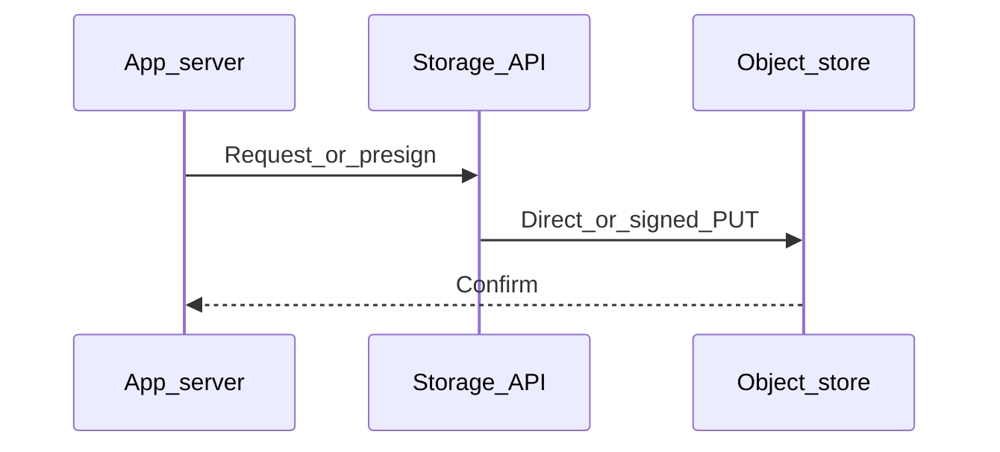

# Chapter 03 — AWS S3

> "S3 is the default object store of the internet. Learn its concepts and API once — Google Cloud Storage, Azure Blob, and Cloudflare R2 all speak dialects of the same ideas."

## Learning objectives

By the end of this chapter you will be able to:

- Create an S3 bucket and upload/download objects using the AWS SDK v3.
- Generate presigned URLs for direct client uploads and downloads.
- Explain storage classes and configure lifecycle rules.
- Secure a bucket with IAM, bucket policies, and Block Public Access.

## Prerequisites & recap

- [File storage](01-file-storage.md) — you understand the three storage models.
- An AWS account (free tier is sufficient for exercises).

## The simple version

S3 is a giant, managed key-value store where the key is a string and the value is a blob of bytes (up to 5 TB). You organize blobs in "buckets" — each with a globally unique name. You interact with it over HTTPS: PUT to upload, GET to download. The SDK wraps those HTTP calls and handles authentication, retries, and multipart uploads for you.

The most important trick is presigned URLs: your server generates a short-lived URL that lets a browser upload or download directly from S3, without exposing your AWS credentials and without routing bytes through your server.

## Visual flow

```
  Your Server                    AWS S3                Browser
      |                            |                      |
      |                            |                      |
      |<--- "I want to upload" ----|----------------------|
      |                            |                      |
      |--- signs a presigned URL ->|                      |
      |--- returns URL to browser -|--------------------->|
      |                            |                      |
      |                            |<--- PUT bytes -------|
      |                            |--- 200 OK ---------->|
      |                            |                      |
      |<--- "upload done" ---------|----------------------|
      |--- HeadObject to verify -->|                      |
      |<--- metadata -------------|                      |
      |--- save to DB             |                      |

  Caption: The server signs; the browser uploads. Your server
  never touches the file bytes.
```

## System diagram (Mermaid)



*Typical control plane vs data plane when moving bytes to durable storage.*

## Concept deep-dive

### Core concepts

- **Bucket** — a top-level container with a globally unique name. You choose the AWS region where it lives.
- **Object** — a blob of bytes + a key (string) + metadata (Content-Type, user-defined headers).
- **Region** — the physical location of your data. Pick the region closest to your users or your compute.
- **Storage class** — determines cost, latency, and durability guarantees.

### Installing the SDK

```bash
npm install @aws-sdk/client-s3 @aws-sdk/s3-request-presigner
```

### Creating the client

```ts
import { S3Client } from "@aws-sdk/client-s3";

const s3 = new S3Client({ region: "us-east-1" });
```

Credentials are resolved automatically from environment variables, IAM instance roles, or SSO profiles. Never hardcode them.

### Uploading an object

```ts
import { PutObjectCommand } from "@aws-sdk/client-s3";

await s3.send(new PutObjectCommand({
  Bucket: "my-bucket",
  Key: "photos/abc.jpg",
  Body: fileBuffer,
  ContentType: "image/jpeg",
}));
```

For large files (> 100 MB), use `@aws-sdk/lib-storage`'s `Upload` class — it handles multipart uploads with automatic chunking and per-part retries.

### Downloading an object

```ts
import { GetObjectCommand } from "@aws-sdk/client-s3";

const res = await s3.send(new GetObjectCommand({ Bucket: "my-bucket", Key: "photos/abc.jpg" }));
const bytes = await res.Body?.transformToByteArray();
```

In most cases you won't download through your server — you'll generate a presigned GET URL and redirect the client.

### Presigned URLs

Generate a URL the client can use for direct upload or download, without ever seeing your AWS keys:

```ts
import { getSignedUrl } from "@aws-sdk/s3-request-presigner";

const putUrl = await getSignedUrl(s3,
  new PutObjectCommand({
    Bucket: "my-bucket",
    Key: "user-uploads/xyz.jpg",
    ContentType: "image/jpeg",
  }),
  { expiresIn: 300 }
);

const getUrl = await getSignedUrl(s3,
  new GetObjectCommand({ Bucket: "my-bucket", Key: "user-uploads/xyz.jpg" }),
  { expiresIn: 60 }
);
```

### Storage classes

| Class | Latency | Use case |
|---|---|---|
| **Standard** | Milliseconds | Default; hot data |
| **Intelligent-Tiering** | Milliseconds | Auto-moves between hot and cold |
| **Standard-IA** | Milliseconds | Infrequently accessed; cheaper storage, costlier reads |
| **One Zone-IA** | Milliseconds | Same, but single AZ (less durable) |
| **Glacier Instant** | Milliseconds | Archive with instant retrieval |
| **Glacier Flexible** | Minutes–hours | Archive; bulk retrieval |
| **Deep Archive** | Hours | Cheapest; regulatory/compliance data |

### Lifecycle rules

Automatically transition or expire objects:

```json
{
  "Rules": [{
    "Id": "archive-old-logs",
    "Status": "Enabled",
    "Filter": { "Prefix": "logs/" },
    "Transitions": [
      { "Days": 30, "StorageClass": "STANDARD_IA" },
      { "Days": 180, "StorageClass": "GLACIER" }
    ],
    "Expiration": { "Days": 365 }
  }]
}
```

### Bucket policies and IAM

- **IAM policies** — attached to users/roles; control what actions they can perform on which resources.
- **Bucket policies** — attached to the bucket; control who can access it and how. Required for cross-account access or CDN integration.
- **ACLs** — legacy mechanism. Disable them by setting Object Ownership to "Bucket owner enforced."

### Versioning

Bucket versioning retains every version of an object. Great for accidental overwrites and undelete. Each version has a unique version ID. Combine with lifecycle rules to expire old versions after N days.

## Why these design choices

**Why presigned URLs instead of server proxying?** Your server has limited bandwidth and connection slots. If every upload routes through it, you turn your app server into a file server — and it's a terrible file server compared to S3's globally distributed infrastructure. Presigned URLs offload the heavy lifting. The trade-off: you need to configure CORS on the bucket, and you validate uploads after-the-fact rather than during streaming.

**Why `npm ci` instead of `npm install`?** `npm ci` uses the lockfile exactly, ensures reproducible installs, and is faster in CI. Use `npm install` only when you intend to update the lockfile.

**Why default to private buckets?** The single most common S3 security incident is an accidentally public bucket exposing sensitive data. Default-private with Block Public Access at the account level makes this category of mistake much harder. Serve public content through CloudFront with OAC instead.

**When would you skip lifecycle rules?** If your bucket is small and you manage retention manually, lifecycle rules add complexity for little benefit. But for any bucket that grows without bound (logs, user uploads), they're essential — without them, storage costs grow forever.

## Production-quality code

### Complete presigned-upload flow

```ts
import { S3Client, PutObjectCommand, HeadObjectCommand } from "@aws-sdk/client-s3";
import { getSignedUrl } from "@aws-sdk/s3-request-presigner";
import { randomUUID } from "node:crypto";
import type { Request, Response, NextFunction } from "express";

const s3 = new S3Client({ region: process.env.AWS_REGION ?? "us-east-1" });
const BUCKET = process.env.UPLOAD_BUCKET;
if (!BUCKET) throw new Error("UPLOAD_BUCKET is required");

const ALLOWED_TYPES = new Set(["image/jpeg", "image/png", "image/webp"]);
const MAX_BYTES = 10 * 1024 * 1024;

app.post("/api/upload-url", async (req: Request, res: Response, next: NextFunction) => {
  try {
    const { contentType } = req.body;
    if (!contentType || !ALLOWED_TYPES.has(contentType)) {
      return res.status(400).json({ error: "Unsupported content type" });
    }

    const key = `uploads/${randomUUID()}`;
    const url = await getSignedUrl(s3,
      new PutObjectCommand({ Bucket: BUCKET, Key: key, ContentType: contentType }),
      { expiresIn: 300 }
    );

    res.json({ url, key });
  } catch (err) {
    next(err);
  }
});

app.post("/api/confirm-upload", async (req: Request, res: Response, next: NextFunction) => {
  try {
    const { key } = req.body;
    if (!key || !key.startsWith("uploads/")) {
      return res.status(400).json({ error: "Invalid key" });
    }

    const head = await s3.send(new HeadObjectCommand({ Bucket: BUCKET, Key: key }));
    if (!head.ContentLength || head.ContentLength > MAX_BYTES) {
      return res.status(413).json({ error: "File too large" });
    }

    await db.photos.insert({
      s3Key: key,
      userId: req.user!.id,
      contentType: head.ContentType ?? "application/octet-stream",
      sizeBytes: head.ContentLength,
    });

    res.json({ ok: true });
  } catch (err) {
    next(err);
  }
});
```

### Browser-side upload

```html
<input type="file" id="picker" accept="image/*" />
<script type="module">
  document.getElementById("picker").onchange = async (e) => {
    const file = e.target.files[0];
    const { url, key } = await fetch("/api/upload-url", {
      method: "POST",
      headers: { "Content-Type": "application/json" },
      body: JSON.stringify({ contentType: file.type }),
    }).then(r => r.json());

    await fetch(url, { method: "PUT", body: file, headers: { "Content-Type": file.type } });
    await fetch("/api/confirm-upload", {
      method: "POST",
      headers: { "Content-Type": "application/json" },
      body: JSON.stringify({ key }),
    });
  };
</script>
```

## Security notes

- **Never hardcode AWS credentials.** Use IAM roles on EC2/ECS/Lambda; use SSO or short-lived credentials locally; use OIDC federation in CI. Leaked AWS keys are the #1 cloud breach vector.
- **Enable Block Public Access** at both the account and bucket level. Serve public content through CloudFront + OAC.
- **CORS configuration is required** on the bucket for browser-direct uploads — restrict `AllowedOrigins` to your domain.
- **Enforce HTTPS** with a bucket policy that denies `aws:SecureTransport: false`.
- **Presigned URL expiry should be short** — 5 minutes for uploads, 1 minute for downloads.

## Performance notes

- **Presigned uploads scale horizontally** — S3 handles the data plane; your server only signs URLs (~0.5 ms per sign).
- **Multipart uploads** (`@aws-sdk/lib-storage`) parallelize transfers and retry individual parts. Essential for files > 100 MB; beneficial above ~25 MB.
- **S3 Transfer Acceleration** uses CloudFront edge locations to speed uploads from distant clients. Enable it when users upload from far-flung regions.
- **Key design affects throughput.** S3 partitions by key prefix. Random prefixes (UUIDs) distribute load evenly. Sequential prefixes (timestamps) can create hot partitions under extreme request rates (> 5,500 PUT/s per prefix).

## Common mistakes

| # | Symptom | Cause | Fix |
|---|---------|-------|-----|
| 1 | Data breach — files visible to the public | Bucket accidentally set to public access | Enable Block Public Access at account + bucket level; audit with AWS Config |
| 2 | Browser upload fails with CORS error | S3 bucket lacks CORS configuration for the origin | Add a CORS rule allowing your domain, the PUT method, and required headers |
| 3 | AWS credentials appear in a GitHub commit | Hardcoded in source or `.env` committed to git | Use IAM roles; add `.env` to `.gitignore`; rotate leaked keys immediately |
| 4 | Uploads break for large files (> 5 GB) | Using single-part PutObject which has a 5 GB limit | Switch to multipart upload via `@aws-sdk/lib-storage` |
| 5 | Objects uploaded without `Content-Type` | `ContentType` not set in PutObjectCommand | Always pass `ContentType` explicitly — browsers need it for correct rendering |

## Practice

### Warm-up

Create a bucket in the AWS Console (or with `aws s3 mb s3://your-name-test-bucket`). Verify with `aws s3 ls`.

<details><summary>Show solution</summary>

```bash
aws s3 mb s3://my-unique-test-bucket-2026 --region us-east-1
aws s3 ls
# Should show: 2026-04-17 ... my-unique-test-bucket-2026
```

</details>

### Standard

Upload and download one object using the AWS SDK v3 in TypeScript.

<details><summary>Show solution</summary>

```ts
import { S3Client, PutObjectCommand, GetObjectCommand } from "@aws-sdk/client-s3";

const s3 = new S3Client({ region: "us-east-1" });
const Bucket = "my-unique-test-bucket-2026";

await s3.send(new PutObjectCommand({
  Bucket, Key: "hello.txt", Body: Buffer.from("Hello S3!"), ContentType: "text/plain",
}));

const res = await s3.send(new GetObjectCommand({ Bucket, Key: "hello.txt" }));
const text = await res.Body?.transformToString();
console.log(text); // "Hello S3!"
```

</details>

### Bug hunt

A developer uses presigned PUT URLs for browser uploads, but the upload fails with a CORS error. The presigned URL is valid. What's wrong?

<details><summary>Show solution</summary>

The S3 bucket doesn't have a CORS configuration that allows the browser's origin. Even though the presigned URL authenticates the request, CORS is enforced by the browser before S3 sees the auth. Fix: add a CORS rule to the bucket:

```json
{
  "CORSRules": [{
    "AllowedOrigins": ["https://your-app.com"],
    "AllowedMethods": ["PUT"],
    "AllowedHeaders": ["Content-Type"],
    "MaxAgeSeconds": 3600
  }]
}
```

</details>

### Stretch

Add a lifecycle rule that moves objects under `logs/` to Standard-IA after 30 days, Glacier after 180 days, and deletes them after 365 days.

<details><summary>Show solution</summary>

```bash
aws s3api put-bucket-lifecycle-configuration \
  --bucket my-bucket \
  --lifecycle-configuration '{
    "Rules": [{
      "ID": "archive-logs",
      "Status": "Enabled",
      "Filter": { "Prefix": "logs/" },
      "Transitions": [
        { "Days": 30, "StorageClass": "STANDARD_IA" },
        { "Days": 180, "StorageClass": "GLACIER" }
      ],
      "Expiration": { "Days": 365 }
    }]
  }'
```

</details>

### Stretch++

Use `@aws-sdk/lib-storage` to multipart-upload a 1 GB file with progress reporting.

<details><summary>Show solution</summary>

```ts
import { S3Client } from "@aws-sdk/client-s3";
import { Upload } from "@aws-sdk/lib-storage";
import { createReadStream } from "node:fs";

const s3 = new S3Client({ region: "us-east-1" });

const upload = new Upload({
  client: s3,
  params: {
    Bucket: "my-bucket",
    Key: "large/backup.tar.gz",
    Body: createReadStream("/tmp/big-file.tar.gz"),
    ContentType: "application/gzip",
  },
  queueSize: 4,
  partSize: 25 * 1024 * 1024,
});

upload.on("httpUploadProgress", (p) => {
  console.log(`Uploaded: ${((p.loaded ?? 0) / 1024 / 1024).toFixed(1)} MB`);
});

await upload.done();
console.log("Upload complete");
```

</details>

## In plain terms (newbie lane)
If `Aws S3` feels abstract, think of it as a practical tool to make your backend work more predictable and easier to debug. Use this chapter to build one clear mental model first, then add details.

> **Newbies often think:** this topic is only theory and memorization.  
> **Actually:** it is a workflow aid that helps you make better decisions under real project pressure.


## Quiz

1. What is the top-level container in S3?
   (a) Folder  (b) Bucket  (c) Region  (d) Object

2. Where should your application get AWS credentials?
   (a) Hardcoded in source  (b) Environment variables or IAM role  (c) Query string  (d) Config file committed to git

3. What is a presigned URL?
   (a) Requires user sign-in  (b) A temporary URL usable without AWS credentials  (c) A permanent public URL  (d) Only works for downloads

4. What is the best default for bucket access?
   (a) Public read  (b) Private; CDN with OAC for public content  (c) Public read-write  (d) It doesn't matter

5. Which storage class family is designed for archival?
   (a) Standard  (b) Standard-IA  (c) Glacier family  (d) All have equal cost

**Short answer:**

6. Why should presigned URLs be generated on the server, not the client?
7. Give one reason to enable bucket versioning.

*Answers: 1-b, 2-b, 3-b, 4-b, 5-c. 6 — The client doesn't have AWS credentials (and shouldn't). Presigning requires the secret key, which must stay server-side. 7 — Protects against accidental deletion or overwrite — you can restore any previous version of an object.*

## Learn-by-doing mini-project

Full brief (goal, acceptance criteria, hints, stretch): [03-aws-s3 — mini-project](mini-projects/03-aws-s3-project.md).

## Where this idea reappears

- **Same thread elsewhere:** trace how this chapter’s primitives show up in production systems — not only in this language or layer.
- **Cross-module links (read next when you feel stuck):**
  - [SQL metadata patterns](../11-sql/README.md) — storing pointers, not blobs.
  - [HTTP cache semantics](../10-http-clients/05-headers.md) — `Cache-Control` and friends behind CDN behavior.

  - [Concept threads (hub)](../appendix-threads/README.md) — state, errors, and performance reading trails.


## Chapter summary

- **S3 = buckets + objects + metadata** — the de facto standard for object storage.
- **Use the AWS SDK v3** — credentials come from the environment, never from source code.
- **Presigned URLs are the key pattern** — they let clients interact with S3 directly, keeping your server lean.
- **Storage classes and lifecycle rules** manage cost as data ages — don't let storage grow unbounded.

## Further reading

- AWS, *Amazon S3 Developer Guide* — the definitive reference.
- AWS, *S3 pricing* — understand the three cost lines.
- AWS, *Using presigned URLs* — SDK examples for every language.
- Next: [Object storage](04-object-storage.md).
