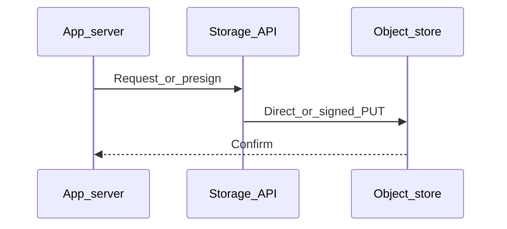

# Chapter 04 — Object Storage

> "S3 is one product; object storage is a model. Understanding the model lets you reason about GCS, Azure Blob, R2, MinIO — they all follow the same pattern."

## Learning objectives

By the end of this chapter you will be able to:

- Describe the universal object-storage data model (key, bytes, metadata).
- Compare major providers on features, API compatibility, and cost.
- Explain the differences between durability, availability, and consistency.
- Swap providers by changing an endpoint, not rewriting your code.

## Prerequisites & recap

- [AWS S3](03-aws-s3.md) — you've used the S3 SDK and understand buckets, objects, and presigned URLs.

## The simple version

Object storage is a pattern, not a product. Every provider gives you the same deal: hand over a blob of bytes, assign it a string key, and get it back later via that key. There are no directories — just strings that look like paths. The storage is virtually unlimited, billed by the byte, and accessed over HTTP.

The reason you care about the model (not just S3) is portability: if you code against the S3 API, you can switch to Cloudflare R2, Backblaze B2, or a self-hosted MinIO by changing a single `endpoint` URL. Your application code stays the same.

## Visual flow

```
  Client App                      Object Store Provider
      |                                   |
      |--- PUT key="photos/a.jpg" ------->|
      |    + bytes + metadata             |
      |                                   |--- replicate across
      |                                   |    3+ availability zones
      |                                   |
      |--- GET key="photos/a.jpg" ------->|
      |<-- bytes + metadata --------------|
      |                                   |
      |--- LIST prefix="photos/" -------->|
      |<-- [photos/a.jpg, photos/b.jpg] --|

  Caption: PUT, GET, LIST — the universal object-storage API.
  No filesystem semantics, no directories, just keys and bytes.
```

## System diagram (Mermaid)



*Typical control plane vs data plane when moving bytes to durable storage.*

## Concept deep-dive

### The data model

An **object** consists of four things:

1. **Key** — a string (e.g. `photos/2026/04/16/abc.jpg`). The `/` characters are conventional — the store treats the key as a flat string.
2. **Bytes** — the payload, up to 5 TB per object.
3. **Metadata** — `Content-Type`, `Content-Length`, and arbitrary user-defined headers.
4. **Immutability** — you don't "edit" an object in place. You replace it with a new version.

### Providers

| Provider | API | Egress fees | Notable |
|---|---|---|---|
| **AWS S3** | S3 (the original) | Yes (~$0.09/GB) | De facto standard |
| **Google Cloud Storage** | Own API + S3 interop | Yes | OAuth-based auth |
| **Azure Blob Storage** | Own API | Yes | "Containers" instead of buckets |
| **Cloudflare R2** | S3-compatible | **None** | Zero egress — huge for public content |
| **Backblaze B2** | S3-compatible | Low | Cheapest storage per GB |
| **MinIO** | S3-compatible | N/A (self-hosted) | Open-source; run on your own hardware |

The S3 SDK works for most S3-compatible providers by swapping the `endpoint`:

```ts
import { S3Client } from "@aws-sdk/client-s3";

const r2 = new S3Client({
  endpoint: "https://<account>.r2.cloudflarestorage.com",
  region: "auto",
  credentials: { accessKeyId: R2_KEY, secretAccessKey: R2_SECRET },
});
```

Everything else — `PutObjectCommand`, `GetObjectCommand`, presigned URLs — works unchanged.

### Durability vs. availability

- **Durability** — the probability of not losing your data. S3 Standard: 99.999999999% (11 nines). You'd have to store 10 million objects to statistically expect losing one in 10,000 years.
- **Availability** — the probability you can read or write right now. S3 Standard: 99.99% (~52 minutes downtime/year).

Durability ≠ availability. During a regional outage, you can't access your bytes, but they aren't lost. Cross-region replication improves availability; durability is already excellent.

### Consistency

S3 has been **strongly consistent** since December 2020: read-after-write and list-after-write are immediate. You no longer need to worry about reading stale data after a PUT. Other providers vary — check their docs if you switch.

### Structuring keys with prefixes

There are no real directories. Prefix conventions create the illusion:

```
uploads/2026/04/16/user-42/abc.jpg
uploads/2026/04/16/user-42/def.png
```

This lets you:

- **List by prefix** — `ListObjectsV2` with `Prefix: "uploads/2026/04/16/"`.
- **Apply lifecycle rules by prefix** — expire `logs/*` after 90 days.
- **Distribute load** — random prefixes (UUIDs) avoid hot partitions under extreme throughput.

### The three cost lines

1. **Storage** — GB × month. S3 Standard: ~$0.023/GB. Glacier: ~$0.004/GB.
2. **Requests** — per 1,000. GET: ~$0.0004. PUT: ~$0.005.
3. **Egress** — bandwidth out to the internet. **The dominant cost** for public-facing workloads. Cloudflare R2 eliminates this entirely; many teams pick it for this reason alone.

### Encryption

- **At rest** — default for S3 (SSE-S3). SSE-KMS for customer-managed keys with audit trails. SSE-C for client-provided keys.
- **In transit** — HTTPS. All modern providers require it.

### Tooling

- **`aws` CLI** — `aws s3 cp`, `aws s3 sync`.
- **`rclone`** — works across all providers; great for backups and migrations.
- **`mc`** — MinIO's client; lightweight S3 interface.
- **`s3cmd`** — older but still popular.

## Why these design choices

**Why a flat namespace instead of real directories?** Directories imply hierarchy, renames, move operations, and POSIX semantics — all of which are expensive to implement at planet-scale distributed storage. A flat namespace with prefix conventions gives you 90% of the organizational benefit with zero overhead. The trade-off: `ListObjectsV2` returns *all* matching keys — there's no "just list the subdirectories" shortcut (though `CommonPrefixes` with a delimiter approximates it).

**Why does R2 skip egress fees?** Cloudflare operates one of the world's largest networks and already carries the traffic. They use R2 as a wedge to pull workloads onto their platform. The trade-off: you're coupling to Cloudflare's ecosystem, and R2 has fewer features than S3 (no lifecycle transitions, limited event notifications). For public-facing content where egress dominates cost, it's often worth it.

**When would you self-host with MinIO?** When data sovereignty, compliance, or air-gapped environments prevent cloud storage. MinIO gives you the S3 API on your own hardware. The trade-off: you manage durability, availability, and operations yourself — exactly the operational burden cloud storage was designed to eliminate.

## Production-quality code

### Provider-agnostic storage wrapper

```ts
import { S3Client, PutObjectCommand, GetObjectCommand } from "@aws-sdk/client-s3";
import { getSignedUrl } from "@aws-sdk/s3-request-presigner";

interface StorageConfig {
  endpoint?: string;
  region: string;
  bucket: string;
  accessKeyId: string;
  secretAccessKey: string;
}

function createStorage(config: StorageConfig) {
  const client = new S3Client({
    region: config.region,
    ...(config.endpoint && { endpoint: config.endpoint }),
    credentials: {
      accessKeyId: config.accessKeyId,
      secretAccessKey: config.secretAccessKey,
    },
    forcePathStyle: !!config.endpoint,
  });

  return {
    async upload(key: string, body: Buffer, contentType: string): Promise<void> {
      await client.send(new PutObjectCommand({
        Bucket: config.bucket,
        Key: key,
        Body: body,
        ContentType: contentType,
      }));
    },

    async getSignedDownloadUrl(key: string, expiresIn = 60): Promise<string> {
      return getSignedUrl(client,
        new GetObjectCommand({ Bucket: config.bucket, Key: key }),
        { expiresIn }
      );
    },
  };
}

// Swap providers by changing config — no code changes
const storage = createStorage({
  endpoint: process.env.S3_ENDPOINT,       // undefined for AWS, URL for R2/MinIO
  region: process.env.S3_REGION ?? "auto",
  bucket: process.env.S3_BUCKET!,
  accessKeyId: process.env.S3_KEY!,
  secretAccessKey: process.env.S3_SECRET!,
});
```

### Sync a directory with rclone

```bash
# Configure once
rclone config create myremote s3 \
  provider=Cloudflare \
  access_key_id=$R2_KEY \
  secret_access_key=$R2_SECRET \
  endpoint=https://$ACCOUNT.r2.cloudflarestorage.com

# Sync
rclone sync ./dist myremote:my-site --progress --checksum
```

## Security notes

- **Credential rotation matters.** Long-lived access keys are a breach waiting to happen. Use IAM roles where possible; rotate keys on a schedule where not.
- **Separate buckets for prod and dev.** A misconfigured dev lifecycle rule shouldn't be able to delete production data.
- **Enable versioning on critical buckets.** Combined with MFA delete, it protects against both accidental and malicious data loss.
- **Audit access with server access logs or CloudTrail data events.** You can't investigate what you don't log.

## Performance notes

- **S3 supports 5,500 GET/s and 3,500 PUT/s per prefix.** Random-prefix key designs (UUIDs) avoid hot-partition bottlenecks.
- **`ListObjectsV2` paginates at 1,000 keys.** If you're listing millions of objects, it will take many round trips. Consider maintaining an index in your database instead.
- **Cross-region egress is more expensive than same-region.** Place your compute and storage in the same region unless you need geographic distribution.
- **R2's lack of egress fees makes it attractive for CDN origins** — you pay nothing for CloudFront or your own CDN pulling content.

## Common mistakes

| # | Symptom | Cause | Fix |
|---|---------|-------|-----|
| 1 | Team confuses durability with availability | "11 nines means it never goes down" — wrong | Clarify: durability = data isn't lost; availability = you can access it right now |
| 2 | Monthly bill dominated by bandwidth cost | Heavy public-facing reads from S3 without a CDN | Put a CDN in front, or switch to R2 for zero egress |
| 3 | Dev accidentally deletes prod objects | Single bucket used for both environments | Separate buckets per environment with distinct IAM policies |
| 4 | Listing objects takes minutes | Millions of objects with no prefix partitioning | Use structured prefixes and maintain a database index of keys |
| 5 | Code breaks when switching from S3 to R2 | Hardcoded S3 endpoint or AWS-specific features | Abstract behind a config-driven client; stick to the S3-compatible subset |

## Practice

### Warm-up

Compare S3 Standard, S3 Standard-IA, and Glacier Flexible on three dimensions: storage cost per GB, retrieval latency, and minimum storage duration.

<details><summary>Show solution</summary>

| Class | Storage/GB-mo | Retrieval | Min duration |
|---|---|---|---|
| Standard | ~$0.023 | Milliseconds | None |
| Standard-IA | ~$0.0125 | Milliseconds | 30 days |
| Glacier Flexible | ~$0.004 | Minutes–hours | 90 days |

</details>

### Standard

Configure the S3 SDK client to point at Cloudflare R2 by setting the `endpoint`. Upload and download an object to verify it works.

<details><summary>Show solution</summary>

```ts
const r2 = new S3Client({
  endpoint: `https://${process.env.CF_ACCOUNT_ID}.r2.cloudflarestorage.com`,
  region: "auto",
  credentials: {
    accessKeyId: process.env.R2_ACCESS_KEY_ID!,
    secretAccessKey: process.env.R2_SECRET_ACCESS_KEY!,
  },
});

await r2.send(new PutObjectCommand({
  Bucket: "test-bucket", Key: "hello.txt",
  Body: Buffer.from("Hello R2"), ContentType: "text/plain",
}));

const res = await r2.send(new GetObjectCommand({ Bucket: "test-bucket", Key: "hello.txt" }));
console.log(await res.Body?.transformToString()); // "Hello R2"
```

</details>

### Bug hunt

Your `ListObjectsV2` call only returns 1,000 objects, but the bucket has 50,000. What's happening?

<details><summary>Show solution</summary>

`ListObjectsV2` paginates at 1,000 keys by default. You need to check `IsTruncated` and pass the `ContinuationToken` from each response to the next call:

```ts
let token: string | undefined;
do {
  const res = await s3.send(new ListObjectsV2Command({
    Bucket: "my-bucket",
    ContinuationToken: token,
  }));
  for (const obj of res.Contents ?? []) console.log(obj.Key);
  token = res.IsTruncated ? res.NextContinuationToken : undefined;
} while (token);
```

</details>

### Stretch

Set up `rclone` to sync data from an S3 bucket to a Backblaze B2 bucket nightly. Write the cron job.

<details><summary>Show solution</summary>

```bash
# Configure remotes
rclone config create aws s3 provider=AWS access_key_id=$AWS_KEY secret_access_key=$AWS_SECRET region=us-east-1
rclone config create b2 s3 provider=Other access_key_id=$B2_KEY secret_access_key=$B2_SECRET endpoint=https://s3.us-west-004.backblazeb2.com

# Cron (every night at 2am)
# crontab -e
0 2 * * * /usr/bin/rclone sync aws:prod-bucket b2:backup-bucket --log-file /var/log/rclone.log --log-level INFO
```

</details>

### Stretch++

Design a multi-region object-storage strategy for disaster recovery. Specify: primary region, replication target, RPO, how failover works, and the cost implications.

<details><summary>Show solution</summary>

**Architecture:**
- Primary: S3 in `us-east-1`.
- Replica: S3 in `eu-west-1` via S3 Cross-Region Replication (CRR).
- RPO: Near-zero (CRR is asynchronous but typically < 15 minutes).

**Failover:** Application reads from the primary region. If `us-east-1` is unavailable (detected by health checks), DNS or application config switches reads to `eu-west-1`. Writes queue until primary recovers, or switch to a write-capable replica bucket.

**Cost:** CRR charges for replication requests + cross-region data transfer (~$0.02/GB). Storage doubles. Worth it for critical data; overkill for logs or temp files.

</details>

## In plain terms (newbie lane)
If `Object Storage` feels abstract, think of it as a practical tool to make your backend work more predictable and easier to debug. Use this chapter to build one clear mental model first, then add details.

> **Newbies often think:** this topic is only theory and memorization.  
> **Actually:** it is a workflow aid that helps you make better decisions under real project pressure.


## Quiz

1. S3's strong consistency guarantee since 2020 means:
   (a) It was never consistent  (b) Read-after-write and list-after-write are immediate  (c) Only in us-east-1  (d) Only with versioning enabled

2. For public-facing workloads, the primary cost driver in object storage is:
   (a) Storage  (b) Requests  (c) Egress  (d) KMS encryption

3. S3's durability target for Standard class is:
   (a) 99%  (b) 99.99%  (c) 99.999999999%  (d) 100%

4. To switch from S3 to R2 in your code, you primarily need to:
   (a) Rewrite the SDK  (b) Change the `endpoint` and credentials  (c) It's impossible  (d) Use a proxy

5. Key prefixes in object storage act as:
   (a) Real filesystem directories  (b) Naming conventions useful for listing, lifecycle rules, and load distribution  (c) Access control lists  (d) Versioning identifiers

**Short answer:**

6. For a video-heavy public site, which provider would you consider and why?
7. Why are structured key prefixes useful beyond just naming?

*Answers: 1-b, 2-c, 3-c, 4-b, 5-b. 6 — Cloudflare R2 or Backblaze B2 with Cloudflare CDN — both eliminate or minimize egress fees, which dominate costs for video workloads. 7 — They enable efficient LIST queries by prefix, lifecycle rules scoped to specific prefixes, and even load distribution across storage partitions.*

## Learn-by-doing mini-project

Full brief (goal, acceptance criteria, hints, stretch): [04-object-storage — mini-project](mini-projects/04-object-storage-project.md).

## Where this idea reappears

- **Same thread elsewhere:** trace how this chapter’s primitives show up in production systems — not only in this language or layer.
- **Cross-module links (read next when you feel stuck):**
  - [SQL metadata patterns](../11-sql/README.md) — storing pointers, not blobs.
  - [HTTP cache semantics](../10-http-clients/05-headers.md) — `Cache-Control` and friends behind CDN behavior.

  - [Concept threads (hub)](../appendix-threads/README.md) — state, errors, and performance reading trails.


## Chapter summary

- **Object storage is a model, not a product** — key + bytes + metadata, flat namespace, HTTP API.
- **Provider portability is real** — the S3 API is a lingua franca. Change the endpoint, keep the code.
- **Egress is the cost killer** — evaluate providers (especially R2 and B2) based on your read patterns.
- **Design keys with prefixes** for listing, lifecycle, and load distribution.

## Further reading

- AWS, *S3 FAQ* — technical details and pricing.
- Cloudflare, *R2 documentation* — zero-egress alternative.
- rclone.org — the Swiss army knife of cloud storage syncing.
- Next: [Video streaming](05-video-streaming.md).
