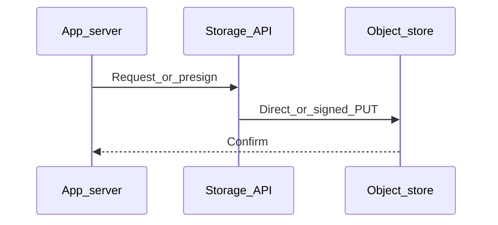

# Chapter 05 — Video Streaming

> "Serving a 1 GB MP4 as a single download is not streaming. True video streaming chunks the media and adapts quality to the viewer's bandwidth."

## Learning objectives

By the end of this chapter you will be able to:

- Distinguish progressive download from adaptive bitrate streaming.
- Explain how HLS and MPEG-DASH work (manifests, segments, renditions).
- Transcode a video into multiple renditions with `ffmpeg`.
- Design an upload-to-playback pipeline using S3 + a CDN.

## Prerequisites & recap

- [S3](03-aws-s3.md) — you can upload/download objects.
- [CDNs](07-cdns.md) (preview) — you understand edge caching basics.

## The simple version

When you stream a video on YouTube, your player isn't downloading one giant file. The video has been pre-cut into thousands of tiny clips (2–10 seconds each), at multiple quality levels. A "manifest" file lists all the clips. Your player reads the manifest, picks the quality that fits your current bandwidth, and downloads clips one by one. If your connection dips, it switches to a lower quality for the next clip. That's **adaptive bitrate streaming**.

The two dominant formats are HLS (Apple's, using `.m3u8` manifests) and MPEG-DASH (open standard, using `.mpd` manifests). Both work the same way — the details differ, the concept is identical.

## Visual flow

```
  Raw upload         Transcoder           Object Store         CDN          Player
      |                  |                     |                |              |
      |--- raw.mp4 ----->|                     |                |              |
      |                  |--- 360p/seg001.ts ->|                |              |
      |                  |--- 360p/seg002.ts ->|                |              |
      |                  |--- 720p/seg001.ts ->|                |              |
      |                  |--- 720p/seg002.ts ->|                |              |
      |                  |--- 1080p/seg*.ts -->|                |              |
      |                  |--- master.m3u8 ---->|                |              |
      |                  |                     |                |              |
      |                  |                     |<-- GET m3u8 ---|<-------------|
      |                  |                     |--- manifest -->|--- manifest->|
      |                  |                     |                |              |
      |                  |                     |<-- GET seg001 -|<-------------|
      |                  |                     |--- segment --->|--- segment ->|
      |                  |                     |                |  (720p)      |
      |                  |                     |                |              |
      |                  |                     |                | bandwidth    |
      |                  |                     |                | drops...     |
      |                  |                     |                |              |
      |                  |                     |<-- GET seg003 -|<-------------|
      |                  |                     |--- segment --->|--- segment ->|
      |                  |                     |                |  (360p)      |

  Caption: Upload once, transcode to multiple qualities, serve
  segments through a CDN. The player adapts quality per segment.
```

## System diagram (Mermaid)



*Typical control plane vs data plane when moving bytes to durable storage.*

## Concept deep-dive

### Progressive download vs. adaptive streaming

**Progressive download** is what happens when you serve a raw `.mp4`. The browser uses HTTP Range requests to fetch bytes and can start playing before the download finishes. But it can't adapt: if the connection is slow, it buffers. If the connection is fast, it wastes bandwidth on a quality the screen doesn't need.

**Adaptive bitrate streaming** solves this by splitting the video into short segments at multiple bitrates. The player monitors bandwidth and switches quality between segments — seamlessly, without rebuffering.

### HLS and MPEG-DASH

| Feature | HLS | MPEG-DASH |
|---|---|---|
| Creator | Apple | MPEG (open standard) |
| Manifest | `.m3u8` | `.mpd` (XML) |
| Segments | `.ts` or fragmented `.mp4` | `.mp4` (fragmented) |
| Native support | Safari, iOS | Chrome (via MSE) |
| Cross-browser | Via hls.js (Media Source Extensions) | Via dash.js |

Most platforms produce both. If you have to pick one, HLS has broader player support.

### HLS structure

```
master.m3u8               (master playlist)
  |
  +-- 360p.m3u8           (variant playlist)
  |     +-- 360p/seg001.ts
  |     +-- 360p/seg002.ts
  |     +-- ...
  |
  +-- 720p.m3u8
  |     +-- 720p/seg001.ts
  |     +-- ...
  |
  +-- 1080p.m3u8
        +-- 1080p/seg001.ts
        +-- ...
```

The master playlist tells the player which renditions exist and their bitrates. The player picks one and fetches the variant playlist, which lists the actual segment URLs.

### Transcoding with `ffmpeg`

```bash
ffmpeg -i input.mp4 \
  -filter:v:0 scale=-2:360  -c:v:0 libx264 -b:v:0 800k \
  -filter:v:1 scale=-2:720  -c:v:1 libx264 -b:v:1 2800k \
  -filter:v:2 scale=-2:1080 -c:v:2 libx264 -b:v:2 5000k \
  -c:a aac -b:a 128k \
  -f hls -hls_time 4 -hls_playlist_type vod \
  -master_pl_name master.m3u8 \
  -var_stream_map "v:0,a:0 v:1,a:0 v:2,a:0" \
  "v%v/prog.m3u8"
```

This produces three renditions (360p, 720p, 1080p) with 4-second segments and a master playlist. Every flag matters — segment duration, codec, and bitrate targets all affect playback quality and switching behavior.

### Where to run transcoding

Do **not** transcode on the request path — it's CPU-intensive and blocks your server. Options:

- **Background worker** — a dedicated process running `ffmpeg` via `child_process`. Simple; you manage the queue.
- **AWS Elastic Transcoder / MediaConvert** — managed service. Pay per minute of output.
- **Third-party services** — Mux, Cloudflare Stream, Bunny Stream. Upload raw video, get a playable URL back. Best for most teams.

For anything beyond a hobby project, use a hosted transcoder. The operational complexity of running ffmpeg at scale is not worth the savings.

### DRM and access control

- **Signed URLs / cookies** — short-lived access to segments. Free; prevents casual hotlinking.
- **AES-128 encryption** — baseline encryption for HLS. The key URL is in the manifest; you protect it with auth.
- **Widevine / FairPlay / PlayReady** — real DRM for premium content. Complex to implement; use a service like Shaka Player + a DRM provider.

### The upload-to-playback pipeline

1. Client uploads raw video to `s3://raw/` (via presigned URL).
2. An S3 event notification triggers a worker (via SQS, Lambda, or a polling job).
3. The worker downloads the raw file, runs `ffmpeg`, and uploads HLS output to `s3://stream/<id>/`.
4. The client plays via `https://cdn.example.com/stream/<id>/master.m3u8`.

### Live streaming

Live video input comes via RTMP or SRT to a hosted service (AWS IVS, Cloudflare Stream Live, Mux). The service transcodes in real-time and outputs HLS/DASH for viewers. You don't run ffmpeg for live — the latency and reliability requirements make managed services essential.

## Why these design choices

**Why 2–10 second segments instead of longer?** Shorter segments let the player adapt quality more frequently — better for variable network conditions. But shorter segments mean more HTTP requests and less compression efficiency (each segment restarts the codec). 4–6 seconds is the sweet spot for VOD.

**Why not just serve a single high-quality file?** A 1080p video is ~5 Mbps. If the viewer is on a 2 Mbps connection, the video buffers constantly. If they're on a phone screen, you're wasting bandwidth on pixels they can't see. Adaptive streaming gives every viewer the best experience for their connection and device.

**Why HLS over DASH?** HLS has broader native support (Safari, iOS) and hls.js covers everything else. DASH is technically superior in some ways (more flexible codec support), but the practical difference is small. If you need to pick one, HLS is the safer bet. If you use a hosted transcoder, you get both.

**When would you skip transcoding entirely?** For internal tools, dashboards, or small-audience apps where video size and bandwidth don't matter. Serve the raw MP4 and let progressive download handle it. Don't over-engineer.

## Production-quality code

### Playing HLS in a browser

```html
<video id="player" controls playsinline></video>

<script src="https://cdn.jsdelivr.net/npm/hls.js@1"></script>
<script>
  const video = document.getElementById("player");
  const src = "https://cdn.example.com/stream/abc/master.m3u8";

  if (video.canPlayType("application/vnd.apple.mpegurl")) {
    video.src = src;
  } else if (window.Hls && Hls.isSupported()) {
    const hls = new Hls({
      maxBufferLength: 30,
      maxMaxBufferLength: 60,
    });
    hls.loadSource(src);
    hls.attachMedia(video);
    hls.on(Hls.Events.ERROR, (_event, data) => {
      if (data.fatal) {
        if (data.type === Hls.ErrorTypes.NETWORK_ERROR) hls.startLoad();
        else if (data.type === Hls.ErrorTypes.MEDIA_ERROR) hls.recoverMediaError();
        else hls.destroy();
      }
    });
  } else {
    video.innerHTML = "Your browser does not support HLS playback.";
  }
</script>
```

### Transcode worker (Node.js)

```ts
import { execFile } from "node:child_process";
import { promisify } from "node:util";
import { S3Client, GetObjectCommand, PutObjectCommand } from "@aws-sdk/client-s3";
import { createWriteStream, createReadStream, mkdirSync, readdirSync, statSync } from "node:fs";
import { join } from "node:path";
import { pipeline } from "node:stream/promises";

const exec = promisify(execFile);
const s3 = new S3Client({ region: process.env.AWS_REGION ?? "us-east-1" });

async function transcodeJob(rawKey: string, outputPrefix: string): Promise<void> {
  const tmpDir = `/tmp/transcode-${Date.now()}`;
  mkdirSync(tmpDir, { recursive: true });

  const inputPath = join(tmpDir, "input.mp4");
  const res = await s3.send(new GetObjectCommand({
    Bucket: process.env.RAW_BUCKET!, Key: rawKey,
  }));
  await pipeline(res.Body as NodeJS.ReadableStream, createWriteStream(inputPath));

  await exec("ffmpeg", [
    "-i", inputPath,
    "-filter:v:0", "scale=-2:360", "-c:v:0", "libx264", "-b:v:0", "800k",
    "-filter:v:1", "scale=-2:720", "-c:v:1", "libx264", "-b:v:1", "2800k",
    "-c:a", "aac", "-b:a", "128k",
    "-f", "hls", "-hls_time", "4", "-hls_playlist_type", "vod",
    "-master_pl_name", "master.m3u8",
    "-var_stream_map", "v:0,a:0 v:1,a:0",
    join(tmpDir, "v%v/prog.m3u8"),
  ]);

  await uploadDirectory(tmpDir, process.env.STREAM_BUCKET!, outputPrefix);
}

async function uploadDirectory(dir: string, bucket: string, prefix: string): Promise<void> {
  for (const entry of readdirSync(dir, { recursive: true, withFileTypes: true })) {
    if (!entry.isFile()) continue;
    const fullPath = join(entry.parentPath ?? entry.path, entry.name);
    const key = `${prefix}/${fullPath.slice(dir.length + 1)}`;
    const contentType = key.endsWith(".m3u8") ? "application/vnd.apple.mpegurl"
      : key.endsWith(".ts") ? "video/mp2t" : "application/octet-stream";

    await s3.send(new PutObjectCommand({
      Bucket: bucket, Key: key,
      Body: createReadStream(fullPath),
      ContentType: contentType,
      CacheControl: key.endsWith(".m3u8")
        ? "public, max-age=5"
        : "public, max-age=31536000, immutable",
    }));
  }
}
```

## Security notes

- **Protect manifests with signed URLs or cookies.** If someone can fetch `master.m3u8`, they can download every segment. Sign the manifest URL; use signed cookies for the segment domain.
- **AES-128 key delivery must be authenticated.** If you serve the encryption key over plain HTTP without auth, the encryption is meaningless.
- **Don't trust `Content-Type` from uploads.** Verify the file is actually a video before queuing it for transcoding — a crafted file could exploit ffmpeg vulnerabilities.
- **Rate-limit upload endpoints.** Video files are large; unthrottled uploads can exhaust disk or memory.

## Performance notes

- **Segment duration vs. request count trade-off.** 4-second segments at 1080p produce ~1 MB per segment. A 2-hour movie = ~1,800 segments × renditions. CDN caching is critical.
- **Cache segments with long TTLs** (`max-age=31536000, immutable`) — they never change. Cache manifests with very short TTLs (5–30 seconds) for live streams, or moderate TTLs for VOD.
- **Transcoding cost** — AWS MediaConvert: ~$0.015/minute of output for basic H.264. A 10-minute video at 3 renditions = ~$0.45.
- **Codec choice matters.** H.264 has universal support. H.265 (HEVC) reduces bitrate by ~40% but has licensing complexity and limited browser support. AV1 is the future — royalty-free, ~30% better than HEVC — but encoding is slow.

## Common mistakes

| # | Symptom | Cause | Fix |
|---|---------|-------|-----|
| 1 | Video stalls or buffers constantly on mobile | Only one rendition (e.g., 1080p) — no lower-quality fallback | Always include at least a 360p rendition for low-bandwidth viewers |
| 2 | HLS playback fails in Chrome/Firefox | Browser doesn't support HLS natively and no hls.js loaded | Include hls.js and detect native support before loading |
| 3 | Segments fail to load with CORS error | CORS not configured on the S3 bucket or CDN for `.ts` and `.m3u8` files | Add CORS rules allowing your player's origin on the bucket and CDN |
| 4 | First few seconds of playback are black | `ffmpeg` not generating keyframes at segment boundaries | Use `-force_key_frames "expr:gte(t,n_forced*4)"` to align keyframes with segment boundaries |
| 5 | API becomes unresponsive during uploads | Transcoding runs in the HTTP request handler, blocking the event loop | Move transcoding to a background worker or external service |

## Practice

### Warm-up

Open a public HLS stream in Safari (or use hls.js in a browser). Observe the network tab to see individual `.ts` segment requests.

<details><summary>Show solution</summary>

Use Apple's test stream: `https://devstreaming-cdn.apple.com/videos/streaming/examples/img_bipbop_adv_example_ts/master.m3u8`. Open it in Safari or create an HTML page with hls.js as shown in the production code section. In DevTools > Network, filter by `.ts` to see segment requests.

</details>

### Standard

Transcode a sample MP4 into HLS with two renditions (360p and 720p) using `ffmpeg`.

<details><summary>Show solution</summary>

```bash
ffmpeg -i sample.mp4 \
  -filter:v:0 scale=-2:360 -c:v:0 libx264 -b:v:0 800k \
  -filter:v:1 scale=-2:720 -c:v:1 libx264 -b:v:1 2800k \
  -c:a aac -b:a 128k \
  -f hls -hls_time 4 -hls_playlist_type vod \
  -master_pl_name master.m3u8 \
  -var_stream_map "v:0,a:0 v:1,a:0" \
  "v%v/prog.m3u8"

ls v0/ v1/ master.m3u8
```

</details>

### Bug hunt

Your video stalls on mobile phones but plays fine on desktop. The master playlist has 720p and 1080p renditions. What's the likely issue?

<details><summary>Show solution</summary>

Both renditions require more bandwidth than a typical mobile connection provides. The player can't switch to a lower quality because none exists. Fix: add a 360p rendition (800 kbps) — it plays on almost any connection and lets the player adapt upward when bandwidth allows.

</details>

### Stretch

Upload HLS output to S3 and serve via CloudFront. Set appropriate `Cache-Control` headers: long TTL for `.ts` segments, short TTL for `.m3u8` manifests.

<details><summary>Show solution</summary>

```bash
aws s3 sync ./output s3://my-video-bucket/stream/abc/ \
  --content-type "video/mp2t" \
  --cache-control "public, max-age=31536000, immutable" \
  --exclude "*.m3u8"

aws s3 sync ./output s3://my-video-bucket/stream/abc/ \
  --content-type "application/vnd.apple.mpegurl" \
  --cache-control "public, max-age=5" \
  --include "*.m3u8" --exclude "*" 
```

Then create a CloudFront distribution pointing at the bucket with OAC.

</details>

### Stretch++

Protect HLS streams with signed CloudFront cookies so only authenticated users can watch.

<details><summary>Show solution</summary>

1. Create a CloudFront key pair (or use a trusted key group).
2. Configure a behavior for `/stream/*` to require signed cookies.
3. In your API, issue signed cookies on authentication:

```ts
import { getSignedCookies } from "@aws-sdk/cloudfront-signer";

app.get("/api/video-session", auth, async (req, res) => {
  const cookies = getSignedCookies({
    url: `https://cdn.example.com/stream/${req.params.videoId}/*`,
    keyPairId: process.env.CF_KEY_PAIR_ID!,
    privateKey: process.env.CF_PRIVATE_KEY!,
    dateLessThan: new Date(Date.now() + 4 * 3600 * 1000).toISOString(),
  });

  for (const [name, value] of Object.entries(cookies)) {
    res.cookie(name, value, { domain: ".example.com", secure: true, httpOnly: true });
  }
  res.json({ ok: true });
});
```

</details>

## In plain terms (newbie lane)
If `Video Streaming` feels abstract, think of it as a practical tool to make your backend work more predictable and easier to debug. Use this chapter to build one clear mental model first, then add details.

> **Newbies often think:** this topic is only theory and memorization.  
> **Actually:** it is a workflow aid that helps you make better decisions under real project pressure.


## Quiz

1. HLS segments are typically what duration?
   (a) 1 hour  (b) 2–10 seconds  (c) Milliseconds  (d) The whole file

2. What file extension does an HLS master playlist use?
   (a) `.mpd`  (b) `.m3u8`  (c) `.ts`  (d) `.mp4`

3. What manifest format does MPEG-DASH use?
   (a) `.m3u8`  (b) `.mpd`  (c) `.ts`  (d) `.mp4`

4. Where should video transcoding run?
   (a) In the HTTP request handler  (b) A background worker or hosted service  (c) In the browser  (d) At the CDN edge

5. How do browsers without native HLS support play HLS streams?
   (a) They can't  (b) Via Media Source Extensions (hls.js)  (c) Via Flash  (d) By downloading the entire file first

**Short answer:**

6. What is the difference between progressive download and adaptive streaming?
7. Why should you cache segments with a long TTL but the manifest with a short TTL?

*Answers: 1-b, 2-b, 3-b, 4-b, 5-b. 6 — Progressive download fetches one file sequentially and can't adapt quality to bandwidth. Adaptive streaming splits video into short segments at multiple bitrates and switches quality per segment based on current bandwidth. 7 — Segments are immutable (same content forever for a given video), so long TTLs are safe. Manifests may update (especially for live streams) and control which segments the player requests, so they need shorter TTLs to reflect changes.*

## Learn-by-doing mini-project

Full brief (goal, acceptance criteria, hints, stretch): [05-video-streaming — mini-project](mini-projects/05-video-streaming-project.md).

## Where this idea reappears

- **Same thread elsewhere:** trace how this chapter’s primitives show up in production systems — not only in this language or layer.
- **Cross-module links (read next when you feel stuck):**
  - [SQL metadata patterns](../11-sql/README.md) — storing pointers, not blobs.
  - [HTTP cache semantics](../10-http-clients/05-headers.md) — `Cache-Control` and friends behind CDN behavior.

  - [Concept threads (hub)](../appendix-threads/README.md) — state, errors, and performance reading trails.


## Chapter summary

- **Adaptive bitrate streaming** splits video into short segments at multiple quality levels — the player switches quality per segment based on bandwidth.
- **Transcode off the request path** — use a background worker or a hosted service like Mux or MediaConvert.
- **HLS (`.m3u8`) is the most broadly supported format** — use hls.js for browsers that don't support it natively.
- **Cache segments aggressively, manifests lightly** — segments are immutable, manifests are the control plane.

## Further reading

- Apple, *HTTP Live Streaming specification* — the HLS reference.
- MPEG-DASH Industry Forum — the DASH standard.
- hls.js GitHub repository — the most popular HLS player library.
- Next: [Security](06-security.md).
