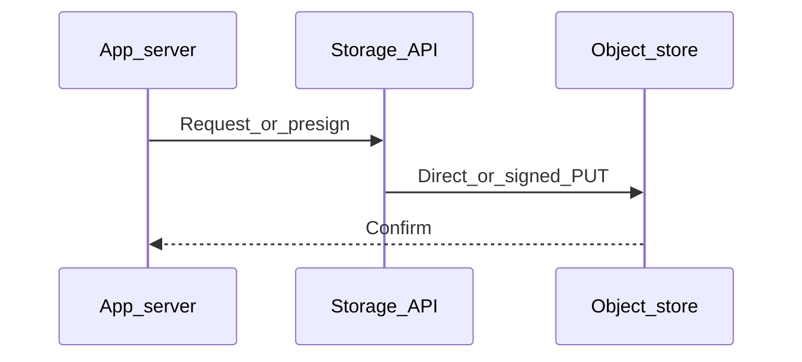

# Chapter 06 — Security

> "File storage leaks are boring, common, and expensive. Most could be prevented with five settings and a habit."

## Learning objectives

By the end of this chapter you will be able to:

- Lock down buckets by default using Block Public Access and bucket policies.
- Generate signed URLs and cookies for time-limited access.
- Enforce encryption at rest and in transit.
- Use IAM roles instead of long-lived access keys.
- Enable and audit access logs for incident investigation.

## Prerequisites & recap

- [S3](03-aws-s3.md) — you can work with buckets, objects, and presigned URLs.

## The simple version

The single most common cloud security incident is an accidentally public storage bucket. It happens because the default used to be permissive and teams forget to lock it down. The fix is simple in principle: default to private, grant access explicitly, use short-lived credentials, encrypt everything, and log every access. The hard part is making it a habit — doing it on every bucket, every deploy, every new service.

Think of bucket security like a building: the front door is locked (Block Public Access), visitors get temporary badges (signed URLs), employees use key cards that expire (IAM roles), and every entry is logged (access logs). You don't leave the door open and hope nobody walks in.

## Visual flow

```
  User/Browser              Your Server              AWS IAM / STS
       |                        |                         |
       |--- "I need the file" ->|                         |
       |                        |--- AssumeRole --------->|
       |                        |<-- temp credentials ----|
       |                        |                         |
       |                        |--- sign URL with temp creds
       |<-- signed URL (5 min) -|                         |
       |                        |                         |
       |--- GET signed URL -----|------------------> S3 (private bucket)
       |<-- file bytes ----------|<------------------ S3
       |                        |                         |
       |                   [access logged to CloudTrail]  |

  Caption: No long-lived keys. The server assumes a role,
  signs a short-lived URL, and the client talks to S3 directly.
```

## System diagram (Mermaid)



*Typical control plane vs data plane when moving bytes to durable storage.*

## Concept deep-dive

### Default to private

Every major cloud provider lets you block public access at the account level. Turn it on. Then grant public access explicitly — per object or via a CDN — only where needed.

**AWS specifics:**

- **Block Public Access (BPA)** — enable at both the account and bucket level. This prevents any policy or ACL from making objects public.
- **Object Ownership: Bucket owner enforced** — disables ACLs entirely. Simpler, harder to misconfigure.

### Signed URLs

Time-limited URLs signed with your credentials. They encode the expiry time and allowed operation (GET, PUT) into the URL itself:

```ts
const url = await getSignedUrl(s3,
  new GetObjectCommand({ Bucket: "my-bucket", Key: "private/report.pdf" }),
  { expiresIn: 60 }
);
```

Rules:

- Share only with the intended user (e.g., embed in a page they're authenticated to see).
- Expire quickly — 60 seconds for downloads, 300 seconds for uploads.
- Presigned URLs inherit the signer's permissions. If the IAM role can read the whole bucket, the URL can too — scope the role's policy.

### IAM roles, not long-lived keys

- **On EC2/ECS/Lambda:** attach an IAM role. The SDK picks up temporary credentials automatically. No secrets to manage.
- **On developer laptops:** `aws configure sso` or short-lived session credentials.
- **In CI (GitHub Actions):** OIDC federation to an IAM role — GitHub presents a JWT to STS, STS returns temporary credentials. No `AWS_ACCESS_KEY_ID` stored as a repo secret.

Leaked AWS access keys are the #1 cloud breach vector. Eliminate them wherever possible.

### Encryption

- **At rest:** S3 encrypts all objects by default (SSE-S3). Use SSE-KMS for customer-managed keys with automatic rotation and audit trails. Use SSE-C if you want to manage your own keys entirely.
- **In transit:** enforce HTTPS with a bucket policy:

```json
{
  "Effect": "Deny",
  "Principal": "*",
  "Action": "s3:*",
  "Resource": ["arn:aws:s3:::my-bucket", "arn:aws:s3:::my-bucket/*"],
  "Condition": { "Bool": { "aws:SecureTransport": "false" } }
}
```

### Least privilege

Give each application the narrowest IAM policy possible:

```json
{
  "Effect": "Allow",
  "Action": ["s3:GetObject", "s3:PutObject"],
  "Resource": "arn:aws:s3:::my-bucket/user-uploads/*"
}
```

Not `s3:*` on `*`. If a service only reads, don't grant write. If it only accesses one prefix, scope the resource ARN to that prefix.

### Access logs

Enable S3 server access logs or CloudTrail data events. These record every API call to the bucket: who, when, what key, from which IP. They're required for compliance audits and invaluable during security incidents.

### Versioning and MFA delete

For buckets holding critical data:

- **Versioning** retains every prior version of an object. Protects against accidental overwrites and deletes.
- **MFA delete** requires a second authentication factor to permanently delete versions. Protects against compromised credentials.

### Public-facing pattern

When you *do* need public access (a marketing site, public images):

1. Keep the bucket private.
2. Put CloudFront in front with **Origin Access Control (OAC)**.
3. The bucket policy allows only the CloudFront distribution to read.
4. CloudFront handles TLS, caching, and DDoS protection.

### Upload validation

When users upload files:

- **Enforce `Content-Type` on the presign.** Don't trust the browser's claim.
- **Limit file size** with presigned POST policies or by checking after upload with `HeadObject`.
- **Scan for malware** if the file will be served to other users.
- **Never execute uploaded content.** Treat all uploads as untrusted data.

## Why these design choices

**Why IAM roles over access keys?** Access keys are long-lived secrets that can be leaked, committed to git, or stolen from a compromised server. IAM roles issue temporary credentials (typically 1-hour expiry) that rotate automatically. There's nothing to leak. The trade-off: initial setup is more complex (trust policies, OIDC configuration), but the security benefit is enormous.

**Why Block Public Access at the account level?** A single misconfigured bucket policy or ACL can make objects public. Account-level BPA acts as a guardrail — even if someone writes a permissive policy, BPA blocks it. The trade-off: when you legitimately need a public bucket, you must explicitly disable BPA for that specific bucket, which forces a deliberate decision.

**Why encrypt at rest if S3 is already secure?** Defense in depth. SSE protects against physical media theft, insider threats, and cross-tenant vulnerabilities in the storage layer. SSE-KMS adds audit trails (every key use is logged in CloudTrail) and the ability to revoke access by disabling the key. The trade-off: SSE-KMS adds ~$1/month per key and per-request charges for key operations.

**When would you skip signed URLs?** For truly public content (open-source release artifacts, public datasets). Even then, serve through a CDN rather than making the bucket public — you get DDoS protection and caching for free.

## Production-quality code

### Bucket policy: deny non-TLS + allow only CloudFront

```json
{
  "Version": "2012-10-17",
  "Statement": [
    {
      "Sid": "DenyInsecureTransport",
      "Effect": "Deny",
      "Principal": "*",
      "Action": "s3:*",
      "Resource": [
        "arn:aws:s3:::my-bucket",
        "arn:aws:s3:::my-bucket/*"
      ],
      "Condition": {
        "Bool": { "aws:SecureTransport": "false" }
      }
    },
    {
      "Sid": "AllowCloudFrontOAC",
      "Effect": "Allow",
      "Principal": {
        "Service": "cloudfront.amazonaws.com"
      },
      "Action": "s3:GetObject",
      "Resource": "arn:aws:s3:::my-bucket/*",
      "Condition": {
        "StringEquals": {
          "AWS:SourceArn": "arn:aws:cloudfront::123456789012:distribution/EDFDVBD6EXAMPLE"
        }
      }
    }
  ]
}
```

### Least-privilege IAM policy for an upload service

```json
{
  "Version": "2012-10-17",
  "Statement": [
    {
      "Effect": "Allow",
      "Action": [
        "s3:PutObject",
        "s3:GetObject",
        "s3:HeadObject"
      ],
      "Resource": "arn:aws:s3:::my-bucket/user-uploads/*"
    },
    {
      "Effect": "Deny",
      "Action": [
        "s3:DeleteObject",
        "s3:PutBucketPolicy",
        "s3:PutBucketAcl"
      ],
      "Resource": [
        "arn:aws:s3:::my-bucket",
        "arn:aws:s3:::my-bucket/*"
      ]
    }
  ]
}
```

### GitHub Actions OIDC workflow (no stored secrets)

```yaml
permissions:
  id-token: write
  contents: read

jobs:
  deploy:
    runs-on: ubuntu-latest
    steps:
      - uses: aws-actions/configure-aws-credentials@v4
        with:
          role-to-assume: arn:aws:iam::123456789012:role/github-deploy
          aws-region: us-east-1

      - run: aws s3 sync ./dist s3://my-site --delete
```

## Security notes

This is the security chapter — the entire deep-dive covers security. Here's a summary checklist:

- **Block Public Access** — on at account + bucket level.
- **HTTPS-only** — bucket policy denies `aws:SecureTransport: false`.
- **IAM roles** — no long-lived keys in CI or production.
- **Signed URLs** — short expiry, scoped to specific keys.
- **Encryption** — SSE-S3 minimum; SSE-KMS for regulated data.
- **Versioning** — on for critical data; MFA delete for high-value buckets.
- **Access logs** — enabled and shipped to a separate, locked-down bucket.
- **Upload validation** — enforce type, size, and scan for malware.

## Performance notes

N/A — this chapter focuses on security controls. Security measures like encryption (SSE-S3, SSE-KMS) add negligible latency (<1 ms per operation). Signed URL generation is a local computation (~0.5 ms). The only performance-relevant decision is choosing between SSE-S3 (free, no per-request overhead) and SSE-KMS (per-request charges for key operations under very high throughput).

## Common mistakes

| # | Symptom | Cause | Fix |
|---|---------|-------|-----|
| 1 | Sensitive data exposed publicly | Bucket is public (BPA disabled or ACLs grant public-read) | Enable Block Public Access at account + bucket level; audit with AWS Config |
| 2 | AWS credentials appear in a git commit | Access keys hardcoded or `.env` committed | Use IAM roles; add `.env` to `.gitignore`; rotate leaked keys immediately with `aws iam delete-access-key` |
| 3 | CI pipeline breaks after key rotation | Long-lived access keys stored as GitHub secrets | Switch to OIDC federation — no secrets to rotate |
| 4 | Audit asks "who accessed this file" — no answer | Access logging not enabled | Enable S3 server access logs or CloudTrail data events; store logs in a separate account |
| 5 | User deletes critical objects and there's no recovery | Versioning disabled; no backups | Enable versioning; consider MFA delete; test restore procedures |
| 6 | Presigned URL shared on social media lets anyone download | URL expiry too long or URL reused | Set `expiresIn` to 60 seconds; generate a new URL per authenticated request |

## Practice

### Warm-up

Enable Block Public Access on a test bucket using the AWS CLI.

<details><summary>Show solution</summary>

```bash
aws s3api put-public-access-block \
  --bucket my-test-bucket \
  --public-access-block-configuration \
    BlockPublicAcls=true,IgnorePublicAcls=true,BlockPublicPolicy=true,RestrictPublicBuckets=true
```

</details>

### Standard

Write a bucket policy that denies all non-TLS access.

<details><summary>Show solution</summary>

```bash
aws s3api put-bucket-policy --bucket my-test-bucket --policy '{
  "Version": "2012-10-17",
  "Statement": [{
    "Sid": "DenyHTTP",
    "Effect": "Deny",
    "Principal": "*",
    "Action": "s3:*",
    "Resource": ["arn:aws:s3:::my-test-bucket", "arn:aws:s3:::my-test-bucket/*"],
    "Condition": { "Bool": { "aws:SecureTransport": "false" } }
  }]
}'
```

</details>

### Bug hunt

A new S3 bucket has Block Public Access enabled, but objects are still accessible publicly. What could be wrong?

<details><summary>Show solution</summary>

Check the **account-level** BPA settings — bucket-level BPA only affects that bucket, but a permissive account-level setting can still allow public access if the bucket policy was created before BPA was enabled. Also check if a CloudFront distribution with OAC is serving the content (which is intentional and correct). Finally, verify no IAM policy grants `s3:GetObject` to `Principal: "*"` — BPA blocks ACL-based public access but doesn't override explicit IAM policies (it does block bucket policies that grant public access, but cross-account IAM policies can bypass this in specific configurations).

</details>

### Stretch

Set up OIDC federation for GitHub Actions to deploy to S3 without any stored secrets.

<details><summary>Show solution</summary>

1. Create an OIDC identity provider in IAM:
```bash
aws iam create-open-id-connect-provider \
  --url https://token.actions.githubusercontent.com \
  --client-id-list sts.amazonaws.com \
  --thumbprint-list 6938fd4d98bab03faadb97b34396831e3780aea1
```

2. Create an IAM role with a trust policy:
```json
{
  "Version": "2012-10-17",
  "Statement": [{
    "Effect": "Allow",
    "Principal": { "Federated": "arn:aws:iam::123456789012:oidc-provider/token.actions.githubusercontent.com" },
    "Action": "sts:AssumeRoleWithWebIdentity",
    "Condition": {
      "StringEquals": { "token.actions.githubusercontent.com:aud": "sts.amazonaws.com" },
      "StringLike": { "token.actions.githubusercontent.com:sub": "repo:you/your-repo:*" }
    }
  }]
}
```

3. Attach an S3 policy to the role. Use the role ARN in GitHub Actions with `aws-actions/configure-aws-credentials@v4`.

</details>

### Stretch++

Enable versioning on a bucket and write a script that restores a previous version of a deleted object.

<details><summary>Show solution</summary>

```bash
aws s3api put-bucket-versioning --bucket my-bucket --versioning-configuration Status=Enabled

aws s3api list-object-versions --bucket my-bucket --prefix "important/report.pdf" \
  --query 'Versions[?IsLatest!=`true`].[VersionId,LastModified]' --output table

aws s3api copy-object \
  --bucket my-bucket \
  --copy-source "my-bucket/important/report.pdf?versionId=OLD_VERSION_ID" \
  --key "important/report.pdf"
```

</details>

## In plain terms (newbie lane)
If `Security` feels abstract, think of it as a practical tool to make your backend work more predictable and easier to debug. Use this chapter to build one clear mental model first, then add details.

> **Newbies often think:** this topic is only theory and memorization.  
> **Actually:** it is a workflow aid that helps you make better decisions under real project pressure.


## Quiz

1. What should the default access level for an S3 bucket be?
   (a) Public read  (b) Private  (c) Public read-write  (d) Not applicable

2. How should production services get AWS credentials?
   (a) Hardcoded environment variables  (b) IAM roles or OIDC federation  (c) SMS  (d) Cookies

3. What does SSE-KMS provide over SSE-S3?
   (a) No benefit  (b) Customer-managed key rotation and CloudTrail audit  (c) Only slower performance  (d) It's deprecated

4. Bucket versioning primarily protects against:
   (a) DDoS attacks  (b) Accidental deletion or overwrite  (c) Cross-region failure  (d) Nothing useful

5. The recommended way to serve S3 content publicly is:
   (a) Make the bucket public  (b) CloudFront with OAC, bucket stays private  (c) Disable TLS  (d) It's impossible

**Short answer:**

6. Why are signed URLs better than making a bucket public for user-specific content?
7. Explain least privilege in one sentence.

*Answers: 1-b, 2-b, 3-b, 4-b, 5-b. 6 — Signed URLs grant time-limited access to specific objects for specific users, while a public bucket exposes everything to everyone forever. 7 — Grant each service only the minimum permissions it needs to function — nothing more.*

## Learn-by-doing mini-project

Full brief (goal, acceptance criteria, hints, stretch): [06-security — mini-project](mini-projects/06-security-project.md).

## Where this idea reappears

- **Same thread elsewhere:** trace how this chapter’s primitives show up in production systems — not only in this language or layer.
- **Cross-module links (read next when you feel stuck):**
  - [SQL metadata patterns](../11-sql/README.md) — storing pointers, not blobs.
  - [HTTP cache semantics](../10-http-clients/05-headers.md) — `Cache-Control` and friends behind CDN behavior.

  - [Concept threads (hub)](../appendix-threads/README.md) — state, errors, and performance reading trails.


## Chapter summary

- **Private by default** — enable Block Public Access at the account and bucket level; serve public content through CloudFront with OAC.
- **Short-lived credentials everywhere** — IAM roles on servers, OIDC in CI, signed URLs for clients.
- **Encrypt, version, and log** — SSE at rest, HTTPS in transit, versioning for recoverability, access logs for auditability.
- **Least privilege as a habit** — scope every IAM policy to the specific actions and resources the service actually needs.

## Further reading

- AWS, *Security best practices for Amazon S3* — the official hardening guide.
- AWS, *IAM best practices* — credential management.
- OWASP, *Cloud Security Cheat Sheet* — cross-provider guidance.
- Next: [CDNs](07-cdns.md).
