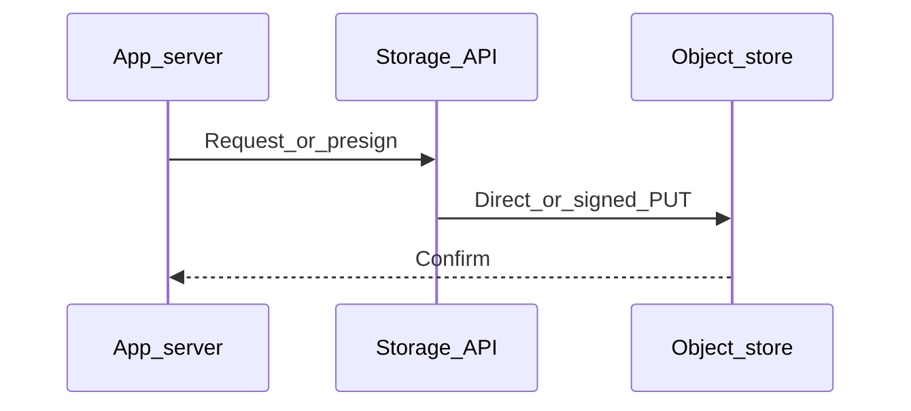

# Chapter 07 — CDNs

> "A CDN is a distributed cache at the edge of the internet. Put one in front of anything public and your site gets faster, cheaper, and more resilient."

## Learning objectives

By the end of this chapter you will be able to:

- Explain what a CDN does and why it matters for latency, cost, and resilience.
- Point a CDN (CloudFront) at an S3 bucket with Origin Access Control.
- Choose between versioned-URL invalidation and explicit cache purging.
- Use CDN cache behaviors to apply different policies per path pattern.
- Describe edge compute and when it's worth using.

## Prerequisites & recap

- [Caching](02-caching.md) — you understand `Cache-Control`, ETags, and invalidation.
- [S3](03-aws-s3.md) — you can work with buckets and objects.

## The simple version

Without a CDN, every request from a user in Tokyo travels all the way to your server in Virginia, picks up the file, and travels back. That's ~200 ms of network latency — before your server even does any work. A CDN places copies of your content on servers (called "Points of Presence" or POPs) all over the world. When the user in Tokyo requests your file, the nearest POP serves it in ~20 ms. Your origin server isn't involved at all.

A CDN is three things in one: a globally distributed cache, a TLS termination point, and a DDoS shield. For static assets, it's a no-brainer. For dynamic content, it takes more thought — but even short-TTL caching at the edge can dramatically reduce origin load.

## Visual flow

```
  User (Tokyo)       CDN POP (Tokyo)        Origin (us-east-1)
       |                   |                       |
       |--- GET /app.js -->|                       |
       |                   |--- (cache miss) ----->|
       |                   |<-- 200 + app.js ------|
       |                   |  [caches locally]     |
       |<-- 200 (25 ms) ---|                       |
       |                   |                       |
  User (Osaka)             |                       |
       |--- GET /app.js -->|                       |
       |<-- 200 (cache hit, 15 ms)                 |
       |                   |  (origin not called)  |
       |                   |                       |
  User (Tokyo)             |                       |
       |--- GET /api/me -->|                       |
       |                   |--- (no-store, pass) ->|
       |                   |<-- 200 + private -----|
       |<-- 200 (215 ms) --|  (not cached)         |

  Caption: Static assets hit the edge cache. Private API
  calls pass through to origin. Each path can have its own policy.
```

## System diagram (Mermaid)



*Typical control plane vs data plane when moving bytes to durable storage.*

## Concept deep-dive

### What a CDN does

A CDN provides five core benefits:

1. **Latency reduction** — content served from a POP near the user, not from your origin across the planet.
2. **Origin offloading** — cache hits never reach your server. High-traffic sites may see 95%+ cache hit rates.
3. **Bandwidth savings** — egress from S3 to CloudFront is free; egress from CloudFront to users is cheaper than direct S3 egress.
4. **TLS termination** — the CDN terminates TLS at the edge, so the user's TLS handshake completes in one round trip to the nearest POP.
5. **DDoS protection and WAF** — CDNs absorb volumetric attacks and can apply web application firewall rules at the edge.

### Major providers

| Provider | Strengths |
|---|---|
| **CloudFront** (AWS) | Tight S3/Lambda integration, Lambda@Edge, global network |
| **Cloudflare** | Widest network (~300 POPs), excellent WAF, Workers, free tier |
| **Fastly** | Highly programmable (Compute@Edge), instant purge, VCL |
| **Bunny CDN** | Cheap, simple, good performance |
| **KeyCDN** | Pay-as-you-go, straightforward |

### CloudFront + S3: the standard static pattern

1. **Private S3 bucket** — Block Public Access enabled.
2. **CloudFront distribution** with **Origin Access Control (OAC)** — the bucket policy allows only CloudFront's service principal to read.
3. **Custom domain** with an ACM certificate (free, auto-renewing).
4. **Cache behaviors** per path:
   - `/assets/*` → `Cache-Control: public, max-age=31536000, immutable` (versioned filenames).
   - `/index.html` → short TTL (e.g., 60 seconds) or `no-cache` with revalidation.
   - `/api/*` → pass-through to API origin, `Cache-Control: no-store`.

### Cache behaviors

Behaviors let you apply different caching policies to different URL patterns on the same distribution:

| Path | Origin | TTL | Why |
|---|---|---|---|
| `/assets/*` | S3 | 1 year, immutable | Fingerprinted filenames never change |
| `/index.html` | S3 | 60 seconds | Must reflect latest deploy quickly |
| `/api/*` | API server | No cache | Dynamic, user-specific |
| `/images/*` | S3 | 1 day | Infrequently updated, tolerate staleness |

### Cache keys

The cache key determines what constitutes "the same request." By default: method + URL. You can extend it to include:

- **Query strings** — whitelist specific params (e.g., `?v=2`) or ignore all.
- **Headers** — via `Vary`. `Vary: Accept-Encoding` caches gzip and brotli separately.
- **Cookies** — generally avoid; every unique cookie set creates a separate cache entry.

### Invalidation

Two approaches:

- **Versioned URLs** (preferred) — `app.abc123.js`. Deploy produces a new filename; old caches serve old URLs (harmlessly). No invalidation needed.
- **Explicit purge** — `aws cloudfront create-invalidation --paths "/index.html"`. Takes seconds to minutes to propagate. The first 1,000 paths/month are free; after that, $0.005 each.

Use versioned URLs for everything you can. Reserve purging for unversionable resources like `index.html`.

### Edge compute

Run JavaScript or WebAssembly at every POP:

- **CloudFront Functions** — lightweight, <1 ms, for header manipulation, URL rewrites, simple auth checks.
- **Lambda@Edge** — full Lambda, up to 30 seconds, for more complex logic (A/B testing, auth, SSR).
- **Cloudflare Workers** — V8 isolates, full JavaScript, generous free tier.

Edge compute keeps your origin stateless and cheap. An auth check at the edge is 5 ms; a round trip to your origin is 200 ms.

### Dynamic content at the edge

CDNs aren't just for static files. You can cache dynamic responses with care:

- **Short TTLs** (5 seconds–5 minutes) for semi-dynamic content like product listings.
- **`stale-while-revalidate`** for smooth updates — serve the cached version immediately while refreshing in the background.
- **`Vary` on relevant headers** — `Accept-Language` for localized content, but be careful with `Cookie` (effectively disables shared caching).

### Observability

CDNs emit access logs with cache status (`Hit`, `Miss`, `Error`), response time, client IP, and more. Ship them to your log system for:

- Monitoring cache hit ratio (target: >90% for static sites).
- Debugging "why is this request hitting origin?"
- Detecting abuse patterns.

## Why these design choices

**Why OAC instead of making the bucket public?** A public bucket means anyone with the URL can bypass the CDN and download directly from S3 — you lose caching benefits, pay full S3 egress, and have no DDoS protection. OAC ensures the only path to your content is through CloudFront.

**Why versioned URLs over cache purging?** Purging is an active operation you have to trigger, wait for, and verify across hundreds of POPs. It's inherently slow and error-prone. Versioned URLs make invalidation a non-problem — the old URL is still valid (serving old content to anyone who has it cached), and the new URL is a cache miss that populates naturally. The trade-off: your HTML must reference the new asset URL, so you need a build step that fingerprints filenames.

**When would you skip a CDN?** Internal-only APIs that serve a small team in one region. A CDN adds complexity (CORS, cache behavior configuration, invalidation) that isn't worth it if your users are all in the same building as your server. But for any public-facing traffic, even low-volume, a CDN's free tier is almost always worth it.

**Why Cloudflare over CloudFront (or vice versa)?** CloudFront integrates tightly with AWS — OAC, Lambda@Edge, ACM. If your stack is AWS, it's the natural choice. Cloudflare has a wider network, better free tier, and Workers are more developer-friendly. If you use R2, Cloudflare's CDN integration is seamless. Pick based on your existing infrastructure.

## Production-quality code

### CloudFront distribution configuration (Terraform-style pseudo-config)

```
Resource: CloudFront Distribution
  Origins:
    - S3 bucket (my-bucket.s3.us-east-1.amazonaws.com)
      Access: OAC (CloudFront signs requests to S3)

  Default cache behavior:
    Path: /*
    Cache policy: CachingOptimized
    Viewer protocol: redirect-to-https

  Additional behaviors:
    - Path: /api/*
      Origin: api.example.com
      Cache policy: CachingDisabled
      Origin request policy: AllViewer

    - Path: /assets/*
      Origin: S3
      Cache policy: CachingOptimized (max-age=1year)
      Compress: true

  Domain: www.example.com
  Certificate: ACM cert in us-east-1
  HTTP version: HTTP/2 + HTTP/3
  Price class: PriceClass_100 (US, EU, Asia)
```

### Deploy script with invalidation

```bash
#!/usr/bin/env bash
set -euo pipefail

BUCKET="my-site-bucket"
DIST_ID="EDFDVBD6EXAMPLE"

aws s3 sync ./dist/assets "s3://$BUCKET/assets/" \
  --cache-control "public, max-age=31536000, immutable" \
  --delete

aws s3 cp ./dist/index.html "s3://$BUCKET/index.html" \
  --cache-control "public, max-age=60, stale-while-revalidate=300"

aws cloudfront create-invalidation \
  --distribution-id "$DIST_ID" \
  --paths "/index.html" "/favicon.ico"

echo "Deployed. Invalidation submitted for index.html."
```

### Cloudflare Worker: redirect old URLs

```js
export default {
  async fetch(request) {
    const url = new URL(request.url);

    if (url.pathname.startsWith("/old-blog/")) {
      const newPath = url.pathname.replace("/old-blog/", "/blog/");
      return Response.redirect(`https://example.com${newPath}`, 301);
    }

    return fetch(request);
  },
};
```

## Security notes

- **OAC prevents direct S3 access.** Without it, users could bypass the CDN's WAF and rate limiting by hitting S3 directly.
- **Enforce HTTPS** — configure the CDN to redirect HTTP to HTTPS. The origin connection should also be HTTPS.
- **Restrict origins in CORS.** If your CDN serves APIs, ensure `Access-Control-Allow-Origin` is specific, not `*`.
- **WAF rules** — CloudFront and Cloudflare both offer managed WAF rulesets (OWASP top 10, bot management). Enable them for dynamic origins.
- **Signed URLs/cookies for private content** — use CloudFront signed URLs for per-resource access or signed cookies for per-session access across a path.

## Performance notes

- **Cache hit ratio is the key metric.** Aim for >90% on static sites. Below 80%, something is misconfigured (overly broad `Vary`, short TTLs on static content, cache key including unnecessary query params).
- **Brotli compression** — CloudFront and Cloudflare compress on the fly. Brotli saves ~15–20% over gzip for text assets.
- **HTTP/3 (QUIC)** — reduces connection setup time and handles packet loss better than HTTP/2. Enable it if your CDN supports it.
- **Stale-while-revalidate** — eliminates the "cache miss penalty" for frequently accessed content. The first request after TTL expiry is served from stale cache while the CDN fetches fresh content in the background.
- **Cold-start POPs** — a rarely-accessed POP may not have your content cached. Consider "origin shield" (an intermediate cache layer between POPs and origin) to reduce origin hits.

## Common mistakes

| # | Symptom | Cause | Fix |
|---|---------|-------|-----|
| 1 | Stale content after deploy | Long `max-age` on `index.html` | Use short TTL on HTML; long TTL only on fingerprinted assets |
| 2 | One user sees another's data | `Cache-Control: public` on user-specific endpoints without proper `Vary` | Use `private` or `no-store` for per-user responses; scope `Vary` correctly |
| 3 | CDN returns errors; origin is healthy | OAC misconfigured — CloudFront can't authenticate to S3 | Verify bucket policy allows CloudFront's service principal with the distribution ARN |
| 4 | Cache hit ratio is <50% | Unnecessary query strings or cookies in cache key | Whitelist only necessary query params; strip cookies from static-asset behaviors |
| 5 | High CloudFront bill despite good cache ratio | Price class includes expensive regions, or transfer to origin is high | Choose an appropriate price class; enable origin shield to reduce origin fetches |

## Practice

### Warm-up

Run `curl -I https://some-cdn-site.com/style.css` and identify the CDN-related headers: `X-Cache`, `Age`, `Cache-Control`, `CF-Cache-Status` (Cloudflare).

<details><summary>Show solution</summary>

```bash
curl -I https://cdn.jsdelivr.net/npm/hls.js@1/dist/hls.min.js
```

Look for:
- `Cache-Control: public, max-age=...` — how long to cache.
- `X-Cache: Hit from cloudfront` or `CF-Cache-Status: HIT` — cache status.
- `Age: 12345` — seconds since the edge cached this response.

</details>

### Standard

Set up a CloudFront distribution in front of an S3 bucket hosting a static site. Use OAC.

<details><summary>Show solution</summary>

1. Create a private S3 bucket.
2. Upload `index.html` and `assets/` to it.
3. In CloudFront, create a distribution with the S3 bucket as origin and OAC enabled.
4. Copy the generated bucket policy from CloudFront and apply it to the S3 bucket.
5. Set the default root object to `index.html`.
6. Test with the CloudFront domain: `https://d1234567890.cloudfront.net/`.

</details>

### Bug hunt

You deploy a new version of your app. Static assets have versioned filenames, but users still see the old `index.html`. What's happening?

<details><summary>Show solution</summary>

`index.html` has a long `Cache-Control: max-age` and isn't fingerprinted — the CDN serves the cached old version. Fix: set a short TTL on `index.html` (e.g., `max-age=60`) and submit a CloudFront invalidation for `/index.html` after each deploy. The fingerprinted assets don't need invalidation.

</details>

### Stretch

Add a Cloudflare Worker (or CloudFront Function) that rewrites a response header at the edge — e.g., add `X-Robots-Tag: noindex` for staging environments.

<details><summary>Show solution</summary>

Cloudflare Worker:
```js
export default {
  async fetch(request) {
    const response = await fetch(request);
    const headers = new Headers(response.headers);
    headers.set("X-Robots-Tag", "noindex, nofollow");
    return new Response(response.body, { ...response, headers });
  },
};
```

CloudFront Function (viewer response):
```js
function handler(event) {
  var response = event.response;
  response.headers["x-robots-tag"] = { value: "noindex, nofollow" };
  return response;
}
```

</details>

### Stretch++

Design a zero-downtime deploy strategy for a static site: versioned assets with long TTLs + short-TTL index.html + invalidation on deploy.

<details><summary>Show solution</summary>

1. Build step produces `assets/app.<hash>.js`, `assets/style.<hash>.css`.
2. `index.html` references the new hashed filenames.
3. Deploy script:
   - Upload new assets to S3 (old assets remain — they're still cached).
   - Upload new `index.html` to S3.
   - Invalidate `/index.html` in CloudFront.
4. Users who already loaded the old `index.html` continue fetching old assets (still available).
5. New page loads get the new `index.html` and the new assets.
6. After a retention period (e.g., 7 days), clean up old assets from S3.

No user ever sees a broken page — old and new versions coexist.

</details>

## In plain terms (newbie lane)
If `Cdns` feels abstract, think of it as a practical tool to make your backend work more predictable and easier to debug. Use this chapter to build one clear mental model first, then add details.

> **Newbies often think:** this topic is only theory and memorization.  
> **Actually:** it is a workflow aid that helps you make better decisions under real project pressure.


## Quiz

1. What are the primary benefits of a CDN?
   (a) Only bandwidth savings  (b) Latency reduction, bandwidth savings, TLS termination, and DDoS protection  (c) Analytics only  (d) Slower origin

2. How does CDN cache invalidation work?
   (a) Instantaneous and free  (b) Propagates across POPs over seconds–minutes; costs money at scale  (c) Replaces the need for versioned URLs  (d) Only works for images

3. What does OAC (Origin Access Control) do?
   (a) Requires the bucket to be public  (b) Lets CloudFront read from a private bucket  (c) It's deprecated  (d) It's not an AWS feature

4. How do cache behaviors help?
   (a) Same caching policy for all paths  (b) Different TTL and cache policies per URL pattern  (c) Impossible to configure  (d) Only available on Cloudflare

5. Where does edge compute run?
   (a) On your origin server  (b) At every CDN POP, close to users  (c) Replaces the database  (d) Only for pre-rendered pages

**Short answer:**

6. Why are versioned URLs better than explicit cache invalidation?
7. Give one reason to cache dynamic API responses at the edge.

*Answers: 1-b, 2-b, 3-b, 4-b, 5-b. 6 — Versioned URLs make invalidation unnecessary: new content gets a new URL (cache miss), old content stays valid at the old URL. No purging, no propagation delay, no cost. 7 — Reduces origin load and latency for semi-dynamic content (e.g., product listings, public feeds) that doesn't change every request — even a 5-second TTL at the edge can absorb traffic spikes.*

## Learn-by-doing mini-project

Full brief (goal, acceptance criteria, hints, stretch): [07-cdns — mini-project](mini-projects/07-cdns-project.md).

## Where this idea reappears

- **Same thread elsewhere:** trace how this chapter’s primitives show up in production systems — not only in this language or layer.
- **Cross-module links (read next when you feel stuck):**
  - [SQL metadata patterns](../11-sql/README.md) — storing pointers, not blobs.
  - [HTTP cache semantics](../10-http-clients/05-headers.md) — `Cache-Control` and friends behind CDN behavior.

  - [Concept threads (hub)](../appendix-threads/README.md) — state, errors, and performance reading trails.


## Chapter summary

- **A CDN is an edge cache + TLS termination + DDoS shield** — put one in front of anything public-facing.
- **Versioned URLs beat cache invalidation** — new content gets a new URL; no purging required.
- **Cache behaviors let you tune per path** — long TTLs on immutable assets, short TTLs on HTML, no cache on APIs.
- **Edge compute runs logic at the POP** — auth checks, redirects, and header manipulation without a round trip to origin.

## Further reading

- Cloudflare Learning Center, *What is a CDN?* — excellent visual explainer.
- AWS, *Amazon CloudFront Developer Guide* — the reference for CloudFront.
- web.dev, *Content delivery networks (CDNs)* — Google's practical guide.
- Next: [Resiliency](08-resiliency.md).
