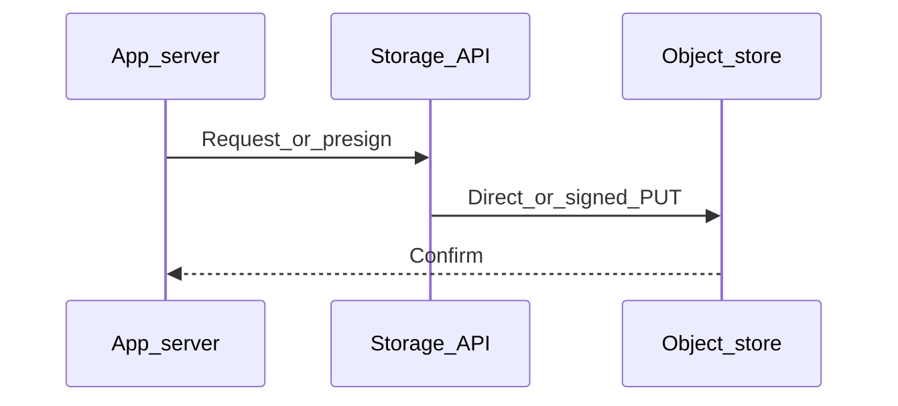

# Chapter 08 — Resiliency

> "A resilient system stays useful when components fail. It's not about never failing — it's about failing *gracefully*, *loudly*, and *recoverably*."

## Learning objectives

By the end of this chapter you will be able to:

- Apply redundancy across availability zones and regions.
- Design graceful degradation so partial failures don't become total outages.
- Implement retries with exponential backoff and jitter, circuit breakers, and timeouts.
- Plan backups and disaster recovery with defined RPO and RTO targets.
- Explain SLIs, SLOs, and SLAs and how they drive engineering decisions.

## Prerequisites & recap

- [CDNs](07-cdns.md) — you understand edge caching and origin offloading.
- [HTTP errors](../10-http-clients/04-errors.md) — you handle error responses.

## The simple version

Every system fails eventually — a database goes down, a network partition happens, a dependency gets overloaded. Resilience isn't about preventing failure; it's about limiting its blast radius. You set timeouts so a slow dependency doesn't stall everything. You retry with backoff so transient errors heal themselves. You use circuit breakers so a failing dependency gets a chance to recover instead of being hammered. And you always have a plan B: a degraded response that's better than a 500 error.

Think of it like building a house in earthquake country. You don't prevent earthquakes — you build with flexible joints, reinforce load-bearing walls, and keep emergency supplies. The house sways but doesn't collapse.

## Visual flow

```
  Client            App Server           Dependency
    |                   |                    |
    |--- request ------>|                    |
    |                   |--- call (2s TO) -->|
    |                   |                    X (timeout)
    |                   |--- retry #1 ------>|
    |                   |                    X (timeout)
    |                   |--- retry #2 ------>|
    |                   |                    X (timeout)
    |                   |                    |
    |                   | [circuit OPENS]    |
    |                   |                    |
    |<-- degraded 200 --|  (cached/fallback) |
    |                   |                    |
    |--- next request ->|                    |
    |                   | [circuit open:     |
    |                   |  fast-fail]        |
    |<-- degraded 200 --|                    |
    |                   |                    |
    |         ... 30s cooldown ...           |
    |                   |                    |
    |--- request ------>|                    |
    |                   |--- half-open try ->|
    |                   |<-- 200 OK ---------|
    |                   | [circuit CLOSES]   |
    |<-- full 200 ------|                    |

  Caption: Timeout → retry with backoff → circuit opens →
  serve degraded → cooldown → half-open probe → recover.
```

## System diagram (Mermaid)



*Typical control plane vs data plane when moving bytes to durable storage.*

## Concept deep-dive

### Availability math

If a single dependency is 99% available and you chain N of them in series, your overall availability is `0.99^N`:

| Dependencies | Availability | Downtime/year |
|---|---|---|
| 1 | 99% | 3.65 days |
| 2 | 98% | 7.3 days |
| 3 | 97% | 11 days |
| 5 | 95% | 18.25 days |

Every additional serial dependency multiplies your failure surface. Redundancy, timeouts, and fallbacks are how you fight the math.

### SLOs, SLIs, and SLAs

- **SLI (Service Level Indicator)** — a measurement. Example: p99 latency, error rate, availability percentage.
- **SLO (Service Level Objective)** — an internal target. Example: "p99 latency < 200 ms, 99.9% of the time."
- **SLA (Service Level Agreement)** — a contractual commitment with penalties. Example: "99.95% uptime or we credit you."

SLOs should be achievable but ambitious. Don't claim "five nines" (99.999%) — that's 5 minutes of downtime per year and requires extraordinary engineering.

### Redundancy

- **Multi-AZ** — deploy in ≥2 availability zones within a region. A load balancer distributes traffic. If one AZ goes down, the other serves all traffic. S3 Standard already stores across 3+ AZs.
- **Multi-region** — failover to a different region during a complete region outage. Cost and complexity rise sharply: you need data replication, DNS-based failover, and testing.
- **Database** — primary + read replicas. Promote a replica to primary on failover. Use point-in-time recovery for data corruption.

### Graceful degradation

When a dependency fails, serve a reduced experience instead of an error:

| Dependency down | Instead of 500… | Serve this |
|---|---|---|
| Recommendations engine | No "You might like…" | Static top-10 list |
| Search index | Search broken | Show recent items or cached results |
| Payment provider | Can't charge | Queue the attempt; tell user "processing" |
| Avatar service | No profile pictures | Default placeholder image |

Design the "works without X" mode on day one. If you wait until the outage, you'll be writing fallback code under pressure.

### Timeouts everywhere

Unbounded waits are how cascading failures happen. Every outbound network call gets a timeout:

```ts
const controller = new AbortController();
const timer = setTimeout(() => controller.abort(), 2000);

try {
  const res = await fetch(url, { signal: controller.signal });
  clearTimeout(timer);
  return await res.json();
} catch (err) {
  clearTimeout(timer);
  if (err.name === "AbortError") throw new Error("Request timed out");
  throw err;
}
```

Even database calls: set `statement_timeout` in Postgres to prevent runaway queries.

### Retries with exponential backoff and jitter

A transient error (network blip, momentary overload) often resolves itself. Retrying helps — but retrying too aggressively makes things worse.

**Exponential backoff:** wait 100 ms, 200 ms, 400 ms, 800 ms…

**Jitter:** add randomness so concurrent retries don't all fire at the same instant (thundering herd).

**Budget:** cap total retries (3–4) and total time (e.g., 5 seconds). If it's still failing after that, escalate.

### Circuit breakers

If a downstream keeps failing, stop calling it:

1. **Closed** — requests flow through normally. Track failures.
2. **Open** — too many failures. Fast-fail immediately; return a degraded response.
3. **Half-open** — after a cooldown, let one request through. If it succeeds, close the circuit. If it fails, stay open.

This gives the failing dependency time to recover instead of being hammered by your retries.

### Bulkheads

Isolate resources per dependency. If your app has one connection pool shared by database calls and payment API calls, a slow payment API can exhaust the pool and block database reads. Separate pools prevent one slow dependency from starving everything else.

### Backups and disaster recovery

- **RPO (Recovery Point Objective)** — how much data can you afford to lose? Daily backups = up to 24 hours of RPO.
- **RTO (Recovery Time Objective)** — how long until you're back up?

For databases: automated snapshots + point-in-time recovery. Store backups in a different account or region.

**An untested backup is a rumor.** Schedule restore drills. If you've never restored, you don't know if your backups work.

### Chaos engineering

Intentionally break things in staging (and eventually production) to verify your resilience assumptions:

- Kill a random container — does the load balancer route around it?
- Introduce 500 ms latency on a dependency — does your timeout fire correctly?
- Fill a disk — does alerting trigger?

Netflix's Chaos Monkey popularized this. Start small; the point is to find weaknesses before an outage finds them for you.

### Postmortems

After every significant incident, write a **blameless postmortem**: timeline, what happened, root cause, what you're changing. The goal is systemic improvement, not finger-pointing. A culture of blameless postmortems encourages transparency and prevents repeat incidents.

## Why these design choices

**Why jitter instead of just exponential backoff?** Without jitter, all clients that failed at the same time retry at the same time — 100 ms later, then 200 ms, then 400 ms. The retry waves perfectly synchronize, creating load spikes on the dependency. Jitter randomizes the retry timing, spreading load evenly. The trade-off: individual retries may wait slightly longer, but the system as a whole recovers faster.

**Why circuit breakers instead of just letting retries handle it?** Retries are great for transient errors. But if a dependency is genuinely down, retries make it worse — you're adding load to a struggling system. A circuit breaker says "this is broken, stop trying" and lets the dependency recover. The trade-off: you need to define failure thresholds carefully. Too sensitive and the circuit opens on normal jitter; too tolerant and it doesn't open in time.

**Why multi-AZ but not always multi-region?** Multi-AZ is relatively cheap: most AWS services support it natively, and you get protection against the most common failure mode (single data center issues). Multi-region adds massive complexity: data replication lag, split-brain scenarios, DNS failover propagation time, and double the infrastructure cost. Use multi-region only for services where region-wide outages are an unacceptable risk.

**When would you skip graceful degradation?** For critical-path operations where a partial answer is worse than an error. If you're processing a payment, you must not return "success" when the payment didn't actually go through. Degrade only where an incomplete response is genuinely better than no response.

## Production-quality code

### Retry with jitter

```ts
interface RetryOptions {
  attempts?: number;
  baseMs?: number;
  maxMs?: number;
}

async function withRetry<T>(
  fn: () => Promise<T>,
  opts: RetryOptions = {}
): Promise<T> {
  const { attempts = 4, baseMs = 100, maxMs = 5000 } = opts;

  for (let i = 0; i < attempts; i++) {
    try {
      return await fn();
    } catch (err) {
      if (i === attempts - 1) throw err;

      const exponential = baseMs * 2 ** i;
      const jitter = Math.random() * baseMs;
      const delay = Math.min(exponential + jitter, maxMs);

      await new Promise((r) => setTimeout(r, delay));
    }
  }

  throw new Error("unreachable");
}
```

### Circuit breaker

```ts
type BreakerState = "closed" | "open" | "half-open";

class CircuitBreaker {
  private state: BreakerState = "closed";
  private failures = 0;
  private openedAt = 0;

  constructor(
    private readonly threshold: number = 5,
    private readonly cooldownMs: number = 30_000
  ) {}

  async call<T>(fn: () => Promise<T>): Promise<T> {
    if (this.state === "open") {
      if (Date.now() - this.openedAt >= this.cooldownMs) {
        this.state = "half-open";
      } else {
        throw new Error("circuit_open");
      }
    }

    try {
      const result = await fn();
      this.onSuccess();
      return result;
    } catch (err) {
      this.onFailure();
      throw err;
    }
  }

  private onSuccess(): void {
    this.failures = 0;
    this.state = "closed";
  }

  private onFailure(): void {
    this.failures++;
    if (this.failures >= this.threshold) {
      this.state = "open";
      this.openedAt = Date.now();
    }
  }

  get currentState(): BreakerState {
    return this.state;
  }
}
```

### Composing resilience patterns

```ts
const paymentBreaker = new CircuitBreaker(3, 15_000);

async function chargeUser(userId: string, amount: number): Promise<ChargeResult> {
  try {
    return await paymentBreaker.call(() =>
      withRetry(
        () => paymentApi.charge(userId, amount, { timeoutMs: 2000 }),
        { attempts: 3, baseMs: 200 }
      )
    );
  } catch (err) {
    if (err.message === "circuit_open") {
      await queue.add("deferred_charge", { userId, amount });
      return { status: "queued", message: "Payment is being processed" };
    }
    throw err;
  }
}
```

## Security notes

- **Retries can amplify attacks.** If a malicious request causes a 500 and your client retries 4 times, you've quadrupled the attack's impact. Only retry on retriable errors (5xx, network errors), not 4xx.
- **Circuit breakers expose internal state.** Don't leak the circuit's state in user-facing error messages ("payment circuit open") — return generic errors and log the details server-side.
- **Backup access control.** Store backups in a separate AWS account with restricted IAM. A compromised production account shouldn't be able to delete backups.
- **Chaos engineering in prod** — only after thorough staging validation and with kill switches. Accidental chaos in production is just an outage.

## Performance notes

- **Timeouts protect performance.** A 2-second timeout on a dependency prevents a p99 tail from growing to 30 seconds when that dependency is slow.
- **Retry cost.** Each retry attempt consumes a connection, CPU, and wall-clock time. Budget your retries: 3 retries with 200/400/800 ms backoff costs ~1.4 seconds total — acceptable for background jobs, possibly too much for user-facing requests.
- **Circuit breaker fast-fail is nearly free.** When the circuit is open, you skip the network call entirely and return in <1 ms. It's the best-performing failure mode.
- **Bulkhead sizing.** Too many connections per pool wastes memory; too few creates contention. Profile under realistic load. A common starting point: 10 connections per dependency, scaled based on throughput requirements.

## Common mistakes

| # | Symptom | Cause | Fix |
|---|---------|-------|-----|
| 1 | One slow dependency stalls all requests | No timeouts on outbound calls | Add `AbortController` timeouts to every `fetch`; set `statement_timeout` on DB |
| 2 | Dependency goes down, comes back, goes down again | Retrying without backoff or jitter; thundering herd | Use exponential backoff with random jitter; cap total retries |
| 3 | "We have backups" but can't restore | Backups never tested | Schedule monthly restore drills; automate and verify them |
| 4 | Oncall can't fix the issue; no documentation | No runbooks for known failure modes | Write runbooks during postmortems; link them to monitoring alerts |
| 5 | Dependency failure causes cascading outage | All connection pools shared; no circuit breaker | Isolate pools per dependency (bulkheads); add circuit breakers |
| 6 | Retrying 400 Bad Request errors wastes resources | Retrying non-retriable client errors | Only retry on 5xx, timeouts, and network errors; fail fast on 4xx |

## Practice

### Warm-up

Add `AbortController` timeouts (2 seconds) to an outbound `fetch` call. Verify it throws on timeout.

<details><summary>Show solution</summary>

```ts
async function fetchWithTimeout(url: string, timeoutMs = 2000): Promise<Response> {
  const controller = new AbortController();
  const timer = setTimeout(() => controller.abort(), timeoutMs);

  try {
    const res = await fetch(url, { signal: controller.signal });
    return res;
  } finally {
    clearTimeout(timer);
  }
}

// Test: point at a server that sleeps for 5s
try {
  await fetchWithTimeout("http://httpbin.org/delay/5", 2000);
} catch (e) {
  console.log(e.name); // "AbortError"
}
```

</details>

### Standard

Implement `withRetry` (exponential backoff + jitter) and wrap one API call with it.

<details><summary>Show solution</summary>

```ts
const data = await withRetry(
  () => fetchWithTimeout("https://api.example.com/data", 2000),
  { attempts: 3, baseMs: 200 }
);
```

See the production code section for the full `withRetry` implementation.

</details>

### Bug hunt

A team retries failed requests immediately, with no backoff, across 50 instances. When the downstream returns 500 for 10 seconds, what happens — and why does the downstream take 2 minutes to recover instead of 10 seconds?

<details><summary>Show solution</summary>

50 instances × immediate retries = the downstream receives dramatically amplified load. Instead of normal traffic, it gets a sustained spike of retries from all instances simultaneously. The extra load prevents recovery — it's already overloaded, and the retries keep it overloaded. Fix: exponential backoff with jitter spreads retries over time, and a circuit breaker stops retries entirely after enough failures, giving the downstream breathing room.

</details>

### Stretch

Add a circuit breaker around a flaky HTTP dependency. Log state transitions (closed→open, open→half-open, half-open→closed).

<details><summary>Show solution</summary>

Extend the `CircuitBreaker` class from the production code section:

```ts
class ObservableBreaker extends CircuitBreaker {
  private onTransition(from: string, to: string): void {
    console.log(`Circuit: ${from} → ${to} at ${new Date().toISOString()}`);
    metrics.gauge("circuit_state", to === "closed" ? 0 : to === "open" ? 1 : 0.5);
  }
  // Override onSuccess/onFailure to call onTransition on state changes
}
```

</details>

### Stretch++

Design a multi-region failover strategy for a write-heavy PostgreSQL database. Identify: replication method, RPO, RTO, and the trade-offs.

<details><summary>Show solution</summary>

**Architecture:**
- Primary: RDS PostgreSQL in `us-east-1` with Multi-AZ (synchronous standby).
- Cross-region replica: RDS read replica in `eu-west-1` (asynchronous).

**RPO:** Seconds to minutes (async replication lag).
**RTO:** 5–15 minutes (promote replica, update DNS/connection strings).

**Trade-offs:**
- Async replication means you may lose the most recent writes on failover.
- Cross-region writes require application changes (connection string update or proxy like PgBouncer with routing).
- Doubling infrastructure cost.
- Testing failover is hard but essential — schedule quarterly drills.

For near-zero RPO, consider Aurora Global Database (synchronous cross-region), but at significantly higher cost.

</details>

## In plain terms (newbie lane)
If `Resiliency` feels abstract, think of it as a practical tool to make your backend work more predictable and easier to debug. Use this chapter to build one clear mental model first, then add details.

> **Newbies often think:** this topic is only theory and memorization.  
> **Actually:** it is a workflow aid that helps you make better decisions under real project pressure.


## Quiz

1. What is the difference between an SLO and an SLA?
   (a) They're the same  (b) SLO is an internal target; SLA is an external contract with penalties  (c) SLA is internal  (d) Same metric, different units

2. What does jitter prevent in a retry strategy?
   (a) Retries  (b) Thundering herds (synchronized retry waves)  (c) Timeouts  (d) Cache misses

3. What does a circuit breaker do when it trips?
   (a) Allows all requests through  (b) Stops calling the failing dependency; returns fast-fail  (c) Retries forever  (d) Loads JavaScript

4. What is RPO?
   (a) How fast you recover  (b) How much data you can afford to lose  (c) Monthly cost  (d) SLA penalty

5. What does graceful degradation mean?
   (a) Crash immediately  (b) Serve reduced functionality when dependencies fail  (c) Ignore all errors  (d) Retry endlessly

**Short answer:**

6. Why should you test backup restores regularly?
7. Give one case where graceful degradation is much better than returning a 500 error.

*Answers: 1-b, 2-b, 3-b, 4-b, 5-b. 6 — A backup you've never restored might be corrupted, incomplete, or use an incompatible format. Testing proves your recovery process actually works under time pressure. 7 — A product listing page where the recommendations engine is down. Showing the product without recommendations is far better than showing an error page — the user can still browse and buy.*

## Learn-by-doing mini-project

Full brief (goal, acceptance criteria, hints, stretch): [08-resiliency — mini-project](mini-projects/08-resiliency-project.md).

## Where this idea reappears

- **Same thread elsewhere:** trace how this chapter’s primitives show up in production systems — not only in this language or layer.
- **Cross-module links (read next when you feel stuck):**
  - [SQL metadata patterns](../11-sql/README.md) — storing pointers, not blobs.
  - [HTTP cache semantics](../10-http-clients/05-headers.md) — `Cache-Control` and friends behind CDN behavior.

  - [Concept threads (hub)](../appendix-threads/README.md) — state, errors, and performance reading trails.


## Chapter summary

- **Redundancy + timeouts + retries + circuit breakers + graceful degradation** — these are the building blocks of resilient systems.
- **Test your assumptions** — chaos engineering in staging, backup restore drills, and load tests expose weaknesses before production outages do.
- **SLOs drive engineering decisions** — define what "good enough" looks like and build to meet it, not exceed it.
- **Postmortems without blame** — every incident is a chance to improve the system, not punish individuals.

## Further reading

- Nygard, Michael T., *Release It!* — the definitive book on resilience patterns.
- Google, *Site Reliability Engineering* — chapters on error budgets, monitoring, and incident response.
- AWS, *Well-Architected Framework: Reliability Pillar* — cloud-specific resilience guidance.
- Next module: [Module 14 — Docker](../14-docker/README.md).
