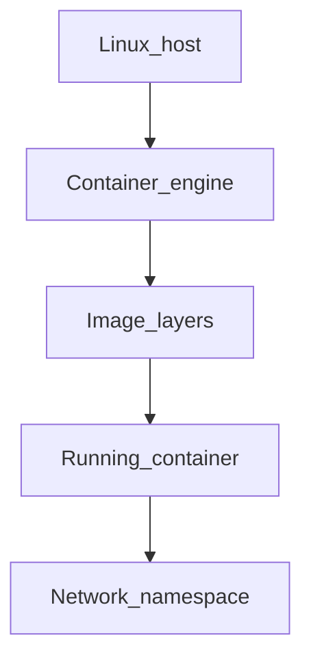

# Chapter 01 — Install

> "Installing Docker is usually boring. Keep it that way by following the official path for your OS and learning the difference between Docker Engine and Docker Desktop."

## Learning objectives

By the end of this chapter you will be able to:

- Install Docker Engine (Linux) or Docker Desktop (Mac/Windows) and verify the installation.
- Run the `hello-world` container to confirm everything works.
- Describe the daemon/client/CLI architecture and how containers are created.
- Use Docker contexts to manage local and remote engines.

## Prerequisites & recap

- [Linux basics](../02-linux/README.md) — you're comfortable with a terminal.

## The simple version

Docker is a tool that lets you run applications in isolated environments called containers. To use it, you install a daemon (a background service) that manages containers, and a CLI that talks to the daemon. On Linux, you install the engine directly. On macOS and Windows, you install a desktop app that runs a lightweight Linux VM behind the scenes, because containers are a Linux kernel feature.

Once installed, you run `docker run hello-world` and if it prints a greeting, you're good. That one command pulled an image from the internet, created a container from it, ran it, and printed the output. Everything else in this module builds on that foundation.

## Visual flow

```
  You type:             docker CLI              dockerd (daemon)
  docker run ...            |                        |
       |                    |                        |
       +----- command ----->|                        |
                            |--- Unix socket ------->|
                            |   /var/run/docker.sock |
                            |                        |
                            |                   containerd
                            |                        |
                            |                      runc
                            |                        |
                            |              +---------+----------+
                            |              | Linux kernel        |
                            |              | namespaces + cgroups|
                            |              | (isolated process)  |
                            |              +--------------------+
                            |                        |
                            |<-- output / exit code -|
       <--- output ---------+

  Caption: The CLI sends commands over a socket. The daemon
  uses kernel namespaces and cgroups to isolate processes.
```

## System diagram (Mermaid)



*How the host, image, and container namespaces relate.*

## Concept deep-dive

### Docker Engine vs. Docker Desktop

- **Engine** (Linux only) — the daemon (`dockerd`) + CLI + `containerd` runtime. What you'd run on a server. Free and open source.
- **Desktop** (Mac/Windows/Linux) — a GUI app that bundles the engine inside a tiny Linux VM. Includes Kubernetes, Docker Compose, and volume sharing. Requires a paid subscription for organizations with >$10M revenue or >250 employees.
- **Alternatives** — Rancher Desktop, Colima (macOS), and Podman are free alternatives that provide a compatible CLI experience.

### Installing on Linux (Ubuntu/Debian)

```bash
curl -fsSL https://get.docker.com | sudo sh
sudo usermod -aG docker $USER
# Log out and back in for group change to take effect
docker run --rm hello-world
```

### Installing on macOS

**Option A: Docker Desktop** — download from docker.com. Straightforward; commercial license.

**Option B: Colima** (free) —

```bash
brew install colima docker docker-compose
colima start
docker run --rm hello-world
```

### Installing on Windows

Install Docker Desktop with the WSL 2 backend (recommended). WSL 2 provides a real Linux kernel — better performance and compatibility than the older Hyper-V backend.

### Architecture

```
docker CLI → Unix socket → dockerd → containerd → runc → Linux kernel
```

- **docker CLI** — the command you type. Stateless; sends requests to the daemon.
- **dockerd** — the Docker daemon. Manages images, containers, networks, volumes.
- **containerd** — the container runtime. Handles image pulling, storage, and container lifecycle.
- **runc** — the low-level OCI runtime. Creates the namespaced process using kernel features.
- **Kernel namespaces** — provide isolation (PID, network, mount, user, UTS).
- **Kernel cgroups** — limit resources (CPU, memory, I/O).

### Quick sanity checks

```bash
docker --version          # CLI version
docker info               # daemon info, storage driver, OS, etc.
docker run --rm hello-world
```

### Docker contexts (managing remote engines)

You can point your local CLI at a remote Docker engine:

```bash
docker context create remote --docker "host=ssh://me@server"
docker context use remote
docker ps    # shows containers on the remote host
```

Switch back with `docker context use default`. Powerful for managing production hosts without SSH-ing in.

## Why these design choices

**Why a daemon instead of a standalone binary?** The daemon provides a persistent process that manages container lifecycle, image caching, networking, and storage. Without it, every `docker run` would need to set up everything from scratch. Podman is the daemonless alternative — it forks a runtime directly. The trade-off: Podman is simpler per-process but loses the caching and management features the daemon provides.

**Why does Docker Desktop need a VM on macOS?** Containers use Linux kernel features (namespaces, cgroups) that don't exist on macOS. Docker Desktop runs a lightweight Linux VM (using Apple's Virtualization Framework) and tunnels commands through it. The trade-off: performance overhead for filesystem operations (bind mounts are slower), and you're running a full VM even for simple containers.

**When would you choose Colima over Docker Desktop?** When you want to avoid the licensing cost, prefer open-source tooling, or want a lighter-weight solution. Colima uses Lima to run a Linux VM and exposes the Docker socket. The trade-off: less polished UI, no built-in Kubernetes toggle, and you manage VM lifecycle yourself.

## Production-quality code

N/A — this chapter covers installation and architecture. There's no application code to write.

## Security notes

- **The `docker` group grants root-equivalent access.** Any user in the `docker` group can mount the host filesystem, access the Docker socket, and effectively become root. Only add trusted users.
- **The Docker socket (`/var/run/docker.sock`) is a root-level API.** Never expose it over the network without TLS client certificates. Never mount it into application containers unless absolutely necessary.
- **Docker Desktop on shared workstations** — be aware that all users share the same Docker engine and can see each other's containers and images.

## Performance notes

N/A — installation has no runtime performance characteristics. Note for macOS users: Docker Desktop's filesystem virtualization adds latency to bind mounts. For hot paths (e.g., `node_modules`), use named volumes instead of bind mounts. This is covered in detail in [Chapter 03 — Storage](03-storage.md).

## Common mistakes

| # | Symptom | Cause | Fix |
|---|---------|-------|-----|
| 1 | `docker: permission denied` on every command | User not in the `docker` group | `sudo usermod -aG docker $USER` then log out and back in |
| 2 | Surprise licensing inquiry from Docker | Docker Desktop used at a large org without a subscription | Switch to Colima/Rancher Desktop, or purchase a subscription |
| 3 | Containers behave differently on Mac vs. Linux | Docker Desktop runs a Linux VM; subtle differences in networking and filesystem behavior | Test in a Linux environment (CI) for production parity |
| 4 | `docker` and `podman` conflict on the same machine | Both installed; CLI commands route to the wrong engine | Use aliases or set `DOCKER_HOST` explicitly; uninstall one |
| 5 | WSL 2 backend not enabled on Windows | Docker Desktop falls back to Hyper-V or fails to start | Enable WSL 2 in Windows Features; set Docker Desktop to use WSL 2 backend |

## Practice

### Warm-up

Install Docker and run `hello-world`. Verify the output includes "Hello from Docker!"

<details><summary>Show solution</summary>

```bash
# Linux
curl -fsSL https://get.docker.com | sudo sh
sudo usermod -aG docker $USER
# Log out and back in
docker run --rm hello-world

# macOS (Colima)
brew install colima docker
colima start
docker run --rm hello-world
```

Expected output includes: "Hello from Docker! This message shows that your installation appears to be working correctly."

</details>

### Standard

Print the Docker daemon version, storage driver, and number of running containers using `docker info`.

<details><summary>Show solution</summary>

```bash
docker info --format '{{.ServerVersion}} | {{.Driver}} | Running: {{.ContainersRunning}}'
```

</details>

### Bug hunt

A new team member runs `docker ps` and gets "permission denied." They're on Ubuntu. What's wrong and how do you fix it?

<details><summary>Show solution</summary>

Their user isn't in the `docker` group. The Docker daemon runs as root and the socket is owned by root:docker. Fix:

```bash
sudo usermod -aG docker their-username
# They must log out and back in (or run `newgrp docker`)
```

Alternatively, they can prefix with `sudo`, but that's tedious and not recommended for daily use.

</details>

### Stretch

Install Colima on macOS as an alternative to Docker Desktop. Start it and verify `docker run hello-world` works.

<details><summary>Show solution</summary>

```bash
brew install colima docker docker-compose
colima start --cpu 2 --memory 4
docker context ls       # should show "colima" as active
docker run --rm hello-world
```

To stop: `colima stop`. To delete the VM: `colima delete`.

</details>

### Stretch++

Create a Docker context that connects to a remote machine via SSH. Run `docker ps` on the remote host from your local terminal.

<details><summary>Show solution</summary>

```bash
# Ensure SSH access to the remote host
ssh me@remote-server "docker --version"  # verify Docker is installed there

# Create and use the context
docker context create staging --docker "host=ssh://me@remote-server"
docker context use staging
docker ps    # shows remote containers

# Switch back to local
docker context use default
```

</details>

## In plain terms (newbie lane)
If `Install` feels abstract, think of it as a practical tool to make your backend work more predictable and easier to debug. Use this chapter to build one clear mental model first, then add details.

> **Newbies often think:** this topic is only theory and memorization.  
> **Actually:** it is a workflow aid that helps you make better decisions under real project pressure.


## Quiz

1. Is Docker Desktop required to run containers on Linux?
   (a) Yes  (b) No — Docker Engine alone is sufficient  (c) Only on Ubuntu  (d) Only with a GUI

2. What kernel features does Docker use for isolation?
   (a) Syscalls only  (b) Namespaces and cgroups  (c) SELinux exclusively  (d) None — it uses a VM

3. What is the default communication path between the CLI and daemon?
   (a) `/var/run/docker.sock` (Unix socket)  (b) TCP port 2375  (c) HTTP port 80  (d) UDP

4. How does Podman differ from Docker?
   (a) Compatible CLI but daemonless  (b) Completely different API  (c) Unmaintained  (d) Deprecated in favor of Docker

5. What is the recommended backend for Docker Desktop on Windows?
   (a) WSL 2  (b) Hyper-V only  (c) VirtualBox  (d) No backend needed

**Short answer:**

6. Why should you add your user to the `docker` group?
7. Give one benefit of Docker contexts.

*Answers: 1-b, 2-b, 3-a, 4-a, 5-a. 6 — So you can run `docker` commands without `sudo`. The Docker socket is owned by root:docker, so group membership grants access. 7 — You can manage containers on a remote host from your local CLI without SSH-ing in, making it easy to switch between local and remote engines.*

## Learn-by-doing mini-project

Full brief (goal, acceptance criteria, hints, stretch): [01-install — mini-project](mini-projects/01-install-project.md).

## Where this idea reappears

- **Same thread elsewhere:** trace how this chapter’s primitives show up in production systems — not only in this language or layer.
- **Cross-module links (read next when you feel stuck):**
  - [Linux processes and packages](../02-linux/04-programs.md) — what PID 1 and namespaces build on.
  - [Pub/Sub services](../15-pubsub/README.md) — how containers host brokers and workers.

  - [Concept threads (hub)](../appendix-threads/README.md) — state, errors, and performance reading trails.


## Chapter summary

- **Docker Engine runs on Linux directly; Docker Desktop wraps it in a VM** for macOS and Windows. Colima and Podman are free alternatives.
- **The architecture is CLI → socket → daemon → containerd → runc → kernel.** Understanding this chain helps you debug when things go wrong.
- **Docker contexts let one CLI manage many hosts** — local, remote, staging, production.

## Further reading

- docs.docker.com, *Install Docker Engine* — official installation guides for every OS.
- Colima GitHub — lightweight Docker Desktop alternative for macOS.
- Podman documentation — daemonless, rootless container engine.
- Next: [Containers](02-containers.md).
