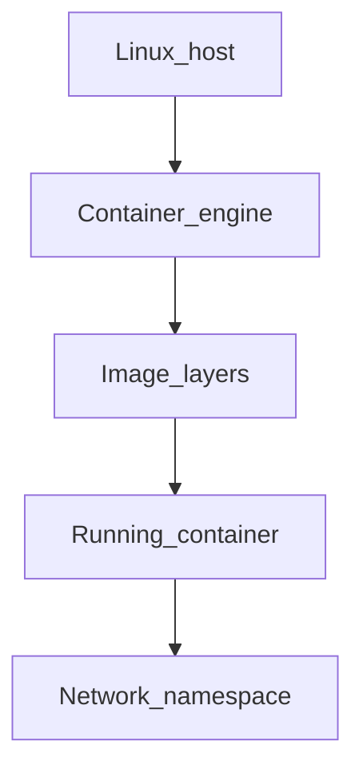

# Chapter 03 — Storage

> "Containers are ephemeral. Anything you want to keep must live in a volume or an external storage service."

## Learning objectives

By the end of this chapter you will be able to:

- Distinguish volumes, bind mounts, and tmpfs mounts and know when to use each.
- Create and manage named volumes for persistent data.
- Use bind mounts for live-reload development workflows.
- Back up and restore volume data using throwaway containers.

## Prerequisites & recap

- [Containers](02-containers.md) — you can run, stop, and remove containers.

## The simple version

By default, everything a container writes goes to its writable layer — and that layer vanishes when the container is removed. If you need data to survive (database files, uploaded content), you mount external storage into the container. Docker gives you three options:

- **Volumes** — Docker-managed storage that lives outside the container. Best for production data.
- **Bind mounts** — a specific directory on your host mapped into the container. Best for development (edit code on your host, see changes in the container).
- **tmpfs** — in-memory storage that's fast and never touches disk. Best for sensitive scratch data.

## Visual flow

```
  Host Filesystem                  Docker
  +-----------------------+
  | /home/you/project/    |        Container A
  |   src/                |        +------------------+
  |   package.json   --------bind->| /app             |
  |                       |        | (live edits)     |
  +-----------------------+        +------------------+

  Docker-managed storage           Container B
  +-----------------------+        +------------------+
  | /var/lib/docker/      |        |                  |
  |   volumes/pgdata/  -----vol--->| /var/lib/pg/data |
  |   _data/              |        | (persists)       |
  +-----------------------+        +------------------+

  RAM                              Container C
  +-----------------------+        +------------------+
  | tmpfs (in memory) -------tmp-->| /run/secrets     |
  |                       |        | (never on disk)  |
  +-----------------------+        +------------------+

  Caption: Three mount types serve three different needs:
  persistence, development, and ephemeral secrets.
```

## System diagram (Mermaid)



*How the host, image, and container namespaces relate.*

## Concept deep-dive

### Three mount types

| Type | Managed by | Persists after rm? | Use case |
|---|---|---|---|
| **Volume** | Docker | Yes (until `docker volume rm`) | Database files, app state |
| **Bind mount** | You (host path) | Yes (it's your filesystem) | Dev: live code editing |
| **tmpfs** | Kernel (RAM) | No | Runtime secrets, scratch space |

### Volumes

Docker creates and manages volumes under `/var/lib/docker/volumes/` (Linux). They're portable — the same commands work on Linux, macOS, and Windows.

```bash
docker volume create pgdata
docker run -d --name pg \
  -e POSTGRES_PASSWORD=pw \
  -v pgdata:/var/lib/postgresql/data \
  postgres:16

docker volume ls
docker volume inspect pgdata
docker volume rm pgdata   # after removing containers that use it
```

### Bind mounts

Map a specific host directory into the container:

```bash
docker run --rm -v "$PWD":/app -w /app node:20 npm test
```

The container sees a live view of your host directory. Edit a file on the host; the container sees the change instantly. This is the foundation of Docker-based development workflows.

### tmpfs mounts

In-memory only. Gone when the container stops:

```bash
docker run --rm --tmpfs /run/secrets:size=10m myapp
```

Good for short-lived sensitive data that should never touch disk.

### When to use what

| Need | Mount type |
|---|---|
| Database files (Postgres, MySQL) | Named volume |
| Dev workflow: edit code, see live | Bind mount |
| Runtime secrets or scratch space | tmpfs |
| Config file in dev | Bind mount |
| Config file in prod | Baked into the image (COPY) or mounted as read-only |

### File permissions

Bind mounts carry host UIDs. On Linux, the container process's user must have permission to read/write the mounted directory. Common problem: the container runs as uid 1000 but the mounted directory is owned by root.

Fix: match UIDs, or use `--user $(id -u):$(id -g)` when running the container.

### Backing up volumes

Back up a volume by `tar`-ing its contents via a throwaway container:

```bash
# Backup
docker run --rm \
  -v pgdata:/data:ro \
  -v "$PWD":/backup \
  alpine tar -czf /backup/pgdata-backup.tgz -C /data .

# Restore
docker volume create pgdata-restored
docker run --rm \
  -v pgdata-restored:/data \
  -v "$PWD":/backup \
  alpine tar -xzf /backup/pgdata-backup.tgz -C /data
```

### The `node_modules` problem

On macOS, bind-mounting your entire project directory (including `node_modules`) into a container causes severe performance issues because Docker Desktop's filesystem virtualization is slow for thousands of small files.

The fix: use a named volume for `node_modules`:

```bash
docker run --rm \
  -v "$PWD":/app \
  -v node_modules:/app/node_modules \
  -w /app \
  node:20 npm install
```

The bind mount provides your code; the named volume stores `node_modules` inside Docker's fast storage.

### What NOT to put in volumes

- **Source code that belongs in image layers** — COPY it during build.
- **Temp files the app can recreate** — let them live in the writable layer.
- **Secrets** — use environment variables, Docker secrets, or a secret manager.

## Why these design choices

**Why volumes over bind mounts for production data?** Volumes are managed by Docker — they're portable across OS, have consistent permissions, and work the same way everywhere. Bind mounts depend on a specific host path existing with the right permissions, which breaks portability. The trade-off: volumes are opaque — you can't easily browse them from the host without mounting them in a container.

**Why not just write to the container's writable layer?** The writable layer uses a copy-on-write filesystem (overlay2). First writes copy the file from the image layer, which is slow. More importantly, the writable layer is deleted with the container — any data stored there is ephemeral. It's also invisible from outside the container without `docker cp`.

**Why tmpfs for secrets?** Secrets in tmpfs never touch the host's disk — if the host is compromised and its disk image analyzed, tmpfs data won't be there. The trade-off: tmpfs is limited to available RAM and data is lost on container stop.

**When would you use a bind mount in production?** For configuration files that vary per environment. Mount a read-only config file: `-v /etc/myapp/config.yml:/app/config.yml:ro`. This lets you change config without rebuilding the image.

## Production-quality code

### Dev environment with bind mount + volume for node_modules

```bash
docker run --rm -it \
  -v "$PWD":/app \
  -v app_node_modules:/app/node_modules \
  -w /app \
  -p 3000:3000 \
  node:20 sh -c "npm install && npm run dev"
```

### Postgres with persistent volume and health check

```bash
docker volume create pgdata

docker run -d \
  --name pg \
  -e POSTGRES_USER=app \
  -e POSTGRES_PASSWORD=secret \
  -e POSTGRES_DB=mydb \
  -v pgdata:/var/lib/postgresql/data \
  -p 5432:5432 \
  --health-cmd="pg_isready -U app" \
  --health-interval=5s \
  --health-timeout=3s \
  --health-retries=5 \
  postgres:16

# Data survives stop/start
docker stop pg && docker start pg
```

### Automated volume backup script

```bash
#!/usr/bin/env bash
set -euo pipefail

VOLUME="${1:?Usage: backup.sh <volume-name>}"
TIMESTAMP=$(date +%Y%m%d-%H%M%S)
BACKUP_FILE="${VOLUME}-${TIMESTAMP}.tgz"

docker run --rm \
  -v "${VOLUME}":/source:ro \
  -v "$PWD":/backup \
  alpine tar -czf "/backup/${BACKUP_FILE}" -C /source .

echo "Backed up ${VOLUME} → ${BACKUP_FILE} ($(du -h "$BACKUP_FILE" | cut -f1))"
```

## Security notes

- **Bind mounts can expose the host filesystem.** `-v /:/host` gives the container read-write access to the entire host. Only mount what you need, and use `:ro` for read-only access.
- **Volume data is owned by root by default.** On Linux, the container's process may not be able to read/write unless you match UIDs or use `--user`.
- **Don't store secrets in volumes.** Volumes persist on disk and can be inspected by anyone with Docker access. Use Docker secrets (Swarm mode) or mount secrets from a manager into tmpfs.

## Performance notes

- **Docker Desktop bind mounts are slow on macOS and Windows** due to filesystem virtualization between the host OS and the Linux VM. Named volumes are 5–10x faster because they live inside the VM's native filesystem.
- **overlay2 (the default storage driver) is efficient for reads** — unchanged files are served from cached image layers. Writes trigger a copy-on-write, which has a one-time overhead.
- **For write-heavy workloads** (databases), always use a named volume. The writable layer's copy-on-write overhead is significant for continuous writes.
- **`:delegated` and `:cached` mount options** (Docker Desktop) trade consistency for speed on bind mounts. Useful for development; don't use in production.

## Common mistakes

| # | Symptom | Cause | Fix |
|---|---------|-------|-----|
| 1 | Database data lost after `docker rm` | Forgot to mount a volume for the data directory | Use `-v pgdata:/var/lib/postgresql/data` |
| 2 | `npm install` takes forever on macOS | `node_modules` in a bind mount (filesystem virtualization overhead) | Use a named volume for `node_modules` |
| 3 | Permission denied on bind-mounted files | Container user's UID doesn't match host file ownership | Use `--user $(id -u):$(id -g)` or fix directory permissions |
| 4 | Accidentally deleted a volume with important data | Ran `docker system prune --volumes` without checking | Back up volumes before pruning; use explicit `docker volume rm` |
| 5 | Config file changes require image rebuild | Config baked in with COPY at build time | Bind-mount config in dev; mount as read-only in prod |

## Practice

### Warm-up

Create a named volume, inspect it, and then remove it.

<details><summary>Show solution</summary>

```bash
docker volume create test-vol
docker volume inspect test-vol
docker volume rm test-vol
```

</details>

### Standard

Run Postgres with a named volume (`pgdata`). Insert data, stop the container, start it again, and verify the data survived.

<details><summary>Show solution</summary>

```bash
docker run -d --name pg \
  -e POSTGRES_PASSWORD=pw \
  -v pgdata:/var/lib/postgresql/data \
  -p 5432:5432 \
  postgres:16

# Wait for startup, then create a table
docker exec pg psql -U postgres -c "CREATE TABLE test (val TEXT); INSERT INTO test VALUES ('survived');"

docker stop pg && docker start pg
docker exec pg psql -U postgres -c "SELECT * FROM test;"
# Output: survived

docker stop pg && docker rm pg
# Volume pgdata still exists — data is safe
```

</details>

### Bug hunt

On macOS, `npm install` in a bind-mounted project takes 10 minutes instead of 30 seconds. What's happening?

<details><summary>Show solution</summary>

Docker Desktop's filesystem virtualization between macOS and the Linux VM is slow for bind mounts with many small files (node_modules has thousands). Fix: use a named volume for `node_modules`:

```bash
docker run --rm \
  -v "$PWD":/app \
  -v node_modules:/app/node_modules \
  -w /app \
  node:20 npm install
```

The bind mount gives you live code; the named volume stores `node_modules` in Docker's fast native storage.

</details>

### Stretch

Back up a volume to a `.tgz` file using a throwaway alpine container.

<details><summary>Show solution</summary>

```bash
docker run --rm \
  -v pgdata:/data:ro \
  -v "$PWD":/backup \
  alpine tar -czf /backup/pgdata.tgz -C /data .

ls -lh pgdata.tgz
```

</details>

### Stretch++

Mount a config file as read-only into a container: `-v ./config.yml:/etc/app/config.yml:ro`. Verify the container can read but not write it.

<details><summary>Show solution</summary>

```bash
echo "key: value" > config.yml
docker run --rm -v "$PWD/config.yml":/etc/app/config.yml:ro alpine sh -c '
  cat /etc/app/config.yml      # works: key: value
  echo "new" >> /etc/app/config.yml  # fails: Read-only file system
'
```

</details>

## In plain terms (newbie lane)
If `Storage` feels abstract, think of it as a practical tool to make your backend work more predictable and easier to debug. Use this chapter to build one clear mental model first, then add details.

> **Newbies often think:** this topic is only theory and memorization.  
> **Actually:** it is a workflow aid that helps you make better decisions under real project pressure.


## Quiz

1. A bind mount is:
   (a) Docker-managed storage  (b) A specific host path mapped into the container  (c) In-memory only  (d) Always read-only

2. tmpfs storage:
   (a) Persists after container removal  (b) Lives in RAM only, never on disk  (c) Is network-attached  (d) Is automatically backed up

3. Where do named volumes live on Linux?
   (a) Anywhere  (b) Under `/var/lib/docker/volumes`  (c) Inside the container  (d) In S3

4. Persistent data (database files) should live in:
   (a) The container's writable layer  (b) A named volume  (c) The image  (d) An environment variable

5. The flag for a read-only bind mount is:
   (a) `:ro`  (b) `:rw`  (c) `--read-only`  (d) `:r`

**Short answer:**

6. What is the trade-off between volumes and bind mounts for development?
7. Why are bind mounts slow on Docker Desktop (macOS/Windows)?

*Answers: 1-b, 2-b, 3-b, 4-b, 5-a. 6 — Bind mounts let you edit code on the host and see changes instantly in the container, but they're slower on macOS. Volumes are fast but opaque — you can't easily browse them from the host. 7 — Docker Desktop runs a Linux VM, and bind mounts require filesystem synchronization between the host OS and the VM, which adds latency for every file operation.*

## Learn-by-doing mini-project

Full brief (goal, acceptance criteria, hints, stretch): [03-storage — mini-project](mini-projects/03-storage-project.md).

## Where this idea reappears

- **Same thread elsewhere:** trace how this chapter’s primitives show up in production systems — not only in this language or layer.
- **Cross-module links (read next when you feel stuck):**
  - [Linux processes and packages](../02-linux/04-programs.md) — what PID 1 and namespaces build on.
  - [Pub/Sub services](../15-pubsub/README.md) — how containers host brokers and workers.

  - [Concept threads (hub)](../appendix-threads/README.md) — state, errors, and performance reading trails.


## Chapter summary

- **Volumes for persistence, bind mounts for development, tmpfs for secrets** — pick the right mount type for the job.
- **Containers are ephemeral by design** — any data you care about must live outside the writable layer.
- **Back up volumes with throwaway containers** — `tar` + a disposable Alpine container is the standard pattern.

## Further reading

- Docker docs, *Manage data in Docker* — volumes, bind mounts, and tmpfs.
- Docker docs, *Storage drivers* — how overlay2 and copy-on-write work.
- Next: [Execute (Docker Compose)](04-execute.md).
