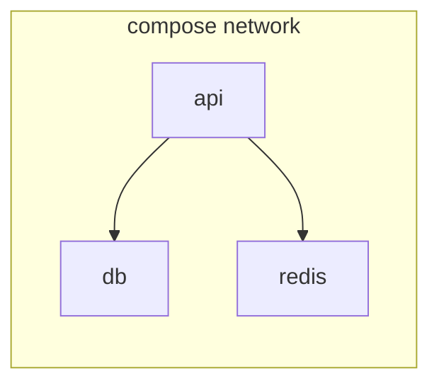

# Chapter 04 — Execute

> Running multi-container apps by hand gets old fast. `docker compose` turns a YAML file into your local dev environment and your simple prod stack.

## Learning objectives

- Write a `docker-compose.yml`.
- Start, stop, rebuild, and log services.
- Pass env via `.env` files.
- Use Compose for dev-only dependencies.

## Prerequisites & recap

- [Containers](02-containers.md), [Storage](03-storage.md).

## Concept deep-dive

### Compose file

```yaml
# compose.yaml
services:
  db:
    image: postgres:16
    environment:
      POSTGRES_PASSWORD: pw
    volumes:
      - pgdata:/var/lib/postgresql/data
    ports:
      - "5432:5432"

  api:
    build: .
    depends_on:
      - db
    environment:
      DATABASE_URL: postgres://postgres:pw@db:5432/postgres
    ports:
      - "3000:3000"

volumes:
  pgdata:
```

Run:

```bash
docker compose up -d          # start
docker compose logs -f api    # tail logs
docker compose ps
docker compose down           # stop + remove
docker compose down -v        # also delete volumes
```

### Service DNS

Inside the Compose network, each service is reachable by its name (`db`, `api`). No need for `localhost:port` gymnastics.

### Profiles

Define optional services that only start when asked:

```yaml
services:
  loadtester:
    profiles: ["load"]
```

Start with `docker compose --profile load up`.

### Env files

`.env` at the project root is auto-loaded by Compose for variable substitution:

```yaml
services:
  api:
    image: myapp:${TAG:-latest}
```

Pass through into services with `env_file:` or explicit `environment:`.

### Building images

```yaml
services:
  api:
    build:
      context: .
      dockerfile: Dockerfile
```

`docker compose build` rebuilds; `up --build` builds then runs.

### Health checks

```yaml
services:
  db:
    healthcheck:
      test: ["CMD-SHELL", "pg_isready -U postgres"]
      interval: 5s
      timeout: 3s
      retries: 5

  api:
    depends_on:
      db:
        condition: service_healthy
```

`depends_on` with `condition: service_healthy` makes API wait until the DB is ready.

### Override files

`compose.yaml` plus `compose.override.yaml` merge automatically. Great for dev-only tweaks:

```yaml
# compose.override.yaml (gitignored or committed, your call)
services:
  api:
    volumes:
      - .:/app
    command: npm run dev
```

### Prod considerations

Compose is fine for single-host or small deployments. For multi-host, move to Kubernetes, Nomad, ECS, or Fly. Compose specs are readable by those tools and by `docker stack deploy` (Swarm).

## Worked examples

### Example 1 — Full-stack dev

```yaml
services:
  db:
    image: postgres:16
    environment: { POSTGRES_PASSWORD: pw }
    volumes: ["pgdata:/var/lib/postgresql/data"]
  redis:
    image: redis:7
  api:
    build: .
    env_file: .env.local
    ports: ["3000:3000"]
    volumes: [".:/app"]
    command: npm run dev
    depends_on: [db, redis]
volumes:
  pgdata:
```

### Example 2 — One-shot command

```bash
docker compose run --rm api npm test
```

Runs tests in a one-off container that shares the Compose network and env.

## Diagrams



*Caption: Trace the flow (data/time/money) through this figure before reading further.*

## Real-world incidents (postmortem sketches)

| Incident | Symptom | Root cause | Prevention |
|----------|---------|------------|------------|
| **Ghost dependency** | `api` crashes on `ECONNREFUSED` to `db` right after `compose up` | `depends_on` without healthcheck — Postgres binary is up before it accepts connections | Add `pg_isready` healthcheck + `condition: service_healthy` |
| **Never-ending rebuild** | CI spins 12 minutes on every push | `COPY . .` invalidates cache because developers commit local `.env` and fixtures | `.dockerignore` aggressive defaults; split deps layer from app layer |
| **Works on my machine only** | Bind-mount hot reload pegs CPU on macOS | `node_modules` synced through osxfs; watchers recurse millions of files | Named volume for `node_modules`, or devcontainer with Linux FS |

Use these as **tabletop drills** with a teammate: ask “what’s the first log line you’d grep for?”

## Common pitfalls & gotchas

- Naming port-mapped service `postgres` but connecting to `localhost:5432` — use service DNS `db:5432` from other services.
- Forgetting to `down -v` when you want a clean slate.
- Hot-reload broken by bind mount perf on macOS; use volumes for `node_modules`.
- `depends_on` alone doesn't wait for readiness — use healthchecks.

## Exercises

1. Warm-up. Write a Compose file with one service (`nginx`).
2. Standard. Full-stack: db + api; wire env var.
3. Bug hunt. Why doesn't `postgres://localhost:5432` work from inside the API container?
4. Stretch. Add healthcheck-gated `depends_on`.
5. Stretch++. Use profiles to create an optional `loadtester` service.

## In plain terms (newbie lane)
If `Execute` feels abstract, think of it as a practical tool to make your backend work more predictable and easier to debug. Use this chapter to build one clear mental model first, then add details.

> **Newbies often think:** this topic is only theory and memorization.  
> **Actually:** it is a workflow aid that helps you make better decisions under real project pressure.


## Quiz

1. Start all services:
    (a) `docker up` (b) `docker compose up -d` (c) `compose run` (d) `docker start`
2. Service DNS:
    (a) localhost (b) service name across the Compose network (c) 127.0.0.1 (d) container IPs
3. Compose file default name:
    (a) `Dockerfile` (b) `compose.yaml` or `docker-compose.yml` (c) any (d) `services.yaml`
4. Healthcheck + depends_on:
    (a) not supported (b) waits for healthy before starting dependents (c) deprecated (d) ignored
5. Clean volumes on down:
    (a) `down` (b) `down -v` (c) `rm -rf` (d) `prune`

**Short answer:**

6. Compose for prod?
7. One advantage of an override file.

## Mini-project: Apply it

Full brief (goal, acceptance criteria, hints, stretch): [04-execute — mini-project](mini-projects/04-execute-project.md).

## Where this idea reappears

- **Same thread elsewhere:** trace how this chapter’s primitives show up in production systems — not only in this language or layer.
- **Cross-module links (read next when you feel stuck):**
  - [Linux processes and packages](../02-linux/04-programs.md) — what PID 1 and namespaces build on.
  - [Pub/Sub services](../15-pubsub/README.md) — how containers host brokers and workers.

  - [Concept threads (hub)](../appendix-threads/README.md) — state, errors, and performance reading trails.


## Chapter summary

- Compose describes multi-container apps in YAML.
- Service DNS and named volumes make networking and state easy.
- Healthchecks gate dependencies.

## Further reading

- docs.docker.com, *Compose specification*.
- Next: [networks](05-networks.md).
