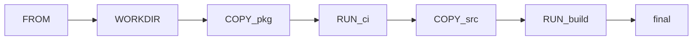

# Chapter 06 — Dockerfiles

> A Dockerfile is a recipe for building an image. A good Dockerfile is small, fast to build, reproducible, and runs as a non-root user.

## Learning objectives

- Write a Dockerfile for a Node/TypeScript app.
- Use multi-stage builds.
- Leverage layer caching for fast rebuilds.
- Adopt production-grade practices.

## Prerequisites & recap

- [Containers](02-containers.md), [Execute](04-execute.md).

## Concept deep-dive

### Instructions

```dockerfile
FROM node:20-alpine
WORKDIR /app
COPY package*.json ./
RUN npm ci
COPY . .
RUN npm run build
USER node
EXPOSE 3000
CMD ["node", "dist/index.js"]
```

Key instructions:

- `FROM` — base image.
- `WORKDIR` — `cd` for subsequent commands.
- `COPY` / `ADD` — copy files in.
- `RUN` — execute during build.
- `ENV` — set env vars.
- `USER` — drop privileges.
- `EXPOSE` — documentation only (doesn't publish ports).
- `CMD` / `ENTRYPOINT` — what to run when started.

### Layer caching

Each instruction produces a cached layer. Docker reuses layers when their inputs haven't changed. Order instructions from *least* to *most* frequently changing:

1. `FROM`
2. System deps (`RUN apt-get ...`)
3. `COPY package.json` + `RUN npm ci` — deps
4. `COPY .` — source
5. `RUN build`

Your code changes often; deps rarely. Keep the dep install step high in the file.

### Multi-stage builds

Separate **builder** from **runtime**:

```dockerfile
# Stage 1 — builder
FROM node:20-alpine AS builder
WORKDIR /app
COPY package*.json tsconfig.json ./
RUN npm ci
COPY src ./src
RUN npm run build
RUN npm prune --omit=dev

# Stage 2 — runtime
FROM node:20-alpine
WORKDIR /app
ENV NODE_ENV=production
COPY --from=builder /app/node_modules ./node_modules
COPY --from=builder /app/dist ./dist
COPY package.json .
USER node
EXPOSE 3000
CMD ["node", "dist/index.js"]
```

Final image has no compilers, no dev deps — smaller and more secure.

### Choose base images

- `node:20-alpine` — smallest; watch for musl vs. glibc issues.
- `node:20-slim` — Debian slim; balance.
- `node:20` — full; heaviest.
- `distroless` (`gcr.io/distroless/nodejs20`) — minimal runtime, no shell.

Pin versions (`node:20.12.0-alpine3.19`), don't chase `latest`.

### Non-root

Run as a non-root user. Many base images ship one (`node`, `postgres`):

```dockerfile
USER node
```

Prevents a container escape from having root on the host.

### Ignore and secrets

`.dockerignore` reduces build context:

```
node_modules
.git
.env
.DS_Store
dist
```

Never `COPY .env` into an image. Use runtime env vars or secret mounts.

### Build args

```dockerfile
ARG VERSION=unknown
LABEL org.opencontainers.image.version=$VERSION
```

```bash
docker build --build-arg VERSION=$(git rev-parse --short HEAD) -t myapp:$(git rev-parse --short HEAD) .
```

### BuildKit

Docker's modern builder. Enabled by default in recent versions. Supports:

- Parallel stages.
- Secret mounts: `RUN --mount=type=secret,id=npm npm ci`.
- Cache mounts: `RUN --mount=type=cache,target=/root/.npm npm ci`.

## Worked examples

### Example 1 — Python app

```dockerfile
FROM python:3.12-slim
ENV PIP_NO_CACHE_DIR=1
WORKDIR /app
COPY requirements.txt .
RUN pip install -r requirements.txt
COPY . .
USER 1000
CMD ["python", "-m", "app"]
```

### Example 2 — Distroless Node runtime

```dockerfile
FROM node:20-alpine AS builder
WORKDIR /app
COPY package*.json ./
RUN npm ci
COPY . .
RUN npm run build

FROM gcr.io/distroless/nodejs20
WORKDIR /app
COPY --from=builder /app/node_modules ./node_modules
COPY --from=builder /app/dist ./dist
COPY package.json .
CMD ["dist/index.js"]
```

No shell → exec-level security.

## Diagrams



*Caption: Trace the flow (data/time/money) through this figure before reading further.*

## Common pitfalls & gotchas

- Copying everything before `npm ci` — cache busted on every code change.
- Running as root.
- `ADD` for non-URL sources when `COPY` would do.
- Shipping dev deps in prod image.
- `ENV NODE_ENV=development` (typo you'll regret).

## Exercises

1. Warm-up. Write a 5-line Dockerfile for a Node server.
2. Standard. Convert to multi-stage; note image size before/after.
3. Bug hunt. Why did your rebuild reinstall deps even though only `src/index.ts` changed?
4. Stretch. Add a `USER node` step; deal with permissions.
5. Stretch++. Use BuildKit secret mounts to inject an npm token.

<details><summary>Show solutions</summary>

3. You probably `COPY . .` before `RUN npm ci`, invalidating the install layer.

</details>

## In plain terms (newbie lane)
If `Dockerfiles` feels abstract, think of it as a practical tool to make your backend work more predictable and easier to debug. Use this chapter to build one clear mental model first, then add details.

> **Newbies often think:** this topic is only theory and memorization.  
> **Actually:** it is a workflow aid that helps you make better decisions under real project pressure.


## Quiz

1. Smallest image among:
    (a) `node:20` (b) `node:20-slim` (c) `node:20-alpine` (d) distroless
2. COPY location:
    (a) before WORKDIR (b) after WORKDIR (c) same layer (d) doesn't matter
3. Layer cache invalidated by:
    (a) unchanged inputs (b) changed inputs to that layer or any prior (c) time (d) docker restart
4. Multi-stage benefit:
    (a) faster runtime (b) smaller, deps-free image (c) uses more disk (d) only for Go
5. Non-root `USER`:
    (a) optional (b) recommended for defense-in-depth (c) breaks volumes (d) not possible

**Short answer:**

6. Why place `COPY package*.json` before `COPY .`?
7. One reason to choose distroless.

## Mini-project: Apply it

Full brief (goal, acceptance criteria, hints, stretch): [06-dockerfiles — mini-project](mini-projects/06-dockerfiles-project.md).

## Where this idea reappears

- **Same thread elsewhere:** trace how this chapter’s primitives show up in production systems — not only in this language or layer.
- **Cross-module links (read next when you feel stuck):**
  - [Linux processes and packages](../02-linux/04-programs.md) — what PID 1 and namespaces build on.
  - [Pub/Sub services](../15-pubsub/README.md) — how containers host brokers and workers.

  - [Concept threads (hub)](../appendix-threads/README.md) — state, errors, and performance reading trails.


## Chapter summary

- Order layers from stable to volatile.
- Multi-stage for small, secure final images.
- Non-root, pinned bases, ignored context.

## Further reading

- Dockerfile reference; Google's distroless repo.
- Next: [debug](07-debug.md).
