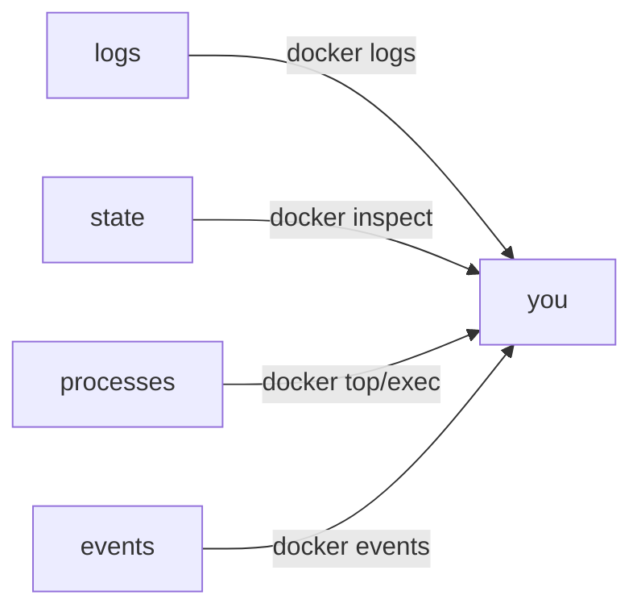

# Chapter 07 — Debug

> When a container misbehaves, you have a handful of tools that tell you almost everything.

## Learning objectives

- Inspect logs, state, and processes in a container.
- Shell into a running container.
- Use health checks and Docker events.
- Diagnose OOM, networking, and filesystem issues.

## Prerequisites & recap

- [Containers](02-containers.md), [Networks](05-networks.md).

## Concept deep-dive

### Logs

```bash
docker logs api
docker logs -f api --tail 100
docker compose logs -f api
```

Apps should log to stdout/stderr, one JSON line per event. Don't log to files inside containers.

### Inspect

```bash
docker ps -a
docker inspect api | less
docker inspect -f '{{.State.Status}} {{.State.ExitCode}}' api
docker inspect -f '{{json .NetworkSettings}}' api | jq
```

Inspect returns giant JSON: state, env, mounts, networks, health.

### Exec in

```bash
docker exec -it api sh          # alpine
docker exec -it api bash        # debian/ubuntu
docker exec -it api cat /etc/os-release
```

No shell? Use distroless debug variants (`gcr.io/distroless/base:debug`) or attach a sidecar.

### Top / stats

```bash
docker top api                  # processes inside container
docker stats                    # CPU/memory/IO per container
```

### Events

```bash
docker events --since 1h
```

Real-time stream of all Docker events. Gold when you need to know *when* a container died.

### Healthchecks

```dockerfile
HEALTHCHECK --interval=30s --timeout=3s --retries=3 \
  CMD wget -qO- http://localhost:3000/health || exit 1
```

`docker ps` shows `healthy`/`unhealthy`. Compose can gate `depends_on` on health.

### Exit codes

- `0` — normal exit.
- `137` — SIGKILL (often OOM).
- `139` — segfault.
- `143` — SIGTERM.

Check with `docker inspect -f '{{.State.ExitCode}}'`.

### OOM

```bash
dmesg | rg -i "Killed process"
docker inspect api | rg OOMKilled
```

If `OOMKilled: true`, the container exceeded its memory limit. Raise `-m` limit or reduce memory use.

### Networking issues

Checklist:

1. Are both containers on the same network?
2. Try by IP instead of name — is DNS the problem?
3. `docker exec api nslookup db`.
4. `docker exec api wget -O- http://db:PORT`.
5. Check host firewall or Docker Desktop networking mode.

### Filesystem issues

```bash
docker exec api df -h
docker exec api ls -la /data
```

Check bind mount permissions: container user's UID must match.

## Worked examples

### Example 1 — Diagnose crash

```bash
docker compose up -d
docker compose ps            # shows exited(1)
docker compose logs api      # last lines
docker inspect api | rg 'ExitCode\|OOMKilled\|Error'
```

### Example 2 — Step into a distroless-ish image

If you built without a shell and can't `exec`:

```bash
docker run --rm -it --pid container:api --network container:api \
  --volumes-from api alpine sh
```

Share namespaces with the target; inspect without modifying it.

## Diagrams



*Caption: Trace the flow (data/time/money) through this figure before reading further.*

## Real-world incidents (postmortem sketches)

| Incident | Symptom | Root cause | Prevention |
|----------|---------|------------|------------|
| **Silent OOM** | Container restarts every ~20 min, no stack trace | Node heap exceeded cgroup memory limit → kernel SIGKILL (exit 137) | `docker stats`, set `mem_limit`, add heap snapshots |
| **Distroless dead end** | “Cannot exec into container” | Image intentionally has no shell; team used to `docker exec bash` | Sidecar pattern (`--pid container:api --network container:api`) |
| **Log tsunami** | Disk full on host | App logs JSON to stdout but log driver misconfigured to local file without rotation | Centralize logs (journald, cloud agent) + JSON one-line per event |

## Common pitfalls & gotchas

- Only checking `docker ps` (running); forgetting `-a`.
- Writing logs to files inside the container.
- Assuming "it works" just because the container is up — add a healthcheck.
- Image has no shell → reach for sidecar.

## Exercises

1. Warm-up. `docker ps -a`; note exited containers.
2. Standard. Exec into a container; find its PID 1.
3. Bug hunt. Container exits with code 137. Root-cause.
4. Stretch. Add a healthcheck to a Node app.
5. Stretch++. Share PID+net namespaces with a distroless container to debug.

<details><summary>Show solutions</summary>

3. OOMKilled — raise limits or fix the memory leak.

</details>

## In plain terms (newbie lane)
If `Debug` feels abstract, think of it as a practical tool to make your backend work more predictable and easier to debug. Use this chapter to build one clear mental model first, then add details.

> **Newbies often think:** this topic is only theory and memorization.  
> **Actually:** it is a workflow aid that helps you make better decisions under real project pressure.


## Quiz

1. Preferred log destination:
    (a) file inside container (b) stdout/stderr (c) syslog (d) DB
2. Exit 137 usually means:
    (a) normal exit (b) SIGKILL / OOM (c) segfault (d) SIGTERM
3. Healthcheck affects:
    (a) container scheduling by Compose/k8s (b) image size (c) build speed (d) nothing
4. `docker inspect` returns:
    (a) PNG (b) JSON with container info (c) text (d) sqlite
5. Debug a distroless image:
    (a) impossible (b) share namespaces with sidecar (c) docker exec bash (d) edit image

**Short answer:**

6. Why prefer stdout logging?
7. One scenario where events beat logs.

## Mini-project: Apply it

Full brief (goal, acceptance criteria, hints, stretch): [07-debug — mini-project](mini-projects/07-debug-project.md).

## Where this idea reappears

- **Same thread elsewhere:** trace how this chapter’s primitives show up in production systems — not only in this language or layer.
- **Cross-module links (read next when you feel stuck):**
  - [Linux processes and packages](../02-linux/04-programs.md) — what PID 1 and namespaces build on.
  - [Pub/Sub services](../15-pubsub/README.md) — how containers host brokers and workers.

  - [Concept threads (hub)](../appendix-threads/README.md) — state, errors, and performance reading trails.


## Chapter summary

- Logs, inspect, exec, top, stats, events — five tools.
- Healthchecks + structured stdout logs = fast debugging.
- Exit codes tell you a lot.

## Further reading

- Docker docs, *Troubleshooting*.
- Next: [publish](08-publish.md).
