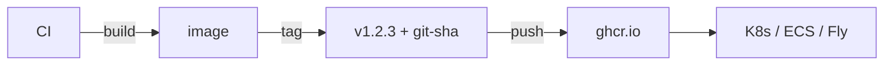

# Chapter 08 — Publish

> Building locally is 10% of the work. Publishing a reproducible, signed, multi-arch image is where Docker pays for itself.

## Learning objectives

- Push images to Docker Hub and GHCR.
- Tag images with versions and immutable digests.
- Build multi-arch images (amd64 + arm64).
- Sign images (Sigstore / cosign) at a high level.

## Prerequisites & recap

- [Dockerfiles](06-dockerfiles.md).

## Concept deep-dive

### Registries

- **Docker Hub** — default; free public, paid private.
- **GHCR** — GitHub Container Registry; free for public, per-repo access.
- **ECR / GCR / ACR** — AWS / Google / Azure.
- **Self-hosted**: Harbor, Distribution (the open-source registry).

### Tagging

```bash
docker tag myapp:latest ghcr.io/you/myapp:1.2.3
docker tag myapp:latest ghcr.io/you/myapp:latest
docker push ghcr.io/you/myapp:1.2.3
docker push ghcr.io/you/myapp:latest
```

A tag points to a **digest** (`sha256:…`). Tags are mutable; digests are not. In production, deploy by digest for immutability:

```
ghcr.io/you/myapp@sha256:abcdef...
```

### Login

```bash
docker login ghcr.io -u you -p $GHCR_TOKEN
docker login              # docker hub
```

In CI, use OIDC or dedicated bot tokens; never hard-code.

### Versioning strategy

- `latest` — mutable pointer (useful for dev, dangerous for prod).
- `MAJOR.MINOR.PATCH` — SemVer for releases.
- `<git-sha>` — every build is unique.

Popular CI pattern: tag every main-branch build with the short git SHA; only add `1.2.3` and `latest` on explicit release.

### Multi-arch images

Apple Silicon and Graviton are ARM. Publish both architectures:

```bash
docker buildx create --use
docker buildx build --platform linux/amd64,linux/arm64 \
  -t ghcr.io/you/myapp:1.2.3 \
  --push .
```

A single tag references a *manifest list* that dispatches to the right arch automatically.

### Size matters

Smaller image = faster pulls = faster scale-up. Targets:

- Node API: < 200 MB.
- Go binary: < 30 MB.
- Python API: < 200 MB.

Use distroless or Alpine bases, multi-stage, `--omit=dev`.

### Secrets in images

Anyone who can pull can inspect every layer. Do **not** bake secrets in — not even in "dev" tags.

### Scanning

Scan images for known CVEs:

- `docker scout cves IMAGE`
- `trivy image IMAGE`
- GitHub container scanning.

Fix high-severity findings before shipping.

### Signing (cosign / Sigstore)

```bash
cosign sign --yes ghcr.io/you/myapp:1.2.3
cosign verify ghcr.io/you/myapp:1.2.3 --certificate-identity …
```

Proves provenance. Adopt when you can.

### CI pipeline

Typical GitHub Actions:

```yaml
- uses: docker/login-action@v3
  with: { registry: ghcr.io, username: ${{ github.actor }}, password: ${{ secrets.GITHUB_TOKEN }} }
- uses: docker/setup-buildx-action@v3
- uses: docker/build-push-action@v6
  with:
    push: true
    platforms: linux/amd64,linux/arm64
    tags: |
      ghcr.io/${{ github.repository }}:${{ github.sha }}
      ghcr.io/${{ github.repository }}:latest
```

Merge to main → image pushed, ready to deploy.

## Worked examples

### Example 1 — First push to GHCR

```bash
echo $GHCR_TOKEN | docker login ghcr.io -u you --password-stdin
docker build -t ghcr.io/you/myapp:0.1.0 .
docker push ghcr.io/you/myapp:0.1.0
```

### Example 2 — Deploy by digest

```bash
docker pull ghcr.io/you/myapp:1.2.3
docker image inspect ghcr.io/you/myapp:1.2.3 --format '{{index .RepoDigests 0}}'
# ghcr.io/you/myapp@sha256:abcdef...
# Use this in Kubernetes manifests for immutable deploys.
```

## Diagrams



*Caption: Trace the flow (data/time/money) through this figure before reading further.*

## Common pitfalls & gotchas

- Relying on `latest` in production.
- Missing arm64 build, breaking Apple Silicon dev.
- Baking secrets; visible in layers forever.
- Registry quota exhaustion for unused images.

## Exercises

1. Warm-up. Tag and push an image to Docker Hub.
2. Standard. Multi-arch build to GHCR via `buildx`.
3. Bug hunt. Why does a colleague on M1 fail to run an image you pushed from x86?
4. Stretch. Add a GitHub Actions workflow that builds + pushes on every merge.
5. Stretch++. Sign the image with cosign; verify in another job.

## In plain terms (newbie lane)
If `Publish` feels abstract, think of it as a practical tool to make your backend work more predictable and easier to debug. Use this chapter to build one clear mental model first, then add details.

> **Newbies often think:** this topic is only theory and memorization.  
> **Actually:** it is a workflow aid that helps you make better decisions under real project pressure.


## Quiz

1. Registry examples:
    (a) Docker Hub, GHCR, ECR (b) npm (c) S3 only (d) none
2. Immutable reference:
    (a) `:latest` (b) `:v1` (c) `@sha256:...` digest (d) tag name
3. Multi-arch images use:
    (a) multiple tags (b) manifest list (c) different filenames (d) RPM
4. Secrets in images:
    (a) safe (b) visible in layers — never (c) only in alpine (d) shielded
5. Preferred CI output tag:
    (a) `latest` always (b) git SHA + semver on releases (c) today's date (d) none

**Short answer:**

6. Why deploy by digest, not tag?
7. One benefit of image signing.

## Mini-project: Apply it

Full brief (goal, acceptance criteria, hints, stretch): [08-publish — mini-project](mini-projects/08-publish-project.md).

## Where this idea reappears

- **Same thread elsewhere:** trace how this chapter’s primitives show up in production systems — not only in this language or layer.
- **Cross-module links (read next when you feel stuck):**
  - [Linux processes and packages](../02-linux/04-programs.md) — what PID 1 and namespaces build on.
  - [Pub/Sub services](../15-pubsub/README.md) — how containers host brokers and workers.

  - [Concept threads (hub)](../appendix-threads/README.md) — state, errors, and performance reading trails.


## Chapter summary

- Tag with version + SHA; deploy by digest.
- Multi-arch for modern devs and production.
- Don't ship secrets in images.

## Further reading

- GitHub Actions + docker/build-push-action docs.
- Sigstore / cosign docs.
- Next module: [Module 15 — Pub/Sub](../15-pubsub/README.md).
