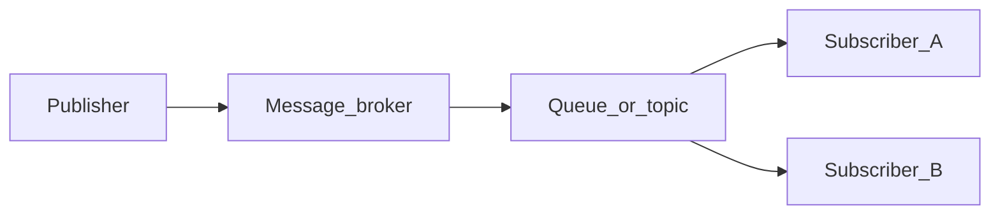

# Chapter 01 — Pub/Sub Architecture

> *"Publish/Subscribe decouples who produces from who consumes. Add a broker in the middle and services stop caring about each other's uptime, language, or geography."*

## Learning objectives

By the end of this chapter you will be able to:

- Contrast pub/sub with request/response and explain when each is appropriate.
- Identify concrete scenarios where pub/sub beats synchronous HTTP.
- Define the core vocabulary: publisher, subscriber, topic, queue, broker.
- Choose between work-queue and fan-out patterns for a given use case.
- Articulate the trade-offs you accept when you adopt asynchronous messaging.

## Prerequisites & recap

- [HTTP servers](../12-http-servers/README.md) — you know how request/response works.
- [Webhooks](../12-http-servers/09-webhooks.md) — you've seen one form of event-driven HTTP.

## The simple version

Imagine you walk into a post office and drop a letter into a mailbox. You don't know who the mail carrier is, you don't know which route the letter takes, and you don't wait at the mailbox for a reply. The post office handles routing, storage, and delivery. That's pub/sub: your service publishes a message, a broker stores and routes it, and one or more subscribers pick it up whenever they're ready.

This decoupling is the whole point. Your API doesn't need to know that the email service, the analytics pipeline, and the billing system all care about a new user registration. It publishes a single `user.registered` event and moves on. Each downstream service subscribes to what it needs, processes at its own pace, and can go offline without breaking the publisher.

## Visual flow

```
  ┌───────────┐         ┌─────────────┐         ┌──────────┐
  │ Publisher  │────────▶│   Broker    │────────▶│ Sub A    │
  │ (API)     │  event   │ (RabbitMQ,  │  route   │ (email)  │
  └───────────┘         │  Kafka...)  │         └──────────┘
                        │             │────────▶┌──────────┐
                        │             │         │ Sub B    │
                        │             │         │ (billing)│
                        │             │────────▶└──────────┘
                        └─────────────┘         ┌──────────┐
                                       ────────▶│ Sub C    │
                                                │ (analytics)
                                                └──────────┘
```
*Figure 1-1. A publisher emits an event; the broker routes copies to every subscriber that cares.*

## System diagram (Mermaid)



*Decoupled delivery: publishers never address subscribers by name.*

## Concept deep-dive

### Two interaction styles — and why both exist

You already know **request/response**: your client sends an HTTP request, the server processes it, the client blocks until it gets a reply. Both sides are coupled in *time* (the client waits) and *identity* (the client must know who to call). That coupling is fine for "give me this user's profile right now" — a synchronous read with an immediate answer.

**Pub/sub** flips both knobs. A publisher says "here's an event that happened" and drops it on a broker. The publisher doesn't know (or care) which consumers will pick it up, or when. Consumers arrive at their own pace. This decoupling in time and identity is why pub/sub exists — it solves a category of problems that synchronous HTTP handles poorly.

### The actors

- **Publisher** — the service that emits messages. It knows *what happened* but doesn't care *who listens*.
- **Subscriber** (consumer) — the service that reads messages. It knows *what it cares about* but doesn't care *who published*.
- **Broker** — the middleman that stores, routes, and delivers messages. RabbitMQ, Kafka, SNS/SQS, Redis Streams, NATS — all brokers with different models.
- **Topic / exchange / stream** — the named channel where messages flow. Think of it as a mailbox label.
- **Queue** — a per-subscriber buffer. The broker pushes messages into queues; consumers drain them.

### When pub/sub wins

You should reach for pub/sub when you see one of these patterns in your system:

- **Slow work off the critical path.** Sending a confirmation email, resizing a thumbnail, running ML inference — none of these should block your API response. Publish an event; let a worker handle it asynchronously.
- **Fan-out.** One event, many consumers. When an order is placed, the email service, CRM, analytics pipeline, and inventory system all need to know. With HTTP you'd make four synchronous calls; with pub/sub you publish once and each subscriber gets its own copy.
- **Backpressure.** Your producer is bursty (flash sales, API spikes) but your downstream systems process at a steady rate. The broker absorbs the burst and feeds consumers at a pace they can handle.
- **Team decoupling.** Different teams own different services. As long as they agree on the event contract (the message shape), they can deploy, scale, and evolve independently. No cross-team deploy coordination.
- **Cross-language interop.** Your API is in TypeScript, your ML pipeline is in Python, your data warehouse loader is in Go. They all speak AMQP or the Kafka protocol equally well.

### When HTTP is perfectly fine

Don't use pub/sub where you don't need it:

- Simple CRUD with an immediate answer ("fetch this user").
- Low traffic where the operational cost of a broker isn't justified.
- No fan-out — a single caller and a single handler.
- You need a synchronous response to show the user right now.

Adding a broker when HTTP would suffice is over-engineering. The broker is another process to run, monitor, and debug. Earn that complexity.

### The four patterns

Almost every pub/sub use case fits one of these four shapes:

1. **Work queue.** Multiple consumers share a single queue. Each message goes to exactly one consumer — whichever picks it up first. This is parallel processing: ten workers draining an `images.resize` queue.
2. **Fan-out.** Every subscriber gets its own copy of every message. One `order.placed` event triggers email *and* SMS *and* a dashboard update. Each service has its own queue bound to the same exchange.
3. **Topic routing.** Messages carry a routing key (like `user.registered` or `order.shipped`). Subscribers declare patterns (`user.*`, `order.#`) and only receive messages that match. This is selective consumption — you hear only what you care about.
4. **Request/reply over broker.** The publisher creates a temporary reply queue and waits for a response message. This is rare and usually a sign that HTTP would have been simpler.

### The trade-offs you accept

Pub/sub isn't free. When you adopt it, you accept:

- **Eventual consistency.** Consumers lag behind the publisher by milliseconds to minutes. If your user signs up and immediately checks their inbox, the welcome email might not be there yet. Your UI must handle this gracefully.
- **Operational complexity.** A broker is another moving part — you need to run, monitor, and upgrade it. Disk fills up, networks partition, consumers crash.
- **Debugging across services.** When something goes wrong, the bug spans processes. You need distributed tracing (correlation IDs, structured logs) to follow a message from publisher to consumer.
- **Idempotency is mandatory.** Messages can be delivered more than once (network hiccups, consumer crashes before ack). Your consumers must handle duplicates without duplicating side effects. This is non-negotiable.

### The ecosystem at a glance

| Broker | Model | Strengths | Best fit |
|---|---|---|---|
| **RabbitMQ** | AMQP, queues + exchanges | Flexible routing, easy to run, explicit acks | General-purpose work queues |
| **Kafka** | Partitioned log | Extreme throughput, replay, exactly-once* | Event sourcing, analytics |
| **AWS SNS + SQS** | Managed fan-out + queue | Zero ops, integrates with AWS ecosystem | AWS-native apps |
| **Redis Streams** | Log in Redis | Lightweight when you already run Redis | Small loads, prototyping |
| **NATS** | Subject-based pub/sub | Fast, lean, JetStream for persistence | Microservices |

This module focuses on **RabbitMQ** — it's the most instructive general-purpose broker and the easiest to run locally.

## Why these design choices

**Why a broker at all, instead of direct service-to-service calls?** Because direct calls create a web of dependencies. Service A calls B, C, and D. When D goes down, A either blocks or needs retry logic for every downstream. A broker centralizes that responsibility: A publishes once, and the broker handles routing, buffering, and redelivery.

**Why RabbitMQ over Kafka for this module?** RabbitMQ's queue-and-exchange model maps more naturally to the work-queue and fan-out patterns that backend engineers encounter first. Kafka is a distributed log — it shines at replay and stream processing, but its mental model (partitions, offsets, consumer groups) is heavier for a first encounter. You'll know when to reach for Kafka by the end of this module.

**Why not just use webhooks?** Webhooks are HTTP callbacks — the producer calls the consumer directly. They work, but they couple the producer to the consumer's uptime and endpoint. If the consumer is down, the producer must retry. If you add a fourth consumer, the producer must be reconfigured. A broker removes that coupling.

**When you'd pick differently:** If your system is small, your traffic is low, and you only have one consumer — use HTTP. If you need real-time, exactly-once stream processing with replay — start with Kafka. If you're all-in on AWS and want zero ops — use SNS/SQS. The right choice depends on your constraints, not on what's trending.

## Production-quality code

```ts
// event-types.ts — shared event contract
export interface UserRegisteredEvent {
  readonly id: string;
  readonly email: string;
  readonly registeredAt: string; // ISO-8601
}

export interface OrderPlacedEvent {
  readonly orderId: string;
  readonly userId: string;
  readonly total: number;
  readonly currency: string;
}

export type DomainEvent =
  | { type: "user.registered"; payload: UserRegisteredEvent }
  | { type: "order.placed"; payload: OrderPlacedEvent };
```

```ts
// publish-event.ts — a thin wrapper showing the pub/sub contract
import amqp from "amqplib";
import { randomUUID } from "crypto";
import type { DomainEvent } from "./event-types.js";

let channel: amqp.ConfirmChannel;

export async function initPublisher(url: string): Promise<void> {
  const conn = await amqp.connect(url);
  channel = await conn.createConfirmChannel();
  await channel.assertExchange("events.topic", "topic", { durable: true });

  process.once("SIGTERM", async () => {
    await channel.close();
    await conn.close();
  });
}

export async function publishEvent(event: DomainEvent): Promise<void> {
  const body = Buffer.from(JSON.stringify(event.payload));
  channel.publish("events.topic", event.type, body, {
    contentType: "application/json",
    persistent: true,
    messageId: randomUUID(),
    timestamp: Date.now(),
  });
  await channel.waitForConfirms();
}
```

This is the publisher side only — the full consumer comes in chapter 04. The key design: typed event contracts shared across services, with the broker as the only coupling point.

## Security notes

- **Broker access control.** RabbitMQ ships with a default `guest`/`guest` account that only works from localhost. In production, create per-service accounts with the minimum required permissions (publish to specific exchanges, consume from specific queues). Never expose the management UI to the public internet.
- **TLS in transit.** AMQP supports TLS. Enable it in production — messages may contain PII (emails, user IDs).
- **Message content.** Don't put secrets (API keys, passwords) in event payloads. If a consumer needs a secret, it should fetch it from a vault, not from the message.

## Performance notes

- **Latency.** Pub/sub adds latency compared to in-process calls (network hop + broker processing). For RabbitMQ with persistent messages: expect 1–5 ms per publish under normal load. This is the cost of decoupling.
- **Throughput.** A single RabbitMQ node on modest hardware pushes 20,000–50,000 messages/second. Your bottleneck will almost certainly be the consumer's downstream (database, HTTP API), not the broker.
- **Broker as bottleneck.** The broker stores messages in memory and on disk. If consumers fall behind, queues grow, memory fills, and the broker starts applying backpressure (blocking publishers). Monitor queue depth as a leading indicator.

## Common mistakes

| Symptom | Cause | Fix |
|---|---|---|
| Using pub/sub for a simple CRUD read that needs an immediate response | Reaching for async where sync is simpler | Use HTTP for synchronous request/response; pub/sub for fire-and-forget or fan-out |
| Users see stale data after an action | Consumer lag creates visible inconsistency; UI assumes synchronous completion | Design the UI for eventual consistency — optimistic updates, polling, or websocket notifications |
| Duplicate side effects (double-charged, double-emailed) | Consumer processes a message, crashes before ack, broker redelivers, consumer processes again without idempotency | Make every consumer idempotent — dedup table, conditional writes, or natural idempotency |
| Broker treated as a permanent database | Queue depth grows forever because no consumer drains it, or messages are "stored" in queues long-term | Queues are buffers, not storage. Set TTLs, DLX, and alerts on depth. Use a real database for durable state |

## Practice

**Warm-up.** List five real events in an application you've built or used (e.g., `user.signed_up`, `payment.completed`). For each, name at least one downstream consumer that would benefit from hearing about it asynchronously.

<details><summary>Show solution</summary>

Example list for an e-commerce app:
1. `user.signed_up` → email service sends welcome email
2. `order.placed` → inventory service reserves stock
3. `payment.completed` → fulfillment service starts shipping
4. `review.posted` → moderation service scans for spam
5. `subscription.cancelled` → analytics service logs churn event

</details>

**Standard.** Design the event flow for a "user signs up" workflow: the API writes the user to the database, then publishes a single event. Three downstream services — email, analytics, and billing — each need to act on it. Draw the flow showing exchanges, queues, and bindings.

<details><summary>Show solution</summary>

```
API writes to DB → publishes "user.registered" to events.topic exchange

events.topic exchange
├── binding: "user.registered" → email.queue     → Email service
├── binding: "user.registered" → analytics.queue  → Analytics service
└── binding: "user.registered" → billing.queue    → Billing service
```

Each service gets its own queue bound to the same exchange with the same routing key. This is a fan-out via topic routing — every service gets a copy.

</details>

**Bug hunt.** A teammate made the email service call synchronous during user registration. Response times went from 80 ms to 2.4 seconds. Explain why, and describe the pub/sub alternative.

<details><summary>Show solution</summary>

The synchronous call blocks the API while the email service processes the request (SMTP connection, template rendering, delivery confirmation). If the email provider is slow or down, the registration endpoint slows or fails entirely. The pub/sub fix: publish a `user.registered` event and return immediately. The email service consumes asynchronously — the user sees a fast response, and the email arrives seconds later.

</details>

**Stretch.** Compare message brokers to HTTP webhooks. List three reasons you'd pick a broker over webhooks and one scenario where webhooks are actually better.

<details><summary>Show solution</summary>

Broker wins:
1. **Retry and buffering** — the broker stores undelivered messages; webhooks require the sender to implement retry logic.
2. **Fan-out without sender changes** — add a new subscriber by binding a queue, not by reconfiguring the publisher.
3. **Backpressure** — the broker absorbs bursts; webhooks dump load directly on the consumer.

Webhooks win when: you're integrating with an external third-party service (like Stripe or GitHub) that you don't control. They publish webhooks; you can't make them publish to your broker.

</details>

**Stretch++.** Research Kafka's partitioned-log model. In two paragraphs, explain when you'd choose Kafka over RabbitMQ and why.

<details><summary>Show solution</summary>

Kafka models messages as an append-only log partitioned by key. Consumers track their offset (position in the log) rather than acknowledging individual messages. This means you can *replay* old messages by resetting the offset — invaluable for event sourcing, rebuilding read models, or launching a new analytics service that needs to process historical data. Kafka's throughput per partition is also higher than RabbitMQ's per-queue dispatch.

Choose Kafka when you need replay, when you're building an event-sourced architecture, when throughput requirements exceed 50k+ msg/s sustained, or when you want stream processing (Kafka Streams, Flink) on the same substrate. Choose RabbitMQ when you need flexible routing (topic, headers, direct exchanges), when your primary pattern is work queues with competing consumers, and when operational simplicity matters more than replay.

</details>

## In plain terms (newbie lane)
If `Pubsub Architecture` feels abstract, think of it as a practical tool to make your backend work more predictable and easier to debug. Use this chapter to build one clear mental model first, then add details.

> **Newbies often think:** this topic is only theory and memorization.  
> **Actually:** it is a workflow aid that helps you make better decisions under real project pressure.


## Quiz

1. Pub/sub decouples:
    (a) network protocols only (b) producers and consumers in time and identity (c) database tables (d) nothing useful

2. A typical message broker is:
    (a) a relational database (b) RabbitMQ, Kafka, or SQS (c) a CDN (d) an ORM

3. In a work-queue pattern, each message is delivered to:
    (a) every subscriber (b) exactly one competing consumer (c) the publisher (d) a cache layer

4. Pub/sub primarily improves:
    (a) read latency (b) decoupling, resiliency, and async processing (c) authentication (d) schema validation

5. Eventual consistency in a pub/sub system:
    (a) is a bug you should eliminate (b) is an inherent property of async decoupling (c) only exists in Kafka (d) is always avoidable

**Short answer:**

6. Give one concrete reason to prefer a message broker over HTTP webhooks for inter-service communication.

7. Why is idempotency critical in pub/sub consumers?

*Answers: 1-b, 2-b, 3-b, 4-b, 5-b.*

## Learn-by-doing mini-project

Full brief (goal, acceptance criteria, hints, stretch): [01-pubsub-architecture — mini-project](mini-projects/01-pubsub-architecture-project.md).

## Where this idea reappears

- **Same thread elsewhere:** trace how this chapter’s primitives show up in production systems — not only in this language or layer.
- **Cross-module links (read next when you feel stuck):**
  - [HTTP webhooks](../12-http-servers/09-webhooks.md) — synchronous cousin to async messaging.
  - [JSON and serialization](../10-http-clients/06-json.md) — message payloads cross language boundaries.

  - [Concept threads (hub)](../appendix-threads/README.md) — state, errors, and performance reading trails.


## Chapter summary

- Pub/sub is broker-mediated async messaging that decouples producers from consumers in time and identity.
- Fan-out (one event, many subscribers) and work-queue (one event, one competing consumer) cover the vast majority of use cases.
- You trade decoupling for eventual consistency, operational complexity, and mandatory idempotency.
- RabbitMQ is the module's focus — a flexible, general-purpose broker that teaches the patterns clearly.

## Further reading

- *Designing Data-Intensive Applications*, Martin Kleppmann — chapter 11 on messaging and stream processing.
- [Enterprise Integration Patterns](https://www.enterpriseintegrationpatterns.com/) — the canonical reference for messaging patterns.
- Next: [message brokers](02-message-brokers.md).
