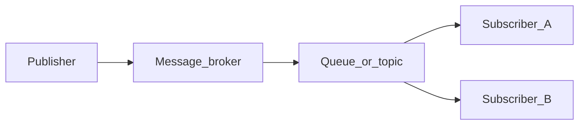

# Chapter 02 — Message Brokers

> *"The broker is the gravity of a pub/sub system. Pick one, learn it well, and hang your services off it."*

## Learning objectives

By the end of this chapter you will be able to:

- Compare RabbitMQ, Kafka, Redis Streams, and SNS/SQS on model, strengths, and fit.
- Run RabbitMQ locally with Docker and navigate its management UI.
- Define RabbitMQ's core concepts: exchange, queue, binding, and message.
- Distinguish the four exchange types and explain when you'd use each.
- Configure durability and understand the latency trade-off it introduces.

## Prerequisites & recap

- [Docker](../14-docker/README.md) — you can run containers locally.
- [Pub/sub architecture](01-pubsub-architecture.md) — you know why a broker exists.

## The simple version

A message broker is the post office from chapter 01 made concrete. It's a piece of software that sits between your publishers and subscribers, accepting messages, storing them temporarily, and routing them to the right queues. Different brokers make different trade-offs: RabbitMQ gives you flexible routing and explicit acknowledgements, Kafka gives you a replayable log with extreme throughput, and managed services like SNS/SQS trade flexibility for zero operational burden.

You're going to learn RabbitMQ first because its exchange-queue-binding model teaches you the *mechanics* of message routing in a way that transfers to every other broker. Once you understand how RabbitMQ routes a message from an exchange through a binding to a queue, you'll recognize the same pattern — with different vocabulary — in Kafka, NATS, and cloud-managed services.

## Visual flow

```
                       ┌───────────────────────────┐
                       │        RabbitMQ            │
  ┌──────────┐         │                           │
  │Publisher │──AMQP──▶│  Exchange ──binding──▶ Queue A ──▶ Consumer A
  └──────────┘         │     │                     │
                       │     └─────binding──▶ Queue B ──▶ Consumer B
                       │                           │
                       │  :5672  AMQP port         │
                       │  :15672 Management UI     │
                       └───────────────────────────┘
```
*Figure 2-1. A publisher sends to an exchange; bindings route to queues; consumers drain queues.*

## System diagram (Mermaid)



*Decoupled delivery: publishers never address subscribers by name.*

## Concept deep-dive

### The landscape

Before you commit to a broker, you should understand what's out there and *why* each one exists.

| Broker | Model | Strengths | Best fit |
|---|---|---|---|
| **RabbitMQ** | AMQP, queues + exchanges | Flexible routing, small/medium scale, explicit acks | General-purpose work queues |
| **Kafka** | Partitioned log | Extreme throughput, replay, exactly-once semantics | Event sourcing, analytics |
| **SNS/SQS** (AWS) | Topic + queue (managed) | Zero ops, deep AWS integration | AWS-native apps |
| **Redis Streams** | Log stored in Redis | Lightweight, reuses existing Redis | Small loads, prototyping |
| **NATS** | Subject-based pub/sub | Extremely fast, JetStream for persistence | Microservices |

This module focuses on **RabbitMQ** — not because it's "the best" but because its explicit model (exchanges, bindings, queues, acks) forces you to understand what every broker does implicitly.

### RabbitMQ's core concepts

RabbitMQ implements the AMQP 0-9-1 protocol. Here's the mental model:

- **Message** — a blob of bytes plus metadata (content-type, headers, timestamp). The broker doesn't look inside the body; it routes based on metadata and binding rules.
- **Exchange** — the entry point for messages. A publisher sends to an exchange, never directly to a queue. The exchange's job is to route the message to zero or more queues based on rules.
- **Queue** — an ordered buffer of messages waiting for consumers. Messages sit here until a consumer picks them up and acknowledges them.
- **Binding** — a rule that links an exchange to a queue. It says "messages matching *this pattern* should go to *that queue*." Without bindings, messages published to an exchange are silently discarded.
- **Consumer** — a process subscribed to a queue. It receives messages, processes them, and acknowledges (or rejects) them.
- **Publisher** — a process that sends messages to an exchange.

### The four exchange types

Exchanges differ in *how* they decide which queues get a copy of each message:

**Direct exchange** — routes by exact match on the routing key. If you publish with routing key `user.registered` and a queue is bound with `user.registered`, it gets the message. If the keys don't match exactly, the queue gets nothing. Use this when each message type goes to exactly one queue.

**Fanout exchange** — ignores the routing key entirely and copies every message to every bound queue. This is the simplest fan-out: publish once, every subscriber gets a copy. Use this for broadcast scenarios (e.g., "every service should know about this config change").

**Topic exchange** — routes by pattern-matching on dotted routing keys. Two wildcards are available:
- `*` matches exactly one token: `user.*` matches `user.registered` but not `user.login.success`.
- `#` matches zero or more tokens: `user.#` matches `user.registered`, `user.login.success`, and plain `user`.

Use topic exchanges for selective consumption — they're the most flexible and the one you'll use most often.

**Headers exchange** — routes based on message header key-value pairs rather than the routing key. Rarely used in practice; topic exchanges cover almost all routing needs.

### Running RabbitMQ locally

One Docker command gets you a fully working broker with a management UI:

```bash
docker run -d --name rabbit \
  -p 5672:5672 -p 15672:15672 \
  --hostname rabbit \
  rabbitmq:3-management
```

- **Port 5672** — the AMQP protocol port. Your application connects here.
- **Port 15672** — the management UI. Open `http://localhost:15672` in your browser. Default credentials: `guest` / `guest`.

The management UI shows you exchanges, queues, bindings, message rates, queue depth, and consumer counts in real time. Bookmark it — you'll live in this tab while developing.

### The management CLI

For scripting or quick checks, RabbitMQ's CLI tools are available inside the container:

```bash
docker exec -it rabbit rabbitmqctl list_queues name messages consumers
docker exec -it rabbit rabbitmqadmin declare queue name=events
```

`rabbitmqctl` is the administrative tool; `rabbitmqadmin` is a convenience wrapper for declaring topology. Both are useful for debugging and automation.

### Durability: the persistence trade-off

By default, queues and messages are transient — they live in memory and vanish if the broker restarts. To survive restarts, you need *both*:

- **Durable queue** — the queue definition survives a broker restart.
- **Persistent message** — the message body is flushed to disk before the broker acknowledges the publish.

You need *both* because a durable queue with transient messages simply means "the empty queue survives, but all messages in it are lost." And a persistent message published to a non-durable queue is lost when the queue disappears.

The trade-off: persistence costs latency. Every persistent message triggers an `fsync` (or batched equivalent). For messages you can afford to lose (metrics, debug events), skip persistence. For anything that represents real work (orders, payments, user actions), always persist.

### Acknowledgements

When a consumer receives a message, the broker needs to know whether it was processed successfully. This is the acknowledgement (ack) protocol:

- **Auto-ack** — the broker deletes the message the instant it delivers it. If the consumer crashes mid-processing, the message is gone.
- **Manual ack** — the consumer explicitly calls `ack` after successful processing. If the consumer crashes before acking, the broker redelivers the message to another consumer.

Always use manual ack for anything that matters. Auto-ack is only appropriate for fire-and-forget telemetry where losing a message is acceptable.

### Kafka by contrast

Kafka is fundamentally different from RabbitMQ. Where RabbitMQ is a *broker* (it routes messages and deletes them after ack), Kafka is a *log* (it appends messages to partitions and retains them for a configured duration — hours, days, or forever).

In Kafka, consumers track their *offset* — their position in the log. Fan-out is free because every consumer group reads the same log independently. Re-processing old events is trivial: just reset the offset.

Use Kafka for event *sourcing* and analytics. Use RabbitMQ for event-driven *work* (task queues, routing-heavy pipelines). They solve adjacent problems; the switch is a change of model, not an upgrade.

## Why these design choices

**Why exchanges instead of publishing directly to queues?** Because exchanges give you routing flexibility without changing the publisher. If you add a new analytics service next month, you bind a new queue to the existing exchange — the publisher doesn't change, doesn't redeploy, doesn't even know. Direct-to-queue publishing locks you into a 1:1 relationship.

**Why four exchange types?** Different routing problems need different strategies. Fanout is the simplest (broadcast), direct is the most precise (exact match), topic is the most flexible (patterns), and headers covers edge cases. In practice, you'll use topic 80% of the time.

**Why manual ack by default?** Because the alternative — auto-ack — silently loses messages when consumers crash. The cost of manual ack is one extra `ch.ack(msg)` call per message. The cost of auto-ack is data loss during any consumer failure. The asymmetry is clear.

**When you'd pick differently:** If you're in AWS and want zero broker ops, use SNS + SQS — you lose routing flexibility but gain managed scaling and integrated monitoring. If you need replay, use Kafka. If you need sub-millisecond latency and can tolerate at-most-once, use NATS without persistence.

## Production-quality code

```ts
// broker-setup.ts — idempotent RabbitMQ topology declaration
import amqp from "amqplib";

export async function setupBroker(url: string) {
  const conn = await amqp.connect(url);
  const ch = await conn.createChannel();

  await ch.assertExchange("events.topic", "topic", { durable: true });
  await ch.assertExchange("events.dlx", "fanout", { durable: true });

  await ch.assertQueue("events.dead", { durable: true });
  await ch.bindQueue("events.dead", "events.dlx", "");

  await ch.assertQueue("user.events", {
    durable: true,
    deadLetterExchange: "events.dlx",
  });
  await ch.bindQueue("user.events", "events.topic", "user.*");

  await ch.assertQueue("order.events", {
    durable: true,
    deadLetterExchange: "events.dlx",
  });
  await ch.bindQueue("order.events", "events.topic", "order.#");

  await ch.assertQueue("audit.all", {
    durable: true,
    deadLetterExchange: "events.dlx",
  });
  await ch.bindQueue("audit.all", "events.topic", "#");

  console.log("Topology declared: events.topic → user.events, order.events, audit.all");
  await ch.close();
  await conn.close();
}
```

```bash
# docker-compose.yml for a local RabbitMQ with management UI
# Run: docker compose up -d
```

```yaml
# docker-compose.yml
services:
  rabbitmq:
    image: rabbitmq:3-management
    hostname: rabbit
    ports:
      - "5672:5672"
      - "15672:15672"
    environment:
      RABBITMQ_DEFAULT_USER: app
      RABBITMQ_DEFAULT_PASS: devpassword
    volumes:
      - rabbit-data:/var/lib/rabbitmq
volumes:
  rabbit-data:
```

The `setupBroker` function is idempotent — `assertExchange` and `assertQueue` create if missing, verify if present. Run it on deploy; it's safe to call repeatedly.

## Security notes

- **Default credentials.** The `guest`/`guest` account only works from localhost by design. In production, create per-service accounts via `rabbitmqctl add_user` with minimal permissions. Never expose port 15672 (management UI) to the public internet without authentication and TLS.
- **Network segmentation.** The broker should live in a private network segment. Only application services need AMQP access; only ops needs management UI access.
- **TLS.** Enable TLS on port 5671 for encrypted AMQP in production. RabbitMQ's TLS config is well-documented; the cost is a few milliseconds of handshake per connection (amortized since you reuse connections).

## Performance notes

- **Single-node throughput.** A RabbitMQ node on modest hardware handles 20,000–50,000 persistent messages/second. Non-persistent: 80,000+. Your bottleneck will almost certainly be downstream (database writes, HTTP calls).
- **Persistence cost.** Durable queues + persistent messages cut throughput roughly in half vs transient, because of disk fsync. Batch publisher confirms (`waitForConfirms()` every N messages) amortize this cost.
- **Memory.** Queues hold messages in RAM by default. If consumers fall behind, memory grows. RabbitMQ applies flow control (blocks publishers) when memory exceeds `vm_memory_high_watermark` (default 40% of system RAM). Lazy queues (`x-queue-mode: lazy`) push messages to disk immediately, trading latency for memory stability.

## Common mistakes

| Symptom | Cause | Fix |
|---|---|---|
| Messages vanish after a broker restart | Queue is durable but messages are published without `persistent: true` | Always set `persistent: true` on the publish options for important messages |
| Publishing directly to a queue (bypassing the exchange) | Misunderstanding the AMQP model; loses routing flexibility | Publish to an exchange with appropriate bindings; use the default exchange only for quick tests |
| Management UI is accessible from the public internet | Port 15672 exposed without firewalling | Bind management UI to localhost or a VPN; use a reverse proxy with auth for remote access |
| One queue used for many unrelated workloads | Convenience over correctness; one slow consumer blocks all work | Separate queues per workload, each with appropriate bindings |
| Queue created but no bindings | Exchange has no rules to route to the queue; messages are silently dropped | Always bind queues to exchanges; use `assertQueue` + `bindQueue` together |

## Practice

**Warm-up.** Run RabbitMQ in Docker using the command from this chapter. Visit the management UI at `localhost:15672`. Navigate to the Exchanges, Queues, and Bindings tabs. Take a screenshot or note what you see.

<details><summary>Show solution</summary>

After running `docker run -d --name rabbit -p 5672:5672 -p 15672:15672 rabbitmq:3-management`, open `http://localhost:15672` and log in with `guest`/`guest`. You'll see several default exchanges (amq.direct, amq.fanout, amq.topic, amq.headers, and the default `""` exchange). The Queues tab will be empty until you declare one.

</details>

**Standard.** Using the management UI, declare a topic exchange called `events.topic`, a queue called `user.events`, and a binding from the exchange to the queue with routing key `user.*`. Publish a test message with routing key `user.registered` from the exchange's "Publish message" panel and verify it appears in the queue.

<details><summary>Show solution</summary>

1. Exchanges tab → Add exchange → name: `events.topic`, type: `topic`, durable: checked.
2. Queues tab → Add queue → name: `user.events`, durable: checked.
3. Click into `user.events` → Bindings → From exchange: `events.topic`, routing key: `user.*`.
4. Go to `events.topic` exchange → Publish message → routing key: `user.registered`, payload: `{"test": true}`.
5. Check `user.events` queue — message count should show 1 ready.

</details>

**Bug hunt.** You declared a durable queue, published 1,000 messages, and restarted the broker with `docker restart rabbit`. All 1,000 messages are gone. Why?

<details><summary>Show solution</summary>

The queue is durable (its definition survives restart) but the messages were published without `persistent: true`. Transient messages live in memory only and are lost on restart. Fix: set `persistent: true` in the publish options.

</details>

**Stretch.** Use `rabbitmqctl list_queues name messages consumers` inside the container to inspect queue depth from the command line. Publish 50 messages and verify the count matches.

<details><summary>Show solution</summary>

```bash
docker exec -it rabbit rabbitmqctl list_queues name messages consumers
```

Output should show `user.events 50 0` (50 messages, 0 consumers). If the count doesn't match, check whether a consumer was accidentally running and draining the queue.

</details>

**Stretch++.** Run Kafka via Redpanda in Docker (`docker run -d --name redpanda -p 9092:9092 redpandadata/redpanda`). Create a topic, produce a message, and consume it. Write two paragraphs comparing the mental model to RabbitMQ.

<details><summary>Show solution</summary>

Redpanda is a Kafka-compatible broker. After starting it:

```bash
docker exec -it redpanda rpk topic create user-events
docker exec -it redpanda rpk topic produce user-events
# type a message, press Ctrl+D
docker exec -it redpanda rpk topic consume user-events
```

Key difference: Kafka/Redpanda doesn't have exchanges or bindings. You produce to a *topic* (a log), and consumers read from that log at their own offset. Messages aren't deleted after consumption — they stay in the log until the retention period expires. This means any new consumer can replay from the beginning, which RabbitMQ can't do (messages are deleted on ack). The trade-off: Kafka's routing is simpler (partition by key), while RabbitMQ's exchange/binding model gives you richer routing logic.

</details>

## In plain terms (newbie lane)
If `Message Brokers` feels abstract, think of it as a practical tool to make your backend work more predictable and easier to debug. Use this chapter to build one clear mental model first, then add details.

> **Newbies often think:** this topic is only theory and memorization.  
> **Actually:** it is a workflow aid that helps you make better decisions under real project pressure.


## Quiz

1. RabbitMQ's AMQP protocol port is:
    (a) 15672 (b) 5672 (c) 5432 (d) 80

2. RabbitMQ's four exchange types are:
    (a) direct, fanout, topic, headers (b) only fanout (c) only direct (d) random, round-robin, hash, broadcast

3. Kafka's primary model compared to RabbitMQ is:
    (a) identical (b) partitioned log vs queues + exchanges (c) reversed roles (d) both are logs

4. Surviving a broker restart requires:
    (a) durable queue AND persistent messages (b) only a durable queue (c) only persistent messages (d) nothing — brokers never crash

5. The management UI runs on port:
    (a) 5672 (b) 15672 (c) 3000 (d) 8080

**Short answer:**

6. Why would you pick Kafka over RabbitMQ for "replay 30 days of events when launching a new analytics service"?

7. Name one security practice for production RabbitMQ deployments.

*Answers: 1-b, 2-a, 3-b, 4-a, 5-b.*

## Learn-by-doing mini-project

Full brief (goal, acceptance criteria, hints, stretch): [02-message-brokers — mini-project](mini-projects/02-message-brokers-project.md).

## Where this idea reappears

- **Same thread elsewhere:** trace how this chapter’s primitives show up in production systems — not only in this language or layer.
- **Cross-module links (read next when you feel stuck):**
  - [HTTP webhooks](../12-http-servers/09-webhooks.md) — synchronous cousin to async messaging.
  - [JSON and serialization](../10-http-clients/06-json.md) — message payloads cross language boundaries.

  - [Concept threads (hub)](../appendix-threads/README.md) — state, errors, and performance reading trails.


## Chapter summary

- Brokers differ in model and trade-offs; RabbitMQ (queues + exchanges) is a great default for learning and for most work-queue scenarios.
- Exchange → binding → queue is the routing chain. Publish to exchanges, never directly to queues.
- Durability requires *both* a durable queue and persistent messages — one without the other still loses data.
- The management UI at `:15672` is your primary debugging tool during development.

## Further reading

- [RabbitMQ Tutorials](https://www.rabbitmq.com/tutorials) — the official step-by-step guides.
- [RabbitMQ in Depth](https://www.manning.com/books/rabbitmq-in-depth) by Gavin M. Roy — comprehensive reference.
- Next: [publishers and queues](03-publishers-and-queues.md).
