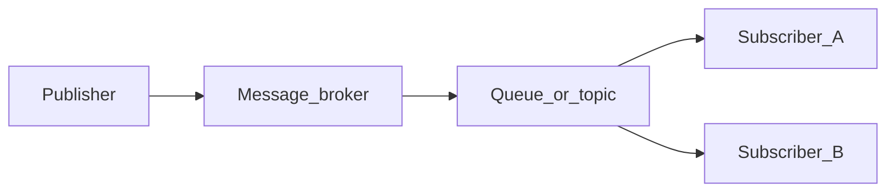

# Chapter 04 — Subscribers and Routing

> *"Consumers do work. Routing decides which consumers see which messages. Get routing right and your system grows gracefully."*

## Learning objectives

By the end of this chapter you will be able to:

- Write a subscriber that consumes messages, processes them, and acknowledges correctly.
- Use topic exchange patterns (`*` and `#`) for selective consumption.
- Control concurrency with prefetch to prevent consumer overload.
- Implement bounded retries with a dead-letter exchange.
- Scale horizontally with competing consumers on a shared queue.
- Shut down consumers gracefully without losing in-flight messages.

## Prerequisites & recap

- [Publishers and queues](03-publishers-and-queues.md) — you can publish messages with confirms.

## The simple version

A subscriber is a long-running process that listens on a queue and processes messages as they arrive. When a message shows up, your handler runs — maybe it inserts a row into a database, sends an email, or calls an external API. If the handler succeeds, you acknowledge the message (`ack`) and the broker deletes it. If the handler fails, you reject the message (`nack`) and the broker either requeues it for retry or routes it to a dead-letter exchange.

The tricky part isn't processing — it's *flow control*. Without a prefetch limit, the broker dumps every available message onto your consumer at once, and a slow handler causes memory exhaustion. With prefetch, you tell the broker "only give me N unacknowledged messages at a time," creating natural backpressure. This single setting — prefetch — is the difference between a consumer that handles load gracefully and one that crashes under it.

## Visual flow

```
  events.topic exchange
       │
       ├── "user.registered" ──▶ ┌──────────────┐
       │                         │ email.queue  │──▶ Email Worker
       │                         └──────────────┘
       ├── "user.*" ────────────▶ ┌──────────────┐
       │                         │ crm.queue    │──▶ CRM Worker
       │                         └──────────────┘
       └── "#" ─────────────────▶ ┌──────────────┐
                                  │ audit.queue  │──▶ Audit Worker
                                  └──────────────┘
```
*Figure 4-1. Topic routing: each queue binds a pattern; only matching messages arrive.*

## System diagram (Mermaid)



*Decoupled delivery: publishers never address subscribers by name.*

## Concept deep-dive

### The basic consumer

Here's the minimal shape of a reliable consumer:

```ts
import amqp from "amqplib";

const conn = await amqp.connect(process.env.AMQP_URL!);
const ch = await conn.createChannel();

await ch.assertExchange("events.topic", "topic", { durable: true });
await ch.assertQueue("user.service", {
  durable: true,
  deadLetterExchange: "events.dlx",
});
await ch.bindQueue("user.service", "events.topic", "user.*");
await ch.prefetch(10);

await ch.consume("user.service", async (msg) => {
  if (!msg) return;
  try {
    const body = JSON.parse(msg.content.toString());
    await handleEvent(msg.fields.routingKey, body);
    ch.ack(msg);
  } catch (err) {
    ch.nack(msg, false, false); // no requeue → DLX
  }
});
```

Every line matters: `assertQueue` with DLX ensures rejected messages don't vanish. `prefetch(10)` prevents the broker from flooding the consumer. Manual `ack`/`nack` gives you control over when the broker considers a message "done."

### Routing keys and topic bindings

Topic exchanges are the workhorse of selective consumption. Messages carry a dotted routing key like `user.registered` or `order.payment.confirmed`. Bindings use patterns:

- **`*`** matches exactly one dot-separated token. `user.*` matches `user.registered` and `user.deleted`, but not `user.login.success` (three tokens).
- **`#`** matches zero or more tokens. `user.#` matches `user`, `user.registered`, and `user.login.success`.

This lets you build a routing tree:

```
events.topic
├── user.registered  → email.queue   (exact events only)
├── user.*           → crm.queue     (all user events)
├── order.#          → order.queue   (all order events, any depth)
└── #                → audit.queue   (everything — the catch-all)
```

Why topic over direct? Because as your system grows, you'll add new event types (`user.password_reset`, `user.email_verified`). With a topic binding of `user.*`, the CRM queue automatically receives them without rebinding. With direct, you'd need to add a new binding for each event type.

### Prefetch: the concurrency dial

Without prefetch, the broker sends messages as fast as the network allows. A slow handler means messages pile up in your process's memory buffer until you run out of RAM.

```ts
await ch.prefetch(10);
```

This tells the broker: "don't give me more than 10 unacknowledged messages at a time." When you ack one, the broker sends the next. This is your primary tool for:

- **Throughput.** Too-low prefetch (e.g., 1) means the consumer idles while waiting for the next dispatch. Too-high prefetch risks memory exhaustion and uneven distribution across competing consumers.
- **Fairness.** With low prefetch, work spreads evenly across consumers. With high prefetch, one fast consumer can hoard messages.
- **Backpressure.** When your downstream (database, HTTP API) slows down, prefetch limits how much damage accumulates.

Starting point: `prefetch = 2 × number_of_cores` for CPU-bound handlers, or `target_throughput × average_handler_time` for I/O-bound ones.

### Ack modes

- **Auto-ack** (`{ noAck: true }` in `consume`). The broker deletes the message the moment it delivers it. If your handler crashes mid-processing, the message is gone forever. Only use this for telemetry you can afford to lose.
- **Manual ack** (`ch.ack(msg)`). You explicitly tell the broker "I processed this successfully, delete it." If you crash before acking, the broker redelivers to another consumer.
- **Nack** (`ch.nack(msg, allUpTo, requeue)`). Tells the broker the message failed. `requeue=true` puts it back at the head of the queue (risk: infinite loop). `requeue=false` routes to the DLX if configured, otherwise discards.
- **Reject** (`ch.reject(msg, requeue)`). Older single-message variant of nack. Same semantics.

The rule: always use manual ack for anything that matters.

### Competing consumers

You scale consumers horizontally by running N instances of the same consumer, all subscribed to the same queue. The broker round-robins messages across consumers (specifically: it dispatches to whichever consumer has prefetch headroom). Linear scale until you hit the downstream bottleneck (usually the database).

```
  ┌──────────────┐
  │  work.queue  │──▶ Worker 1  (prefetch 10)
  │              │──▶ Worker 2  (prefetch 10)
  │              │──▶ Worker 3  (prefetch 10)
  └──────────────┘
```

Deploy the same container image N times, all connecting to the same queue. The broker handles distribution. This is the work-queue pattern from chapter 01, made concrete.

### Fan-out via multiple queues

For fan-out (every subscriber gets a copy), bind *different* queues to the same exchange:

```ts
await ch.bindQueue("email.queue", "events.topic", "user.registered");
await ch.bindQueue("analytics.queue", "events.topic", "user.registered");
await ch.bindQueue("billing.queue", "events.topic", "user.registered");
```

Each queue gets its own copy of every `user.registered` message. Each service consumes from its own queue independently.

### Bounded retries with DLX

Unbounded requeue creates a poison-message loop: the message fails, gets requeued, fails again, forever. Instead, track retry count in a header and cap it:

```ts
async function handleWithRetry(msg: amqp.ConsumeMessage): Promise<void> {
  const attempts = Number(msg.properties.headers?.["x-attempts"] ?? 0);
  try {
    const body = JSON.parse(msg.content.toString());
    await processEvent(body);
    ch.ack(msg);
  } catch (err) {
    if (attempts >= 3) {
      ch.nack(msg, false, false); // give up → DLX
      return;
    }
    // republish with incremented attempt counter
    ch.publish(
      msg.fields.exchange,
      msg.fields.routingKey,
      msg.content,
      {
        ...msg.properties,
        headers: { ...msg.properties.headers, "x-attempts": attempts + 1 },
      },
    );
    ch.ack(msg); // ack the original to remove it from the queue
  }
}
```

For production, consider a **delay plugin** or a TTL'd "retry queue" whose DLX points back to the work queue. This prevents tight retry loops and gives transient errors time to resolve.

### Graceful shutdown

When your process receives SIGTERM (e.g., during a deploy), you want to finish in-flight messages before closing:

```ts
let shuttingDown = false;

process.once("SIGTERM", async () => {
  shuttingDown = true;
  await ch.cancel(consumerTag); // stop receiving new messages
  // in-flight handlers will finish and ack/nack naturally
  // then close
  setTimeout(async () => {
    await ch.close();
    await conn.close();
    process.exit(0);
  }, 30_000); // grace period for in-flight work
});
```

The key: `ch.cancel(consumerTag)` tells the broker to stop delivering new messages, but doesn't interrupt messages already being processed. Your handlers finish, ack, and then you close cleanly.

## Why these design choices

**Why manual ack over auto-ack?** Auto-ack is a bet that your consumer never crashes, never throws, and never needs to retry. That bet loses exactly when it matters most — under high load or during transient failures. Manual ack costs one extra line of code and gives you crash resilience.

**Why prefetch instead of just "consuming everything"?** Because consuming everything works right up until your consumer can't process as fast as the broker delivers. Then memory grows until OOM. Prefetch is the backpressure mechanism that prevents this. It's not optional — it's the safety valve.

**Why republish for retries instead of `nack(msg, false, true)` (requeue)?** Requeue puts the message back at the *front* of the queue. If the failure is caused by the message itself (a poison message), it'll immediately fail again, blocking the queue. Republishing to the exchange puts it at the *end* and lets you add metadata (retry count), giving other messages a chance to be processed.

**When you'd pick differently:** If your use case tolerates message loss (fire-and-forget metrics), auto-ack with high prefetch is the fastest option. If you need strict ordered processing, run a single consumer with prefetch 1 — but accept the throughput ceiling.

## Production-quality code

```ts
// consumer.ts — production consumer with prefetch, retries, DLX, and graceful shutdown
import amqp, { type Channel, type Connection, type ConsumeMessage } from "amqplib";

const MAX_RETRIES = 3;

let conn: Connection;
let ch: Channel;
let consumerTag: string;

export async function startConsumer(
  url: string,
  queue: string,
  exchange: string,
  bindingKey: string,
  handler: (routingKey: string, body: unknown) => Promise<void>,
): Promise<void> {
  conn = await amqp.connect(url);
  ch = await conn.createChannel();

  await ch.assertExchange(exchange, "topic", { durable: true });
  await ch.assertExchange("events.dlx", "fanout", { durable: true });
  await ch.assertQueue("events.dead", { durable: true });
  await ch.bindQueue("events.dead", "events.dlx", "");

  await ch.assertQueue(queue, {
    durable: true,
    deadLetterExchange: "events.dlx",
  });
  await ch.bindQueue(queue, exchange, bindingKey);
  await ch.prefetch(10);

  const { consumerTag: tag } = await ch.consume(queue, async (msg) => {
    if (!msg) return;
    await processMessage(msg, handler);
  });
  consumerTag = tag;

  process.once("SIGTERM", gracefulShutdown);
  process.once("SIGINT", gracefulShutdown);

  console.log(`Consumer started on ${queue} [${bindingKey}]`);
}

async function processMessage(
  msg: ConsumeMessage,
  handler: (routingKey: string, body: unknown) => Promise<void>,
): Promise<void> {
  const attempts = Number(msg.properties.headers?.["x-attempts"] ?? 0);

  try {
    const body = JSON.parse(msg.content.toString());
    await handler(msg.fields.routingKey, body);
    ch.ack(msg);
  } catch (err) {
    if (attempts >= MAX_RETRIES) {
      console.error(`Message ${msg.properties.messageId} failed after ${MAX_RETRIES} retries, routing to DLX`);
      ch.nack(msg, false, false);
      return;
    }

    ch.publish(msg.fields.exchange, msg.fields.routingKey, msg.content, {
      ...msg.properties,
      headers: { ...msg.properties.headers, "x-attempts": attempts + 1 },
    });
    ch.ack(msg);
  }
}

async function gracefulShutdown(): Promise<void> {
  console.log("Shutting down consumer...");
  try {
    await ch.cancel(consumerTag);
    await new Promise((r) => setTimeout(r, 5_000)); // drain in-flight
    await ch.close();
    await conn.close();
  } catch {
    // already closing
  }
  process.exit(0);
}
```

```ts
// usage
import { startConsumer } from "./consumer.js";

await startConsumer(
  process.env.AMQP_URL ?? "amqp://localhost",
  "user.service",
  "events.topic",
  "user.*",
  async (routingKey, body) => {
    console.log(`Handling ${routingKey}:`, body);
    // your business logic here
  },
);
```

## Security notes

- **Consumer credentials.** Each consumer service should connect with its own RabbitMQ account, with permissions limited to the queues it needs. A compromised consumer shouldn't be able to read from unrelated queues.
- **Message validation.** Never trust the message body blindly. Parse and validate (e.g., with Zod) before acting on it. A malformed message from a buggy publisher shouldn't crash your consumer or corrupt your database.
- **DLX monitoring.** A growing dead-letter queue is an operational signal. Alert on it — it may indicate a poisoned message, a consumer bug, or an attack.

## Performance notes

- **Prefetch tuning.** Start with `prefetch = 10` and measure. If your handler averages 50 ms and you need 1,000 msg/s, you need `1000 × 0.05 = 50` concurrent messages in flight. That's either 5 consumers × prefetch 10 or 2 consumers × prefetch 25. Measure and adjust.
- **Serial vs parallel handlers.** Node.js `ch.consume` calls your handler for each message, but if your handler is async and you have prefetch > 1, multiple handlers run concurrently (they're all on the event loop). This is usually what you want, but be aware of shared state.
- **Competing consumer scaling.** Adding consumers is linear — 2× consumers ≈ 2× throughput — until you hit the downstream bottleneck (database connections, rate limits). Profile the handler, not the consumer framework.

## Common mistakes

| Symptom | Cause | Fix |
|---|---|---|
| Consumer pulls 1,000 messages instantly and runs out of memory | No prefetch set; broker dumps all available messages | Set `ch.prefetch(N)` before calling `consume`; start with 10 and tune |
| Auto-ack on important data; messages lost during crashes | Using `{ noAck: true }` for convenience | Switch to manual ack; ack after the side effect is complete |
| Infinite retry loop on a poison message | `nack(msg, false, true)` without a retry counter | Track attempts in a header; cap retries at 3–5; route to DLX on exhaustion |
| Consumer runs handlers serially despite prefetch > 1 | Handler uses synchronous blocking code or awaits sequentially | Ensure handler is truly async; let the event loop dispatch multiple concurrent handlers |
| Deploy kills in-flight messages | Process exits immediately on SIGTERM without draining | Cancel the consumer tag on SIGTERM; wait for in-flight handlers to finish before closing |

## Practice

**Warm-up.** Write a consumer that subscribes to a queue and prints each message's routing key and body.

<details><summary>Show solution</summary>

```ts
import amqp from "amqplib";

const conn = await amqp.connect("amqp://localhost");
const ch = await conn.createChannel();

await ch.assertQueue("test.queue", { durable: false });
await ch.consume("test.queue", (msg) => {
  if (!msg) return;
  console.log(`[${msg.fields.routingKey}]`, msg.content.toString());
  ch.ack(msg);
});
```

</details>

**Standard.** Build a consumer with prefetch 5 and manual ack. Simulate a failure (throw on every 3rd message) and verify that failed messages route to the DLX queue.

<details><summary>Show solution</summary>

```ts
let count = 0;

await ch.prefetch(5);
await ch.consume("work.queue", async (msg) => {
  if (!msg) return;
  count++;
  if (count % 3 === 0) {
    console.log("Simulated failure, nacking to DLX");
    ch.nack(msg, false, false);
    return;
  }
  console.log("Processing:", msg.content.toString());
  ch.ack(msg);
});
```

Check the DLX queue in the management UI — it should contain every 3rd message.

</details>

**Bug hunt.** Your consumer's throughput drops to zero under load. Queue depth is 50,000. The consumer process shows no CPU usage and no errors. What's wrong?

<details><summary>Show solution</summary>

No prefetch is set. The broker delivered all 50,000 messages to the consumer at once, filling its memory buffer. The consumer is likely OOM or thrashing. Fix: set `ch.prefetch(10)` (or whatever's appropriate for your handler speed). The broker will only deliver 10 at a time, allowing the consumer to drain steadily.

</details>

**Stretch.** Run two competing consumers on the same queue. Publish 100 messages and verify that each consumer gets roughly half (round-robin distribution).

<details><summary>Show solution</summary>

Start two instances of the same consumer script pointing to the same queue. Publish 100 messages. With `prefetch(1)`, distribution will be nearly perfect 50/50. With higher prefetch, one consumer may "hoard" more if it starts slightly first. Log the consumer PID with each processed message to verify distribution.

</details>

**Stretch++.** Implement a delayed retry queue: messages that fail once go to a `retry.queue` with a 30-second TTL, whose DLX points back to the original work queue. Cap at 3 retries via a header.

<details><summary>Show solution</summary>

```ts
// Retry queue: messages sit here for 30s, then DLX back to work queue
await ch.assertQueue("retry.queue", {
  durable: true,
  deadLetterExchange: "events.topic", // back to main exchange
  deadLetterRoutingKey: "work.retry",
  arguments: { "x-message-ttl": 30_000 },
});

// In the consumer handler:
if (attempts < 3) {
  ch.publish("", "retry.queue", msg.content, {
    ...msg.properties,
    headers: { ...msg.properties.headers, "x-attempts": attempts + 1 },
  });
  ch.ack(msg);
} else {
  ch.nack(msg, false, false); // → permanent DLX
}
```

After 30 seconds, the message reappears in the work queue via the retry queue's DLX. After 3 failures, it goes to the permanent dead-letter queue.

</details>

## In plain terms (newbie lane)
If `Subscribers And Routing` feels abstract, think of it as a practical tool to make your backend work more predictable and easier to debug. Use this chapter to build one clear mental model first, then add details.

> **Newbies often think:** this topic is only theory and memorization.  
> **Actually:** it is a workflow aid that helps you make better decisions under real project pressure.


## Quiz

1. Manual acknowledgement is:
    (a) slower and unnecessary (b) required for reliable message processing (c) deprecated in modern RabbitMQ (d) only supported with auto-ack

2. Prefetch controls:
    (a) how fast the broker writes to disk (b) the maximum number of unacknowledged messages per consumer (c) the total queue size (d) the number of channels

3. The `#` wildcard in topic routing keys matches:
    (a) zero or more dot-separated tokens (b) exactly one token (c) a literal `#` character (d) only the first token

4. Competing consumers on one queue will:
    (a) each receive a copy of every message (b) share the load, each message going to one consumer (c) cause an error (d) require synchronized locks

5. `nack` with `requeue=false` plus a configured DLX:
    (a) drops the message permanently (b) routes the message to the dead-letter exchange (c) retries the message forever (d) blocks the consumer

**Short answer:**

6. Why should you avoid infinite retry of a poison message?

7. Give one benefit of a topic exchange over a direct exchange.

*Answers: 1-b, 2-b, 3-a, 4-b, 5-b.*

## Learn-by-doing mini-project

Full brief (goal, acceptance criteria, hints, stretch): [04-subscribers-and-routing — mini-project](mini-projects/04-subscribers-and-routing-project.md).

## Where this idea reappears

- **Same thread elsewhere:** trace how this chapter’s primitives show up in production systems — not only in this language or layer.
- **Cross-module links (read next when you feel stuck):**
  - [HTTP webhooks](../12-http-servers/09-webhooks.md) — synchronous cousin to async messaging.
  - [JSON and serialization](../10-http-clients/06-json.md) — message payloads cross language boundaries.

  - [Concept threads (hub)](../appendix-threads/README.md) — state, errors, and performance reading trails.


## Chapter summary

- Bind queues with topic patterns; ack manually after the side-effect completes; always set prefetch.
- Scale horizontally by running N consumers on the same queue (competing consumers).
- Cap retries and route exhausted messages to a DLX — never allow unbounded requeue.
- Graceful shutdown: cancel the consumer tag, drain in-flight work, then close.

## Further reading

- [RabbitMQ Tutorial 3 — Publish/Subscribe](https://www.rabbitmq.com/tutorials/tutorial-three-javascript) — fan-out pattern.
- [RabbitMQ Tutorial 5 — Topics](https://www.rabbitmq.com/tutorials/tutorial-five-javascript) — topic routing.
- Next: [delivery](05-delivery.md).
