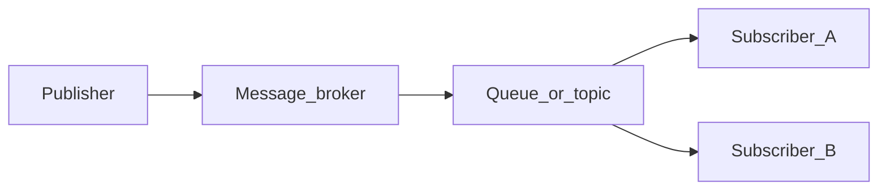

# Chapter 05 — Delivery

> *"Every message bus lies to you about 'delivery.' The useful question isn't will it arrive? — it's will it arrive how many times, and what do I do if the answer is zero or seven?"*

## Learning objectives

By the end of this chapter you will be able to:

- Define at-most-once, at-least-once, and exactly-once delivery and explain which one you actually get.
- Combine publisher confirms, manual acks, durable queues, and persistent messages to build reliable pipelines.
- Design idempotent consumers so that at-least-once duplicates are harmless.
- Implement the outbox pattern to avoid the "two commits, one truth" problem.
- Configure TTL, dead-letter exchanges, and retry queues for production failure handling.

## Prerequisites & recap

- [Chapter 03: Publishers and queues](03-publishers-and-queues.md) — `publish`, durable, persistent.
- [Chapter 04: Subscribers and routing](04-subscribers-and-routing.md) — acks, nacks, DLX.

A message crosses five boundaries between the producer's memory and the consumer's side-effect. Each boundary can fail. Delivery guarantees are statements about *which* failures the system masks from you.

## The simple version

There are three delivery promises a messaging system can make, and only two of them are real. **At-most-once** means the message might never arrive, but it'll never arrive twice — fire-and-forget. **At-least-once** means the message will definitely arrive, but it might arrive more than once — duplicates are possible. **Exactly-once** means each message is processed exactly one time — and this is almost always a lie, because achieving it end-to-end across network failures is provably impossible without cooperation from the consumer.

The practical answer is: you design for **at-least-once delivery** (durable queues, persistent messages, publisher confirms, manual acks) and make your consumers **idempotent** (processing the same message twice has the same effect as processing it once). At-least-once + idempotent consumer = exactly-once *from the outside*. That's how production systems work.

## Visual flow

```
        1           2            3            4           5
  Producer ───▶ Broker ───▶ Broker ───▶ Consumer ───▶ DB / Side
               memory      disk        process       effect

  Boundary 1: network between producer and broker
  Boundary 2: broker memory → disk (fsync)
  Boundary 3: broker dispatches to consumer
  Boundary 4: consumer processes the message
  Boundary 5: consumer commits side-effect, then acks
```
*Figure 5-1. Five failure boundaries between "event happened" and "effect committed."*

## System diagram (Mermaid)



*Decoupled delivery: publishers never address subscribers by name.*

## Concept deep-dive

### The three delivery semantics

| Semantic | Meaning | Typical cost |
|---|---|---|
| **At-most-once** | Zero or one delivery. Losses acceptable. | Cheapest. No confirms, no acks, no persistence. |
| **At-least-once** | One or more deliveries. Duplicates possible. | Default for most brokers with the right knobs turned on. |
| **Exactly-once** | Exactly one *effective* delivery. | Expensive — usually faked with at-least-once + idempotent consumer. |

RabbitMQ gives you **at-least-once** once you enable durable queues, persistent messages, publisher confirms, and manual acks. Exactly-once in the theoretical sense (end-to-end, across arbitrary failures) is [provably impossible](https://bravenewgeek.com/you-cannot-have-exactly-once-delivery/) without the consumer participating in the protocol. You engineer around it with idempotency.

### The five-boundary failure map

Understanding *where* failures happen tells you *which* tool to reach for:

**Boundary 1: Producer → broker (network).** The TCP packet is lost, the broker is unreachable, or the connection drops mid-send. Without publisher confirms, the producer doesn't know if the message arrived. **Tool:** publisher confirms (`createConfirmChannel` + `waitForConfirms`).

**Boundary 2: Broker memory → disk.** The broker received the message into memory but crashes before flushing it to disk. **Tool:** `persistent: true` on messages + `durable: true` on queues.

**Boundary 3: Broker dispatches to consumer.** The consumer receives the message but crashes before processing it. With auto-ack, the message is gone. **Tool:** manual ack — the broker only deletes the message after the consumer explicitly confirms.

**Boundary 4: Consumer processes the message.** The handler throws an exception. **Tool:** `nack` with bounded retries → DLX after exhaustion.

**Boundary 5: Consumer commits side-effect, then acks.** The DB write succeeds but the consumer crashes before sending the ack. The broker redelivers. The consumer processes the message again. **Tool:** idempotent consumer — the second processing has no additional effect.

### Publisher-side reliability

Three knobs, used together:

```ts
const ch = await conn.createConfirmChannel();

await ch.assertQueue("orders.new", { durable: true });

ch.publish("orders", "order.created", Buffer.from(body), {
  persistent: true,
  mandatory: true,
  messageId: crypto.randomUUID(),
});
await ch.waitForConfirms();
```

- **`createConfirmChannel()`** — the broker sends an async `basic.ack` once it has "taken responsibility" for the message. Without this, `publish()` is fire-and-forget.
- **`durable: true`** on queues + **`persistent: true`** on messages — together they survive broker restarts. You need *both*: a durable queue with transient messages still loses the messages on restart.
- **`mandatory: true`** — fires a `basic.return` if no queue is bound to receive the message. Without it, unroutable messages are silently dropped.
- **`messageId`** — a UUID that consumers use for deduplication.

### Consumer-side reliability

Already covered in chapter 04: manual ack, nack with DLX, prefetch. The subtle rule:

> **Ack only after the side-effect is durable.** Ack before, and you've promised work that isn't done.

```ts
await ch.consume("orders.new", async (msg) => {
  if (!msg) return;
  await db.transaction(async (tx) => {
    await tx.insert("orders", parse(msg));
  });
  ch.ack(msg); // only now — DB committed
});
```

If the process dies between the DB commit and the ack, the broker redelivers. The consumer will try to insert again — and you need idempotency to handle that duplicate.

### Idempotency: the real "exactly once"

A consumer is **idempotent** when processing the same message N times has the same effect as processing it once. Three common patterns:

**1. Natural idempotency.** `SET user.email = 'x'` is idempotent by nature — running it twice doesn't change the result. `INSERT INTO orders` is *not* — running it twice creates two rows.

**2. Deduplication table.** Insert the `messageId` into a `processed_messages` table inside the *same transaction* as the side-effect. Duplicate delivery → primary key conflict → skip.

```ts
await db.transaction(async (tx) => {
  const { rowCount } = await tx.query(
    "INSERT INTO processed_messages(id) VALUES ($1) ON CONFLICT DO NOTHING RETURNING 1",
    [msg.properties.messageId],
  );
  if (rowCount === 0) return; // already processed
  await tx.query(
    "INSERT INTO orders(id, total) VALUES ($1, $2)",
    [order.id, order.total],
  );
});
ch.ack(msg);
```

**3. Conditional writes.** `INSERT ... ON CONFLICT DO NOTHING`, or `UPDATE ... WHERE version = ?` (optimistic concurrency). These build idempotency into the SQL itself.

At-least-once + idempotent consumer ≈ exactly-once from the outside.

### TTL and dead-letter exchanges (DLX)

Two orthogonal escape hatches:

- **TTL** — a message expires after N milliseconds. Set at the queue level (`x-message-ttl`) or per-message (`expiration`). Useful for time-sensitive notifications ("this promotion expires in 1 hour").
- **DLX** — when a message is rejected, expires, or exceeds queue max length, the broker republishes it to a dead-letter exchange.

Combine them for **delayed retry queues**: messages sit in a TTL queue whose DLX points back to the work queue. After the TTL elapses, they reappear for another attempt.

```ts
await ch.assertQueue("orders.retry", {
  durable: true,
  arguments: {
    "x-dead-letter-exchange": "orders",
    "x-dead-letter-routing-key": "order.created",
    "x-message-ttl": 60_000, // retry after 60 seconds
  },
});
```

### The outbox pattern

If your producer writes to a database *and* publishes to a broker, you have two commits. If one succeeds and the other fails, you get inconsistency. The outbox pattern eliminates this:

1. In the *same DB transaction*, insert the side-effect **and** a row in an `outbox` table.
2. A separate relay worker reads from `outbox`, publishes to the broker with confirms, and marks rows as sent.

This turns a two-phase commit into a single DB transaction plus an at-least-once relay. The relay can safely retry because the consumer is idempotent.

```ts
// In your API handler — single transaction
await db.transaction(async (tx) => {
  await tx.query(
    "INSERT INTO orders(id, total) VALUES ($1, $2)",
    [order.id, order.total],
  );
  await tx.query(
    "INSERT INTO outbox(id, event_type, payload, created_at) VALUES ($1, $2, $3, NOW())",
    [randomUUID(), "order.created", JSON.stringify(order)],
  );
});

// Separate relay worker
const unsent = await db.query(
  "SELECT * FROM outbox WHERE sent_at IS NULL ORDER BY created_at LIMIT 100",
);
for (const row of unsent.rows) {
  await publish(row.event_type, row.payload);
  await db.query("UPDATE outbox SET sent_at = NOW() WHERE id = $1", [row.id]);
}
```

### Transactions vs confirms

AMQP has `tx.select` / `tx.commit` transactions. They work but are **~250x slower** than publisher confirms because they serialize at the protocol level. Use confirms.

## Why these design choices

**Why not just use exactly-once?** Because true end-to-end exactly-once requires the consumer, broker, and producer to participate in a distributed transaction. That's a 2PC (two-phase commit) protocol — slow, fragile, and complex. At-least-once + idempotency achieves the same *observable* result with simpler, faster components.

**Why the outbox pattern instead of just "publish after DB commit"?** Because the publish can fail after the DB commit succeeds (network error, broker down). Now your DB says the order exists but no event was emitted. The outbox guarantees both happen or neither does (via a single DB transaction), and the relay handles the eventual publish.

**Why `messageId` as a UUID instead of a business key?** UUIDs are guaranteed unique without requiring coordination. Business keys (like `orderId`) can work for idempotency but may collide if the same business entity triggers multiple events of the same type. UUIDs are a simpler default.

**When you'd pick differently:** If you're using Kafka with its transactional producer (which ties the offset commit and the produce into one atomic operation), you get closer to true exactly-once within the Kafka ecosystem. But you still need idempotency at the final side-effect (database, HTTP call).

## Production-quality code

```ts
// reliable-pipeline.ts — end-to-end reliable publish + idempotent consume
import amqp from "amqplib";
import { randomUUID } from "crypto";
import { Pool } from "pg";

const EXCHANGE = "orders";
const QUEUE = "orders.new";
const ROUTING_KEY = "order.created";

const db = new Pool({ connectionString: process.env.DATABASE_URL });

// --- Publisher side ---

export async function initPublisher(amqpUrl: string) {
  const conn = await amqp.connect(amqpUrl);
  const ch = await conn.createConfirmChannel();

  await ch.assertExchange(EXCHANGE, "topic", { durable: true });
  await ch.assertExchange("orders.dlx", "fanout", { durable: true });
  await ch.assertQueue("orders.dead", { durable: true });
  await ch.bindQueue("orders.dead", "orders.dlx", "");

  await ch.assertQueue(QUEUE, {
    durable: true,
    deadLetterExchange: "orders.dlx",
  });
  await ch.bindQueue(QUEUE, EXCHANGE, ROUTING_KEY);

  return { conn, ch };
}

export async function publishOrder(
  ch: amqp.ConfirmChannel,
  order: { id: string; total: number },
): Promise<void> {
  const body = Buffer.from(JSON.stringify(order));
  ch.publish(EXCHANGE, ROUTING_KEY, body, {
    persistent: true,
    mandatory: true,
    messageId: randomUUID(),
    contentType: "application/json",
    timestamp: Date.now(),
  });
  await ch.waitForConfirms();
}

// --- Consumer side (idempotent) ---

export async function initConsumer(amqpUrl: string) {
  const conn = await amqp.connect(amqpUrl);
  const ch = await conn.createChannel();
  await ch.prefetch(10);

  await ch.consume(QUEUE, async (msg) => {
    if (!msg) return;

    const messageId = msg.properties.messageId;
    const order = JSON.parse(msg.content.toString());

    try {
      const client = await db.connect();
      try {
        await client.query("BEGIN");

        const { rowCount } = await client.query(
          "INSERT INTO processed_messages(id) VALUES ($1) ON CONFLICT DO NOTHING RETURNING 1",
          [messageId],
        );

        if (rowCount && rowCount > 0) {
          await client.query(
            "INSERT INTO orders(id, total) VALUES ($1, $2)",
            [order.id, order.total],
          );
        }

        await client.query("COMMIT");
      } catch (err) {
        await client.query("ROLLBACK");
        throw err;
      } finally {
        client.release();
      }

      ch.ack(msg);
    } catch (err) {
      ch.nack(msg, false, false); // → DLX
    }
  });

  return { conn, ch };
}
```

## Security notes

- **Outbox table access.** The relay worker needs read/write access to the outbox table and publish access to the broker. Keep these credentials separate from the main application's.
- **Message replay.** Anyone with access to the DLX queue can see failed messages, which may contain PII. Restrict DLX queue access to ops/debugging accounts.
- **Dedup table cleanup.** The `processed_messages` table grows indefinitely. Schedule a cleanup job to delete entries older than your message retention window (e.g., 30 days).

## Performance notes

- **`persistent: true` throughput.** Persistent messages halve throughput compared to transient because of disk fsync. Batch publisher confirms (`waitForConfirms()` every N messages) amortize this cost. Typical numbers: individual confirms ~5,000 msg/s, batched ~40,000 msg/s.
- **Dedup table cost.** Each message adds one row and one index lookup. For Postgres, this is microseconds at moderate scale. At millions of messages/day, partition the table by date and drop old partitions.
- **Outbox relay latency.** The relay adds a delay (polling interval) between the DB commit and the broker publish. Typical: 100ms–1s. For lower latency, use Postgres LISTEN/NOTIFY to trigger the relay immediately.

## Common mistakes

| Symptom | Cause | Fix |
|---|---|---|
| Durable queue, but messages vanish on broker restart | Messages published without `persistent: true` | Set `persistent: true` *and* use durable queues — you need both |
| Consumer acks before the DB write completes | Ack and side-effect are not ordered correctly | Move `ch.ack(msg)` after the transaction commits, never before |
| "Exactly-once" promised by a vendor pitch | Marketing, not engineering | Use at-least-once + idempotent consumer; be skeptical of exactly-once claims |
| Infinite requeue loop on a poison message | `nack(msg, false, true)` without a retry cap | Track attempts in a header; route to DLX after N failures |
| DB and broker out of sync (order exists but no event emitted) | Two separate commits — DB write succeeds, publish fails | Use the outbox pattern: single DB transaction, separate relay worker |

## Practice

**Warm-up.** Publish 10 messages with publisher confirms enabled. Log the confirmation for each.

<details><summary>Show solution</summary>

```ts
const ch = await conn.createConfirmChannel();
for (let i = 0; i < 10; i++) {
  ch.publish("events.topic", "test.event", Buffer.from(`msg-${i}`), {
    persistent: true,
    messageId: randomUUID(),
  });
}
await ch.waitForConfirms();
console.log("All 10 messages confirmed by broker");
```

</details>

**Standard.** Build the idempotent consumer from the production code section. Publish 5 duplicate messages (same `messageId`) and verify the database row count stays at 1.

<details><summary>Show solution</summary>

Publish the same message 5 times with the same `messageId`. The dedup table insert will succeed once and conflict four times. The orders table gets exactly one row. Verify with `SELECT COUNT(*) FROM orders WHERE id = 'test-order'` — should return 1.

</details>

**Bug hunt.** A teammate says: *"We lose ~1% of messages on broker restart."* The queues are durable. Find the likely cause.

<details><summary>Show solution</summary>

Messages are published without `persistent: true`. A durable queue preserves the queue *definition* on restart, but transient messages live in memory only and are lost when the broker stops. Fix: add `persistent: true` to the publish options. Use publisher confirms to detect any future regressions.

</details>

**Stretch.** Implement a retry queue: messages failing once go to `retry.queue` with TTL 30s, whose DLX points back to the work queue. Cap at 3 retries via a header.

<details><summary>Show solution</summary>

```ts
await ch.assertQueue("retry.queue", {
  durable: true,
  deadLetterExchange: "orders",
  deadLetterRoutingKey: "order.created",
  arguments: { "x-message-ttl": 30_000 },
});

// In consumer: on failure with attempts < 3, publish to retry.queue
// On failure with attempts >= 3, nack to permanent DLX
```

Messages sit in `retry.queue` for 30 seconds, then the DLX routes them back to the work queue. After 3 total attempts, they go to the permanent dead-letter queue.

</details>

**Stretch++.** Implement the outbox pattern: a DB table `outbox`, a relay worker that reads new rows and publishes with confirms, and marks rows as sent.

<details><summary>Show solution</summary>

Schema: `CREATE TABLE outbox (id UUID PRIMARY KEY, event_type TEXT, payload JSONB, created_at TIMESTAMPTZ, sent_at TIMESTAMPTZ)`.

The API handler writes to the outbox in the same transaction as the business write. The relay worker polls for `sent_at IS NULL`, publishes each with confirms, and updates `sent_at`. If the relay crashes after publishing but before marking, the next poll republishes — but the consumer is idempotent, so duplicates are harmless.

</details>

## In plain terms (newbie lane)
If `Delivery` feels abstract, think of it as a practical tool to make your backend work more predictable and easier to debug. Use this chapter to build one clear mental model first, then add details.

> **Newbies often think:** this topic is only theory and memorization.  
> **Actually:** it is a workflow aid that helps you make better decisions under real project pressure.


## Quiz

1. A RabbitMQ publisher confirm tells you:
    (a) the consumer received the message (b) the broker has accepted responsibility for the message (c) the message was fully processed (d) the TCP segment arrived

2. At-least-once + idempotent consumer is effectively:
    (a) at-most-once (b) exactly-once from the outside (c) unreliable (d) impossible

3. To survive a broker restart, a message needs:
    (a) a durable queue only (b) `persistent: true` on publish only (c) both a durable queue and persistent messages (d) neither — brokers are magic

4. A dead-letter exchange is most useful for:
    (a) speeding up delivery (b) isolating poison messages after bounded retries (c) replacing queues (d) publisher authentication

5. AMQP transactions (`tx.select`) vs publisher confirms:
    (a) identical (b) transactions are faster (c) confirms are dramatically faster (d) transactions are required for durability

**Short answer:**

6. Explain why "exactly-once delivery" is typically a lie and how systems still achieve its *effect*.

7. Why must the ack happen *after* the DB commit, not before?

*Answers: 1-b, 2-b, 3-c, 4-b, 5-c.*

## Learn-by-doing mini-project

Full brief (goal, acceptance criteria, hints, stretch): [05-delivery — mini-project](mini-projects/05-delivery-project.md).

## Where this idea reappears

- **Same thread elsewhere:** trace how this chapter’s primitives show up in production systems — not only in this language or layer.
- **Cross-module links (read next when you feel stuck):**
  - [HTTP webhooks](../12-http-servers/09-webhooks.md) — synchronous cousin to async messaging.
  - [JSON and serialization](../10-http-clients/06-json.md) — message payloads cross language boundaries.

  - [Concept threads (hub)](../appendix-threads/README.md) — state, errors, and performance reading trails.


## Chapter summary

- RabbitMQ gives you at-least-once when you combine durable queues, persistent messages, publisher confirms, manual acks, and bounded retries.
- Exactly-once is an illusion produced by idempotent consumers, not by brokers. Design your consumers for deduplication.
- The outbox pattern eliminates the "two commits, one truth" problem for systems that write to a DB and a broker.
- Every delivery boundary (producer→broker, broker→disk, broker→consumer, consumer→DB) needs its own reliability tool.

## Further reading

- [RabbitMQ — Confirms and Returns](https://www.rabbitmq.com/confirms.html).
- Kleppmann, *Designing Data-Intensive Applications*, chapter 11 ("Stream Processing").
- [You Cannot Have Exactly-Once Delivery (Tyler Treat)](https://bravenewgeek.com/you-cannot-have-exactly-once-delivery/).
- Next: [serialization](06-serialization.md).
