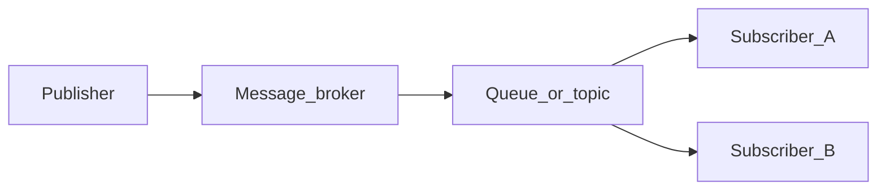

# Chapter 06 — Serialization

> *"Messages leave your process as bytes. Whoever reads them next — a different service, a different language, a different you six months from now — needs to decode those bytes into something meaningful. Serialization is that contract."*

## Learning objectives

By the end of this chapter you will be able to:

- Pick between JSON, Protobuf, Avro, and MessagePack based on concrete trade-offs.
- Validate incoming messages at the boundary using Zod.
- Evolve message schemas without breaking old publishers or old consumers.
- Tag messages with `contentType`, `type`, and `schema-version` so consumers can dispatch correctly.
- Explain backward, forward, and full compatibility and their practical implications.

## Prerequisites & recap

- [Module 10, chapter 06: JSON](../10-http-clients/06-json.md) — you know how JSON works.
- [Module 10, chapter 10: runtime validation](../10-http-clients/10-runtime-validation.md) — you've used Zod or similar.
- [Chapter 05: Delivery](05-delivery.md) — messages arrive reliably; now you need to decode them.

Transport makes no promises about *meaning*. A queue moves bytes; serialization decides what those bytes say.

## The simple version

Serialization is the act of turning a structured value (an object, a record, a struct) into a sequence of bytes that can travel over a network and be reconstructed on the other side. The easy part is encoding and decoding. The hard part is **schema evolution** — what happens when the producer adds a new field, renames an old one, or changes a type, while consumers are still running the old version of the code.

Your default should be **JSON + Zod validation**: human-readable, universally supported, and paired with runtime type-checking at the consumer boundary. When you outgrow JSON (payload size, parse speed, or cross-language schema discipline), you graduate to **Protobuf** or **Avro**. But regardless of format, every message should carry a `contentType`, a `type` name, and a `schema-version` header — because the consumer needs to know *how* to decode and *which version* of the schema to apply.

## Visual flow

```
  Publisher                     Broker                  Consumer
  ┌──────────┐                                        ┌──────────┐
  │ Object   │                                        │ Decode   │
  │   ↓      │                                        │   ↓      │
  │ Encode   │──▶ bytes ──▶ [   Queue   ] ──▶ bytes ──│ Validate │
  │ (JSON/   │    + headers                   + headers│ (Zod)    │
  │  Proto)  │                                        │   ↓      │
  └──────────┘                                        │ Handler  │
                                                      │   or     │
                                                      │  DLX     │
                                                      └──────────┘
```
*Figure 6-1. Publisher encodes → broker transports bytes → consumer decodes and validates.*

## System diagram (Mermaid)



*Decoupled delivery: publishers never address subscribers by name.*

## Concept deep-dive

### What serialization has to do

Four jobs, usually at once:

1. **Encode** a language-level value (struct, object, record) into bytes.
2. **Decode** bytes back into a language-level value.
3. **Describe** the shape of that value — inline, out-of-band, or both.
4. **Evolve** — old and new versions of the shape must coexist gracefully.

Different formats pick different trade-offs on each job.

### The four common formats

| Format | Human-readable | Size | Schema | Best for |
|---|---|---|---|---|
| **JSON** | yes | large | none (bolt one on) | Quick start, heterogeneous systems, debugging |
| **MessagePack** | no | ~30% smaller than JSON | none | JSON's features with less bandwidth |
| **Protobuf** | no | small | `.proto` file (external) | Tight internal services, polyglot teams |
| **Avro** | no (binary) / yes (JSON mode) | small | mandatory, schema registry | Streaming ecosystems (Kafka + Schema Registry) |

Rule of thumb:
- **JSON** until you measure a reason not to.
- **Protobuf / Avro** when serialization cost, payload size, or cross-language schema discipline matters.
- **Never** invent your own format.

### Schema evolution: the actual hard problem

Once producers and consumers ship independently, they'll disagree about message shape. You need rules that keep old and new on speaking terms.

**Backward compatible** = a new consumer can read messages from an old producer.
**Forward compatible** = an old consumer can read messages from a new producer.
**Full compatibility** = both directions work.

**Safe evolution moves:**
- Add a new **optional** field.
- Remove an optional field *after* all consumers have stopped reading it.
- Widen an integer (int32 → int64 in Protobuf — same wire type).
- Rename a field in JSON with dual-writing for one release cycle.

**Breaking moves:**
- Renaming a field without dual-write.
- Changing a type (`string` → `number`).
- Making a previously-optional field required.
- Reordering positional tuples (seen in bad bespoke formats).

Protobuf and Avro encode field *numbers* (not names), which is why adding/removing fields is safe — the wire refers to fields by number; names are for humans.

### Tagging the envelope

AMQP messages carry properties that describe the body without peeking inside:

```ts
ch.publish("orders", "order.created", payload, {
  contentType: "application/json",
  contentEncoding: "identity",
  type: "OrderCreated",
  headers: { "schema-version": 3 },
  messageId: randomUUID(),
  timestamp: Date.now(),
});
```

Consumers dispatch on `type` + `schema-version` *before* decoding. That single habit solves most evolution disasters: you know which schema to apply before you parse the body.

### Validation at the boundary

Decoding gives you `unknown`; validation turns it into a typed value you trust. In TypeScript, that's **Zod**:

```ts
import { z } from "zod";

const OrderCreatedV3 = z.object({
  id: z.string().uuid(),
  userId: z.string().uuid(),
  total: z.number().int().positive(),
  currency: z.string().length(3),
  couponCode: z.string().optional(),
});

type OrderCreatedV3 = z.infer<typeof OrderCreatedV3>;
```

On `ZodError`, nack straight to the DLX — the message is structurally wrong, and retrying won't fix it.

### Versioned dispatch

When you have multiple schema versions in flight, dispatch by version:

```ts
const schemas = {
  OrderCreated: {
    1: z.object({ id: z.string(), total: z.number() }),
    2: z.object({ id: z.string(), userId: z.string(), total: z.number() }),
    3: z.object({
      id: z.string(),
      userId: z.string(),
      total: z.number(),
      couponCode: z.string().optional(),
    }),
  },
} as const;

function parseMessage(type: string, version: number, raw: unknown) {
  const typeSchemas = schemas[type as keyof typeof schemas];
  if (!typeSchemas) throw new Error(`Unknown type: ${type}`);
  const schema = typeSchemas[version as keyof typeof typeSchemas];
  if (!schema) throw new Error(`Unknown ${type} v${version}`);
  return schema.parse(raw);
}
```

Adding v4 is a one-line addition to the schema map. Old consumers keep using v3 until they're updated.

### Protobuf in a nutshell

`order.proto`:

```proto
syntax = "proto3";
package events;

message OrderCreated {
  string id = 1;
  string user_id = 2;
  int64 total = 3;
  string currency = 4;
  optional string coupon_code = 5;
}
```

In TypeScript, `ts-proto` generates typed classes with `encode`/`decode`. The trade-off:
- Smaller wire (~40 bytes vs ~120 bytes for JSON), faster parse.
- Schema lives in version control, reviewable.
- Debugging requires tooling — you can't `cat` the queue and read the message.

### Compression

`contentEncoding: "gzip"` is legal for large JSON payloads (> 1 KB). Costs CPU on both ends; benefits disappear for short messages. Measure before enabling.

### The additive evolution strategy

The safest evolution approach:
- v1 publishes `OrderCreated` with fields A, B.
- v2 adds optional field C. Old consumers ignore it; new consumers read if present.
- v3 *renames* B to B2. Publish both B and B2 during one release cycle. Consumers drop B after cutover.

If you change *semantics* (not just shape), make a new message type (`OrderCreatedV2`) rather than mutating the existing one. Type names are cheap; broken consumers are expensive.

## Why these design choices

**Why JSON as the default?** Because it's human-readable, universally supported, and trivially debuggable. You can paste a message body into a REPL and see what it says. Protobuf and Avro require tooling. JSON's inefficiency only matters at scale — and most systems never hit that scale.

**Why Zod instead of just `JSON.parse`?** `JSON.parse` returns `any` — it tells you the bytes are valid JSON but nothing about the *shape*. A message with `{ id: 123 }` when you expect `{ id: "abc" }` will silently corrupt your database. Zod catches structural mismatches at the boundary, before they reach your business logic.

**Why version headers instead of version fields in the body?** Because the consumer needs to know *which decoder to use* before it decodes. A version header in the AMQP properties is accessible without parsing the body. A version field inside the JSON body requires parsing the JSON first, then checking, then re-parsing with the right schema.

**When you'd pick differently:** If you're in a pure Kafka ecosystem with Confluent Schema Registry, use Avro — the schema registry handles compatibility checks automatically. If you're building a polyglot microservices system with tight performance requirements, use Protobuf with `.proto` files as the contract.

## Production-quality code

```ts
// message-schemas.ts — versioned schema registry with Zod
import { z } from "zod";
import type { ConsumeMessage } from "amqplib";

const OrderCreatedV1 = z.object({
  id: z.string(),
  total: z.number().int().positive(),
});

const OrderCreatedV2 = z.object({
  id: z.string(),
  userId: z.string(),
  total: z.number().int().positive(),
});

const OrderCreatedV3 = z.object({
  id: z.string(),
  userId: z.string(),
  total: z.number().int().positive(),
  currency: z.string().length(3).default("USD"),
  couponCode: z.string().optional(),
});

const schemaRegistry: Record<string, Record<number, z.ZodSchema>> = {
  OrderCreated: { 1: OrderCreatedV1, 2: OrderCreatedV2, 3: OrderCreatedV3 },
};

export function parseMessage(msg: ConsumeMessage): unknown {
  const contentType = msg.properties.contentType;
  if (contentType !== "application/json") {
    throw new Error(`Unsupported contentType: ${contentType}`);
  }

  const type = msg.properties.type;
  const version = Number(msg.properties.headers?.["schema-version"] ?? 1);

  const typeSchemas = schemaRegistry[type];
  if (!typeSchemas) {
    throw new Error(`Unknown message type: ${type}`);
  }

  const schema = typeSchemas[version];
  if (!schema) {
    throw new Error(`Unknown schema version: ${type} v${version}`);
  }

  const raw = JSON.parse(msg.content.toString());
  return schema.parse(raw);
}
```

```ts
// consumer using the schema registry
import { parseMessage } from "./message-schemas.js";

await ch.consume("orders.new", async (msg) => {
  if (!msg) return;
  try {
    const order = parseMessage(msg);
    await processOrder(order);
    ch.ack(msg);
  } catch (err) {
    if (err instanceof z.ZodError) {
      console.error("Schema validation failed, routing to DLX:", err.issues);
    }
    ch.nack(msg, false, false);
  }
});
```

## Security notes

- **Untrusted input.** Every message body is untrusted input. Validate with Zod (or equivalent) before acting on it. A malicious or buggy publisher could send payloads designed to exploit SQL injection, prototype pollution, or buffer overflows.
- **Serialization attacks.** Avoid formats that allow arbitrary code execution during deserialization (e.g., Python `pickle`, Java `ObjectInputStream`). JSON and Protobuf are safe by design; Avro is safe if you control the schema.
- **BigInt handling.** `JSON.stringify(1n)` throws in JavaScript. For monetary values or IDs exceeding 2^53, serialize as strings. Document this convention in your event contract.

## Performance notes

- **JSON vs Protobuf size.** A typical event is ~120 bytes in JSON, ~40 bytes in Protobuf. At 1 million messages/day, that's ~80 MB/day difference. At 100 million/day, it's 8 GB/day — measurable in bandwidth and storage costs.
- **Parse speed.** `JSON.parse` is highly optimized in V8 but still allocates new objects. Protobuf decode is faster for large payloads. For small payloads (< 1 KB), the difference is negligible.
- **Compression.** Gzip compresses JSON well (60–80% reduction for large payloads) but adds CPU overhead on both ends. For messages < 1 KB, compression often makes the payload *larger* due to header overhead.

## Common mistakes

| Symptom | Cause | Fix |
|---|---|---|
| Consumer crashes with `ZodError: Expected string, received undefined` after a publisher update | Publisher renamed a field without dual-writing | Revert publisher to emit both old and new field names for one release; update consumer schema to accept either |
| No version header on messages; rolling upgrades break silently | `schema-version` wasn't set from day one | Add `schema-version` header to every publish call immediately; default to v1 for untagged messages |
| `JSON.parse` succeeds but database write fails with type mismatch | Parsed JSON is `any`; no runtime validation | Validate with Zod at the boundary before passing to business logic |
| Making a previously-optional field required in a new version | Breaks backward compatibility — old producers don't send the field | Treat required fields as permanent; new fields should always be optional |
| Using `Date` objects in JSON payloads | JSON has no native date type; `Date` serializes inconsistently | Standardize on ISO-8601 strings or Unix milliseconds; document the convention |

## Practice

**Warm-up.** Write a Zod schema for a `UserRegistered` event with `id` (UUID), `email` (string), and `signedUpAt` (ISO-8601 string). Parse a sample message against it.

<details><summary>Show solution</summary>

```ts
import { z } from "zod";

const UserRegistered = z.object({
  id: z.string().uuid(),
  email: z.string().email(),
  signedUpAt: z.string().datetime(),
});

const sample = { id: "550e8400-e29b-41d4-a716-446655440000", email: "alice@example.com", signedUpAt: "2026-04-17T10:00:00Z" };
const result = UserRegistered.parse(sample); // typed, validated
```

</details>

**Standard.** Add a v2 schema with an optional `referralCode` field. Write a dispatcher that picks the schema based on a `schema-version` header.

<details><summary>Show solution</summary>

```ts
const UserRegisteredV1 = z.object({
  id: z.string().uuid(),
  email: z.string().email(),
  signedUpAt: z.string().datetime(),
});

const UserRegisteredV2 = UserRegisteredV1.extend({
  referralCode: z.string().optional(),
});

const schemas = { 1: UserRegisteredV1, 2: UserRegisteredV2 };

function parse(version: number, raw: unknown) {
  const schema = schemas[version as keyof typeof schemas];
  if (!schema) throw new Error(`Unknown version ${version}`);
  return schema.parse(raw);
}
```

</details>

**Bug hunt.** Messages arrive but your consumer throws `ZodError: Expected string, received undefined` on `userId`. The publisher recently changed `user_id` → `userId`. How do you fix both sides without downtime?

<details><summary>Show solution</summary>

1. Revert the publisher to emit **both** `user_id` and `userId` for one release (dual-write).
2. Update the consumer's schema to accept either: use `z.preprocess` to normalize `user_id` into `userId`, or use `z.union`.
3. Once all consumers are updated and stable, drop `user_id` from the publisher in the next release.

This is the dual-write trick for safe field renames.

</details>

**Stretch.** Port the v3 OrderCreated message to Protobuf with `ts-proto`. Benchmark encode/decode and payload size vs JSON on 10,000 messages.

<details><summary>Show solution</summary>

Define `order.proto` with the v3 fields. Generate TypeScript with `protoc --plugin=./node_modules/.bin/protoc-gen-ts_proto --ts_proto_out=./src/gen order.proto`. In a benchmark script, encode 10,000 orders with both `JSON.stringify` and `OrderCreated.encode`, measure time and total bytes. Typical result: Protobuf is ~3x smaller and ~2x faster for encode/decode.

</details>

**Stretch++.** Write a schema-registry client that fetches the schema from a URL (keyed on message `type` + `schema-version`) and caches it in-process.

<details><summary>Show solution</summary>

```ts
const schemaCache = new Map<string, z.ZodSchema>();

async function getSchema(type: string, version: number): Promise<z.ZodSchema> {
  const key = `${type}:${version}`;
  if (schemaCache.has(key)) return schemaCache.get(key)!;

  const res = await fetch(`${REGISTRY_URL}/schemas/${type}/v${version}`);
  if (!res.ok) throw new Error(`Schema not found: ${key}`);
  const def = await res.json();
  // Convert JSON Schema or custom format to Zod (use a library or manual mapping)
  const schema = convertToZod(def);
  schemaCache.set(key, schema);
  return schema;
}
```

The cache avoids HTTP calls on every message. Invalidate on deploy or use a TTL.

</details>

## In plain terms (newbie lane)
If `Serialization` feels abstract, think of it as a practical tool to make your backend work more predictable and easier to debug. Use this chapter to build one clear mental model first, then add details.

> **Newbies often think:** this topic is only theory and memorization.  
> **Actually:** it is a workflow aid that helps you make better decisions under real project pressure.


## Quiz

1. Backward compatible means:
    (a) old consumers can read new messages (b) new consumers can read old messages (c) consumers and producers must upgrade atomically (d) no schema changes are allowed

2. A safe evolution move in Protobuf is:
    (a) renumbering existing fields (b) changing a `string` to `int32` (c) adding a new optional field with a new number (d) deleting a field by name and reusing its number

3. `contentType: "application/json"` on an AMQP message means:
    (a) the broker parses the JSON (b) a hint to consumers about how to decode the body (c) the message is encrypted (d) nothing — it's unused metadata

4. Zod is used at the consumer boundary because:
    (a) it's faster than `JSON.parse` (b) it validates shape at runtime and produces a typed value (c) it replaces TypeScript's type system (d) RabbitMQ requires it

5. JSON's biggest weakness for event payloads is:
    (a) unreadable wire format (b) no built-in schema or type system — you must bolt one on (c) slow in V8 (d) no Unicode support

**Short answer:**

6. Explain the dual-write trick for safely renaming a field in an event schema.

7. Why is adding an optional field safer than making an existing optional field required?

*Answers: 1-b, 2-c, 3-b, 4-b, 5-b.*

## Learn-by-doing mini-project

Full brief (goal, acceptance criteria, hints, stretch): [06-serialization — mini-project](mini-projects/06-serialization-project.md).

## Where this idea reappears

- **Same thread elsewhere:** trace how this chapter’s primitives show up in production systems — not only in this language or layer.
- **Cross-module links (read next when you feel stuck):**
  - [HTTP webhooks](../12-http-servers/09-webhooks.md) — synchronous cousin to async messaging.
  - [JSON and serialization](../10-http-clients/06-json.md) — message payloads cross language boundaries.

  - [Concept threads (hub)](../appendix-threads/README.md) — state, errors, and performance reading trails.


## Chapter summary

- Serialization is two problems: *encoding* and *schema evolution*. Pick a format that addresses both.
- JSON + Zod is the pragmatic default; Protobuf and Avro pay off under scale or polyglot pressure.
- Tag every message with `contentType`, `type`, and `schema-version`. Future-you will thank you.
- Validate at the boundary; route invalid messages to the DLX rather than corrupting your database.

## Further reading

- [Protocol Buffers — Language Guide (proto3)](https://protobuf.dev/programming-guides/proto3/).
- [Zod documentation](https://zod.dev/).
- Kleppmann, *Designing Data-Intensive Applications*, chapter 4 ("Encoding and Evolution").
- Next: [scalability](07-scalability.md).
