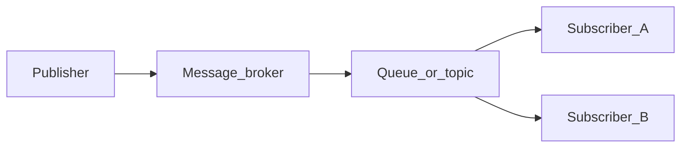

# Chapter 07 — Scalability

> *"A single RabbitMQ node on a laptop pushes tens of thousands of messages per second. Your bottleneck won't be the broker — it'll be the way you've shaped the traffic around it."*

## Learning objectives

By the end of this chapter you will be able to:

- Scale consumers horizontally with competing-consumer and sharded-queue patterns.
- Use prefetch, acknowledgements, and lazy queues to shape backpressure.
- Decide when to cluster RabbitMQ vs split by bounded context.
- Navigate the ordering-vs-parallelism trade-off with per-key partitioning.
- Recognize when you've outgrown RabbitMQ and need Kafka, Kinesis, or NATS.

## Prerequisites & recap

- [Chapter 04: Subscribers and routing](04-subscribers-and-routing.md) — competing consumers.
- [Chapter 05: Delivery](05-delivery.md) — manual ack + idempotency are prerequisites for safe parallelism.

Scale is multiplication. Multiplying anything unreliable gives you more unreliability, faster. Chapter 05's reliability tools are the floor this chapter builds on.

## The simple version

Scaling a message pipeline comes down to two axes: **consumer scale** (can you drain the queue faster?) and **broker scale** (can the broker itself handle higher throughput?). Most of the time, the answer is consumer scale — run more instances of the same consumer, all pointed at the same queue. The broker round-robins messages across them. Linear speedup until you hit the downstream bottleneck, which is almost always the database.

When a single queue's dispatch throughput hits its ceiling (~50,000 msg/s), you partition: split the queue by a key (user ID, tenant ID, order ID) so that messages for the same key always go to the same partition. This preserves per-key ordering while allowing parallel processing across keys. It's the same concept Kafka uses natively — in RabbitMQ you get it via the consistent-hash exchange plugin.

## Visual flow

```
  Publisher
     │
     ▼
  ┌─────────────────────────────────┐
  │  consistent-hash exchange       │
  │  (hashes on routing key)       │
  └──┬──────────┬──────────┬───────┘
     │          │          │
     ▼          ▼          ▼
  ┌──────┐  ┌──────┐  ┌──────┐
  │ P0   │  │ P1   │  │ P2   │    queues (partitions)
  └──┬───┘  └──┬───┘  └──┬───┘
     │         │         │
   ┌─┴─┐    ┌─┴─┐    ┌─┴─┐
   │W0a│    │W1a│    │W2a│         workers
   │W0b│    │W1b│    │W2b│         (competing consumers
   └───┘    └───┘    └───┘          per partition)
```
*Figure 7-1. Consistent-hash exchange distributes by key; competing consumers drain each partition.*

## System diagram (Mermaid)



*Decoupled delivery: publishers never address subscribers by name.*

## Concept deep-dive

### Two axes of scale

- **Consumer scale.** Can you drain the queue faster? Run more consumer instances. This is the first lever you pull, and it handles 90% of scaling needs.
- **Broker scale.** Can the broker itself handle more throughput, connections, or state? This only becomes the bottleneck at extreme volume or when misconfigured.

### Horizontal consumers: the competing-consumer pattern

You already know this from chapter 04. Run N consumer instances, all subscribed to the same queue. RabbitMQ dispatches to whichever consumer has prefetch headroom. Linear scale until you hit:

1. **Database contention** (usually the first bottleneck).
2. **Network bandwidth.**
3. **Broker per-queue dispatch throughput** (~50,000 msg/s on one queue).

Deploy the same container image N times behind the same queue. Done. No code changes.

### Prefetch is your throttle

Prefetch governs three things simultaneously:

- **Throughput.** Too low → consumer idles between dispatches. Too high → one consumer hoards messages, memory grows.
- **Fairness.** Low prefetch spreads work evenly across consumers. High prefetch lets fast consumers pull ahead (sometimes desirable, sometimes not).
- **Backpressure.** When the downstream is slow, prefetch limits how much damage accumulates. Without it, the broker fills your process memory.

**Sizing formula:** `desired_in_flight = target_throughput_msg_per_sec × avg_processing_time_seconds`. For 5,000 msg/s with 50ms handlers: `5000 × 0.05 = 250` concurrent messages in flight. Distribute across consumers: 25 consumers × prefetch 10, or 10 consumers × prefetch 25.

### Sharded / partitioned queues

When a single queue's dispatch hits its ceiling, you split the traffic across multiple queues by hashing on a routing key:

**Consistent-hash exchange** (plugin). Messages with the same routing key always go to the same queue — preserving per-key ordering while enabling parallel processing across keys.

```ts
await ch.assertExchange("orders.hash", "x-consistent-hash", {
  durable: true,
});

const NUM_PARTITIONS = 4;
for (let i = 0; i < NUM_PARTITIONS; i++) {
  await ch.assertQueue(`orders.p${i}`, { durable: true });
  await ch.bindQueue(`orders.p${i}`, "orders.hash", "1"); // weight
}

ch.publish("orders.hash", order.userId, body); // routing key = hash input
```

Messages for a given `userId` consistently land in the same partition. You get per-user FIFO ordering with parallel processing across users.

**Stream queues** (RabbitMQ 3.9+). Append-only log with offset-based consumption — the closest RabbitMQ gets to Kafka's model. Useful when you need replay within RabbitMQ.

### Ordering vs parallelism

These two are in permanent tension:

- **Strict global order** → one queue, one consumer, one CPU. Maximum correctness, minimum throughput.
- **No ordering** → unlimited parallelism. Maximum throughput, messages processed in any order.
- **Per-key order** → partition by the business key (user, tenant, account). Each key's messages are processed in order; different keys are processed in parallel. This is usually what you actually need.

Decide the partitioning key *once*, in the domain model. "Ordered per customer" is different from "ordered per shipment" and they're not interchangeable later.

### Lazy queues

Default queues hold messages in memory and spill to disk under pressure. **Lazy queues** (`x-queue-mode: lazy`) go to disk first, keeping only a small working set in memory. Use them when:

- Queues grow to millions of messages (batch jobs, offline consumers).
- Consumers go offline for hours or days.
- Memory pressure on the broker is a concern.

Trade-off: slightly higher per-message latency, dramatically better RAM behavior.

### Clustering and high availability

RabbitMQ clusters share metadata (users, vhosts, exchanges, bindings) and co-locate queues across nodes. For high availability, use **quorum queues** (Raft-based, RabbitMQ 3.8+):

```ts
await ch.assertQueue("orders", {
  durable: true,
  arguments: { "x-queue-type": "quorum" },
});
```

Quorum queues replicate across cluster nodes. If one node fails, the remaining nodes elect a new leader and keep serving. They're slower than classic queues (~20–30% throughput reduction) but survive node failures.

Avoid **classic mirrored queues** — they're deprecated in favor of quorum queues.

### Connections and channels

- **One TCP connection** per process. Connections are expensive (handshake, TLS, heartbeat).
- **Many channels** per connection. Channels are multiplexed on the TCP connection and are nearly free.
- **One channel per concurrent worker** — channels aren't thread-safe.

Don't open a connection per message. Don't share a channel across concurrent handlers without synchronization.

### Flow control and backpressure

When the broker's memory or disk watermarks are crossed, it stops accepting publishes — publishers block in `publish()`. This *is* backpressure — the system telling you to slow down. Your options:

- **Add consumers** (drain faster).
- **Partition the queue** (parallelize).
- **Coalesce or batch messages** (send fewer).
- **Raise watermarks** (kicking the can — temporary at best).

Never disable flow control. It exists to prevent the broker from OOM-crashing.

### Monitoring: the four numbers

You need dashboards for:

1. **Queue depth.** Rising steadily → consumers can't keep up.
2. **Publish rate vs deliver rate.** The delta is the gap.
3. **Consumer count and ack rate.** Sudden drop = a deploy broke something or consumers crashed.
4. **Unacked messages per consumer.** High + stable = prefetch headroom used normally. High + growing = stuck handler.

RabbitMQ's management plugin exposes all of these at `:15672`. In production, scrape via Prometheus using the `rabbitmq_prometheus` plugin.

### When to reach for Kafka (or friends)

Consider leaving RabbitMQ when you need:

- **Very high throughput per partition** (100,000+ msg/s sustained).
- **Replay.** Kafka retains messages for days/weeks; RabbitMQ deletes on ack.
- **Strict ordered log semantics** across millions of keys.
- **Stream processing** (Kafka Streams, Flink, ksqlDB) on the same substrate.

RabbitMQ is a *broker*; Kafka is a *log*. They solve adjacent problems. Don't treat the switch as an upgrade — it's a change of model.

## Why these design choices

**Why competing consumers before partitioning?** Because competing consumers require zero code changes — just deploy more instances. Partitioning introduces a new exchange type, changes your routing key semantics, and makes rebalancing harder. Only partition when you've measured that a single queue is the bottleneck.

**Why per-key partitioning instead of random?** Because most business logic needs *some* ordering. "Process this user's events in order" is almost universal. Random distribution maximizes throughput but breaks ordering guarantees, which forces your handler to handle out-of-order events (much harder).

**Why quorum queues over classic mirrored?** Classic mirrored queues use a synchronous replication protocol with known edge cases (split-brain, slow mirrors). Quorum queues use Raft — a well-studied consensus protocol with clearer failure semantics. The throughput cost is worth the correctness gain.

**When you'd pick differently:** If you need the absolute highest single-queue throughput and can tolerate data loss (transient telemetry), classic non-replicated queues are faster. If you need true stream processing with replay, Kafka is the right tool, not "RabbitMQ with more nodes."

## Production-quality code

```ts
// partitioned-pipeline.ts — consistent-hash partitioning with quorum queues
import amqp from "amqplib";

const NUM_PARTITIONS = 8;
const EXCHANGE = "work.hash";

export async function setupPartitions(url: string) {
  const conn = await amqp.connect(url);
  const ch = await conn.createChannel();

  await ch.assertExchange(EXCHANGE, "x-consistent-hash", { durable: true });

  for (let i = 0; i < NUM_PARTITIONS; i++) {
    await ch.assertQueue(`work.p${i}`, {
      durable: true,
      arguments: { "x-queue-type": "quorum" },
    });
    await ch.bindQueue(`work.p${i}`, EXCHANGE, "1");
  }

  await ch.close();
  await conn.close();
}

export async function publishToPartition(
  ch: amqp.Channel,
  partitionKey: string,
  payload: unknown,
) {
  ch.publish(
    EXCHANGE,
    partitionKey,
    Buffer.from(JSON.stringify(payload)),
    { persistent: true },
  );
}

export async function consumePartition(
  url: string,
  partitionIndex: number,
  handler: (body: unknown) => Promise<void>,
) {
  const conn = await amqp.connect(url);
  const ch = await conn.createChannel();

  await ch.prefetch(10);

  const queue = `work.p${partitionIndex}`;
  await ch.consume(queue, async (msg) => {
    if (!msg) return;
    try {
      const body = JSON.parse(msg.content.toString());
      await handler(body);
      ch.ack(msg);
    } catch {
      ch.nack(msg, false, false);
    }
  });

  process.once("SIGTERM", async () => {
    await ch.close();
    await conn.close();
  });
}
```

```ts
// Consumer sizing calculator
function calculateConsumerConfig(
  targetMsgPerSec: number,
  avgHandlerMs: number,
) {
  const inFlightNeeded = targetMsgPerSec * (avgHandlerMs / 1000);

  const configs = [
    { consumers: 5, prefetch: Math.ceil(inFlightNeeded / 5) },
    { consumers: 10, prefetch: Math.ceil(inFlightNeeded / 10) },
    { consumers: 25, prefetch: Math.ceil(inFlightNeeded / 25) },
  ];

  return configs.filter((c) => c.prefetch >= 1 && c.prefetch <= 100);
}
```

## Security notes

- **Consistent-hash exchange plugin.** The plugin must be explicitly enabled (`rabbitmq-plugins enable rabbitmq_consistent_hash_exchange`). Ensure your deployment scripts include this step; a missing plugin causes topology assertions to fail.
- **Quorum queue permissions.** Quorum queues replicate across cluster nodes. All nodes must have mutual trust (Erlang cookie). Secure the inter-node communication with TLS in production.
- **Monitoring access.** The Prometheus endpoint and management UI expose queue depths, message rates, and consumer counts — operational intelligence. Restrict access to ops teams; don't expose publicly.

## Performance notes

- **Single-queue ceiling.** A single classic queue on one Erlang process caps at ~50,000 msg/s dispatch. Quorum queues are ~20–30% slower. Stream queues vary by partition count.
- **Prefetch 1 everywhere.** This accidentally serializes every consumer. Before setting prefetch to 1 "for safety," benchmark your pipeline throughput. Prefetch 10–25 is a better starting point for most I/O-bound handlers.
- **Connection cost.** Each AMQP connection is a TCP socket + heartbeat thread. At 1,000+ connections, the broker starts spending significant CPU on connection management. Use connection pooling or fewer, longer-lived connections.
- **Partition count.** More partitions = more parallelism, but also more queues to monitor and more consumers to manage. Start with `number_of_consumer_hosts × 2` and adjust based on load testing.

## Common mistakes

| Symptom | Cause | Fix |
|---|---|---|
| Prefetch = 1 everywhere; pipeline throughput is 10x lower than expected | Over-conservative prefetch serializes consumers | Benchmark with prefetch 10, 25, 50; find the throughput knee |
| One connection per message; broker shows thousands of connections | Misunderstanding connection lifecycle | Reuse one connection per process; pool channels |
| Queue depth grows unbounded with no alert | No monitoring on queue depth; consumers fell behind silently | Set up alerting on queue depth; configure max-length + DLX as a safety net |
| "Messages are delivered out of order" with 4 competing consumers | Global FIFO assumed but never guaranteed with multiple consumers | Partition by the key that needs ordering (user ID, order ID) using consistent-hash exchange |
| Using classic mirrored queues in production | Deprecated; known split-brain issues | Migrate to quorum queues |
| Using RabbitMQ for 30-day event replay | RabbitMQ deletes on ack; it's not a log | Use Kafka or RabbitMQ stream queues for replay requirements |

## Practice

**Warm-up.** Start RabbitMQ, publish 10,000 messages, and consume with 1, 2, and 4 workers. Record throughput for each configuration.

<details><summary>Show solution</summary>

Create a publisher that sends 10,000 messages to a single queue. Start 1 consumer with prefetch 10, time how long it takes to drain. Repeat with 2 and 4 consumers. Typical results with a 10ms simulated handler: 1 worker ~100 msg/s, 2 workers ~200 msg/s, 4 workers ~400 msg/s. Linear scaling until the downstream bottleneck.

</details>

**Standard.** Add prefetch 1, 10, and 100 to the 4-worker setup. Note throughput and per-worker fairness (how many messages each worker processes).

<details><summary>Show solution</summary>

With prefetch 1: fairest distribution (each worker gets ~2,500 messages), lowest throughput (idle time between dispatches). With prefetch 100: highest throughput, but one fast worker may process 4,000 messages while a slow one processes 1,000. Prefetch 10 is typically the sweet spot — balanced fairness and throughput.

</details>

**Bug hunt.** A consumer's throughput drops 10x overnight. Queue depth is growing. `htop` shows CPU idle, network quiet. What do you check?

<details><summary>Show solution</summary>

"CPU idle, network quiet, throughput dropped" → the handler is waiting on something external. Likely culprits:
- Downstream DB or HTTP API is slow (check handler latency metrics).
- Connection pool is exhausted (check DB/HTTP pool saturation).
- A poison message with high prefetch blocks the channel (inspect unacked counts in the management UI).

The fix is almost never "more consumers" — it's unblocking the handler.

</details>

**Stretch.** Convert a single queue to a 4-partition consistent-hash setup. Verify that messages with the same routing key always land on the same partition.

<details><summary>Show solution</summary>

Enable the plugin: `rabbitmq-plugins enable rabbitmq_consistent_hash_exchange`. Create the exchange and 4 queues as shown in the production code. Publish 100 messages with routing key `user-123` and verify they all land in the same partition queue. Publish another 100 with `user-456` and verify they land in a (possibly different) consistent partition.

</details>

**Stretch++.** Run a 3-node RabbitMQ cluster (Docker Compose), declare a quorum queue, kill one node mid-publish. Confirm no message loss.

<details><summary>Show solution</summary>

Use a Docker Compose file with three RabbitMQ containers configured as a cluster (shared Erlang cookie, `rabbitmqctl join_cluster`). Declare a quorum queue. Publish 1,000 messages with confirms. Mid-batch, `docker stop` one node. The publisher should continue (confirms still work on the remaining majority). After draining the queue, verify all 1,000 messages were consumed exactly once (via dedup table).

</details>

## In plain terms (newbie lane)
If `Scalability` feels abstract, think of it as a practical tool to make your backend work more predictable and easier to debug. Use this chapter to build one clear mental model first, then add details.

> **Newbies often think:** this topic is only theory and memorization.  
> **Actually:** it is a workflow aid that helps you make better decisions under real project pressure.


## Quiz

1. Prefetch primarily controls:
    (a) publish rate (b) max unacked messages per consumer (c) queue size on disk (d) number of channels

2. To get per-user FIFO with parallelism across users:
    (a) one queue, one consumer (b) consistent-hash exchange keyed on userId (c) no ordering is possible (d) set prefetch to infinity

3. Quorum queues primarily provide:
    (a) faster throughput than classic queues (b) replicated, HA queues backed by Raft consensus (c) automatic sharding (d) at-most-once delivery

4. When you need replay from last Tuesday:
    (a) RabbitMQ classic queues (b) Kafka or RabbitMQ stream queues (c) any broker — replay is free (d) redesign as request/response

5. A process should manage connections and channels as:
    (a) one connection per message (b) one connection and one channel, reuse both (c) one connection and many channels, reused per worker (d) avoid connections entirely

**Short answer:**

6. Explain the ordering-vs-parallelism trade-off and how partitioning navigates it.

7. Describe how to detect, from metrics alone, that your consumers can't keep up.

*Answers: 1-b, 2-b, 3-b, 4-b, 5-c.*

## Learn-by-doing mini-project

Full brief (goal, acceptance criteria, hints, stretch): [07-scalability — mini-project](mini-projects/07-scalability-project.md).

## Where this idea reappears

- **Same thread elsewhere:** trace how this chapter’s primitives show up in production systems — not only in this language or layer.
- **Cross-module links (read next when you feel stuck):**
  - [HTTP webhooks](../12-http-servers/09-webhooks.md) — synchronous cousin to async messaging.
  - [JSON and serialization](../10-http-clients/06-json.md) — message payloads cross language boundaries.

  - [Concept threads (hub)](../appendix-threads/README.md) — state, errors, and performance reading trails.


## Chapter summary

- Consumers scale horizontally; prefetch is the dial that converts consumer count into actual throughput.
- Partition queues to break the single-queue dispatch ceiling and preserve per-key ordering.
- Quorum queues give you HA; lazy queues give you memory headroom.
- Know when to leave RabbitMQ — replay, streaming, and six-digit-per-second throughput want Kafka.

## Further reading

- [RabbitMQ — Quorum Queues](https://www.rabbitmq.com/quorum-queues.html).
- [RabbitMQ — Streams](https://www.rabbitmq.com/streams.html).
- Kleppmann, *Designing Data-Intensive Applications*, chapter 11.
- Next module: [Module 16 — Learn How to Find a Programming Job](../16-job-hunt/README.md).
