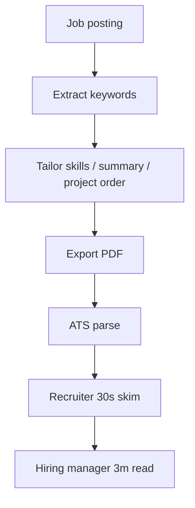

# Chapter 04 — Resume

> A resume is a 6-second pitch that decides whether you get the next 60 minutes. Everything on it earns its place or gets cut.

## Learning objectives

- Structure a one-page resume that survives both ATS parsing and human skim.
- Write bullet points that carry impact, not activity.
- Translate non-traditional experience (bootcamp, self-taught, career switch) into credible signal.
- Tailor the resume to specific postings without rewriting it every time.

## Prerequisites & recap

- [Chapter 01: Strategy](01-strategy.md) — you know the target.
- [Chapter 02: Projects](02-projects.md) — your resume's headline section will draw from these.

## Concept deep-dive

### Two readers

Your resume is read by two agents:

1. **An ATS** (applicant tracking system). Parses PDF/DOCX into fields and keywords. Silent fail if parsing breaks.
2. **A human** — recruiter first (30–60 seconds), then a hiring manager (2–5 minutes).

Design for both. The good news: what works for humans (clear structure, specific language) also works for ATS.

### One page, always

Until you have 8+ years of relevant experience, a one-page resume is not a stylistic choice — it's a discipline. A two-page junior resume signals either "can't edit" or "padded".

Cut brutally. Every line must beat its replacement.

### The canonical junior structure

Top to bottom:

1. **Header.** Name, email, phone (optional), city/region, LinkedIn URL, GitHub URL, portfolio URL. No photo (country-dependent; US/UK: no).
2. **Summary** (optional, 1–2 lines). Only if you can say something *specific*.
3. **Skills.** 2–4 lines, grouped. Ordered by target role relevance.
4. **Projects.** Your strongest section if you're junior.
5. **Experience.** Jobs — any jobs. Even non-tech ones show professionalism.
6. **Education.** Degree(s), bootcamps, meaningful certifications.
7. **Optional.** Speaking, open source, volunteering — only if relevant.

For career switchers: Projects **above** Experience. For CS grads with internships: Experience above Projects is also fine.

### Contact header example

```
Maria Alves
maria.alves@gmail.com · +351 912 345 678 · Lisbon, PT
github.com/mariaalves · linkedin.com/in/mariaalves · mariaalves.dev
```

No icons, no table layout, no fancy dividers. ATS tools occasionally mangle multi-column headers. Keep it plain text.

### Skills section — the ATS keyword zone

Two rules:

1. Only list what you'd be comfortable answering 10 minutes of questions on.
2. Mirror the language of the posting (within truth).

```
Languages:        Python, TypeScript, JavaScript, SQL, Bash
Backend:          Express, FastAPI, Node.js, Postgres, RabbitMQ
Tooling:          Git, Docker, Linux, CI/CD (GitHub Actions), AWS basics
Concepts:         REST APIs, OOP, functional programming, data structures, pub/sub
```

Avoid:

- "HTML" as a skill for a backend role.
- Star ratings or progress bars.
- Every language you touched once.

### Projects section — where juniors win

Format per project: **Name — one-line elevator pitch**, then 2–3 bullets.

```
Goal Tracker API — deployed habit-tracking REST API with session auth
  • Built with TypeScript, Express, and Postgres 16; deployed on Fly.io.
  • Designed schema for 5k+ check-ins with weekly aggregations in a single query.
  • CI runs 120 tests on every PR; configured via GitHub Actions and Docker.
  Live: goals.fly.dev · Code: github.com/mariaalves/goals-api
```

Include: tech used, a concrete number or outcome, the live URL or repo link.

Skip: every feature you built. That's the README's job.

### Experience bullets: activity → impact

Weak bullets describe *activity*: "Worked on the backend using Node.js."

Strong bullets describe *impact*: "Reduced payment webhook processing time from 900 ms to 120 ms by batching database writes, improving checkout reliability."

A proven template: **[Did X] [using Y] [resulting in Z]**, where Z is measurable.

Measurements work even when you invent the denominator sensibly:

- Users: "served 1200 weekly active users".
- Performance: "cut p95 latency from 800 ms to 150 ms".
- Quality: "reduced error rate from 3.1% to 0.4% over one quarter".
- Scope: "owned the authentication module end-to-end (design, implementation, monitoring)".

For non-tech experience, translate to transferable skills:

```
Retail — Shift Lead, BestCoffee · 2020–2022
  • Managed daily operations for a 6-person team; on-call for inventory issues.
  • Designed a weekly shift scheduling spreadsheet reducing schedule conflicts by 60%.
```

Not pretending to be an engineer — signaling reliability, communication, and ownership.

### Summary section — usually skip, sometimes gold

Only include if it says something the rest of the resume can't, in one or two sentences. Useful for career switchers:

> *Former data analyst transitioning to backend engineering. Completed 800+ hours of self-study on Python, TypeScript, and distributed systems. Strongest in data-heavy APIs and SQL.*

Avoid aphorisms: *"Passionate full-stack developer with a love for clean code."* Every recruiter has read that exact sentence.

### Tailoring — a 5-minute practice

For each application:

1. Save a `resume-base.md` (or .docx) and a per-role copy.
2. Skim the posting. Identify 5–7 keywords: stack, scale words (distributed, async), domain words (payments, APIs).
3. Rewrite your **skills** section order to lead with the ones in the posting.
4. Adjust the **summary** line, if you have one, to echo the role's language.
5. Swap the ordering or selection of **projects** to lead with the most relevant.

Do *not* lie. A resume you can't defend at a tech screen is a waste.

### Education

For bootcamp grads: list the bootcamp with dates and a one-line description, not 10 bullets. The resume's signal is what you *built*, not what the curriculum claimed to teach.

For self-taught: *"Self-directed study — Boot.dev backend path (Python/TypeScript), 2024–2026"* is honest and specific. Pair it with your projects.

For CS degrees: list relevant coursework only if space allows and it's specific enough to matter (e.g., "Operating Systems", "Database Systems").

### Style

- Font: Inter, Source Sans, Charter, Helvetica Neue — any clean sans-serif or readable serif at ~10–11 pt.
- Margin: ~0.6–0.8".
- Alignment: left-align content; dates can be right-aligned.
- No: photos (region-dependent), Comic Sans, 5 colors, infographics, column layouts (ATS-breaking), embedded tables.
- Yes: plain PDF. Sometimes submit as `.docx` too if the posting has a specific uploader.

### Proofreading

- Read aloud. Typos in resumes correlate with "no" faster than any other single thing.
- Have a friend read it and tell you what they think the role is, based only on the resume. If they misidentify, the signal is off.
- Use `aspell` or similar for typos; re-read names of technologies twice — "Postgres" vs "PostgreSQL" vs "Postgresql" is less forgiving than it should be.

## Worked examples

### Example 1 — A complete junior resume (text-only)

```
Maria Alves
maria.alves@gmail.com · Lisbon, PT · +351 912 345 678
github.com/mariaalves · linkedin.com/in/mariaalves · mariaalves.dev

SUMMARY
Backend-focused engineer in career transition. 12 months of self-directed
study in Python, TypeScript, and backend systems. Strongest in APIs, SQL,
and event-driven workflows.

SKILLS
Languages: Python, TypeScript, JavaScript, SQL, Bash
Backend:   Express, FastAPI, Node.js, Postgres, RabbitMQ
Tooling:   Git, Docker, Linux, GitHub Actions, AWS (S3, Lambda basics)
Concepts:  REST APIs, OOP, functional programming, pub/sub, testing

PROJECTS
Goal Tracker API — deployed habit-tracking REST API
  • TypeScript + Express + Postgres 16; deployed on Fly.io.
  • Schema and queries for 5k+ weekly check-ins across users.
  • 120 tests in CI via GitHub Actions; OpenAPI docs served at /docs.
  Live: goals.fly.dev · Code: github.com/mariaalves/goals-api

Tiny Queue — educational Redis-backed job queue (npm package)
  • Implements retries, DLQ, and prefetch inspired by RabbitMQ semantics.
  • ~1k LOC TypeScript, 95% test coverage; used by the Goal Tracker for
    background email.
  Code: github.com/mariaalves/tiny-queue

Markdown FS — a filesystem browser written in Python as a CLI
  • Trees, greps, and tags a directory of markdown notes.
  • Shipped first to self; used daily; ~2k LOC.
  Code: github.com/mariaalves/markdown-fs

EXPERIENCE
Shift Lead — BestCoffee, Lisbon                              2020 – 2022
  • Led a 6-person team across morning and evening shifts.
  • Built a shift scheduling spreadsheet reducing conflicts by 60%.
  • Handled supplier coordination and weekly P&L reporting.

EDUCATION
Self-directed study — Boot.dev backend path (Python/TS)       2024 – 2026
BA, Communications — University of Lisbon                     2015 – 2018
```

One page. Specific. Leads with projects (career switcher). Experience translates.

### Example 2 — Bullet rewrites

Before:
> Worked with TypeScript and React to build a web application for users.

After:
> Built a personal-finance dashboard in TypeScript + React; served 120 DAU with p95 under 300 ms; deployed via Vercel.

Before:
> Learned Python and SQL.

After:
> Completed 14 practice projects in Python and SQL, including a normalized Postgres schema for a booking system with 10+ joined queries.

## Diagrams



*Caption: Trace the flow (data/time/money) through this figure before reading further.*

## Common pitfalls & gotchas

- **Two pages as a junior.** Nearly always fixable.
- **Columns and tables.** ATS-hostile. Single-column.
- **Photo / graphic design.** Usually neutral-negative outside of certain EU countries. Err plain.
- **Unverifiable claims.** "Improved performance by 40%" with no context reads as made-up.
- **Skill inflation.** Listing "Kubernetes" because you watched a tutorial. Interviewers will ask.
- **Generic summary.** Delete it rather than keep a bland one.
- **Exported from Canva with no text layer.** Recruiters can't copy-paste your email. Use a real document.

## Exercises

1. **Warm-up.** Draft a one-page resume using the structure above, using only true facts.
2. **Standard.** Rewrite five of your weakest bullets into **[Did X] using [Y] resulting in [Z]** form. Where you can't quantify Z honestly, cut the bullet.
3. **Bug hunt.** Paste your resume's text into a plain .txt file. If it reads as gibberish (two-column layouts turn into `NameEmail...Skills...`), your ATS parse is broken. Reformat.
4. **Stretch.** Tailor your resume to a real posting. Compare to your base version — track what you changed and whether the changes are defensible.
5. **Stretch++.** Ask three people (one engineer, one recruiter, one non-technical friend) to review. Consolidate feedback and revise.

## In plain terms (newbie lane)
If `Resume` feels abstract, think of it as a practical tool to make your backend work more predictable and easier to debug. Use this chapter to build one clear mental model first, then add details.

> **Newbies often think:** this topic is only theory and memorization.  
> **Actually:** it is a workflow aid that helps you make better decisions under real project pressure.


## Quiz

1. A junior resume should be:
    (a) 1 page (b) 2 pages min (c) 3 pages (d) any length
2. Skills you list must be:
    (a) everything you've ever seen (b) things you can defend in a 10-minute conversation (c) alphabetical (d) star-rated
3. For a career switcher, projects should sit:
    (a) below non-tech experience (b) above non-tech experience (c) in a separate document (d) hidden
4. A strong bullet is:
    (a) "Worked with Node.js" (b) "Built X using Y resulting in Z" with Z measurable (c) "Passionate about clean code" (d) a one-word noun
5. ATS-unfriendly elements include:
    (a) plain sans-serif fonts (b) single-column text (c) multi-column tables and Canva image exports (d) real PDFs

**Short answer:**

6. Explain why tailoring to each posting is worth the ~5 minutes per application.
7. Why does listing every language you've touched actually *hurt* you at a tech screen?

*Answers: 1-a, 2-b, 3-b, 4-b, 5-c.*

## Mini-project: Apply it

Full brief (goal, acceptance criteria, hints, stretch): [04-resume — mini-project](mini-projects/04-resume-project.md).

## Where this idea reappears

- **Same thread elsewhere:** trace how this chapter’s primitives show up in production systems — not only in this language or layer.
- **Cross-module links (read next when you feel stuck):**
  - [Integration projects (cross-module builds)](../appendix-projects/README.md) — tie every earlier module into interview stories.
  - [System design primer](../appendix-system-design.md) — vocabulary for scaling conversations post-modules.

  - [Concept threads (hub)](../appendix-threads/README.md) — state, errors, and performance reading trails.


## Chapter summary

- One page, clean PDF, ATS-parseable, impact-oriented bullets.
- Structure favors recent evidence for the target role — projects first for juniors.
- Tailor quickly, never lie, always defend.

## Further reading

- [Google XYZ bullets](https://www.careerjam.co.uk/blog/the-best-resume-format-xyz/) (popularized by Laszlo Bock) — the X/Y/Z frame.
- [Gayle McDowell's resume tips](https://www.techinterviewhandbook.org/resume/) — heavier on FAANG targeting but broadly useful.
- [Tech Interview Handbook — Resume](https://www.techinterviewhandbook.org/resume/) — cross-check before applying.
- Next: [LinkedIn](05-linkedin.md).
