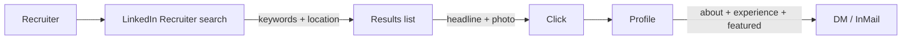

# Chapter 05 — LinkedIn Profile

> Most engineers hate LinkedIn. Recruiters live on it. Your profile exists to be found by the right ones and to say — in their language — "yes, call me."

## Learning objectives

- Build a LinkedIn profile that surfaces in recruiter searches for your target role.
- Write a headline and About section that read as a pitch, not a corporate self-portrait.
- Decide which activity is worth doing on the platform and which is noise.
- Use LinkedIn's job tools (Open to Work, Easy Apply, saved searches) without setting off red flags.

## Prerequisites & recap

- [Chapter 04: Resume](04-resume.md) — your resume is the source of truth; LinkedIn is a richer, semi-duplicate version.

## Concept deep-dive

### How recruiters actually use LinkedIn

They search LinkedIn Recruiter (a separate, paid tool) with a query like:

> location:Lisbon OR Berlin · title:(software engineer OR backend engineer) · skills:(Python AND SQL) · years of experience: 0–2

Your profile appears in the results if you match on keywords (title, skills, headline, experience text) and location. A recruiter scans the first 20 results and clicks on maybe 5.

So two jobs:

1. **Be findable** — keywords in the right fields.
2. **Be worth clicking once you appear** — headline and photo decide the click.

### The five high-signal fields

LinkedIn has dozens of sections. Five do 90% of the work:

1. **Profile photo.**
2. **Headline** (the line under your name).
3. **About** (the paragraph block).
4. **Experience** bullets.
5. **Skills** list.

Two extras for juniors:

6. **Featured** section (live projects, pinned).
7. **Open to Work** setting (with care).

### Profile photo

Rules:

- Your face, clear, well-lit, looking at the camera.
- A plain or softly blurred background.
- Everyday clothes (not pajamas, not a tuxedo unless you're a conductor).
- Smile is optional, friendliness isn't.

If you don't have a good photo, spend 15 minutes with a friend and a phone near a window. Don't use a filtered selfie; don't use an anime avatar.

### Cover photo (banner)

Secondary, but cheap to do well:

- A clean gradient, a keyboard photo, a cityscape, or something on-brand.
- **Not**: a stock photo of "coding" with Matrix rain. It reads as effort-free.

### Headline

This is the most important line on the site. It appears in every search result, comment, and DM thread.

Template:

> *[Role] · [Stack / specialty] · [Stage or mission]*

Examples:

- *Backend Engineer · Python, TypeScript, Postgres · Open to junior roles*
- *Software Engineer · Distributed systems · Building developer tools*
- *Career-changer → Backend Engineer · 12 months of focused study, open to roles*

Don't:

- Leave it as the default (your current job title).
- Cram emoji, slashes, and every skill.
- Write *"Passionate coder | Lifelong learner | Dreamer"*.

The headline is the recruiter's bumper sticker for you. Keep it scannable.

### About section

200–400 words. Three paragraphs:

1. **Who** — what kind of engineer you are, what you focus on.
2. **What you've done** — 2–4 concrete things (projects, outcomes, study).
3. **What you're looking for** — be direct. Location, role, stack.

End with a contact line: email + "happy to chat about X or Y".

Sample:

> *I'm a backend-focused engineer with strong footing in Python, TypeScript, and SQL. I spent the last year building real systems end-to-end — including a deployed habit-tracking API, a tiny job queue, and contributions to open-source retry libraries.*
>
> *My favorite problems are the ones where data model and API shape meet — normalizing a schema you'll actually query, or finding the right abstraction for a cross-cutting concern. I've built with Postgres, RabbitMQ, Docker, and GitHub Actions day-to-day; I'm comfortable on Linux and in a terminal.*
>
> *I'm open to junior backend roles, remote or in Lisbon / Berlin, at companies solving real problems (fintech, devtools, infra). You can reach me at maria.alves@gmail.com or via DM.*

Tone: professional but yours. Skip "passionate", "ninja", "rockstar", and anything that makes you gag.

### Experience entries

Mirror the resume bullets but allow slightly more length (3–5 lines vs 2–3) and slightly more context.

Two rules:

1. **Same dates and titles as the resume.** Mismatches trigger background-check issues later.
2. **One paragraph of context + a few bullets**, not just bullets. LinkedIn lets you tell more of the story.

For projects, use the **Projects** section (under "Add profile section → Additional"), or put them under a custom "experience" entry titled something like *"Independent Backend Projects"* — with dates and description.

### Skills

LinkedIn gives you up to 50 skills. Use ~15–25 real ones, ordered to lead with your top three pinned:

- Python
- TypeScript
- Node.js
- PostgreSQL
- Docker
- Linux
- …

Three are pinned at the top. Make those the three your target role values most. Don't list skills you can't defend.

**Endorsements** aren't very meaningful, but a few from real engineers look better than zero. Reciprocate genuinely.

### Featured section

Under your About, pin up to ~4 items. Ideal content:

- Your headline project repo link.
- A deployed demo URL with a preview image.
- One blog post or technical writeup.
- Your portfolio site.

This is the "click through to evidence" slot. Use it.

### Open to Work

Two flavors:

- **Recruiter-visible** (a banner flag, the dashed frame on your photo). Helpful signal; slight stigma in some circles.
- **Recruiters-only** (Green frame off, flag hidden from your public profile, still visible in recruiter search). Safer if you're employed.

For unemployed candidates: public is fine and probably helpful. For employed: recruiters-only avoids your boss noticing.

Set preferences honestly — locations, titles, types (full-time, contract). Recruiter search filters on these.

### Headline vs status

Your headline is always visible; your "status" (e.g. "Open to work") is optional and separate. Don't confuse them. Keep the headline professional even if you switch off Open to Work later.

### Activity: post or don't post?

Two viable strategies:

1. **Lurk usefully.** Follow 20–50 engineers you respect, occasionally comment thoughtfully, like good posts. Zero original content. Totally fine.
2. **Post occasionally.** One short post every 2–4 weeks: a project milestone, a concrete lesson learned, a link to something you wrote.

Avoid:

- "Humble brag" posts. "I rejected an offer today…"
- "Engagement farming" questions. "Name one thing every dev should know 👇"
- AI-written essays. Recruiters increasingly notice the cadence.

One honest post about a real thing you built > 50 inspirational quotes.

### Messaging recruiters

- Respond within 48 hours. A one-line acknowledgement is fine.
- Ask the three screening questions early: role level, comp range, remote/on-site. Don't play coy about money.
- Say no politely and remember the recruiter. They move companies frequently.

### Connections vs followers

- **Connect** with people you've actually interacted with — former colleagues, classmates, engineers you met at an event, recruiters you've had a real call with.
- Don't bulk-connect with strangers; LinkedIn rate-limits and your invites become spam.
- You can *follow* anyone — that's what the feed is for.

### Avoid dark patterns

- Auto-connect bots and "profile viewer" plugins: risk your account.
- Buying endorsements: transparent to the eye.
- Adding a second private profile: against ToS and usually gets both frozen.

### Region nuances

- **US/UK/NL**: no photo is fine; professional photo is standard; don't list DOB/marital status.
- **DE/FR/ES/PT/IT**: photo expected; CV (resume) often a bit longer too.
- **JP**: LinkedIn less used; look for the local equivalent.
- **Remote-first global**: optimize for the company's HQ region.

## Worked examples

### Example 1 — Headline iterations

Before: *"Software Developer | Full-Stack | Passionate about Learning 🚀"*

After iteration 1: *"Software Developer — Full-Stack (React + Node.js)"*

After iteration 2 (junior, career-switcher, open): *"Backend Engineer (Python, TypeScript, Postgres) — open to junior roles · Lisbon / Remote EU"*

The third version matches *actual* recruiter search queries.

### Example 2 — About section audit

For each paragraph of your current About, ask: "Does a recruiter looking for a Python backend junior in Lisbon care about this sentence?"

- "Former lawyer turned coder ✨" → cut or rewrite specifically.
- "I believe code should be elegant" → cut.
- "I built a booking API with Postgres, handling 50k monthly reservations" → keep.

Signal > vibes.

## Diagrams

*Caption: Trace the flow (data/time/money) through this figure before reading further.*

## Common pitfalls & gotchas

- **Default headline.** Your current job title ≠ the job you want.
- **Cryptic About section.** Recruiters bounce; engineers roll their eyes.
- **Listing skills you can't defend.** Great way to fail a tech screen you worked hard to get.
- **Dead links in Featured.** Audit quarterly.
- **"Open to Work" banner while your boss is a connection.** Use "recruiters-only" mode.
- **No photo.** Your profile shows less often; recruiters skip.
- **Engagement bait posts.** You'll attract the wrong recruiters and annoy the right ones.

## Exercises

1. **Warm-up.** Write three headline candidates. Pick the one that would rank highest in the imagined search you want to appear in.
2. **Standard.** Rewrite your About in the three-paragraph structure. Read aloud; cut anything embarrassing or generic.
3. **Bug hunt.** Search LinkedIn for your target role + location. Look at the top 10 profiles of people a year ahead of where you are. What do their profiles do that yours doesn't?
4. **Stretch.** Add a Featured section with three items: repo, live demo, portfolio. Verify the link previews look good.
5. **Stretch++.** Post one short update about a real project milestone. Keep it under 200 words. Don't check the likes count.

## In plain terms (newbie lane)
If `Linkedin` feels abstract, think of it as a practical tool to make your backend work more predictable and easier to debug. Use this chapter to build one clear mental model first, then add details.

> **Newbies often think:** this topic is only theory and memorization.  
> **Actually:** it is a workflow aid that helps you make better decisions under real project pressure.

## Quiz

1. LinkedIn's most important line for recruiter search-ranking is:
    (a) About (b) headline (c) skills list (d) Featured
2. Ideal profile photo:
    (a) anime avatar (b) clear photo of your face, plain background (c) selfie with a Snapchat filter (d) your pet
3. About section structure:
    (a) a bulleted list of skills (b) 3 paragraphs: who, what you've done, what you're looking for (c) one motivational quote (d) copy-paste of your resume
4. Listing a skill on LinkedIn commits you to:
    (a) nothing (b) defending it in a 10-minute conversation (c) certifying it (d) endorsing others back
5. "Open to Work" recruiters-only mode:
    (a) shows a green banner publicly (b) is hidden from your public profile but visible in recruiter search (c) is the same as fully public (d) disables recruiter contact

**Short answer:**

6. Why does a strong headline matter more than a strong About section for search visibility?
7. What's the trade-off of posting content vs lurking usefully?

*Answers: 1-b, 2-b, 3-b, 4-b, 5-b.*

## Mini-project: Apply it

Full brief (goal, acceptance criteria, hints, stretch): [05-linkedin — mini-project](mini-projects/05-linkedin-project.md).

## Where this idea reappears

- **Same thread elsewhere:** trace how this chapter’s primitives show up in production systems — not only in this language or layer.
- **Cross-module links (read next when you feel stuck):**
  - [Integration projects (cross-module builds)](../appendix-projects/README.md) — tie every earlier module into interview stories.
  - [System design primer](../appendix-system-design.md) — vocabulary for scaling conversations post-modules.

  - [Concept threads (hub)](../appendix-threads/README.md) — state, errors, and performance reading trails.

## Chapter summary

- Recruiters find you through search on title, skills, and location; headline + photo earn the click.
- The About section is a pitch, not a biography. End it with a concrete ask.
- Keep the resume and LinkedIn consistent; inconsistencies slow hiring.

## Further reading

- [LinkedIn — Help Center, profile best practices](https://www.linkedin.com/help/linkedin/answer/a542685/improve-your-public-profile).
- Austen Allred, ["How to write a LinkedIn headline that gets you noticed"](https://austenallred.com/) (browse their writing).
- Next: [applying](06-applying.md).
