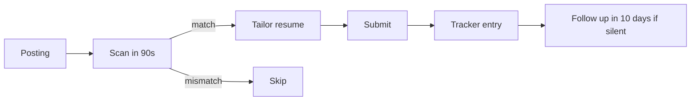

# Chapter 06 — Applying

> The application is the cheapest part of the pipeline — and the place people waste the most time. Fast, targeted, repeatable.

## Learning objectives

- Build a repeatable application workflow that takes ~10 minutes per role, not 60.
- Decide which postings are worth applying to and which are traps.
- Write a cover note (when needed) that actually gets read.
- Keep a tracker that lets you diagnose your funnel and follow up systematically.

## Prerequisites & recap

- [Chapter 01: Strategy](01-strategy.md) — you know your target and your pipeline shape.
- [Chapter 04: Resume](04-resume.md) — base + tailored resume ready.
- [Chapter 05: LinkedIn](05-linkedin.md) — profile is search-visible.

## Concept deep-dive

### The economics of applying

You have a cost per application (C) and a conversion rate (P(response)). Expected responses = N × P.

C is mostly **time**. For a 10-minute application, 40 applications a week is sustainable. For a 60-minute application, 7 a week is a ceiling — and your conversion needs to be 6× higher to match. Very precise applications beat volume only when they're much better, not just "a bit more tailored".

**Pick a pipeline shape** and hold the cost per application in that budget.

### The 10-minute workflow

Assumes your base resume, tailored template, and tracker exist.

1. **Read the posting (90 s).** Look for: role level, required stack, scale words, company size, explicit disqualifiers.
2. **Decide (30 s).** Skip if: level mismatch, stack is 70%+ unknown, explicit on-site requirement in a city you won't relocate to.
3. **Tailor the resume (3 min).** Reorder skills, swap project lead, tweak summary. Save as `resume-[company].pdf`.
4. **Write a cover note if asked (3 min).** Template + 2–3 sentences of specifics.
5. **Submit (1 min).** Attach resume, paste LinkedIn, portfolio, GitHub. Answer the 3 screening questions honestly (salary expectation included).
6. **Log (1 min).** Tracker entry.

10 minutes. If a posting demands a 60-minute take-home before even a recruiter call, skip unless the role is a stretch-target you love.

### Reading a posting correctly

Scan for the signal that matters:

- **Level.** "Senior" means senior. "Engineer III", "Staff" likewise. Junior and mid are safer bets. Mid-level postings often accept strong juniors; senior ones rarely do.
- **Stack.** If 6 of 8 required technologies are ones you've shipped something in, apply. If 3 of 8, it's a stretch. If 1 of 8, skip.
- **Scale words.** "High-throughput", "distributed", "at scale" in a junior posting is either a red flag (unrealistic expectations) or a sign of a strong team. Proceed carefully.
- **Company info.** Series, funding, team size. "Seed-stage fintech" is a different job from "Series D fintech".
- **Salary range.** If listed and low, don't waste time. If not listed, ask in the recruiter call.
- **Work setup.** "Remote (US only)" for a candidate in Europe is a no. Don't ghost-apply hoping they'll change their mind.

### Posting red flags

Skip postings that:

- List 15+ required technologies and 5 years of experience "for a junior role".
- Demand unpaid take-homes > 4 hours before a recruiter call.
- Have been open > 6 months (likely ghost).
- Don't mention the company or make it very hard to find.
- Require you to apply only through a weird recruiting firm site with no company page.
- Have obvious typos in the company's own name.

None of these are guarantees, but they predict a slow, painful pipeline.

### Cover letters: the 2025 reality

Most tech roles don't require them, and hiring managers skim them if submitted. Write one **only when**:

- The form has a dedicated field (leaving it blank looks lazy).
- You're applying to a role that cares about writing — technical writer, dev-rel, PM.
- You have a specific, genuine connection to the company or role (referred by X; shipped a project in their domain).

A cover letter template that works:

```
Hi [recruiter name or team],

I'm a [role type] with a focus on [2 specifics]. I came across this
role via [source] — a few things stood out:

- [Specific thing 1 about their product/team/problem]
- [Specific thing 2 that maps to my experience]

I've built [one relevant project]: [link]. It [one-line outcome].

Happy to share more — my resume, portfolio, and GitHub are linked below.

— [Name]
```

Keep it under 150 words. Any longer and it's ignored.

### Applying through channels

In descending order of conversion (roughly):

1. **Warm referral** (an engineer at the company submits your resume). Often 5–10× baseline conversion.
2. **Direct application via the company site** (not through LinkedIn Easy Apply).
3. **Recruiter outreach** that you engage with promptly.
4. **Non-Easy-Apply on LinkedIn** (redirects to the company site).
5. **Easy Apply on LinkedIn.** Lowest effort, lowest response rate. Fine for volume.
6. **Generic job boards** (Indeed, etc.). Depends on market.

Apply where conversion is plausibly worth the time. For 10 minutes, LinkedIn Easy Apply is fine. For 30 minutes, go through the company site.

### Job boards worth watching

- **Company career pages.** For a target list, check weekly.
- **LinkedIn Jobs.** Default board for most.
- **Hacker News "Who is Hiring"** (monthly thread). Excellent for SWE roles.
- **Wellfound (formerly AngelList)**, **Otta / Welcome to the Jungle**, **Arc.dev** — junior-friendly startup-focused boards.
- **Stack Overflow Jobs** (though declining).
- **Regional boards.** (Lisbon: LandingJobs; Berlin: Berlin Startup Jobs; US: Levels.fyi jobs.)

Set up saved searches with email alerts. Check Hacker News threads at the start of each month.

### Applying to recruiters

Some recruiters post their own listings; responding to them is a decent channel. Rules:

- Tell them your target comp range, seniority, and location early.
- Ask if they specialize in a sector (generalists sometimes waste your time).
- Don't take their "exclusive role" at face value — it's usually just their current mandate.

### The tracker

A sheet or simple database. Columns:

- Date applied · Company · Role · Link · Source · Resume version · Referrer · Recruiter response · Outcome per stage · Next action · Notes.

Review weekly. Two questions:

1. What's my application-to-response rate? (Target 5–15% for targeted apps.)
2. What's my tech-screen pass rate? (Target 30%+; if lower, practice.)

If you can't answer either, the tracker isn't working.

### Following up

- **No recruiter response after 10 business days.** Send a one-line polite follow-up message. Yields a reply ~20% of the time.
- **Tech screen done, no word after 7 business days.** Nudge.
- **Offer pending at another company.** Email *every* live pipeline to expedite; most will either accelerate or gracefully drop off.

Don't follow up more than twice. After that, you're just noise.

### Declines and ghosts

Both happen. A ghost is not personal. A decline is not final — pipelines re-open, recruiters switch companies. Keep the recruiter's name.

Reply to a decline with a short thanks. Recruiters remember the gracious candidates; they refer them to other roles.

## Worked examples

### Example 1 — One morning's application session

09:00–09:10 — Open tracker, open target board, set a 60-minute timer.
09:10–10:10 — Rotate through 5 postings:
  - Posting A: matches → apply (10 min).
  - Posting B: stack mismatch → skip (1 min).
  - Posting C: 5-hour take-home → skip (1 min).
  - Posting D: matches → apply (12 min).
  - Posting E: matches, has cover letter field → apply (15 min).
  - Posting F: ghost posting (6 months open) → skip (1 min).
10:10–10:20 — Log entries, tag resume versions, note follow-up dates.

Three applications in a focused hour. Sustainable.

### Example 2 — Tracker entry (one row)

```
2026-04-20 | Acme Fintech | Backend Engineer (Jr) |
acme.com/careers/be-jr | Company site | resume-acme.pdf |
— | (pending) | next: follow up 2026-05-04 |
notes: stack matches 6/7; referral-less; posted 2 weeks ago
```

Consistent rows make the spreadsheet useful later.

## Diagrams



*Caption: Trace the flow (data/time/money) through this figure before reading further.*

## Application rubric (score before you spend 10 minutes)

| Dimension | Green (apply) | Yellow (maybe) | Red (skip) |
|-----------|----------------|----------------|------------|
| **Stack fit** | ≥60% of listed tech you’ve shipped in a repo | Gaps only in “nice to have” | Core platform you’ve never touched |
| **Level** | Title matches or says “open to strong juniors” | “Mid” with heavy senior signals | “Senior/Staff” with no junior lane |
| **Take-home** | ≤4h, repo + tests provided, clear scope | Vague but recruiter answers scope in email | >4h unpaid before human contact |
| **Geo / legal** | Remote policy matches your location | Hybrid you can commute to | “US only” when you’re not |

**Follow-up script (day 10, polite ping):**

> *Hi [Name] — I applied for the [role] on [date] via [channel]. Still very interested because [one specific product/tech reason]. If the role is still open, happy to share a 2-minute Loom walking through [project]. Either way, thanks for the work you do hiring here.*

## Common pitfalls & gotchas

- **Applying to postings you know you won't accept.** Pure funnel noise.
- **One resume for everything.** Cuts conversion substantially vs a 5-minute tailor.
- **Easy Apply only.** Works for some markets; often too noisy alone.
- **Ghost postings.** Adjust the filter: open > 3 months is suspicious.
- **Skipping the salary question.** Leads to wasted interviews.
- **Obsessive checking of the tracker.** Batch your reviews weekly; don't refresh status hourly.

## Exercises

1. **Warm-up.** Build the tracker template in your tool of choice (Sheets, Airtable, Notion). Include all columns above.
2. **Standard.** Apply to 3 roles in an hour using the 10-minute workflow. Log each. Note any step that took longer than expected.
3. **Bug hunt.** You've applied to 40 roles, 2 responses. Audit your decisions: were you applying in-range (level, stack, geo)? Fix the upstream problem before applying to more.
4. **Stretch.** Review your tracker and compute two numbers: application-to-response rate, tech-screen pass rate. Identify the weaker stage.
5. **Stretch++.** Write two cover letter templates — one for warm referrals, one for cold applications — and use them as starting points.

## In plain terms (newbie lane)
If `Applying` feels abstract, think of it as a practical tool to make your backend work more predictable and easier to debug. Use this chapter to build one clear mental model first, then add details.

> **Newbies often think:** this topic is only theory and memorization.  
> **Actually:** it is a workflow aid that helps you make better decisions under real project pressure.


## Quiz

1. 10-minute application workflow includes:
    (a) 60 minutes of tailoring (b) reading, deciding, tailoring, submitting, logging (c) writing a 500-word essay (d) calling the recruiter first
2. A posting with 15 required technologies and "5+ years for junior":
    (a) green flag (b) red flag — expectations misaligned (c) means you should still apply (d) is normal
3. Highest-converting channel typically:
    (a) LinkedIn Easy Apply (b) warm referral (c) job board with no filter (d) cold messages
4. Follow up on silence:
    (a) never (b) after ~10 business days, once or twice (c) every day (d) only after 3 months
5. Cover letter necessary when:
    (a) always (b) there's a dedicated field or a genuine connection (c) never (d) only if you have 5 hours

**Short answer:**

6. Explain the trade-off between volume and precision in applying.
7. Why do ghost postings hurt your metrics if you don't filter them?

*Answers: 1-b, 2-b, 3-b, 4-b, 5-b.*

## Mini-project: Apply it

Full brief (goal, acceptance criteria, hints, stretch): [06-applying — mini-project](mini-projects/06-applying-project.md).

## Where this idea reappears

- **Same thread elsewhere:** trace how this chapter’s primitives show up in production systems — not only in this language or layer.
- **Cross-module links (read next when you feel stuck):**
  - [Integration projects (cross-module builds)](../appendix-projects/README.md) — tie every earlier module into interview stories.
  - [System design primer](../appendix-system-design.md) — vocabulary for scaling conversations post-modules.

  - [Concept threads (hub)](../appendix-threads/README.md) — state, errors, and performance reading trails.


## Chapter summary

- Application is cheap labor; make it repeatable and cap time-per-app.
- Filter aggressively on level, stack, geography. Don't apply to roles you'd reject.
- Follow up once; track everything; diagnose funnel weekly.

## Further reading

- *The 2-Hour Job Search* by Steve Dalton — application workflow.
- [Who is hiring? — HN](https://news.ycombinator.com/submitted?id=whoishiring) — monthly.
- [Levels.fyi](https://www.levels.fyi/) — salary calibration.
- Next: [networking](07-networking.md).
