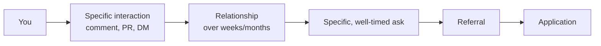

# Chapter 07 — Networking

> Most junior engineers think "networking" means asking strangers for jobs. Good networking is the opposite — you build relationships first; jobs occasionally follow.

## Learning objectives

- Build a lightweight networking practice that fits around a full-time job or the path.
- Write cold messages that don't sound like cold messages.
- Turn a conversation into a referral without making it transactional.
- Maintain a network over years, not the six weeks of a job hunt.

## Prerequisites & recap

- [Chapter 01: Strategy](01-strategy.md) — your target defines who's worth talking to.
- [Chapter 05: LinkedIn](05-linkedin.md) — your profile does the legwork when someone checks before replying.

## Concept deep-dive

### Why networking works (and why "networking" often doesn't)

The observable effect: referred candidates convert 5–10× better than cold applicants. The common explanation — "nepotism" — is wrong. The real mechanism is simpler:

- A referral is a **filter**. An engineer is risking their social capital by vouching for you. That filter encodes information the resume doesn't.
- Referrals **rank up** your resume in the ATS, ensuring human eyes.
- Referrals **pre-brief** the interviewer ("I worked with them, they're solid at X").

Cold "please refer me" DMs from strangers carry none of those benefits — which is why they convert poorly. You have to earn the referral.

### The four relationship types

Not all connections convert equally:

1. **Close colleagues, past and present.** Worked with you directly. Strongest referrals.
2. **Loose ties** — former classmates, bootcamp cohort, people you met at a meetup, OSS contributors to the same project. Second strongest.
3. **Warm strangers** — engineers you've interacted with publicly (comments, PRs, tweets). Potential second-degree connection.
4. **Cold strangers.** Weakest. But strong messages to strangers still beat nothing.

Put most of your energy into 1 and 2; most of your time into expanding 3; the rest into 4.

### The "weak ties" insight

Sociologist Mark Granovetter's *The Strength of Weak Ties* (1973) found that people mostly find jobs through *acquaintances* rather than close friends. Close friends know the same people you do — they can't open new doors. Acquaintances are windows into other networks.

Practical consequence: even a 30-minute coffee with someone you barely know is worth the calories.

### A weekly networking practice (30–60 min)

This is low-volume but compounding. Do it every week.

1. **Reach out to 1 old contact.** Former colleague, classmate, someone you haven't talked to in 6+ months. No ask — just "how are you, what are you up to, here's what I've been building." Replies come back unexpectedly months later.
2. **Engage in 3 public interactions.** Comment on a LinkedIn post, reply to a Hacker News comment, review a PR on an OSS project. Be specific, not flattering.
3. **Send 1 cold message.** Carefully (below).
4. **Follow up on 2 threads.** Reply to people who replied. Don't let threads die.

Four actions, total ~60 minutes. Over 12 months: ~200 maintained relationships.

### The cold message that works

Structure:

```
Hi [name],

I [specific context on who you are] — I've been [specific thing
you've built / are learning].

I saw [something specific about them] — [what caught your attention].

I'm not job-hunting directly; I'd love 15 minutes to ask about
[a specific, narrow question].

No pressure — totally understand if not.

— [Your name]
```

Rules:

- **Specific, not generic.** If the message could be sent to anyone, it'll be deleted by everyone.
- **Small ask.** "15 minutes to ask about X" >> "can we hop on a call".
- **One question** — the one you actually want answered. Not five.
- **Make it easy to say no.** Counter-intuitively, this raises the reply rate.

A 20–30% reply rate for thoughtful cold messages is realistic. A 1–5% reply rate for "here's my resume, any roles?" is also realistic.

### The coffee chat (or 15-minute call)

You've got the call. Do **not** ask for a job in the first message or the first call. Instead:

- Ask about their path, their current team, the problems they're solving.
- Share (briefly) what you're building and why.
- Listen far more than you talk (~60/40 at least).
- At the end: "Is there anyone else I should talk to?" or "What would you pay attention to if you were in my position?"

A **referral often shows up unprompted**, two calls later, because you impressed them over time. That's the game.

### Making the ask (eventually)

After a real interaction — once you've built even a small relationship — a specific ask is legitimate:

> *"I noticed your team has a junior backend opening. If you think I'd be a fit, would you be willing to submit a referral? Totally understand if you don't have the context yet."*

Good referrers *want* to refer solid people (many companies pay bounties). Make it easy: send your resume, a one-line pitch, and the job link pre-packaged.

If they say "I don't feel I know you well enough yet": respect it, keep the relationship going, don't ask again for that role.

### Local vs online networking

- **Meetups** are underrated. 20–30 person technical meetups (language user groups, PyData, local startup events) convert better than giant conferences.
- **Conferences** work if you go with an intent (talk to 5 people, follow up with all 5 within 48 hours).
- **Online communities** (Discord, Slack, forums) are slow but cumulative. Four years in the same Python Discord produces a network.
- **Hackathons** — less useful for hiring than commonly believed; great for project collaborators.

### Open source as networking

Unique feature: work becomes relationship. Pattern that works:

1. Use a library at work or in a project.
2. File a thoughtful issue or submit a small PR.
3. Engage with the maintainer over 1–3 PRs.
4. Over months, you become "one of the regular contributors".

This is one of the most credible forms of networking available to introverts. The maintainers often run or work at interesting companies, and they'll vouch for your code because they've read your code.

### Writing in public

A blog post about something you learned, posted to Hacker News or Reddit, converts to connections far better than a LinkedIn post. Examples:

- "Why we moved from MongoDB to Postgres."
- "A brief tour of RabbitMQ quorum queues."
- "How I debugged a p99 latency spike in a Node.js process."

Aim for a post a month. A small body of writing over a year signals to hiring managers far more than raw GitHub commits.

### Reciprocity, without score-keeping

If someone helped you: thank them, update them when you land something, be specific about the impact they had. If someone asks *you* for help: give it when the cost is low. Referring back, forwarding a resume, making an intro — these compound.

Never keep score publicly. Treat networking like tipping, not trading.

### The long-term practice

The best networks were built slowly over years. A ruthless job-hunt approach ("I'll message 50 engineers this week") *does* yield short-term wins but poisons the long-term relationship. Favor **quality + consistency**:

- 10 real connections a year, revisited biannually, beats 200 cold touches.
- 40 maintained loose ties over 5 years is a career's worth of opportunity.

### Boundaries and ethics

- **Don't ask for jobs on every thread.** Respect others' bandwidth.
- **Don't pretend intimacy.** If you met once at a meetup, say so. Don't say "as we discussed".
- **Don't mass-spam.** Recruiters see the patterns; so do engineers.
- **Don't ask someone to lie** on a referral. Their name is at stake.

## Worked examples

### Example 1 — A good cold DM

> *"Hi David — I've been building a small job queue library in TypeScript this year and studying Kafka/RabbitMQ patterns. I read your post on the RabbitMQ → Kafka migration at Acme; the part about idempotency keys in the outbox was the clearest description I've seen. Quick question if you have 10 minutes sometime: when you moved to Kafka, did the outbox pattern still feel necessary, or did Kafka's exactly-once semantics make it redundant?"*

Specific, small ask, evidence of reading their work, no implicit "hire me."

### Example 2 — A bad cold DM

> *"Hi — I'm a junior developer looking for opportunities. I noticed you work at Acme. Could you refer me? Attached is my CV."*

Generic, asks for the biggest favor available, no relationship, no specificity. Immediate delete.

## Diagrams



*Caption: Trace the flow (data/time/money) through this figure before reading further.*

## Scripts and agendas

**15-minute coffee chat agenda (you drive the timebox):**

1. *00:00–01:00* — Thanks + one-line who you are (role + current focus).
2. *01:00–08:00* — Ask your **one** prepared question; listen; one clarifying follow-up max.
3. *08:00–11:00* — Share **one** artifact (PR, post, diagram) only if it answers something they raised.
4. *11:00–13:00* — “What would you read next if you were me?” — harvest reading list.
5. *13:00–15:00* — Thank-you + optional tiny ask (“OK to follow up in 6 weeks with a progress note?”).

**Referral ask (only after ≥2 meaningful touches):**

> *I’m applying to [team/role] this week — would you be comfortable passing my packet to recruiting? I’ve linked a one-pager + repo. Totally fine if now isn’t a good time.*

## Common pitfalls & gotchas

- **Networking only when job-hunting.** Poisons the well. Do it always, at low volume.
- **Generic messages.** Zero reply rate; leaves a bad aftertaste.
- **Asking for a job in the first interaction.** Even when a friend-of-a-friend does it, it's off-putting.
- **Ghosting after help.** Say thanks. Close the loop. Update later.
- **Chasing celebrities.** A senior engineer at a 20-person company usually has more bandwidth than a staff engineer at FAANG.
- **Transactional thinking.** People feel it. Even introverts.

## Exercises

1. **Warm-up.** List 10 people you've worked or studied with — any relationship — you haven't spoken to in 6+ months. Send a no-ask "hi, how are you" to three of them this week.
2. **Standard.** Identify 3 engineers whose public work you admire. Write a specific cold DM to each using the template.
3. **Bug hunt.** A friend sends 50 cold DMs a month with a generic template and gets 0 replies. Rewrite one of their messages specifically for a real recipient and explain the changes.
4. **Stretch.** Attend one meetup or online community event this month. Follow up within 48 hours with everyone you had a conversation with.
5. **Stretch++.** Publish a short technical post about something you recently learned. Share it once on LinkedIn, once on Hacker News (or equivalent), and in one community you're part of.

## In plain terms (newbie lane)
If `Networking` feels abstract, think of it as a practical tool to make your backend work more predictable and easier to debug. Use this chapter to build one clear mental model first, then add details.

> **Newbies often think:** this topic is only theory and memorization.  
> **Actually:** it is a workflow aid that helps you make better decisions under real project pressure.


## Quiz

1. Referrals convert better primarily because:
    (a) nepotism (b) they encode additional filtering and pre-brief interviewers (c) money (d) randomness
2. Weak ties are often more valuable than strong ties for job-finding because:
    (a) they're cheaper (b) they give access to networks your close friends don't (c) they owe you favors (d) they lie less
3. A thoughtful cold DM can realistically expect:
    (a) 90% reply (b) 20–30% reply (c) 0% reply (d) guaranteed job
4. In a coffee chat, you should:
    (a) ask for a referral in the first minute (b) listen more than you talk; share briefly; ask one specific question (c) pitch your resume line by line (d) stay silent
5. Which is closest to the best long-term practice?
    (a) 200 cold touches in a month, burn out, quit (b) 10 real connections a year, revisited (c) no networking (d) only attend giant conferences

**Short answer:**

6. Why is "asking for a job" usually the wrong first move, even when you need one?
7. How does open-source contribution turn into a credible networking signal?

*Answers: 1-b, 2-b, 3-b, 4-b, 5-b.*

## Mini-project: Apply it

Full brief (goal, acceptance criteria, hints, stretch): [07-networking — mini-project](mini-projects/07-networking-project.md).

## Where this idea reappears

- **Same thread elsewhere:** trace how this chapter’s primitives show up in production systems — not only in this language or layer.
- **Cross-module links (read next when you feel stuck):**
  - [Integration projects (cross-module builds)](../appendix-projects/README.md) — tie every earlier module into interview stories.
  - [System design primer](../appendix-system-design.md) — vocabulary for scaling conversations post-modules.

  - [Concept threads (hub)](../appendix-threads/README.md) — state, errors, and performance reading trails.


## Chapter summary

- Networking is a long-horizon practice, not a job-hunt sprint.
- Specific > generic; small asks > big asks; listen > pitch.
- Weak ties, writing in public, and OSS contribution compound over years.
- Don't be transactional — people feel it, and opportunities dry up.

## Further reading

- Granovetter, M. S., ["The Strength of Weak Ties"](https://www.cs.cmu.edu/~jure/pub/papers/granovetter73ties.pdf) (1973).
- Patrick McKenzie, ["Don't Call Yourself a Programmer"](https://www.kalzumeus.com/2011/10/28/dont-call-yourself-a-programmer/) — networking is in here, implicitly.
- Julia Evans' blog (jvns.ca) — a model of small, helpful, public writing.
- Next: [interviewing](08-interviewing.md).
