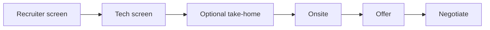

# Chapter 08 — Interviewing

> Interviews are a skill, not a personality test. Practice the skill, reduce the nerves, and let your year of real engineering work come through.

## Learning objectives

- Prepare for the four common interview stages: recruiter screen, technical screen, take-home, and onsite.
- Structure your answers to behavioral questions without reciting a script.
- Solve coding problems out loud in a way interviewers can follow.
- Handle systems, debugging, and "talk about your project" rounds with a repeatable process.

## Prerequisites & recap

- [Module 06: Data Structures and Algorithms](../06-dsa/README.md) — the technical foundation.
- [Module 11: SQL](../11-sql/README.md) — common in backend interviews.
- [Module 12: HTTP Servers](../12-http-servers/README.md) — underlies most system-design discussions for juniors.

## Concept deep-dive

### The standard funnel

Most junior backend loops look like:

1. **Recruiter screen** (30 min). Culture-fit, logistics, salary, level-check.
2. **Technical screen** (45–60 min). One coding problem or a take-home, plus some "talk about your project".
3. **Take-home** (optional, 2–6 hours). Small project you submit.
4. **Onsite / virtual onsite** (3–5 hours). 2–4 rounds: coding, systems, behavioral, sometimes debugging.
5. **Offer + negotiation.**

Not every company runs all stages. FAANG-style companies skew toward DSA-heavy. Startups lean on take-homes or "build something with us live". Senior-adjacent roles introduce system design earlier.

### Recruiter screen

Goals from both sides:

- **Them.** Verify level, check salary fit, gauge communication, align on timeline and location.
- **You.** Learn role specifics, check values match, protect your time.

Prepare:

- 60-second pitch: *"I'm a [role], recent focus on [X], current highlights are [Y and Z]."*
- Your target salary range, tested against [levels.fyi](https://www.levels.fyi/) and local market data.
- Questions: team size, tech stack specifics, typical day, interview process, timeline.

Answer the salary question honestly and early. Dodging it wastes both parties' time.

### Behavioral questions

Common questions and what they're really asking:

| They ask | They want to know |
|---|---|
| "Tell me about yourself." | Can you structure a story and own your trajectory? |
| "Why us?" | Have you done any homework? |
| "Describe a conflict at work/school." | Can you work with humans? |
| "Tell me about a hard project." | Can you scope, build, and reflect? |
| "Weakness?" | Self-awareness + real learning, not humble-brag. |

**STAR** is a decent template for structuring stories: Situation, Task, Action, Result.

Keep stories under 2 minutes. Prep 4–6 real stories that cover: (a) shipping something hard, (b) working with people, (c) a mistake and what you learned, (d) initiative, (e) dealing with ambiguity. Mix and match for each prompt.

Avoid the two classic failures:

- **No story — just adjectives.** *"I'm hard-working and passionate"* with no example.
- **Over-scripted.** Reading from a memorized monologue reads as performance.

### "Talk about your project"

Likely the single most important 10 minutes in a junior interview. Structure:

1. **Context (20 s).** What is it, who uses it, why does it exist?
2. **Architecture (1–2 min).** High-level picture. A diagram if you can share a screen.
3. **A hard part (2–3 min).** The one place you had to make a real decision.
4. **Trade-off discussion (2–3 min).** What you'd do differently, what you'd keep.
5. **Their questions (3–5 min).** This is the real test.

Practice *out loud*. Record yourself once. Most people ramble for 8 minutes when 2 would suffice.

### Coding rounds

A universally useful process:

1. **Clarify (2 min).** Ask about input constraints, edge cases, expected runtime. "Can the input be empty?" "What's the max size?" "Are duplicates allowed?"
2. **Plan (3 min).** State an approach in English. Mention complexity before writing code.
3. **Code (20–30 min).** Write it. Type carefully. Talk through what you're doing.
4. **Test (3–5 min).** Dry-run with a small example. Handle edge cases *intentionally*, not frantically.
5. **Optimize (if time).** "I have a working O(n²); we could get O(n) with a hashmap if we accept the extra space."

Narrate your thinking. Silent coding — even if correct — scores worse than a reasoning-out-loud attempt that doesn't finish.

### Coding patterns for a junior loop

80% of junior-level coding questions fall into these patterns. Practice them in this order:

1. **Arrays & strings** — two pointers, sliding window.
2. **Hashmaps** — counting, lookup, dedup.
3. **Recursion / backtracking** — subsets, permutations.
4. **Trees** — BFS, DFS, path problems.
5. **Graphs** — BFS/DFS, topological sort.
6. **Dynamic programming** — only if your target demands it; many junior loops don't test this heavily.
7. **Sorting + binary search** — know when to use them.

Aim for ~80 problems solved across these patterns before heavy interviewing. LeetCode's curated "LeetCode 150" list is a reasonable target.

### System design for juniors

Junior loops rarely run a full 45-minute system design round. They do sometimes ask:

- "How would you design [X]?" for 15 minutes.
- "Walk me through the architecture of your project."
- "What database would you pick and why?"

A repeatable frame:

1. **Clarify requirements.** Who uses it, scale, read-heavy or write-heavy?
2. **Sketch the happy path.** Client → API → service → database.
3. **Identify pain points.** Where does this break at 10× scale?
4. **Propose relief.** Caching, queueing, sharding — only what you can defend.

Don't pretend to know how Twitter built their timeline. Name what you know, admit what you don't, reason through the rest.

### Take-homes: worth doing?

Rules of thumb:

- **≤ 4 hours with clear scope**: usually fine. Do them.
- **> 4 hours or vague scope**: ask the recruiter to time-box.
- **Production-level work for no pay**: skip.

When you do them:

- Obey the scope. Don't gold-plate into a weekend project.
- Include a README with decisions, trade-offs, and what you'd do with more time.
- Include tests.
- Submit on time, with a short explanation of what's included.

Most take-homes are judged more on judgment than perfection.

### Debugging rounds

A specialty round some companies run: they hand you broken code, you fix it live.

Process:

1. **Read first, run second.** Spend 2 min understanding before changing anything.
2. **Reproduce the bug.** Actually trigger it.
3. **Hypothesize.** Say it out loud.
4. **Isolate.** Minimize inputs or comment out chunks.
5. **Fix and verify.**

Talk through each step. Debugging is more about process than aha.

### Onsite logistics

- **Sleep.** Nothing else matters as much.
- **Eat beforehand and between rounds.** Bring water.
- **Bathroom break between rounds** is almost always fine — ask.
- **Ask for 1–2 minutes of context at the start of each round.** Interviewer name, area, what to expect.
- **Have 2–3 questions per round** — generic ones are fine ("What's the hardest thing about your team right now?").

### What to do when you bomb a round

It happens. The next round is independent — companies typically need all rounds to go well but don't aggregate in a scoring sense you can rescue mid-loop. Strategy:

- Reset between rounds. Splash water, walk.
- Acknowledge once, then drop it. Don't apologize across rounds.
- Ask your interviewer for concrete feedback if the recruiter offers a debrief.

### Negotiation

Once an offer arrives:

- **Don't accept on the call.** "This is exciting — can I take 48 hours?"
- **Ask for time** to get competing offers. 3–7 business days is normal.
- **Negotiate in writing.** Ask for a specific number, not "the best you can do".
- **Leverage competing offers** if they exist; don't invent them (recruiters talk).
- **Focus on base + equity + sign-on**, in that order. Benefits rarely move meaningfully.
- Read Patrick McKenzie, ["Salary Negotiation"](https://www.kalzumeus.com/2012/01/23/salary-negotiation/) before your first offer.

Juniors often leave 5–15% on the table because they feel lucky to be hired. A calm, polite counter almost always beats silence.

### Saying no gracefully

Not every offer is right. Decline professionally: thank them, be brief about reasons (fit/timing/alternative), keep the door open ("I'd love to stay in touch for future roles").

## Worked examples

### Example 1 — A "tell me about yourself" pitch

> *"I'm a backend-focused engineer transitioning from [prior career]. Over the last year I completed an intensive self-directed path in Python and TypeScript — finishing with a deployed habit-tracking API and a job-queue library I used to understand pub/sub patterns. Before this, I spent four years at BestCoffee leading a six-person shift team, which is where I learned to ship under pressure and coordinate across people. I'm looking for a junior backend role where I can build real features and grow alongside experienced engineers."*

90 seconds. Specific. Covers trajectory, evidence, and what you want.

### Example 2 — Coding narration

> *"Okay, problem is 'two sum': return indices of two numbers summing to target.
> Clarify: are there always exactly two? I'll assume yes per the spec. Duplicates allowed? Probably — the examples suggest so.
> Simple approach: nested loops, O(n²). That works; let me also think about O(n) with a hashmap — for each element, check if `target - x` is in the map, else insert `x`. That's O(n) time and space.
> I'll go with the hashmap solution; the nested loop is fallback if anything goes sideways.
> [types code]
> Let me dry-run with `[2,7,11,15]`, target 9. i=0, x=2, need 7, not in map yet, insert 2→0. i=1, x=7, need 2, in map at 0, return [0,1]. Matches.
> Edge: empty input? Problem says length ≥ 2. Single element? Same — won't happen per constraints, but I'll note it.
> Done — O(n) time, O(n) space."*

Interviewer knows exactly what happened, even if you'd written nothing.

## Diagrams

*Caption: Trace the flow (data/time/money) through this figure before reading further.*

## Take-home project rubric (score yourself before submit)

| Area | Weight | Green signal |
|------|--------|----------------|
| **Scope discipline** | 25% | README states in/out of scope; no surprise features |
| **Tests** | 25% | Automated tests for core paths + one failure case |
| **Ops story** | 20% | `docker compose up` or single script boots dependencies |
| **Security basics** | 15% | No secrets in git; parameterized SQL / validated input |
| **Communication** | 15% | Short `DECISIONS.md` with trade-offs you considered |

**Opening line for live coding (buy yourself 60 seconds):**

> *“I’m going to restate the problem and write down two test cases before I touch code — shout if I misread anything.”*

## Common pitfalls & gotchas

- **Silent coding.** Worst case: you solve it in silence and interviewer scores "poor communication".
- **Jumping to code** without clarifying. Get the problem right before solving it.
- **Memorized monologues.** Interviewers can tell.
- **Under-preparing the project story.** Surprising how often candidates can't cleanly describe their headline project.
- **No questions at the end.** Read as "not interested".
- **Accepting on the call.** Rarely optimal, always unnecessary.
- **Practicing only LeetCode, ignoring behavioral prep.** Easy way to bomb the last round.

## Exercises

1. **Warm-up.** Write your 60-second "tell me about yourself" pitch. Record yourself once. Iterate twice.
2. **Standard.** Solve 20 LeetCode easy problems across arrays, strings, and hashmaps, narrating aloud each time.
3. **Bug hunt.** Record yourself doing a LeetCode medium. Watch the recording. Identify two verbal habits you'll change (too fast, filler words, silent debugging).
4. **Stretch.** Do 3 mock interviews — with a peer, on Pramp, or with interviewing.io. Get one real debrief each.
5. **Stretch++.** Run a full-loop rehearsal: 4 rounds of 45 minutes (coding, coding, systems, behavioral), back-to-back, with a 10-minute break. Measure fatigue. Plan countermeasures.

## In plain terms (newbie lane)
If `Interviewing` feels abstract, think of it as a practical tool to make your backend work more predictable and easier to debug. Use this chapter to build one clear mental model first, then add details.

> **Newbies often think:** this topic is only theory and memorization.  
> **Actually:** it is a workflow aid that helps you make better decisions under real project pressure.

## Quiz

1. The most important move before coding a problem:
    (a) dive in (b) clarify constraints and edge cases (c) ask for hints (d) memorize the answer
2. A good story response uses:
    (a) adjectives only (b) the STAR structure with real specifics (c) 10-minute monologue (d) memorized script verbatim
3. Take-home > 4 hours with vague scope:
    (a) always do (b) push back on scope or skip (c) gold-plate (d) ignore tests
4. When you bomb a round:
    (a) apologize through the rest (b) reset, the next round is independent (c) leave early (d) beg
5. You get an offer. Best first response:
    (a) "I accept!" (b) "Thank you — can I take 48 hours to consider?" (c) silence for a week (d) counter with a number immediately

**Short answer:**

6. Why does narrating your thinking while coding score better than silent correctness?
7. How do you prepare 4–6 stories that can adapt to any behavioral prompt?

*Answers: 1-b, 2-b, 3-b, 4-b, 5-b.*

## Mini-project: Apply it

Full brief (goal, acceptance criteria, hints, stretch): [08-interviewing — mini-project](mini-projects/08-interviewing-project.md).

## Where this idea reappears

- **Same thread elsewhere:** trace how this chapter’s primitives show up in production systems — not only in this language or layer.
- **Cross-module links (read next when you feel stuck):**
  - [Integration projects (cross-module builds)](../appendix-projects/README.md) — tie every earlier module into interview stories.
  - [System design primer](../appendix-system-design.md) — vocabulary for scaling conversations post-modules.

  - [Concept threads (hub)](../appendix-threads/README.md) — state, errors, and performance reading trails.

## Chapter summary

- Interviewing is a distinct, trainable skill. Treat it like a sport.
- Narrate your reasoning; clarify before coding; prepare your project story.
- Negotiate every offer, politely and in writing.
- Mocks beat solo prep, and rest beats more prep.

## Further reading

- Companion **system design primer** for post-curriculum interview prep: [appendix-system-design.md](../appendix-system-design.md).
- **Junior backend spine** (logging, tests, migrations): [appendix-junior-backend.md](../appendix-junior-backend.md).
- *Cracking the Coding Interview* by Gayle McDowell — classic reference.
- [Tech Interview Handbook](https://www.techinterviewhandbook.org/) — free, comprehensive.
- Patrick McKenzie, ["Salary Negotiation"](https://www.kalzumeus.com/2012/01/23/salary-negotiation/).
- [Pramp](https://www.pramp.com/), [interviewing.io](https://interviewing.io/) — mock interviews.
- Next: [relocation](09-relocation.md).
