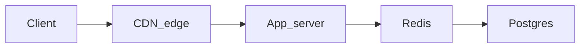

# Appendix — System design starter

> Use this **after** Modules 01–16 and **before** your first system-design interview. It connects vocabulary you already earned (HTTP, SQL, Docker, pub/sub) to how teams talk about scale.

## Capacity and back-of-the-envelope

- **Users → RPS:** daily active users × actions per day ÷ seconds per day ≈ average RPS; multiply by peak factor (often 3–10×).
- **Data per day:** events × payload size; add replication (3×) and indexes (2×) as first-pass fudge factors.
- **Read vs write:** separate hot paths; caching wins reads, queues smooth writes.

## Latency: p50 vs p95 vs p99

- **p50** is typical user experience; **p99** is the “unlucky tail” that drives timeouts and support tickets.
- Cutting p99 usually means removing head-of-line blocking, coalescing work, or shrinking dependency depth — not micro-optimizing p50.

## Storage choices (when SQL is not enough)

| Need | First tool | Why |
|------|------------|-----|
| Strong consistency + ad-hoc queries | PostgreSQL | ACID, joins, mature ops story |
| Huge immutable blobs | Object storage (S3-style) | Cost per GB, CDN integration — see [Module 13](13-file-cdn/README.md) |
| Ephemeral fan-out work | Queue / stream (RabbitMQ, Kafka) | Decouple producers from consumers — see [Module 15](15-pubsub/README.md) |
| Low-latency reads of derived data | Cache (Redis, CDN) | Trade freshness for speed — see [Module 13 ch. 02](13-file-cdn/02-caching.md) |

## Queues vs RPC

- **RPC (HTTP):** caller blocks until callee answers; simple mental model; coupling in time.
- **Queue:** caller drops work and moves on; callee catches up; needs idempotency and poison-message handling.
- Pick RPC for queries; queues for notifications, retries, and burst absorption.

## Caching layers (read path)

Invalidate or TTL explicitly — “cache forever” is how stale security rules ship.

## Consistency vocabulary

- **Strong consistency:** reads see the latest write (single leader DB).
- **Eventual consistency:** reads may lag; converges over time (many caches, DNS, async replicas).
- **CAP (practical version):** when a partition happens, choose between **available** responses and **consistent** data — real systems pick with eyes open.

## Retries, idempotency, and backpressure

- **Retries with jitter:** exponential backoff + randomness prevents thundering herds when a dependency blips — ties to [HTTP errors](10-http-clients/04-errors.md).
- **Idempotency keys:** duplicate POSTs must not double-charge — producer supplies a stable key stored with the business transaction.
- **Backpressure:** slow consumer signals upstream to stop (bounded queues, `429`, drop policy) instead of OOMing.

## Security at scale (OWASP-flavored checklist)

Short reminders, not a replacement for a security course:

- Injection (SQL, command, LDAP) — always parameterize — [Module 11](11-sql/README.md), [Module 12](12-http-servers/README.md).
- Broken auth — sessions vs JWTs, rotation, theft detection — [Module 12 ch. 07](12-http-servers/07-authentication.md).
- Sensitive data exposure — TLS everywhere, secrets in vaults/env — [Module 10 ch. 09](10-http-clients/09-https.md).
- SSRF when your server fetches user-supplied URLs — validate hosts and schemes.

## Further reading

- Kleppmann, *Designing Data-Intensive Applications* — the canonical bridge from coding to architecture.
- [AWS Well-Architected](https://aws.amazon.com/architecture/well-architected/) — operational pillars in checklist form.
- [Junior backend spine](appendix-junior-backend.md) — logging, tests, migrations, and REST ergonomics after the core 16 modules.
- Return to interviewing specifics in [Module 16 ch. 08](16-job-hunt/08-interviewing.md).
